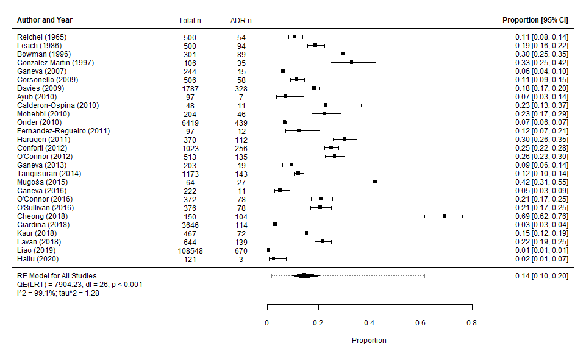
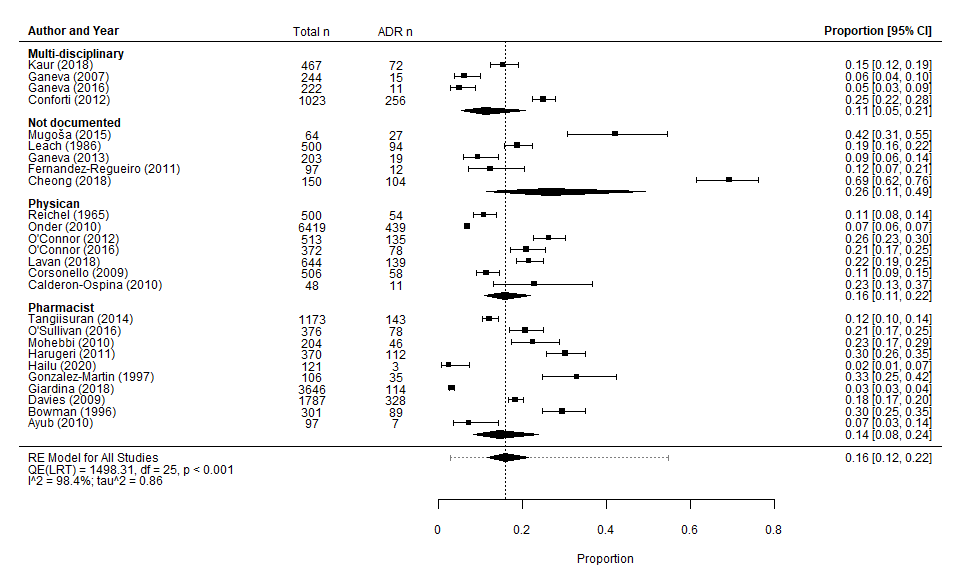

# Queries

The reviewers also had some requests regarding further analyses they would like included (see below for details), and some questions that I need to seek your clarification on:

**1.	"what software and version was used to conduct themeta-analysis?" - I presume this was R but am aware I never actually asked.**

2.	"is it not customary to conduct analyses to take out one study at a time to identify if any one study was highly influential? please provide this information" - was this the case with the prior analysis, and if so what impact / if any was there? If not, can we do this?

**3.	"it would be helpful to see a funnel plot and eggers test to examine publication bias" - I am unsure how to run/conduct same, could you assist here (please let me know if you require further information).**

**4.	"It would be most helpful to see forest plots for severity and preventability using random effects model"**

**5.	Questioning regarding impact  of hospital setting on ADR proportions**

I have attached a new Excel file for your attention. Each tab contains the data for each analysis.

**1.	Overall pooled ADR proportions for all included studies**

**2.	Subgroup analysis for studies where all participants were >65years - forest plot for this group and query any statistical significance between this group and overall pooled proportion (analysis #1).**

**3.	Subgroup analysis for grouped ADR definitions - forest plot for each grouping and query and staistical significance between each group and overall pooled proportion(analysis #1).**

**4.	Subgroup analysis for grouped ADR causality tools - forest plot for each grouping and query and staistical significance between each group and overall pooled proportion (analysis #1).**

**5.	Subgroup analysis grouped by overlapping ADR methodology - forest plot for each grouping and query and staistical significance between each group and overall pooled proportion (analysis #1).**

**6.	New subgroup analysis -  grouped by ADR identification method - forest plot for each grouping and query any statistical significance between each group and overall pooled proportion (analysis #1).**

**7.	New subgroup analysis - pooled proportions for ADR preventability based on studies reporting preventability**

**8.	New subgroup analysis - pooled proportions for ADR severity based on studies reporting severity** 

**9.	New subgroup analysis - based on reviewer comment querying impact on risk of bias - forest plot for high quality studies and query any statistical significance between each group and overall pooled proportion (analysis #1).**

**10.	New subgroup analysis - based on reviewer comment querying impact of NOS domain "demonstration that outcome of interest was not present at start of study" - forest plots for groupings that did and did not demonstarte this and query any statistical significance between each grouping and overall pooled proportion (analysis #1).**

**11.	New subgroup analysis - based on reviewer comment querying impact of ward setting on ADR proportions - forest plots for each ward grouping and query any statistical significance between each grouping and overall pooled proportion (analysis #1).** 


# ADRs

## Overall model


*1. "what software and version was used to conduct themeta-analysis?" - I presume this was R but am aware I never actually asked.*

All analysis were conducted using the R Language for Statistical Programming (REF1).  

REF1: R Core Team (2020). R: A language and environment for statistical computing. R Foundation for Statistical Computing, Vienna, Austria. URL https://www.R-project.org/.

Meta-analysis models and plots were produced using the metafor package (REF2).

REF2: Viechtbauer, W. (2010). Conducting meta-analyses in R with the metafor package. Journal of Statistical Software, 36(3), 1-48. URL: https://www.jstatsoft.org/v36/i03/

For meta-analysis models we used a generalized linear mixed effects model for logit transformed proportions (i.e. metafor::rms.glmm(measure = "PLO")). 

*1.	Overall pooled ADR proportions for all included studies except Liao*

Binomial-normal random effects model (coefficients on the log-odds scale). 

```
## 
## Random-Effects Model (k = 26; tau^2 estimator: ML)
## 
## tau^2 (estimated amount of total heterogeneity): 0.8585
## tau (square root of estimated tau^2 value):      0.9266
## I^2 (total heterogeneity / total variability):   98.4160%
## H^2 (total variability / sampling variability):  63.1312
## 
## Tests for Heterogeneity:
## Wld(df = 25) = 1277.8768, p-val < .0001
## LRT(df = 25) = 1498.3058, p-val < .0001
## 
## Model Results:
## 
## estimate      se     zval    pval    ci.lb    ci.ub 
##  -1.6592  0.1861  -8.9138  <.0001  -2.0241  -1.2944  *** 
## 
## ---
## Signif. codes:  0 '***' 0.001 '**' 0.01 '*' 0.05 '.' 0.1 ' ' 1
```

Results on the probability scale. This is the mean ADR proportion, the 95% CI of that estimate, and a 95% prediction interval (the very wide interval)


```
## 
##    pred  ci.lb  ci.ub  cr.lb  cr.ub 
##  0.1599 0.1167 0.2151 0.0290 0.5481
```


Figure 1. 

<!-- -->


Binomial-normal random effects model, with Liao (coefficients on the log-odds scale). 

```
## 
## Random-Effects Model (k = 27; tau^2 estimator: ML)
## 
## tau^2 (estimated amount of total heterogeneity): 1.2838
## tau (square root of estimated tau^2 value):      1.1331
## I^2 (total heterogeneity / total variability):   99.1469%
## H^2 (total variability / sampling variability):  117.2263
## 
## Tests for Heterogeneity:
## Wld(df = 26) = 6854.9243, p-val < .0001
## LRT(df = 26) = 7904.2253, p-val < .0001
## 
## Model Results:
## 
## estimate      se     zval    pval    ci.lb    ci.ub 
##  -1.7965  0.2216  -8.1053  <.0001  -2.2310  -1.3621  *** 
## 
## ---
## Signif. codes:  0 '***' 0.001 '**' 0.01 '*' 0.05 '.' 0.1 ' ' 1
```

```
## 
##    pred  ci.lb  ci.ub  cr.lb  cr.ub 
##  0.1423 0.0970 0.2039 0.0170 0.6145
```

<!-- -->


Binomial-normal fixed effects model, with Liao (coefficients on the log-odds scale). 

```
## 
## Fixed-Effects Model (k = 27)
## 
## Tests for Heterogeneity:
## Wld(df = 26) = 6854.9243, p-val < .0001
## LRT(df = 26) = 7904.2253, p-val < .0001
## 
## Model Results:
## 
## estimate      se       zval    pval    ci.lb    ci.ub 
##  -3.6856  0.0180  -204.2772  <.0001  -3.7210  -3.6503  *** 
## 
## ---
## Signif. codes:  0 '***' 0.001 '**' 0.01 '*' 0.05 '.' 0.1 ' ' 1
```

```
## 
##    pred  ci.lb  ci.ub 
##  0.0245 0.0236 0.0253
```

## Funnel plot

*3.	"it would be helpful to see a funnel plot and eggers test to examine publication bias" - I am unsure how to run/conduct same, could you assist here (please let me know if you require further information).*

### Without Liao
<!-- -->

### With Liao

<!-- -->

## Influence

<!-- -->
4 = Cheong (2018)
12 = Giardina (2018)
23 = Onder (2010)


```
## 
##    estimate    zval  pval ci.lb ci.ub        Q    Qp  tau2     I2     H2 
## 1     0.167  -8.438 0.000 0.121 0.225 1273.542 0.000 0.870 98.492 66.309 
## 2     0.158  -8.708 0.000 0.114 0.215 1228.850 0.000 0.879 98.457 64.821 
## 3     0.160  -8.566 0.000 0.115 0.218 1275.527 0.000 0.896 98.534 68.194 
## 4     0.150 -10.596 0.000 0.113 0.196 1066.445 0.000 0.627 97.887 47.335 
## 5     0.159  -8.594 0.000 0.114 0.217 1190.604 0.000 0.893 98.367 61.234 
## 6     0.164  -8.374 0.000 0.118 0.223 1272.939 0.000 0.898 98.499 66.627 
## 7     0.161  -8.452 0.000 0.116 0.220 1259.183 0.000 0.906 98.325 59.702 
## 8     0.164  -8.407 0.000 0.118 0.223 1277.368 0.000 0.899 98.536 68.311 
## 9     0.169  -8.516 0.000 0.124 0.227 1262.344 0.000 0.831 98.420 63.273 
## 10    0.168  -8.455 0.000 0.122 0.226 1264.054 0.000 0.852 98.454 64.682 
## 11    0.165  -8.389 0.000 0.120 0.224 1272.956 0.000 0.886 98.510 67.111 
## 12    0.173  -8.813 0.000 0.129 0.229  941.909 0.000 0.742 98.126 53.372 
## 13    0.157  -8.796 0.000 0.114 0.213 1252.662 0.000 0.867 98.472 65.466 
## 14    0.171  -8.686 0.000 0.126 0.227 1266.920 0.000 0.793 98.352 60.671 
## 15    0.158  -8.727 0.000 0.114 0.214 1211.473 0.000 0.876 98.439 64.058 
## 16    0.162  -8.409 0.000 0.117 0.221 1277.795 0.000 0.906 98.504 66.863 
## 17    0.160  -8.517 0.000 0.115 0.218 1254.712 0.000 0.901 98.454 64.692 
## 18    0.161  -8.463 0.000 0.116 0.219 1271.864 0.000 0.905 98.490 66.208 
## 19    0.160  -8.541 0.000 0.115 0.218 1268.650 0.000 0.899 98.515 67.322 
## 20    0.155  -9.055 0.000 0.113 0.210 1246.010 0.000 0.831 98.414 63.044 
## 21    0.160  -8.506 0.000 0.115 0.218 1267.109 0.000 0.902 98.497 66.549 
## 22    0.159  -8.625 0.000 0.114 0.216 1225.292 0.000 0.889 98.443 64.206 
## 23    0.168  -8.421 0.000 0.122 0.226  885.258 0.000 0.858 98.119 53.160 
## 24    0.160  -8.501 0.000 0.115 0.219 1267.775 0.000 0.903 98.498 66.570 
## 25    0.165  -8.373 0.000 0.119 0.224 1271.008 0.000 0.895 98.497 66.535 
## 26    0.164  -8.373 0.000 0.118 0.223 1270.401 0.000 0.901 98.439 64.045
```


## Moderators

### Age

*2. Subgroup analysis for studies where all participants were >65years - forest plot for this group and query any statistical significance between this group and overall pooled proportion (analysis #1).*

Studies that only recruited those aged 65+ vs those that recruited other ages too. 
<!--html_preserve--><div class="tabwid"><table style='border-collapse:collapse;'><thead><tr style="overflow-wrap:break-word;"><td style="width:54px;background-color:transparent;vertical-align: middle;border-bottom: 2.00px solid rgba(0, 0, 0, 1.00);border-top: 2.00px solid rgba(0, 0, 0, 1.00);border-left: 0 solid rgba(0, 0, 0, 1.00);border-right: 0 solid rgba(0, 0, 0, 1.00);margin-bottom:0;margin-top:0;margin-left:0;margin-right:0;"><p style="margin:0;text-align:left;border-bottom: 0 solid rgba(0, 0, 0, 1.00);border-top: 0 solid rgba(0, 0, 0, 1.00);border-left: 0 solid rgba(0, 0, 0, 1.00);border-right: 0 solid rgba(0, 0, 0, 1.00);padding-bottom:2px;padding-top:2px;padding-left:5px;padding-right:5px;background-color:transparent;"><span style="font-family:'Arial';font-size:11px;font-weight:normal;font-style:normal;text-decoration:none;color:rgba(17, 17, 17, 1.00);background-color:transparent;">cat</span></p></td><td style="width:54px;background-color:transparent;vertical-align: middle;border-bottom: 2.00px solid rgba(0, 0, 0, 1.00);border-top: 2.00px solid rgba(0, 0, 0, 1.00);border-left: 0 solid rgba(0, 0, 0, 1.00);border-right: 0 solid rgba(0, 0, 0, 1.00);margin-bottom:0;margin-top:0;margin-left:0;margin-right:0;"><p style="margin:0;text-align:right;border-bottom: 0 solid rgba(0, 0, 0, 1.00);border-top: 0 solid rgba(0, 0, 0, 1.00);border-left: 0 solid rgba(0, 0, 0, 1.00);border-right: 0 solid rgba(0, 0, 0, 1.00);padding-bottom:2px;padding-top:2px;padding-left:5px;padding-right:5px;background-color:transparent;"><span style="font-family:'Arial';font-size:11px;font-weight:normal;font-style:normal;text-decoration:none;color:rgba(17, 17, 17, 1.00);background-color:transparent;">n_studies</span></p></td><td style="width:54px;background-color:transparent;vertical-align: middle;border-bottom: 2.00px solid rgba(0, 0, 0, 1.00);border-top: 2.00px solid rgba(0, 0, 0, 1.00);border-left: 0 solid rgba(0, 0, 0, 1.00);border-right: 0 solid rgba(0, 0, 0, 1.00);margin-bottom:0;margin-top:0;margin-left:0;margin-right:0;"><p style="margin:0;text-align:right;border-bottom: 0 solid rgba(0, 0, 0, 1.00);border-top: 0 solid rgba(0, 0, 0, 1.00);border-left: 0 solid rgba(0, 0, 0, 1.00);border-right: 0 solid rgba(0, 0, 0, 1.00);padding-bottom:2px;padding-top:2px;padding-left:5px;padding-right:5px;background-color:transparent;"><span style="font-family:'Arial';font-size:11px;font-weight:normal;font-style:normal;text-decoration:none;color:rgba(17, 17, 17, 1.00);background-color:transparent;">ADR_proportion</span></p></td><td style="width:54px;background-color:transparent;vertical-align: middle;border-bottom: 2.00px solid rgba(0, 0, 0, 1.00);border-top: 2.00px solid rgba(0, 0, 0, 1.00);border-left: 0 solid rgba(0, 0, 0, 1.00);border-right: 0 solid rgba(0, 0, 0, 1.00);margin-bottom:0;margin-top:0;margin-left:0;margin-right:0;"><p style="margin:0;text-align:right;border-bottom: 0 solid rgba(0, 0, 0, 1.00);border-top: 0 solid rgba(0, 0, 0, 1.00);border-left: 0 solid rgba(0, 0, 0, 1.00);border-right: 0 solid rgba(0, 0, 0, 1.00);padding-bottom:2px;padding-top:2px;padding-left:5px;padding-right:5px;background-color:transparent;"><span style="font-family:'Arial';font-size:11px;font-weight:normal;font-style:normal;text-decoration:none;color:rgba(17, 17, 17, 1.00);background-color:transparent;">ci.lb</span></p></td><td style="width:54px;background-color:transparent;vertical-align: middle;border-bottom: 2.00px solid rgba(0, 0, 0, 1.00);border-top: 2.00px solid rgba(0, 0, 0, 1.00);border-left: 0 solid rgba(0, 0, 0, 1.00);border-right: 0 solid rgba(0, 0, 0, 1.00);margin-bottom:0;margin-top:0;margin-left:0;margin-right:0;"><p style="margin:0;text-align:right;border-bottom: 0 solid rgba(0, 0, 0, 1.00);border-top: 0 solid rgba(0, 0, 0, 1.00);border-left: 0 solid rgba(0, 0, 0, 1.00);border-right: 0 solid rgba(0, 0, 0, 1.00);padding-bottom:2px;padding-top:2px;padding-left:5px;padding-right:5px;background-color:transparent;"><span style="font-family:'Arial';font-size:11px;font-weight:normal;font-style:normal;text-decoration:none;color:rgba(17, 17, 17, 1.00);background-color:transparent;">ci.ub</span></p></td><td style="width:54px;background-color:transparent;vertical-align: middle;border-bottom: 2.00px solid rgba(0, 0, 0, 1.00);border-top: 2.00px solid rgba(0, 0, 0, 1.00);border-left: 0 solid rgba(0, 0, 0, 1.00);border-right: 0 solid rgba(0, 0, 0, 1.00);margin-bottom:0;margin-top:0;margin-left:0;margin-right:0;"><p style="margin:0;text-align:right;border-bottom: 0 solid rgba(0, 0, 0, 1.00);border-top: 0 solid rgba(0, 0, 0, 1.00);border-left: 0 solid rgba(0, 0, 0, 1.00);border-right: 0 solid rgba(0, 0, 0, 1.00);padding-bottom:2px;padding-top:2px;padding-left:5px;padding-right:5px;background-color:transparent;"><span style="font-family:'Arial';font-size:11px;font-weight:normal;font-style:normal;text-decoration:none;color:rgba(17, 17, 17, 1.00);background-color:transparent;">cr.lb</span></p></td><td style="width:54px;background-color:transparent;vertical-align: middle;border-bottom: 2.00px solid rgba(0, 0, 0, 1.00);border-top: 2.00px solid rgba(0, 0, 0, 1.00);border-left: 0 solid rgba(0, 0, 0, 1.00);border-right: 0 solid rgba(0, 0, 0, 1.00);margin-bottom:0;margin-top:0;margin-left:0;margin-right:0;"><p style="margin:0;text-align:right;border-bottom: 0 solid rgba(0, 0, 0, 1.00);border-top: 0 solid rgba(0, 0, 0, 1.00);border-left: 0 solid rgba(0, 0, 0, 1.00);border-right: 0 solid rgba(0, 0, 0, 1.00);padding-bottom:2px;padding-top:2px;padding-left:5px;padding-right:5px;background-color:transparent;"><span style="font-family:'Arial';font-size:11px;font-weight:normal;font-style:normal;text-decoration:none;color:rgba(17, 17, 17, 1.00);background-color:transparent;">cr.ub</span></p></td><td style="width:54px;background-color:transparent;vertical-align: middle;border-bottom: 2.00px solid rgba(0, 0, 0, 1.00);border-top: 2.00px solid rgba(0, 0, 0, 1.00);border-left: 0 solid rgba(0, 0, 0, 1.00);border-right: 0 solid rgba(0, 0, 0, 1.00);margin-bottom:0;margin-top:0;margin-left:0;margin-right:0;"><p style="margin:0;text-align:right;border-bottom: 0 solid rgba(0, 0, 0, 1.00);border-top: 0 solid rgba(0, 0, 0, 1.00);border-left: 0 solid rgba(0, 0, 0, 1.00);border-right: 0 solid rgba(0, 0, 0, 1.00);padding-bottom:2px;padding-top:2px;padding-left:5px;padding-right:5px;background-color:transparent;"><span style="font-family:'Arial';font-size:11px;font-weight:normal;font-style:normal;text-decoration:none;color:rgba(17, 17, 17, 1.00);background-color:transparent;">moderator_p</span></p></td></tr></thead><tbody><tr style="overflow-wrap:break-word;"><td style="width:54px;background-color:transparent;vertical-align: middle;border-bottom: 0 solid rgba(0, 0, 0, 1.00);border-top: 0 solid rgba(0, 0, 0, 1.00);border-left: 0 solid rgba(0, 0, 0, 1.00);border-right: 0 solid rgba(0, 0, 0, 1.00);margin-bottom:0;margin-top:0;margin-left:0;margin-right:0;"><p style="margin:0;text-align:left;border-bottom: 0 solid rgba(0, 0, 0, 1.00);border-top: 0 solid rgba(0, 0, 0, 1.00);border-left: 0 solid rgba(0, 0, 0, 1.00);border-right: 0 solid rgba(0, 0, 0, 1.00);padding-bottom:2px;padding-top:2px;padding-left:5px;padding-right:5px;background-color:transparent;"><span style="font-family:'Arial';font-size:11px;font-weight:normal;font-style:normal;text-decoration:none;color:rgba(17, 17, 17, 1.00);background-color:transparent;">All ages</span></p></td><td style="width:54px;background-color:transparent;vertical-align: middle;border-bottom: 0 solid rgba(0, 0, 0, 1.00);border-top: 0 solid rgba(0, 0, 0, 1.00);border-left: 0 solid rgba(0, 0, 0, 1.00);border-right: 0 solid rgba(0, 0, 0, 1.00);margin-bottom:0;margin-top:0;margin-left:0;margin-right:0;"><p style="margin:0;text-align:right;border-bottom: 0 solid rgba(0, 0, 0, 1.00);border-top: 0 solid rgba(0, 0, 0, 1.00);border-left: 0 solid rgba(0, 0, 0, 1.00);border-right: 0 solid rgba(0, 0, 0, 1.00);padding-bottom:2px;padding-top:2px;padding-left:5px;padding-right:5px;background-color:transparent;"><span style="font-family:'Arial';font-size:11px;font-weight:normal;font-style:normal;text-decoration:none;color:rgba(17, 17, 17, 1.00);background-color:transparent;">14</span></p></td><td style="width:54px;background-color:transparent;vertical-align: middle;border-bottom: 0 solid rgba(0, 0, 0, 1.00);border-top: 0 solid rgba(0, 0, 0, 1.00);border-left: 0 solid rgba(0, 0, 0, 1.00);border-right: 0 solid rgba(0, 0, 0, 1.00);margin-bottom:0;margin-top:0;margin-left:0;margin-right:0;"><p style="margin:0;text-align:right;border-bottom: 0 solid rgba(0, 0, 0, 1.00);border-top: 0 solid rgba(0, 0, 0, 1.00);border-left: 0 solid rgba(0, 0, 0, 1.00);border-right: 0 solid rgba(0, 0, 0, 1.00);padding-bottom:2px;padding-top:2px;padding-left:5px;padding-right:5px;background-color:transparent;"><span style="font-family:'Arial';font-size:11px;font-weight:normal;font-style:normal;text-decoration:none;color:rgba(17, 17, 17, 1.00);background-color:transparent;">0.14</span></p></td><td style="width:54px;background-color:transparent;vertical-align: middle;border-bottom: 0 solid rgba(0, 0, 0, 1.00);border-top: 0 solid rgba(0, 0, 0, 1.00);border-left: 0 solid rgba(0, 0, 0, 1.00);border-right: 0 solid rgba(0, 0, 0, 1.00);margin-bottom:0;margin-top:0;margin-left:0;margin-right:0;"><p style="margin:0;text-align:right;border-bottom: 0 solid rgba(0, 0, 0, 1.00);border-top: 0 solid rgba(0, 0, 0, 1.00);border-left: 0 solid rgba(0, 0, 0, 1.00);border-right: 0 solid rgba(0, 0, 0, 1.00);padding-bottom:2px;padding-top:2px;padding-left:5px;padding-right:5px;background-color:transparent;"><span style="font-family:'Arial';font-size:11px;font-weight:normal;font-style:normal;text-decoration:none;color:rgba(17, 17, 17, 1.00);background-color:transparent;">0.09</span></p></td><td style="width:54px;background-color:transparent;vertical-align: middle;border-bottom: 0 solid rgba(0, 0, 0, 1.00);border-top: 0 solid rgba(0, 0, 0, 1.00);border-left: 0 solid rgba(0, 0, 0, 1.00);border-right: 0 solid rgba(0, 0, 0, 1.00);margin-bottom:0;margin-top:0;margin-left:0;margin-right:0;"><p style="margin:0;text-align:right;border-bottom: 0 solid rgba(0, 0, 0, 1.00);border-top: 0 solid rgba(0, 0, 0, 1.00);border-left: 0 solid rgba(0, 0, 0, 1.00);border-right: 0 solid rgba(0, 0, 0, 1.00);padding-bottom:2px;padding-top:2px;padding-left:5px;padding-right:5px;background-color:transparent;"><span style="font-family:'Arial';font-size:11px;font-weight:normal;font-style:normal;text-decoration:none;color:rgba(17, 17, 17, 1.00);background-color:transparent;">0.21</span></p></td><td style="width:54px;background-color:transparent;vertical-align: middle;border-bottom: 0 solid rgba(0, 0, 0, 1.00);border-top: 0 solid rgba(0, 0, 0, 1.00);border-left: 0 solid rgba(0, 0, 0, 1.00);border-right: 0 solid rgba(0, 0, 0, 1.00);margin-bottom:0;margin-top:0;margin-left:0;margin-right:0;"><p style="margin:0;text-align:right;border-bottom: 0 solid rgba(0, 0, 0, 1.00);border-top: 0 solid rgba(0, 0, 0, 1.00);border-left: 0 solid rgba(0, 0, 0, 1.00);border-right: 0 solid rgba(0, 0, 0, 1.00);padding-bottom:2px;padding-top:2px;padding-left:5px;padding-right:5px;background-color:transparent;"><span style="font-family:'Arial';font-size:11px;font-weight:normal;font-style:normal;text-decoration:none;color:rgba(17, 17, 17, 1.00);background-color:transparent;">0.02</span></p></td><td style="width:54px;background-color:transparent;vertical-align: middle;border-bottom: 0 solid rgba(0, 0, 0, 1.00);border-top: 0 solid rgba(0, 0, 0, 1.00);border-left: 0 solid rgba(0, 0, 0, 1.00);border-right: 0 solid rgba(0, 0, 0, 1.00);margin-bottom:0;margin-top:0;margin-left:0;margin-right:0;"><p style="margin:0;text-align:right;border-bottom: 0 solid rgba(0, 0, 0, 1.00);border-top: 0 solid rgba(0, 0, 0, 1.00);border-left: 0 solid rgba(0, 0, 0, 1.00);border-right: 0 solid rgba(0, 0, 0, 1.00);padding-bottom:2px;padding-top:2px;padding-left:5px;padding-right:5px;background-color:transparent;"><span style="font-family:'Arial';font-size:11px;font-weight:normal;font-style:normal;text-decoration:none;color:rgba(17, 17, 17, 1.00);background-color:transparent;">0.5</span></p></td><td style="width:54px;background-color:transparent;vertical-align: middle;border-bottom: 0 solid rgba(0, 0, 0, 1.00);border-top: 0 solid rgba(0, 0, 0, 1.00);border-left: 0 solid rgba(0, 0, 0, 1.00);border-right: 0 solid rgba(0, 0, 0, 1.00);margin-bottom:0;margin-top:0;margin-left:0;margin-right:0;"><p style="margin:0;text-align:right;border-bottom: 0 solid rgba(0, 0, 0, 1.00);border-top: 0 solid rgba(0, 0, 0, 1.00);border-left: 0 solid rgba(0, 0, 0, 1.00);border-right: 0 solid rgba(0, 0, 0, 1.00);padding-bottom:2px;padding-top:2px;padding-left:5px;padding-right:5px;background-color:transparent;"><span style="font-family:'Arial';font-size:11px;font-weight:normal;font-style:normal;text-decoration:none;color:rgba(17, 17, 17, 1.00);background-color:transparent;">NA</span></p></td></tr><tr style="overflow-wrap:break-word;"><td style="width:54px;background-color:transparent;vertical-align: middle;border-bottom: 2.00px solid rgba(0, 0, 0, 1.00);border-top: 0 solid rgba(0, 0, 0, 1.00);border-left: 0 solid rgba(0, 0, 0, 1.00);border-right: 0 solid rgba(0, 0, 0, 1.00);margin-bottom:0;margin-top:0;margin-left:0;margin-right:0;"><p style="margin:0;text-align:left;border-bottom: 0 solid rgba(0, 0, 0, 1.00);border-top: 0 solid rgba(0, 0, 0, 1.00);border-left: 0 solid rgba(0, 0, 0, 1.00);border-right: 0 solid rgba(0, 0, 0, 1.00);padding-bottom:2px;padding-top:2px;padding-left:5px;padding-right:5px;background-color:transparent;"><span style="font-family:'Arial';font-size:11px;font-weight:normal;font-style:normal;text-decoration:none;color:rgba(17, 17, 17, 1.00);background-color:transparent;">65+ only</span></p></td><td style="width:54px;background-color:transparent;vertical-align: middle;border-bottom: 2.00px solid rgba(0, 0, 0, 1.00);border-top: 0 solid rgba(0, 0, 0, 1.00);border-left: 0 solid rgba(0, 0, 0, 1.00);border-right: 0 solid rgba(0, 0, 0, 1.00);margin-bottom:0;margin-top:0;margin-left:0;margin-right:0;"><p style="margin:0;text-align:right;border-bottom: 0 solid rgba(0, 0, 0, 1.00);border-top: 0 solid rgba(0, 0, 0, 1.00);border-left: 0 solid rgba(0, 0, 0, 1.00);border-right: 0 solid rgba(0, 0, 0, 1.00);padding-bottom:2px;padding-top:2px;padding-left:5px;padding-right:5px;background-color:transparent;"><span style="font-family:'Arial';font-size:11px;font-weight:normal;font-style:normal;text-decoration:none;color:rgba(17, 17, 17, 1.00);background-color:transparent;">12</span></p></td><td style="width:54px;background-color:transparent;vertical-align: middle;border-bottom: 2.00px solid rgba(0, 0, 0, 1.00);border-top: 0 solid rgba(0, 0, 0, 1.00);border-left: 0 solid rgba(0, 0, 0, 1.00);border-right: 0 solid rgba(0, 0, 0, 1.00);margin-bottom:0;margin-top:0;margin-left:0;margin-right:0;"><p style="margin:0;text-align:right;border-bottom: 0 solid rgba(0, 0, 0, 1.00);border-top: 0 solid rgba(0, 0, 0, 1.00);border-left: 0 solid rgba(0, 0, 0, 1.00);border-right: 0 solid rgba(0, 0, 0, 1.00);padding-bottom:2px;padding-top:2px;padding-left:5px;padding-right:5px;background-color:transparent;"><span style="font-family:'Arial';font-size:11px;font-weight:normal;font-style:normal;text-decoration:none;color:rgba(17, 17, 17, 1.00);background-color:transparent;">0.19</span></p></td><td style="width:54px;background-color:transparent;vertical-align: middle;border-bottom: 2.00px solid rgba(0, 0, 0, 1.00);border-top: 0 solid rgba(0, 0, 0, 1.00);border-left: 0 solid rgba(0, 0, 0, 1.00);border-right: 0 solid rgba(0, 0, 0, 1.00);margin-bottom:0;margin-top:0;margin-left:0;margin-right:0;"><p style="margin:0;text-align:right;border-bottom: 0 solid rgba(0, 0, 0, 1.00);border-top: 0 solid rgba(0, 0, 0, 1.00);border-left: 0 solid rgba(0, 0, 0, 1.00);border-right: 0 solid rgba(0, 0, 0, 1.00);padding-bottom:2px;padding-top:2px;padding-left:5px;padding-right:5px;background-color:transparent;"><span style="font-family:'Arial';font-size:11px;font-weight:normal;font-style:normal;text-decoration:none;color:rgba(17, 17, 17, 1.00);background-color:transparent;">0.12</span></p></td><td style="width:54px;background-color:transparent;vertical-align: middle;border-bottom: 2.00px solid rgba(0, 0, 0, 1.00);border-top: 0 solid rgba(0, 0, 0, 1.00);border-left: 0 solid rgba(0, 0, 0, 1.00);border-right: 0 solid rgba(0, 0, 0, 1.00);margin-bottom:0;margin-top:0;margin-left:0;margin-right:0;"><p style="margin:0;text-align:right;border-bottom: 0 solid rgba(0, 0, 0, 1.00);border-top: 0 solid rgba(0, 0, 0, 1.00);border-left: 0 solid rgba(0, 0, 0, 1.00);border-right: 0 solid rgba(0, 0, 0, 1.00);padding-bottom:2px;padding-top:2px;padding-left:5px;padding-right:5px;background-color:transparent;"><span style="font-family:'Arial';font-size:11px;font-weight:normal;font-style:normal;text-decoration:none;color:rgba(17, 17, 17, 1.00);background-color:transparent;">0.28</span></p></td><td style="width:54px;background-color:transparent;vertical-align: middle;border-bottom: 2.00px solid rgba(0, 0, 0, 1.00);border-top: 0 solid rgba(0, 0, 0, 1.00);border-left: 0 solid rgba(0, 0, 0, 1.00);border-right: 0 solid rgba(0, 0, 0, 1.00);margin-bottom:0;margin-top:0;margin-left:0;margin-right:0;"><p style="margin:0;text-align:right;border-bottom: 0 solid rgba(0, 0, 0, 1.00);border-top: 0 solid rgba(0, 0, 0, 1.00);border-left: 0 solid rgba(0, 0, 0, 1.00);border-right: 0 solid rgba(0, 0, 0, 1.00);padding-bottom:2px;padding-top:2px;padding-left:5px;padding-right:5px;background-color:transparent;"><span style="font-family:'Arial';font-size:11px;font-weight:normal;font-style:normal;text-decoration:none;color:rgba(17, 17, 17, 1.00);background-color:transparent;">0.04</span></p></td><td style="width:54px;background-color:transparent;vertical-align: middle;border-bottom: 2.00px solid rgba(0, 0, 0, 1.00);border-top: 0 solid rgba(0, 0, 0, 1.00);border-left: 0 solid rgba(0, 0, 0, 1.00);border-right: 0 solid rgba(0, 0, 0, 1.00);margin-bottom:0;margin-top:0;margin-left:0;margin-right:0;"><p style="margin:0;text-align:right;border-bottom: 0 solid rgba(0, 0, 0, 1.00);border-top: 0 solid rgba(0, 0, 0, 1.00);border-left: 0 solid rgba(0, 0, 0, 1.00);border-right: 0 solid rgba(0, 0, 0, 1.00);padding-bottom:2px;padding-top:2px;padding-left:5px;padding-right:5px;background-color:transparent;"><span style="font-family:'Arial';font-size:11px;font-weight:normal;font-style:normal;text-decoration:none;color:rgba(17, 17, 17, 1.00);background-color:transparent;">0.6</span></p></td><td style="width:54px;background-color:transparent;vertical-align: middle;border-bottom: 2.00px solid rgba(0, 0, 0, 1.00);border-top: 0 solid rgba(0, 0, 0, 1.00);border-left: 0 solid rgba(0, 0, 0, 1.00);border-right: 0 solid rgba(0, 0, 0, 1.00);margin-bottom:0;margin-top:0;margin-left:0;margin-right:0;"><p style="margin:0;text-align:right;border-bottom: 0 solid rgba(0, 0, 0, 1.00);border-top: 0 solid rgba(0, 0, 0, 1.00);border-left: 0 solid rgba(0, 0, 0, 1.00);border-right: 0 solid rgba(0, 0, 0, 1.00);padding-bottom:2px;padding-top:2px;padding-left:5px;padding-right:5px;background-color:transparent;"><span style="font-family:'Arial';font-size:11px;font-weight:normal;font-style:normal;text-decoration:none;color:rgba(17, 17, 17, 1.00);background-color:transparent;">0.299</span></p></td></tr></tbody></table></div><!--/html_preserve-->


<!-- -->


### ADR definition

*3.	Subgroup analysis for grouped ADR definitions - forest plot for each grouping and query and staistical significance between each group and overall pooled proportion(analysis #1).*

<!--html_preserve--><div class="tabwid"><table style='border-collapse:collapse;'><thead><tr style="overflow-wrap:break-word;"><td style="width:54px;background-color:transparent;vertical-align: middle;border-bottom: 2.00px solid rgba(0, 0, 0, 1.00);border-top: 2.00px solid rgba(0, 0, 0, 1.00);border-left: 0 solid rgba(0, 0, 0, 1.00);border-right: 0 solid rgba(0, 0, 0, 1.00);margin-bottom:0;margin-top:0;margin-left:0;margin-right:0;"><p style="margin:0;text-align:left;border-bottom: 0 solid rgba(0, 0, 0, 1.00);border-top: 0 solid rgba(0, 0, 0, 1.00);border-left: 0 solid rgba(0, 0, 0, 1.00);border-right: 0 solid rgba(0, 0, 0, 1.00);padding-bottom:2px;padding-top:2px;padding-left:5px;padding-right:5px;background-color:transparent;"><span style="font-family:'Arial';font-size:11px;font-weight:normal;font-style:normal;text-decoration:none;color:rgba(17, 17, 17, 1.00);background-color:transparent;">cat</span></p></td><td style="width:54px;background-color:transparent;vertical-align: middle;border-bottom: 2.00px solid rgba(0, 0, 0, 1.00);border-top: 2.00px solid rgba(0, 0, 0, 1.00);border-left: 0 solid rgba(0, 0, 0, 1.00);border-right: 0 solid rgba(0, 0, 0, 1.00);margin-bottom:0;margin-top:0;margin-left:0;margin-right:0;"><p style="margin:0;text-align:right;border-bottom: 0 solid rgba(0, 0, 0, 1.00);border-top: 0 solid rgba(0, 0, 0, 1.00);border-left: 0 solid rgba(0, 0, 0, 1.00);border-right: 0 solid rgba(0, 0, 0, 1.00);padding-bottom:2px;padding-top:2px;padding-left:5px;padding-right:5px;background-color:transparent;"><span style="font-family:'Arial';font-size:11px;font-weight:normal;font-style:normal;text-decoration:none;color:rgba(17, 17, 17, 1.00);background-color:transparent;">n_studies</span></p></td><td style="width:54px;background-color:transparent;vertical-align: middle;border-bottom: 2.00px solid rgba(0, 0, 0, 1.00);border-top: 2.00px solid rgba(0, 0, 0, 1.00);border-left: 0 solid rgba(0, 0, 0, 1.00);border-right: 0 solid rgba(0, 0, 0, 1.00);margin-bottom:0;margin-top:0;margin-left:0;margin-right:0;"><p style="margin:0;text-align:right;border-bottom: 0 solid rgba(0, 0, 0, 1.00);border-top: 0 solid rgba(0, 0, 0, 1.00);border-left: 0 solid rgba(0, 0, 0, 1.00);border-right: 0 solid rgba(0, 0, 0, 1.00);padding-bottom:2px;padding-top:2px;padding-left:5px;padding-right:5px;background-color:transparent;"><span style="font-family:'Arial';font-size:11px;font-weight:normal;font-style:normal;text-decoration:none;color:rgba(17, 17, 17, 1.00);background-color:transparent;">ADR_proportion</span></p></td><td style="width:54px;background-color:transparent;vertical-align: middle;border-bottom: 2.00px solid rgba(0, 0, 0, 1.00);border-top: 2.00px solid rgba(0, 0, 0, 1.00);border-left: 0 solid rgba(0, 0, 0, 1.00);border-right: 0 solid rgba(0, 0, 0, 1.00);margin-bottom:0;margin-top:0;margin-left:0;margin-right:0;"><p style="margin:0;text-align:right;border-bottom: 0 solid rgba(0, 0, 0, 1.00);border-top: 0 solid rgba(0, 0, 0, 1.00);border-left: 0 solid rgba(0, 0, 0, 1.00);border-right: 0 solid rgba(0, 0, 0, 1.00);padding-bottom:2px;padding-top:2px;padding-left:5px;padding-right:5px;background-color:transparent;"><span style="font-family:'Arial';font-size:11px;font-weight:normal;font-style:normal;text-decoration:none;color:rgba(17, 17, 17, 1.00);background-color:transparent;">ci.lb</span></p></td><td style="width:54px;background-color:transparent;vertical-align: middle;border-bottom: 2.00px solid rgba(0, 0, 0, 1.00);border-top: 2.00px solid rgba(0, 0, 0, 1.00);border-left: 0 solid rgba(0, 0, 0, 1.00);border-right: 0 solid rgba(0, 0, 0, 1.00);margin-bottom:0;margin-top:0;margin-left:0;margin-right:0;"><p style="margin:0;text-align:right;border-bottom: 0 solid rgba(0, 0, 0, 1.00);border-top: 0 solid rgba(0, 0, 0, 1.00);border-left: 0 solid rgba(0, 0, 0, 1.00);border-right: 0 solid rgba(0, 0, 0, 1.00);padding-bottom:2px;padding-top:2px;padding-left:5px;padding-right:5px;background-color:transparent;"><span style="font-family:'Arial';font-size:11px;font-weight:normal;font-style:normal;text-decoration:none;color:rgba(17, 17, 17, 1.00);background-color:transparent;">ci.ub</span></p></td><td style="width:54px;background-color:transparent;vertical-align: middle;border-bottom: 2.00px solid rgba(0, 0, 0, 1.00);border-top: 2.00px solid rgba(0, 0, 0, 1.00);border-left: 0 solid rgba(0, 0, 0, 1.00);border-right: 0 solid rgba(0, 0, 0, 1.00);margin-bottom:0;margin-top:0;margin-left:0;margin-right:0;"><p style="margin:0;text-align:right;border-bottom: 0 solid rgba(0, 0, 0, 1.00);border-top: 0 solid rgba(0, 0, 0, 1.00);border-left: 0 solid rgba(0, 0, 0, 1.00);border-right: 0 solid rgba(0, 0, 0, 1.00);padding-bottom:2px;padding-top:2px;padding-left:5px;padding-right:5px;background-color:transparent;"><span style="font-family:'Arial';font-size:11px;font-weight:normal;font-style:normal;text-decoration:none;color:rgba(17, 17, 17, 1.00);background-color:transparent;">cr.lb</span></p></td><td style="width:54px;background-color:transparent;vertical-align: middle;border-bottom: 2.00px solid rgba(0, 0, 0, 1.00);border-top: 2.00px solid rgba(0, 0, 0, 1.00);border-left: 0 solid rgba(0, 0, 0, 1.00);border-right: 0 solid rgba(0, 0, 0, 1.00);margin-bottom:0;margin-top:0;margin-left:0;margin-right:0;"><p style="margin:0;text-align:right;border-bottom: 0 solid rgba(0, 0, 0, 1.00);border-top: 0 solid rgba(0, 0, 0, 1.00);border-left: 0 solid rgba(0, 0, 0, 1.00);border-right: 0 solid rgba(0, 0, 0, 1.00);padding-bottom:2px;padding-top:2px;padding-left:5px;padding-right:5px;background-color:transparent;"><span style="font-family:'Arial';font-size:11px;font-weight:normal;font-style:normal;text-decoration:none;color:rgba(17, 17, 17, 1.00);background-color:transparent;">cr.ub</span></p></td><td style="width:54px;background-color:transparent;vertical-align: middle;border-bottom: 2.00px solid rgba(0, 0, 0, 1.00);border-top: 2.00px solid rgba(0, 0, 0, 1.00);border-left: 0 solid rgba(0, 0, 0, 1.00);border-right: 0 solid rgba(0, 0, 0, 1.00);margin-bottom:0;margin-top:0;margin-left:0;margin-right:0;"><p style="margin:0;text-align:right;border-bottom: 0 solid rgba(0, 0, 0, 1.00);border-top: 0 solid rgba(0, 0, 0, 1.00);border-left: 0 solid rgba(0, 0, 0, 1.00);border-right: 0 solid rgba(0, 0, 0, 1.00);padding-bottom:2px;padding-top:2px;padding-left:5px;padding-right:5px;background-color:transparent;"><span style="font-family:'Arial';font-size:11px;font-weight:normal;font-style:normal;text-decoration:none;color:rgba(17, 17, 17, 1.00);background-color:transparent;">moderator_p</span></p></td></tr></thead><tbody><tr style="overflow-wrap:break-word;"><td style="width:54px;background-color:transparent;vertical-align: middle;border-bottom: 0 solid rgba(0, 0, 0, 1.00);border-top: 0 solid rgba(0, 0, 0, 1.00);border-left: 0 solid rgba(0, 0, 0, 1.00);border-right: 0 solid rgba(0, 0, 0, 1.00);margin-bottom:0;margin-top:0;margin-left:0;margin-right:0;"><p style="margin:0;text-align:left;border-bottom: 0 solid rgba(0, 0, 0, 1.00);border-top: 0 solid rgba(0, 0, 0, 1.00);border-left: 0 solid rgba(0, 0, 0, 1.00);border-right: 0 solid rgba(0, 0, 0, 1.00);padding-bottom:2px;padding-top:2px;padding-left:5px;padding-right:5px;background-color:transparent;"><span style="font-family:'Arial';font-size:11px;font-weight:normal;font-style:normal;text-decoration:none;color:rgba(17, 17, 17, 1.00);background-color:transparent;">WHO</span></p></td><td style="width:54px;background-color:transparent;vertical-align: middle;border-bottom: 0 solid rgba(0, 0, 0, 1.00);border-top: 0 solid rgba(0, 0, 0, 1.00);border-left: 0 solid rgba(0, 0, 0, 1.00);border-right: 0 solid rgba(0, 0, 0, 1.00);margin-bottom:0;margin-top:0;margin-left:0;margin-right:0;"><p style="margin:0;text-align:right;border-bottom: 0 solid rgba(0, 0, 0, 1.00);border-top: 0 solid rgba(0, 0, 0, 1.00);border-left: 0 solid rgba(0, 0, 0, 1.00);border-right: 0 solid rgba(0, 0, 0, 1.00);padding-bottom:2px;padding-top:2px;padding-left:5px;padding-right:5px;background-color:transparent;"><span style="font-family:'Arial';font-size:11px;font-weight:normal;font-style:normal;text-decoration:none;color:rgba(17, 17, 17, 1.00);background-color:transparent;">15</span></p></td><td style="width:54px;background-color:transparent;vertical-align: middle;border-bottom: 0 solid rgba(0, 0, 0, 1.00);border-top: 0 solid rgba(0, 0, 0, 1.00);border-left: 0 solid rgba(0, 0, 0, 1.00);border-right: 0 solid rgba(0, 0, 0, 1.00);margin-bottom:0;margin-top:0;margin-left:0;margin-right:0;"><p style="margin:0;text-align:right;border-bottom: 0 solid rgba(0, 0, 0, 1.00);border-top: 0 solid rgba(0, 0, 0, 1.00);border-left: 0 solid rgba(0, 0, 0, 1.00);border-right: 0 solid rgba(0, 0, 0, 1.00);padding-bottom:2px;padding-top:2px;padding-left:5px;padding-right:5px;background-color:transparent;"><span style="font-family:'Arial';font-size:11px;font-weight:normal;font-style:normal;text-decoration:none;color:rgba(17, 17, 17, 1.00);background-color:transparent;">0.14</span></p></td><td style="width:54px;background-color:transparent;vertical-align: middle;border-bottom: 0 solid rgba(0, 0, 0, 1.00);border-top: 0 solid rgba(0, 0, 0, 1.00);border-left: 0 solid rgba(0, 0, 0, 1.00);border-right: 0 solid rgba(0, 0, 0, 1.00);margin-bottom:0;margin-top:0;margin-left:0;margin-right:0;"><p style="margin:0;text-align:right;border-bottom: 0 solid rgba(0, 0, 0, 1.00);border-top: 0 solid rgba(0, 0, 0, 1.00);border-left: 0 solid rgba(0, 0, 0, 1.00);border-right: 0 solid rgba(0, 0, 0, 1.00);padding-bottom:2px;padding-top:2px;padding-left:5px;padding-right:5px;background-color:transparent;"><span style="font-family:'Arial';font-size:11px;font-weight:normal;font-style:normal;text-decoration:none;color:rgba(17, 17, 17, 1.00);background-color:transparent;">0.09</span></p></td><td style="width:54px;background-color:transparent;vertical-align: middle;border-bottom: 0 solid rgba(0, 0, 0, 1.00);border-top: 0 solid rgba(0, 0, 0, 1.00);border-left: 0 solid rgba(0, 0, 0, 1.00);border-right: 0 solid rgba(0, 0, 0, 1.00);margin-bottom:0;margin-top:0;margin-left:0;margin-right:0;"><p style="margin:0;text-align:right;border-bottom: 0 solid rgba(0, 0, 0, 1.00);border-top: 0 solid rgba(0, 0, 0, 1.00);border-left: 0 solid rgba(0, 0, 0, 1.00);border-right: 0 solid rgba(0, 0, 0, 1.00);padding-bottom:2px;padding-top:2px;padding-left:5px;padding-right:5px;background-color:transparent;"><span style="font-family:'Arial';font-size:11px;font-weight:normal;font-style:normal;text-decoration:none;color:rgba(17, 17, 17, 1.00);background-color:transparent;">0.20</span></p></td><td style="width:54px;background-color:transparent;vertical-align: middle;border-bottom: 0 solid rgba(0, 0, 0, 1.00);border-top: 0 solid rgba(0, 0, 0, 1.00);border-left: 0 solid rgba(0, 0, 0, 1.00);border-right: 0 solid rgba(0, 0, 0, 1.00);margin-bottom:0;margin-top:0;margin-left:0;margin-right:0;"><p style="margin:0;text-align:right;border-bottom: 0 solid rgba(0, 0, 0, 1.00);border-top: 0 solid rgba(0, 0, 0, 1.00);border-left: 0 solid rgba(0, 0, 0, 1.00);border-right: 0 solid rgba(0, 0, 0, 1.00);padding-bottom:2px;padding-top:2px;padding-left:5px;padding-right:5px;background-color:transparent;"><span style="font-family:'Arial';font-size:11px;font-weight:normal;font-style:normal;text-decoration:none;color:rgba(17, 17, 17, 1.00);background-color:transparent;">0.03</span></p></td><td style="width:54px;background-color:transparent;vertical-align: middle;border-bottom: 0 solid rgba(0, 0, 0, 1.00);border-top: 0 solid rgba(0, 0, 0, 1.00);border-left: 0 solid rgba(0, 0, 0, 1.00);border-right: 0 solid rgba(0, 0, 0, 1.00);margin-bottom:0;margin-top:0;margin-left:0;margin-right:0;"><p style="margin:0;text-align:right;border-bottom: 0 solid rgba(0, 0, 0, 1.00);border-top: 0 solid rgba(0, 0, 0, 1.00);border-left: 0 solid rgba(0, 0, 0, 1.00);border-right: 0 solid rgba(0, 0, 0, 1.00);padding-bottom:2px;padding-top:2px;padding-left:5px;padding-right:5px;background-color:transparent;"><span style="font-family:'Arial';font-size:11px;font-weight:normal;font-style:normal;text-decoration:none;color:rgba(17, 17, 17, 1.00);background-color:transparent;">0.49</span></p></td><td style="width:54px;background-color:transparent;vertical-align: middle;border-bottom: 0 solid rgba(0, 0, 0, 1.00);border-top: 0 solid rgba(0, 0, 0, 1.00);border-left: 0 solid rgba(0, 0, 0, 1.00);border-right: 0 solid rgba(0, 0, 0, 1.00);margin-bottom:0;margin-top:0;margin-left:0;margin-right:0;"><p style="margin:0;text-align:right;border-bottom: 0 solid rgba(0, 0, 0, 1.00);border-top: 0 solid rgba(0, 0, 0, 1.00);border-left: 0 solid rgba(0, 0, 0, 1.00);border-right: 0 solid rgba(0, 0, 0, 1.00);padding-bottom:2px;padding-top:2px;padding-left:5px;padding-right:5px;background-color:transparent;"><span style="font-family:'Arial';font-size:11px;font-weight:normal;font-style:normal;text-decoration:none;color:rgba(17, 17, 17, 1.00);background-color:transparent;">NA</span></p></td></tr><tr style="overflow-wrap:break-word;"><td style="width:54px;background-color:transparent;vertical-align: middle;border-bottom: 0 solid rgba(0, 0, 0, 1.00);border-top: 0 solid rgba(0, 0, 0, 1.00);border-left: 0 solid rgba(0, 0, 0, 1.00);border-right: 0 solid rgba(0, 0, 0, 1.00);margin-bottom:0;margin-top:0;margin-left:0;margin-right:0;"><p style="margin:0;text-align:left;border-bottom: 0 solid rgba(0, 0, 0, 1.00);border-top: 0 solid rgba(0, 0, 0, 1.00);border-left: 0 solid rgba(0, 0, 0, 1.00);border-right: 0 solid rgba(0, 0, 0, 1.00);padding-bottom:2px;padding-top:2px;padding-left:5px;padding-right:5px;background-color:transparent;"><span style="font-family:'Arial';font-size:11px;font-weight:normal;font-style:normal;text-decoration:none;color:rgba(17, 17, 17, 1.00);background-color:transparent;">Not documented</span></p></td><td style="width:54px;background-color:transparent;vertical-align: middle;border-bottom: 0 solid rgba(0, 0, 0, 1.00);border-top: 0 solid rgba(0, 0, 0, 1.00);border-left: 0 solid rgba(0, 0, 0, 1.00);border-right: 0 solid rgba(0, 0, 0, 1.00);margin-bottom:0;margin-top:0;margin-left:0;margin-right:0;"><p style="margin:0;text-align:right;border-bottom: 0 solid rgba(0, 0, 0, 1.00);border-top: 0 solid rgba(0, 0, 0, 1.00);border-left: 0 solid rgba(0, 0, 0, 1.00);border-right: 0 solid rgba(0, 0, 0, 1.00);padding-bottom:2px;padding-top:2px;padding-left:5px;padding-right:5px;background-color:transparent;"><span style="font-family:'Arial';font-size:11px;font-weight:normal;font-style:normal;text-decoration:none;color:rgba(17, 17, 17, 1.00);background-color:transparent;">3</span></p></td><td style="width:54px;background-color:transparent;vertical-align: middle;border-bottom: 0 solid rgba(0, 0, 0, 1.00);border-top: 0 solid rgba(0, 0, 0, 1.00);border-left: 0 solid rgba(0, 0, 0, 1.00);border-right: 0 solid rgba(0, 0, 0, 1.00);margin-bottom:0;margin-top:0;margin-left:0;margin-right:0;"><p style="margin:0;text-align:right;border-bottom: 0 solid rgba(0, 0, 0, 1.00);border-top: 0 solid rgba(0, 0, 0, 1.00);border-left: 0 solid rgba(0, 0, 0, 1.00);border-right: 0 solid rgba(0, 0, 0, 1.00);padding-bottom:2px;padding-top:2px;padding-left:5px;padding-right:5px;background-color:transparent;"><span style="font-family:'Arial';font-size:11px;font-weight:normal;font-style:normal;text-decoration:none;color:rgba(17, 17, 17, 1.00);background-color:transparent;">0.23</span></p></td><td style="width:54px;background-color:transparent;vertical-align: middle;border-bottom: 0 solid rgba(0, 0, 0, 1.00);border-top: 0 solid rgba(0, 0, 0, 1.00);border-left: 0 solid rgba(0, 0, 0, 1.00);border-right: 0 solid rgba(0, 0, 0, 1.00);margin-bottom:0;margin-top:0;margin-left:0;margin-right:0;"><p style="margin:0;text-align:right;border-bottom: 0 solid rgba(0, 0, 0, 1.00);border-top: 0 solid rgba(0, 0, 0, 1.00);border-left: 0 solid rgba(0, 0, 0, 1.00);border-right: 0 solid rgba(0, 0, 0, 1.00);padding-bottom:2px;padding-top:2px;padding-left:5px;padding-right:5px;background-color:transparent;"><span style="font-family:'Arial';font-size:11px;font-weight:normal;font-style:normal;text-decoration:none;color:rgba(17, 17, 17, 1.00);background-color:transparent;">0.10</span></p></td><td style="width:54px;background-color:transparent;vertical-align: middle;border-bottom: 0 solid rgba(0, 0, 0, 1.00);border-top: 0 solid rgba(0, 0, 0, 1.00);border-left: 0 solid rgba(0, 0, 0, 1.00);border-right: 0 solid rgba(0, 0, 0, 1.00);margin-bottom:0;margin-top:0;margin-left:0;margin-right:0;"><p style="margin:0;text-align:right;border-bottom: 0 solid rgba(0, 0, 0, 1.00);border-top: 0 solid rgba(0, 0, 0, 1.00);border-left: 0 solid rgba(0, 0, 0, 1.00);border-right: 0 solid rgba(0, 0, 0, 1.00);padding-bottom:2px;padding-top:2px;padding-left:5px;padding-right:5px;background-color:transparent;"><span style="font-family:'Arial';font-size:11px;font-weight:normal;font-style:normal;text-decoration:none;color:rgba(17, 17, 17, 1.00);background-color:transparent;">0.45</span></p></td><td style="width:54px;background-color:transparent;vertical-align: middle;border-bottom: 0 solid rgba(0, 0, 0, 1.00);border-top: 0 solid rgba(0, 0, 0, 1.00);border-left: 0 solid rgba(0, 0, 0, 1.00);border-right: 0 solid rgba(0, 0, 0, 1.00);margin-bottom:0;margin-top:0;margin-left:0;margin-right:0;"><p style="margin:0;text-align:right;border-bottom: 0 solid rgba(0, 0, 0, 1.00);border-top: 0 solid rgba(0, 0, 0, 1.00);border-left: 0 solid rgba(0, 0, 0, 1.00);border-right: 0 solid rgba(0, 0, 0, 1.00);padding-bottom:2px;padding-top:2px;padding-left:5px;padding-right:5px;background-color:transparent;"><span style="font-family:'Arial';font-size:11px;font-weight:normal;font-style:normal;text-decoration:none;color:rgba(17, 17, 17, 1.00);background-color:transparent;">0.04</span></p></td><td style="width:54px;background-color:transparent;vertical-align: middle;border-bottom: 0 solid rgba(0, 0, 0, 1.00);border-top: 0 solid rgba(0, 0, 0, 1.00);border-left: 0 solid rgba(0, 0, 0, 1.00);border-right: 0 solid rgba(0, 0, 0, 1.00);margin-bottom:0;margin-top:0;margin-left:0;margin-right:0;"><p style="margin:0;text-align:right;border-bottom: 0 solid rgba(0, 0, 0, 1.00);border-top: 0 solid rgba(0, 0, 0, 1.00);border-left: 0 solid rgba(0, 0, 0, 1.00);border-right: 0 solid rgba(0, 0, 0, 1.00);padding-bottom:2px;padding-top:2px;padding-left:5px;padding-right:5px;background-color:transparent;"><span style="font-family:'Arial';font-size:11px;font-weight:normal;font-style:normal;text-decoration:none;color:rgba(17, 17, 17, 1.00);background-color:transparent;">0.69</span></p></td><td style="width:54px;background-color:transparent;vertical-align: middle;border-bottom: 0 solid rgba(0, 0, 0, 1.00);border-top: 0 solid rgba(0, 0, 0, 1.00);border-left: 0 solid rgba(0, 0, 0, 1.00);border-right: 0 solid rgba(0, 0, 0, 1.00);margin-bottom:0;margin-top:0;margin-left:0;margin-right:0;"><p style="margin:0;text-align:right;border-bottom: 0 solid rgba(0, 0, 0, 1.00);border-top: 0 solid rgba(0, 0, 0, 1.00);border-left: 0 solid rgba(0, 0, 0, 1.00);border-right: 0 solid rgba(0, 0, 0, 1.00);padding-bottom:2px;padding-top:2px;padding-left:5px;padding-right:5px;background-color:transparent;"><span style="font-family:'Arial';font-size:11px;font-weight:normal;font-style:normal;text-decoration:none;color:rgba(17, 17, 17, 1.00);background-color:transparent;">NA</span></p></td></tr><tr style="overflow-wrap:break-word;"><td style="width:54px;background-color:transparent;vertical-align: middle;border-bottom: 0 solid rgba(0, 0, 0, 1.00);border-top: 0 solid rgba(0, 0, 0, 1.00);border-left: 0 solid rgba(0, 0, 0, 1.00);border-right: 0 solid rgba(0, 0, 0, 1.00);margin-bottom:0;margin-top:0;margin-left:0;margin-right:0;"><p style="margin:0;text-align:left;border-bottom: 0 solid rgba(0, 0, 0, 1.00);border-top: 0 solid rgba(0, 0, 0, 1.00);border-left: 0 solid rgba(0, 0, 0, 1.00);border-right: 0 solid rgba(0, 0, 0, 1.00);padding-bottom:2px;padding-top:2px;padding-left:5px;padding-right:5px;background-color:transparent;"><span style="font-family:'Arial';font-size:11px;font-weight:normal;font-style:normal;text-decoration:none;color:rgba(17, 17, 17, 1.00);background-color:transparent;">Local policy</span></p></td><td style="width:54px;background-color:transparent;vertical-align: middle;border-bottom: 0 solid rgba(0, 0, 0, 1.00);border-top: 0 solid rgba(0, 0, 0, 1.00);border-left: 0 solid rgba(0, 0, 0, 1.00);border-right: 0 solid rgba(0, 0, 0, 1.00);margin-bottom:0;margin-top:0;margin-left:0;margin-right:0;"><p style="margin:0;text-align:right;border-bottom: 0 solid rgba(0, 0, 0, 1.00);border-top: 0 solid rgba(0, 0, 0, 1.00);border-left: 0 solid rgba(0, 0, 0, 1.00);border-right: 0 solid rgba(0, 0, 0, 1.00);padding-bottom:2px;padding-top:2px;padding-left:5px;padding-right:5px;background-color:transparent;"><span style="font-family:'Arial';font-size:11px;font-weight:normal;font-style:normal;text-decoration:none;color:rgba(17, 17, 17, 1.00);background-color:transparent;">1</span></p></td><td style="width:54px;background-color:transparent;vertical-align: middle;border-bottom: 0 solid rgba(0, 0, 0, 1.00);border-top: 0 solid rgba(0, 0, 0, 1.00);border-left: 0 solid rgba(0, 0, 0, 1.00);border-right: 0 solid rgba(0, 0, 0, 1.00);margin-bottom:0;margin-top:0;margin-left:0;margin-right:0;"><p style="margin:0;text-align:right;border-bottom: 0 solid rgba(0, 0, 0, 1.00);border-top: 0 solid rgba(0, 0, 0, 1.00);border-left: 0 solid rgba(0, 0, 0, 1.00);border-right: 0 solid rgba(0, 0, 0, 1.00);padding-bottom:2px;padding-top:2px;padding-left:5px;padding-right:5px;background-color:transparent;"><span style="font-family:'Arial';font-size:11px;font-weight:normal;font-style:normal;text-decoration:none;color:rgba(17, 17, 17, 1.00);background-color:transparent;">0.30</span></p></td><td style="width:54px;background-color:transparent;vertical-align: middle;border-bottom: 0 solid rgba(0, 0, 0, 1.00);border-top: 0 solid rgba(0, 0, 0, 1.00);border-left: 0 solid rgba(0, 0, 0, 1.00);border-right: 0 solid rgba(0, 0, 0, 1.00);margin-bottom:0;margin-top:0;margin-left:0;margin-right:0;"><p style="margin:0;text-align:right;border-bottom: 0 solid rgba(0, 0, 0, 1.00);border-top: 0 solid rgba(0, 0, 0, 1.00);border-left: 0 solid rgba(0, 0, 0, 1.00);border-right: 0 solid rgba(0, 0, 0, 1.00);padding-bottom:2px;padding-top:2px;padding-left:5px;padding-right:5px;background-color:transparent;"><span style="font-family:'Arial';font-size:11px;font-weight:normal;font-style:normal;text-decoration:none;color:rgba(17, 17, 17, 1.00);background-color:transparent;">0.07</span></p></td><td style="width:54px;background-color:transparent;vertical-align: middle;border-bottom: 0 solid rgba(0, 0, 0, 1.00);border-top: 0 solid rgba(0, 0, 0, 1.00);border-left: 0 solid rgba(0, 0, 0, 1.00);border-right: 0 solid rgba(0, 0, 0, 1.00);margin-bottom:0;margin-top:0;margin-left:0;margin-right:0;"><p style="margin:0;text-align:right;border-bottom: 0 solid rgba(0, 0, 0, 1.00);border-top: 0 solid rgba(0, 0, 0, 1.00);border-left: 0 solid rgba(0, 0, 0, 1.00);border-right: 0 solid rgba(0, 0, 0, 1.00);padding-bottom:2px;padding-top:2px;padding-left:5px;padding-right:5px;background-color:transparent;"><span style="font-family:'Arial';font-size:11px;font-weight:normal;font-style:normal;text-decoration:none;color:rgba(17, 17, 17, 1.00);background-color:transparent;">0.71</span></p></td><td style="width:54px;background-color:transparent;vertical-align: middle;border-bottom: 0 solid rgba(0, 0, 0, 1.00);border-top: 0 solid rgba(0, 0, 0, 1.00);border-left: 0 solid rgba(0, 0, 0, 1.00);border-right: 0 solid rgba(0, 0, 0, 1.00);margin-bottom:0;margin-top:0;margin-left:0;margin-right:0;"><p style="margin:0;text-align:right;border-bottom: 0 solid rgba(0, 0, 0, 1.00);border-top: 0 solid rgba(0, 0, 0, 1.00);border-left: 0 solid rgba(0, 0, 0, 1.00);border-right: 0 solid rgba(0, 0, 0, 1.00);padding-bottom:2px;padding-top:2px;padding-left:5px;padding-right:5px;background-color:transparent;"><span style="font-family:'Arial';font-size:11px;font-weight:normal;font-style:normal;text-decoration:none;color:rgba(17, 17, 17, 1.00);background-color:transparent;">0.03</span></p></td><td style="width:54px;background-color:transparent;vertical-align: middle;border-bottom: 0 solid rgba(0, 0, 0, 1.00);border-top: 0 solid rgba(0, 0, 0, 1.00);border-left: 0 solid rgba(0, 0, 0, 1.00);border-right: 0 solid rgba(0, 0, 0, 1.00);margin-bottom:0;margin-top:0;margin-left:0;margin-right:0;"><p style="margin:0;text-align:right;border-bottom: 0 solid rgba(0, 0, 0, 1.00);border-top: 0 solid rgba(0, 0, 0, 1.00);border-left: 0 solid rgba(0, 0, 0, 1.00);border-right: 0 solid rgba(0, 0, 0, 1.00);padding-bottom:2px;padding-top:2px;padding-left:5px;padding-right:5px;background-color:transparent;"><span style="font-family:'Arial';font-size:11px;font-weight:normal;font-style:normal;text-decoration:none;color:rgba(17, 17, 17, 1.00);background-color:transparent;">0.83</span></p></td><td style="width:54px;background-color:transparent;vertical-align: middle;border-bottom: 0 solid rgba(0, 0, 0, 1.00);border-top: 0 solid rgba(0, 0, 0, 1.00);border-left: 0 solid rgba(0, 0, 0, 1.00);border-right: 0 solid rgba(0, 0, 0, 1.00);margin-bottom:0;margin-top:0;margin-left:0;margin-right:0;"><p style="margin:0;text-align:right;border-bottom: 0 solid rgba(0, 0, 0, 1.00);border-top: 0 solid rgba(0, 0, 0, 1.00);border-left: 0 solid rgba(0, 0, 0, 1.00);border-right: 0 solid rgba(0, 0, 0, 1.00);padding-bottom:2px;padding-top:2px;padding-left:5px;padding-right:5px;background-color:transparent;"><span style="font-family:'Arial';font-size:11px;font-weight:normal;font-style:normal;text-decoration:none;color:rgba(17, 17, 17, 1.00);background-color:transparent;">NA</span></p></td></tr><tr style="overflow-wrap:break-word;"><td style="width:54px;background-color:transparent;vertical-align: middle;border-bottom: 0 solid rgba(0, 0, 0, 1.00);border-top: 0 solid rgba(0, 0, 0, 1.00);border-left: 0 solid rgba(0, 0, 0, 1.00);border-right: 0 solid rgba(0, 0, 0, 1.00);margin-bottom:0;margin-top:0;margin-left:0;margin-right:0;"><p style="margin:0;text-align:left;border-bottom: 0 solid rgba(0, 0, 0, 1.00);border-top: 0 solid rgba(0, 0, 0, 1.00);border-left: 0 solid rgba(0, 0, 0, 1.00);border-right: 0 solid rgba(0, 0, 0, 1.00);padding-bottom:2px;padding-top:2px;padding-left:5px;padding-right:5px;background-color:transparent;"><span style="font-family:'Arial';font-size:11px;font-weight:normal;font-style:normal;text-decoration:none;color:rgba(17, 17, 17, 1.00);background-color:transparent;">Edwards and Aronson</span></p></td><td style="width:54px;background-color:transparent;vertical-align: middle;border-bottom: 0 solid rgba(0, 0, 0, 1.00);border-top: 0 solid rgba(0, 0, 0, 1.00);border-left: 0 solid rgba(0, 0, 0, 1.00);border-right: 0 solid rgba(0, 0, 0, 1.00);margin-bottom:0;margin-top:0;margin-left:0;margin-right:0;"><p style="margin:0;text-align:right;border-bottom: 0 solid rgba(0, 0, 0, 1.00);border-top: 0 solid rgba(0, 0, 0, 1.00);border-left: 0 solid rgba(0, 0, 0, 1.00);border-right: 0 solid rgba(0, 0, 0, 1.00);padding-bottom:2px;padding-top:2px;padding-left:5px;padding-right:5px;background-color:transparent;"><span style="font-family:'Arial';font-size:11px;font-weight:normal;font-style:normal;text-decoration:none;color:rgba(17, 17, 17, 1.00);background-color:transparent;">4</span></p></td><td style="width:54px;background-color:transparent;vertical-align: middle;border-bottom: 0 solid rgba(0, 0, 0, 1.00);border-top: 0 solid rgba(0, 0, 0, 1.00);border-left: 0 solid rgba(0, 0, 0, 1.00);border-right: 0 solid rgba(0, 0, 0, 1.00);margin-bottom:0;margin-top:0;margin-left:0;margin-right:0;"><p style="margin:0;text-align:right;border-bottom: 0 solid rgba(0, 0, 0, 1.00);border-top: 0 solid rgba(0, 0, 0, 1.00);border-left: 0 solid rgba(0, 0, 0, 1.00);border-right: 0 solid rgba(0, 0, 0, 1.00);padding-bottom:2px;padding-top:2px;padding-left:5px;padding-right:5px;background-color:transparent;"><span style="font-family:'Arial';font-size:11px;font-weight:normal;font-style:normal;text-decoration:none;color:rgba(17, 17, 17, 1.00);background-color:transparent;">0.17</span></p></td><td style="width:54px;background-color:transparent;vertical-align: middle;border-bottom: 0 solid rgba(0, 0, 0, 1.00);border-top: 0 solid rgba(0, 0, 0, 1.00);border-left: 0 solid rgba(0, 0, 0, 1.00);border-right: 0 solid rgba(0, 0, 0, 1.00);margin-bottom:0;margin-top:0;margin-left:0;margin-right:0;"><p style="margin:0;text-align:right;border-bottom: 0 solid rgba(0, 0, 0, 1.00);border-top: 0 solid rgba(0, 0, 0, 1.00);border-left: 0 solid rgba(0, 0, 0, 1.00);border-right: 0 solid rgba(0, 0, 0, 1.00);padding-bottom:2px;padding-top:2px;padding-left:5px;padding-right:5px;background-color:transparent;"><span style="font-family:'Arial';font-size:11px;font-weight:normal;font-style:normal;text-decoration:none;color:rgba(17, 17, 17, 1.00);background-color:transparent;">0.08</span></p></td><td style="width:54px;background-color:transparent;vertical-align: middle;border-bottom: 0 solid rgba(0, 0, 0, 1.00);border-top: 0 solid rgba(0, 0, 0, 1.00);border-left: 0 solid rgba(0, 0, 0, 1.00);border-right: 0 solid rgba(0, 0, 0, 1.00);margin-bottom:0;margin-top:0;margin-left:0;margin-right:0;"><p style="margin:0;text-align:right;border-bottom: 0 solid rgba(0, 0, 0, 1.00);border-top: 0 solid rgba(0, 0, 0, 1.00);border-left: 0 solid rgba(0, 0, 0, 1.00);border-right: 0 solid rgba(0, 0, 0, 1.00);padding-bottom:2px;padding-top:2px;padding-left:5px;padding-right:5px;background-color:transparent;"><span style="font-family:'Arial';font-size:11px;font-weight:normal;font-style:normal;text-decoration:none;color:rgba(17, 17, 17, 1.00);background-color:transparent;">0.33</span></p></td><td style="width:54px;background-color:transparent;vertical-align: middle;border-bottom: 0 solid rgba(0, 0, 0, 1.00);border-top: 0 solid rgba(0, 0, 0, 1.00);border-left: 0 solid rgba(0, 0, 0, 1.00);border-right: 0 solid rgba(0, 0, 0, 1.00);margin-bottom:0;margin-top:0;margin-left:0;margin-right:0;"><p style="margin:0;text-align:right;border-bottom: 0 solid rgba(0, 0, 0, 1.00);border-top: 0 solid rgba(0, 0, 0, 1.00);border-left: 0 solid rgba(0, 0, 0, 1.00);border-right: 0 solid rgba(0, 0, 0, 1.00);padding-bottom:2px;padding-top:2px;padding-left:5px;padding-right:5px;background-color:transparent;"><span style="font-family:'Arial';font-size:11px;font-weight:normal;font-style:normal;text-decoration:none;color:rgba(17, 17, 17, 1.00);background-color:transparent;">0.03</span></p></td><td style="width:54px;background-color:transparent;vertical-align: middle;border-bottom: 0 solid rgba(0, 0, 0, 1.00);border-top: 0 solid rgba(0, 0, 0, 1.00);border-left: 0 solid rgba(0, 0, 0, 1.00);border-right: 0 solid rgba(0, 0, 0, 1.00);margin-bottom:0;margin-top:0;margin-left:0;margin-right:0;"><p style="margin:0;text-align:right;border-bottom: 0 solid rgba(0, 0, 0, 1.00);border-top: 0 solid rgba(0, 0, 0, 1.00);border-left: 0 solid rgba(0, 0, 0, 1.00);border-right: 0 solid rgba(0, 0, 0, 1.00);padding-bottom:2px;padding-top:2px;padding-left:5px;padding-right:5px;background-color:transparent;"><span style="font-family:'Arial';font-size:11px;font-weight:normal;font-style:normal;text-decoration:none;color:rgba(17, 17, 17, 1.00);background-color:transparent;">0.59</span></p></td><td style="width:54px;background-color:transparent;vertical-align: middle;border-bottom: 0 solid rgba(0, 0, 0, 1.00);border-top: 0 solid rgba(0, 0, 0, 1.00);border-left: 0 solid rgba(0, 0, 0, 1.00);border-right: 0 solid rgba(0, 0, 0, 1.00);margin-bottom:0;margin-top:0;margin-left:0;margin-right:0;"><p style="margin:0;text-align:right;border-bottom: 0 solid rgba(0, 0, 0, 1.00);border-top: 0 solid rgba(0, 0, 0, 1.00);border-left: 0 solid rgba(0, 0, 0, 1.00);border-right: 0 solid rgba(0, 0, 0, 1.00);padding-bottom:2px;padding-top:2px;padding-left:5px;padding-right:5px;background-color:transparent;"><span style="font-family:'Arial';font-size:11px;font-weight:normal;font-style:normal;text-decoration:none;color:rgba(17, 17, 17, 1.00);background-color:transparent;">NA</span></p></td></tr><tr style="overflow-wrap:break-word;"><td style="width:54px;background-color:transparent;vertical-align: middle;border-bottom: 0 solid rgba(0, 0, 0, 1.00);border-top: 0 solid rgba(0, 0, 0, 1.00);border-left: 0 solid rgba(0, 0, 0, 1.00);border-right: 0 solid rgba(0, 0, 0, 1.00);margin-bottom:0;margin-top:0;margin-left:0;margin-right:0;"><p style="margin:0;text-align:left;border-bottom: 0 solid rgba(0, 0, 0, 1.00);border-top: 0 solid rgba(0, 0, 0, 1.00);border-left: 0 solid rgba(0, 0, 0, 1.00);border-right: 0 solid rgba(0, 0, 0, 1.00);padding-bottom:2px;padding-top:2px;padding-left:5px;padding-right:5px;background-color:transparent;"><span style="font-family:'Arial';font-size:11px;font-weight:normal;font-style:normal;text-decoration:none;color:rgba(17, 17, 17, 1.00);background-color:transparent;">Bates</span></p></td><td style="width:54px;background-color:transparent;vertical-align: middle;border-bottom: 0 solid rgba(0, 0, 0, 1.00);border-top: 0 solid rgba(0, 0, 0, 1.00);border-left: 0 solid rgba(0, 0, 0, 1.00);border-right: 0 solid rgba(0, 0, 0, 1.00);margin-bottom:0;margin-top:0;margin-left:0;margin-right:0;"><p style="margin:0;text-align:right;border-bottom: 0 solid rgba(0, 0, 0, 1.00);border-top: 0 solid rgba(0, 0, 0, 1.00);border-left: 0 solid rgba(0, 0, 0, 1.00);border-right: 0 solid rgba(0, 0, 0, 1.00);padding-bottom:2px;padding-top:2px;padding-left:5px;padding-right:5px;background-color:transparent;"><span style="font-family:'Arial';font-size:11px;font-weight:normal;font-style:normal;text-decoration:none;color:rgba(17, 17, 17, 1.00);background-color:transparent;">1</span></p></td><td style="width:54px;background-color:transparent;vertical-align: middle;border-bottom: 0 solid rgba(0, 0, 0, 1.00);border-top: 0 solid rgba(0, 0, 0, 1.00);border-left: 0 solid rgba(0, 0, 0, 1.00);border-right: 0 solid rgba(0, 0, 0, 1.00);margin-bottom:0;margin-top:0;margin-left:0;margin-right:0;"><p style="margin:0;text-align:right;border-bottom: 0 solid rgba(0, 0, 0, 1.00);border-top: 0 solid rgba(0, 0, 0, 1.00);border-left: 0 solid rgba(0, 0, 0, 1.00);border-right: 0 solid rgba(0, 0, 0, 1.00);padding-bottom:2px;padding-top:2px;padding-left:5px;padding-right:5px;background-color:transparent;"><span style="font-family:'Arial';font-size:11px;font-weight:normal;font-style:normal;text-decoration:none;color:rgba(17, 17, 17, 1.00);background-color:transparent;">0.12</span></p></td><td style="width:54px;background-color:transparent;vertical-align: middle;border-bottom: 0 solid rgba(0, 0, 0, 1.00);border-top: 0 solid rgba(0, 0, 0, 1.00);border-left: 0 solid rgba(0, 0, 0, 1.00);border-right: 0 solid rgba(0, 0, 0, 1.00);margin-bottom:0;margin-top:0;margin-left:0;margin-right:0;"><p style="margin:0;text-align:right;border-bottom: 0 solid rgba(0, 0, 0, 1.00);border-top: 0 solid rgba(0, 0, 0, 1.00);border-left: 0 solid rgba(0, 0, 0, 1.00);border-right: 0 solid rgba(0, 0, 0, 1.00);padding-bottom:2px;padding-top:2px;padding-left:5px;padding-right:5px;background-color:transparent;"><span style="font-family:'Arial';font-size:11px;font-weight:normal;font-style:normal;text-decoration:none;color:rgba(17, 17, 17, 1.00);background-color:transparent;">0.02</span></p></td><td style="width:54px;background-color:transparent;vertical-align: middle;border-bottom: 0 solid rgba(0, 0, 0, 1.00);border-top: 0 solid rgba(0, 0, 0, 1.00);border-left: 0 solid rgba(0, 0, 0, 1.00);border-right: 0 solid rgba(0, 0, 0, 1.00);margin-bottom:0;margin-top:0;margin-left:0;margin-right:0;"><p style="margin:0;text-align:right;border-bottom: 0 solid rgba(0, 0, 0, 1.00);border-top: 0 solid rgba(0, 0, 0, 1.00);border-left: 0 solid rgba(0, 0, 0, 1.00);border-right: 0 solid rgba(0, 0, 0, 1.00);padding-bottom:2px;padding-top:2px;padding-left:5px;padding-right:5px;background-color:transparent;"><span style="font-family:'Arial';font-size:11px;font-weight:normal;font-style:normal;text-decoration:none;color:rgba(17, 17, 17, 1.00);background-color:transparent;">0.46</span></p></td><td style="width:54px;background-color:transparent;vertical-align: middle;border-bottom: 0 solid rgba(0, 0, 0, 1.00);border-top: 0 solid rgba(0, 0, 0, 1.00);border-left: 0 solid rgba(0, 0, 0, 1.00);border-right: 0 solid rgba(0, 0, 0, 1.00);margin-bottom:0;margin-top:0;margin-left:0;margin-right:0;"><p style="margin:0;text-align:right;border-bottom: 0 solid rgba(0, 0, 0, 1.00);border-top: 0 solid rgba(0, 0, 0, 1.00);border-left: 0 solid rgba(0, 0, 0, 1.00);border-right: 0 solid rgba(0, 0, 0, 1.00);padding-bottom:2px;padding-top:2px;padding-left:5px;padding-right:5px;background-color:transparent;"><span style="font-family:'Arial';font-size:11px;font-weight:normal;font-style:normal;text-decoration:none;color:rgba(17, 17, 17, 1.00);background-color:transparent;">0.01</span></p></td><td style="width:54px;background-color:transparent;vertical-align: middle;border-bottom: 0 solid rgba(0, 0, 0, 1.00);border-top: 0 solid rgba(0, 0, 0, 1.00);border-left: 0 solid rgba(0, 0, 0, 1.00);border-right: 0 solid rgba(0, 0, 0, 1.00);margin-bottom:0;margin-top:0;margin-left:0;margin-right:0;"><p style="margin:0;text-align:right;border-bottom: 0 solid rgba(0, 0, 0, 1.00);border-top: 0 solid rgba(0, 0, 0, 1.00);border-left: 0 solid rgba(0, 0, 0, 1.00);border-right: 0 solid rgba(0, 0, 0, 1.00);padding-bottom:2px;padding-top:2px;padding-left:5px;padding-right:5px;background-color:transparent;"><span style="font-family:'Arial';font-size:11px;font-weight:normal;font-style:normal;text-decoration:none;color:rgba(17, 17, 17, 1.00);background-color:transparent;">0.63</span></p></td><td style="width:54px;background-color:transparent;vertical-align: middle;border-bottom: 0 solid rgba(0, 0, 0, 1.00);border-top: 0 solid rgba(0, 0, 0, 1.00);border-left: 0 solid rgba(0, 0, 0, 1.00);border-right: 0 solid rgba(0, 0, 0, 1.00);margin-bottom:0;margin-top:0;margin-left:0;margin-right:0;"><p style="margin:0;text-align:right;border-bottom: 0 solid rgba(0, 0, 0, 1.00);border-top: 0 solid rgba(0, 0, 0, 1.00);border-left: 0 solid rgba(0, 0, 0, 1.00);border-right: 0 solid rgba(0, 0, 0, 1.00);padding-bottom:2px;padding-top:2px;padding-left:5px;padding-right:5px;background-color:transparent;"><span style="font-family:'Arial';font-size:11px;font-weight:normal;font-style:normal;text-decoration:none;color:rgba(17, 17, 17, 1.00);background-color:transparent;">NA</span></p></td></tr><tr style="overflow-wrap:break-word;"><td style="width:54px;background-color:transparent;vertical-align: middle;border-bottom: 2.00px solid rgba(0, 0, 0, 1.00);border-top: 0 solid rgba(0, 0, 0, 1.00);border-left: 0 solid rgba(0, 0, 0, 1.00);border-right: 0 solid rgba(0, 0, 0, 1.00);margin-bottom:0;margin-top:0;margin-left:0;margin-right:0;"><p style="margin:0;text-align:left;border-bottom: 0 solid rgba(0, 0, 0, 1.00);border-top: 0 solid rgba(0, 0, 0, 1.00);border-left: 0 solid rgba(0, 0, 0, 1.00);border-right: 0 solid rgba(0, 0, 0, 1.00);padding-bottom:2px;padding-top:2px;padding-left:5px;padding-right:5px;background-color:transparent;"><span style="font-family:'Arial';font-size:11px;font-weight:normal;font-style:normal;text-decoration:none;color:rgba(17, 17, 17, 1.00);background-color:transparent;">Author defined</span></p></td><td style="width:54px;background-color:transparent;vertical-align: middle;border-bottom: 2.00px solid rgba(0, 0, 0, 1.00);border-top: 0 solid rgba(0, 0, 0, 1.00);border-left: 0 solid rgba(0, 0, 0, 1.00);border-right: 0 solid rgba(0, 0, 0, 1.00);margin-bottom:0;margin-top:0;margin-left:0;margin-right:0;"><p style="margin:0;text-align:right;border-bottom: 0 solid rgba(0, 0, 0, 1.00);border-top: 0 solid rgba(0, 0, 0, 1.00);border-left: 0 solid rgba(0, 0, 0, 1.00);border-right: 0 solid rgba(0, 0, 0, 1.00);padding-bottom:2px;padding-top:2px;padding-left:5px;padding-right:5px;background-color:transparent;"><span style="font-family:'Arial';font-size:11px;font-weight:normal;font-style:normal;text-decoration:none;color:rgba(17, 17, 17, 1.00);background-color:transparent;">2</span></p></td><td style="width:54px;background-color:transparent;vertical-align: middle;border-bottom: 2.00px solid rgba(0, 0, 0, 1.00);border-top: 0 solid rgba(0, 0, 0, 1.00);border-left: 0 solid rgba(0, 0, 0, 1.00);border-right: 0 solid rgba(0, 0, 0, 1.00);margin-bottom:0;margin-top:0;margin-left:0;margin-right:0;"><p style="margin:0;text-align:right;border-bottom: 0 solid rgba(0, 0, 0, 1.00);border-top: 0 solid rgba(0, 0, 0, 1.00);border-left: 0 solid rgba(0, 0, 0, 1.00);border-right: 0 solid rgba(0, 0, 0, 1.00);padding-bottom:2px;padding-top:2px;padding-left:5px;padding-right:5px;background-color:transparent;"><span style="font-family:'Arial';font-size:11px;font-weight:normal;font-style:normal;text-decoration:none;color:rgba(17, 17, 17, 1.00);background-color:transparent;">0.19</span></p></td><td style="width:54px;background-color:transparent;vertical-align: middle;border-bottom: 2.00px solid rgba(0, 0, 0, 1.00);border-top: 0 solid rgba(0, 0, 0, 1.00);border-left: 0 solid rgba(0, 0, 0, 1.00);border-right: 0 solid rgba(0, 0, 0, 1.00);margin-bottom:0;margin-top:0;margin-left:0;margin-right:0;"><p style="margin:0;text-align:right;border-bottom: 0 solid rgba(0, 0, 0, 1.00);border-top: 0 solid rgba(0, 0, 0, 1.00);border-left: 0 solid rgba(0, 0, 0, 1.00);border-right: 0 solid rgba(0, 0, 0, 1.00);padding-bottom:2px;padding-top:2px;padding-left:5px;padding-right:5px;background-color:transparent;"><span style="font-family:'Arial';font-size:11px;font-weight:normal;font-style:normal;text-decoration:none;color:rgba(17, 17, 17, 1.00);background-color:transparent;">0.06</span></p></td><td style="width:54px;background-color:transparent;vertical-align: middle;border-bottom: 2.00px solid rgba(0, 0, 0, 1.00);border-top: 0 solid rgba(0, 0, 0, 1.00);border-left: 0 solid rgba(0, 0, 0, 1.00);border-right: 0 solid rgba(0, 0, 0, 1.00);margin-bottom:0;margin-top:0;margin-left:0;margin-right:0;"><p style="margin:0;text-align:right;border-bottom: 0 solid rgba(0, 0, 0, 1.00);border-top: 0 solid rgba(0, 0, 0, 1.00);border-left: 0 solid rgba(0, 0, 0, 1.00);border-right: 0 solid rgba(0, 0, 0, 1.00);padding-bottom:2px;padding-top:2px;padding-left:5px;padding-right:5px;background-color:transparent;"><span style="font-family:'Arial';font-size:11px;font-weight:normal;font-style:normal;text-decoration:none;color:rgba(17, 17, 17, 1.00);background-color:transparent;">0.46</span></p></td><td style="width:54px;background-color:transparent;vertical-align: middle;border-bottom: 2.00px solid rgba(0, 0, 0, 1.00);border-top: 0 solid rgba(0, 0, 0, 1.00);border-left: 0 solid rgba(0, 0, 0, 1.00);border-right: 0 solid rgba(0, 0, 0, 1.00);margin-bottom:0;margin-top:0;margin-left:0;margin-right:0;"><p style="margin:0;text-align:right;border-bottom: 0 solid rgba(0, 0, 0, 1.00);border-top: 0 solid rgba(0, 0, 0, 1.00);border-left: 0 solid rgba(0, 0, 0, 1.00);border-right: 0 solid rgba(0, 0, 0, 1.00);padding-bottom:2px;padding-top:2px;padding-left:5px;padding-right:5px;background-color:transparent;"><span style="font-family:'Arial';font-size:11px;font-weight:normal;font-style:normal;text-decoration:none;color:rgba(17, 17, 17, 1.00);background-color:transparent;">0.03</span></p></td><td style="width:54px;background-color:transparent;vertical-align: middle;border-bottom: 2.00px solid rgba(0, 0, 0, 1.00);border-top: 0 solid rgba(0, 0, 0, 1.00);border-left: 0 solid rgba(0, 0, 0, 1.00);border-right: 0 solid rgba(0, 0, 0, 1.00);margin-bottom:0;margin-top:0;margin-left:0;margin-right:0;"><p style="margin:0;text-align:right;border-bottom: 0 solid rgba(0, 0, 0, 1.00);border-top: 0 solid rgba(0, 0, 0, 1.00);border-left: 0 solid rgba(0, 0, 0, 1.00);border-right: 0 solid rgba(0, 0, 0, 1.00);padding-bottom:2px;padding-top:2px;padding-left:5px;padding-right:5px;background-color:transparent;"><span style="font-family:'Arial';font-size:11px;font-weight:normal;font-style:normal;text-decoration:none;color:rgba(17, 17, 17, 1.00);background-color:transparent;">0.67</span></p></td><td style="width:54px;background-color:transparent;vertical-align: middle;border-bottom: 2.00px solid rgba(0, 0, 0, 1.00);border-top: 0 solid rgba(0, 0, 0, 1.00);border-left: 0 solid rgba(0, 0, 0, 1.00);border-right: 0 solid rgba(0, 0, 0, 1.00);margin-bottom:0;margin-top:0;margin-left:0;margin-right:0;"><p style="margin:0;text-align:right;border-bottom: 0 solid rgba(0, 0, 0, 1.00);border-top: 0 solid rgba(0, 0, 0, 1.00);border-left: 0 solid rgba(0, 0, 0, 1.00);border-right: 0 solid rgba(0, 0, 0, 1.00);padding-bottom:2px;padding-top:2px;padding-left:5px;padding-right:5px;background-color:transparent;"><span style="font-family:'Arial';font-size:11px;font-weight:normal;font-style:normal;text-decoration:none;color:rgba(17, 17, 17, 1.00);background-color:transparent;">0.806</span></p></td></tr></tbody></table></div><!--/html_preserve-->


<!-- -->

### Causality

*4.	Subgroup analysis for grouped ADR causality tools - forest plot for each grouping and query and staistical significance between each group and overall pooled proportion (analysis #1).*

<!--html_preserve--><div class="tabwid"><table style='border-collapse:collapse;'><thead><tr style="overflow-wrap:break-word;"><td style="width:54px;background-color:transparent;vertical-align: middle;border-bottom: 2.00px solid rgba(0, 0, 0, 1.00);border-top: 2.00px solid rgba(0, 0, 0, 1.00);border-left: 0 solid rgba(0, 0, 0, 1.00);border-right: 0 solid rgba(0, 0, 0, 1.00);margin-bottom:0;margin-top:0;margin-left:0;margin-right:0;"><p style="margin:0;text-align:left;border-bottom: 0 solid rgba(0, 0, 0, 1.00);border-top: 0 solid rgba(0, 0, 0, 1.00);border-left: 0 solid rgba(0, 0, 0, 1.00);border-right: 0 solid rgba(0, 0, 0, 1.00);padding-bottom:2px;padding-top:2px;padding-left:5px;padding-right:5px;background-color:transparent;"><span style="font-family:'Arial';font-size:11px;font-weight:normal;font-style:normal;text-decoration:none;color:rgba(17, 17, 17, 1.00);background-color:transparent;">cat</span></p></td><td style="width:54px;background-color:transparent;vertical-align: middle;border-bottom: 2.00px solid rgba(0, 0, 0, 1.00);border-top: 2.00px solid rgba(0, 0, 0, 1.00);border-left: 0 solid rgba(0, 0, 0, 1.00);border-right: 0 solid rgba(0, 0, 0, 1.00);margin-bottom:0;margin-top:0;margin-left:0;margin-right:0;"><p style="margin:0;text-align:right;border-bottom: 0 solid rgba(0, 0, 0, 1.00);border-top: 0 solid rgba(0, 0, 0, 1.00);border-left: 0 solid rgba(0, 0, 0, 1.00);border-right: 0 solid rgba(0, 0, 0, 1.00);padding-bottom:2px;padding-top:2px;padding-left:5px;padding-right:5px;background-color:transparent;"><span style="font-family:'Arial';font-size:11px;font-weight:normal;font-style:normal;text-decoration:none;color:rgba(17, 17, 17, 1.00);background-color:transparent;">n_studies</span></p></td><td style="width:54px;background-color:transparent;vertical-align: middle;border-bottom: 2.00px solid rgba(0, 0, 0, 1.00);border-top: 2.00px solid rgba(0, 0, 0, 1.00);border-left: 0 solid rgba(0, 0, 0, 1.00);border-right: 0 solid rgba(0, 0, 0, 1.00);margin-bottom:0;margin-top:0;margin-left:0;margin-right:0;"><p style="margin:0;text-align:right;border-bottom: 0 solid rgba(0, 0, 0, 1.00);border-top: 0 solid rgba(0, 0, 0, 1.00);border-left: 0 solid rgba(0, 0, 0, 1.00);border-right: 0 solid rgba(0, 0, 0, 1.00);padding-bottom:2px;padding-top:2px;padding-left:5px;padding-right:5px;background-color:transparent;"><span style="font-family:'Arial';font-size:11px;font-weight:normal;font-style:normal;text-decoration:none;color:rgba(17, 17, 17, 1.00);background-color:transparent;">ADR_proportion</span></p></td><td style="width:54px;background-color:transparent;vertical-align: middle;border-bottom: 2.00px solid rgba(0, 0, 0, 1.00);border-top: 2.00px solid rgba(0, 0, 0, 1.00);border-left: 0 solid rgba(0, 0, 0, 1.00);border-right: 0 solid rgba(0, 0, 0, 1.00);margin-bottom:0;margin-top:0;margin-left:0;margin-right:0;"><p style="margin:0;text-align:right;border-bottom: 0 solid rgba(0, 0, 0, 1.00);border-top: 0 solid rgba(0, 0, 0, 1.00);border-left: 0 solid rgba(0, 0, 0, 1.00);border-right: 0 solid rgba(0, 0, 0, 1.00);padding-bottom:2px;padding-top:2px;padding-left:5px;padding-right:5px;background-color:transparent;"><span style="font-family:'Arial';font-size:11px;font-weight:normal;font-style:normal;text-decoration:none;color:rgba(17, 17, 17, 1.00);background-color:transparent;">ci.lb</span></p></td><td style="width:54px;background-color:transparent;vertical-align: middle;border-bottom: 2.00px solid rgba(0, 0, 0, 1.00);border-top: 2.00px solid rgba(0, 0, 0, 1.00);border-left: 0 solid rgba(0, 0, 0, 1.00);border-right: 0 solid rgba(0, 0, 0, 1.00);margin-bottom:0;margin-top:0;margin-left:0;margin-right:0;"><p style="margin:0;text-align:right;border-bottom: 0 solid rgba(0, 0, 0, 1.00);border-top: 0 solid rgba(0, 0, 0, 1.00);border-left: 0 solid rgba(0, 0, 0, 1.00);border-right: 0 solid rgba(0, 0, 0, 1.00);padding-bottom:2px;padding-top:2px;padding-left:5px;padding-right:5px;background-color:transparent;"><span style="font-family:'Arial';font-size:11px;font-weight:normal;font-style:normal;text-decoration:none;color:rgba(17, 17, 17, 1.00);background-color:transparent;">ci.ub</span></p></td><td style="width:54px;background-color:transparent;vertical-align: middle;border-bottom: 2.00px solid rgba(0, 0, 0, 1.00);border-top: 2.00px solid rgba(0, 0, 0, 1.00);border-left: 0 solid rgba(0, 0, 0, 1.00);border-right: 0 solid rgba(0, 0, 0, 1.00);margin-bottom:0;margin-top:0;margin-left:0;margin-right:0;"><p style="margin:0;text-align:right;border-bottom: 0 solid rgba(0, 0, 0, 1.00);border-top: 0 solid rgba(0, 0, 0, 1.00);border-left: 0 solid rgba(0, 0, 0, 1.00);border-right: 0 solid rgba(0, 0, 0, 1.00);padding-bottom:2px;padding-top:2px;padding-left:5px;padding-right:5px;background-color:transparent;"><span style="font-family:'Arial';font-size:11px;font-weight:normal;font-style:normal;text-decoration:none;color:rgba(17, 17, 17, 1.00);background-color:transparent;">cr.lb</span></p></td><td style="width:54px;background-color:transparent;vertical-align: middle;border-bottom: 2.00px solid rgba(0, 0, 0, 1.00);border-top: 2.00px solid rgba(0, 0, 0, 1.00);border-left: 0 solid rgba(0, 0, 0, 1.00);border-right: 0 solid rgba(0, 0, 0, 1.00);margin-bottom:0;margin-top:0;margin-left:0;margin-right:0;"><p style="margin:0;text-align:right;border-bottom: 0 solid rgba(0, 0, 0, 1.00);border-top: 0 solid rgba(0, 0, 0, 1.00);border-left: 0 solid rgba(0, 0, 0, 1.00);border-right: 0 solid rgba(0, 0, 0, 1.00);padding-bottom:2px;padding-top:2px;padding-left:5px;padding-right:5px;background-color:transparent;"><span style="font-family:'Arial';font-size:11px;font-weight:normal;font-style:normal;text-decoration:none;color:rgba(17, 17, 17, 1.00);background-color:transparent;">cr.ub</span></p></td><td style="width:54px;background-color:transparent;vertical-align: middle;border-bottom: 2.00px solid rgba(0, 0, 0, 1.00);border-top: 2.00px solid rgba(0, 0, 0, 1.00);border-left: 0 solid rgba(0, 0, 0, 1.00);border-right: 0 solid rgba(0, 0, 0, 1.00);margin-bottom:0;margin-top:0;margin-left:0;margin-right:0;"><p style="margin:0;text-align:right;border-bottom: 0 solid rgba(0, 0, 0, 1.00);border-top: 0 solid rgba(0, 0, 0, 1.00);border-left: 0 solid rgba(0, 0, 0, 1.00);border-right: 0 solid rgba(0, 0, 0, 1.00);padding-bottom:2px;padding-top:2px;padding-left:5px;padding-right:5px;background-color:transparent;"><span style="font-family:'Arial';font-size:11px;font-weight:normal;font-style:normal;text-decoration:none;color:rgba(17, 17, 17, 1.00);background-color:transparent;">moderator_p</span></p></td></tr></thead><tbody><tr style="overflow-wrap:break-word;"><td style="width:54px;background-color:transparent;vertical-align: middle;border-bottom: 0 solid rgba(0, 0, 0, 1.00);border-top: 0 solid rgba(0, 0, 0, 1.00);border-left: 0 solid rgba(0, 0, 0, 1.00);border-right: 0 solid rgba(0, 0, 0, 1.00);margin-bottom:0;margin-top:0;margin-left:0;margin-right:0;"><p style="margin:0;text-align:left;border-bottom: 0 solid rgba(0, 0, 0, 1.00);border-top: 0 solid rgba(0, 0, 0, 1.00);border-left: 0 solid rgba(0, 0, 0, 1.00);border-right: 0 solid rgba(0, 0, 0, 1.00);padding-bottom:2px;padding-top:2px;padding-left:5px;padding-right:5px;background-color:transparent;"><span style="font-family:'Arial';font-size:11px;font-weight:normal;font-style:normal;text-decoration:none;color:rgba(17, 17, 17, 1.00);background-color:transparent;">WHO-UMC</span></p></td><td style="width:54px;background-color:transparent;vertical-align: middle;border-bottom: 0 solid rgba(0, 0, 0, 1.00);border-top: 0 solid rgba(0, 0, 0, 1.00);border-left: 0 solid rgba(0, 0, 0, 1.00);border-right: 0 solid rgba(0, 0, 0, 1.00);margin-bottom:0;margin-top:0;margin-left:0;margin-right:0;"><p style="margin:0;text-align:right;border-bottom: 0 solid rgba(0, 0, 0, 1.00);border-top: 0 solid rgba(0, 0, 0, 1.00);border-left: 0 solid rgba(0, 0, 0, 1.00);border-right: 0 solid rgba(0, 0, 0, 1.00);padding-bottom:2px;padding-top:2px;padding-left:5px;padding-right:5px;background-color:transparent;"><span style="font-family:'Arial';font-size:11px;font-weight:normal;font-style:normal;text-decoration:none;color:rgba(17, 17, 17, 1.00);background-color:transparent;">6</span></p></td><td style="width:54px;background-color:transparent;vertical-align: middle;border-bottom: 0 solid rgba(0, 0, 0, 1.00);border-top: 0 solid rgba(0, 0, 0, 1.00);border-left: 0 solid rgba(0, 0, 0, 1.00);border-right: 0 solid rgba(0, 0, 0, 1.00);margin-bottom:0;margin-top:0;margin-left:0;margin-right:0;"><p style="margin:0;text-align:right;border-bottom: 0 solid rgba(0, 0, 0, 1.00);border-top: 0 solid rgba(0, 0, 0, 1.00);border-left: 0 solid rgba(0, 0, 0, 1.00);border-right: 0 solid rgba(0, 0, 0, 1.00);padding-bottom:2px;padding-top:2px;padding-left:5px;padding-right:5px;background-color:transparent;"><span style="font-family:'Arial';font-size:11px;font-weight:normal;font-style:normal;text-decoration:none;color:rgba(17, 17, 17, 1.00);background-color:transparent;">0.22</span></p></td><td style="width:54px;background-color:transparent;vertical-align: middle;border-bottom: 0 solid rgba(0, 0, 0, 1.00);border-top: 0 solid rgba(0, 0, 0, 1.00);border-left: 0 solid rgba(0, 0, 0, 1.00);border-right: 0 solid rgba(0, 0, 0, 1.00);margin-bottom:0;margin-top:0;margin-left:0;margin-right:0;"><p style="margin:0;text-align:right;border-bottom: 0 solid rgba(0, 0, 0, 1.00);border-top: 0 solid rgba(0, 0, 0, 1.00);border-left: 0 solid rgba(0, 0, 0, 1.00);border-right: 0 solid rgba(0, 0, 0, 1.00);padding-bottom:2px;padding-top:2px;padding-left:5px;padding-right:5px;background-color:transparent;"><span style="font-family:'Arial';font-size:11px;font-weight:normal;font-style:normal;text-decoration:none;color:rgba(17, 17, 17, 1.00);background-color:transparent;">0.12</span></p></td><td style="width:54px;background-color:transparent;vertical-align: middle;border-bottom: 0 solid rgba(0, 0, 0, 1.00);border-top: 0 solid rgba(0, 0, 0, 1.00);border-left: 0 solid rgba(0, 0, 0, 1.00);border-right: 0 solid rgba(0, 0, 0, 1.00);margin-bottom:0;margin-top:0;margin-left:0;margin-right:0;"><p style="margin:0;text-align:right;border-bottom: 0 solid rgba(0, 0, 0, 1.00);border-top: 0 solid rgba(0, 0, 0, 1.00);border-left: 0 solid rgba(0, 0, 0, 1.00);border-right: 0 solid rgba(0, 0, 0, 1.00);padding-bottom:2px;padding-top:2px;padding-left:5px;padding-right:5px;background-color:transparent;"><span style="font-family:'Arial';font-size:11px;font-weight:normal;font-style:normal;text-decoration:none;color:rgba(17, 17, 17, 1.00);background-color:transparent;">0.37</span></p></td><td style="width:54px;background-color:transparent;vertical-align: middle;border-bottom: 0 solid rgba(0, 0, 0, 1.00);border-top: 0 solid rgba(0, 0, 0, 1.00);border-left: 0 solid rgba(0, 0, 0, 1.00);border-right: 0 solid rgba(0, 0, 0, 1.00);margin-bottom:0;margin-top:0;margin-left:0;margin-right:0;"><p style="margin:0;text-align:right;border-bottom: 0 solid rgba(0, 0, 0, 1.00);border-top: 0 solid rgba(0, 0, 0, 1.00);border-left: 0 solid rgba(0, 0, 0, 1.00);border-right: 0 solid rgba(0, 0, 0, 1.00);padding-bottom:2px;padding-top:2px;padding-left:5px;padding-right:5px;background-color:transparent;"><span style="font-family:'Arial';font-size:11px;font-weight:normal;font-style:normal;text-decoration:none;color:rgba(17, 17, 17, 1.00);background-color:transparent;">0.04</span></p></td><td style="width:54px;background-color:transparent;vertical-align: middle;border-bottom: 0 solid rgba(0, 0, 0, 1.00);border-top: 0 solid rgba(0, 0, 0, 1.00);border-left: 0 solid rgba(0, 0, 0, 1.00);border-right: 0 solid rgba(0, 0, 0, 1.00);margin-bottom:0;margin-top:0;margin-left:0;margin-right:0;"><p style="margin:0;text-align:right;border-bottom: 0 solid rgba(0, 0, 0, 1.00);border-top: 0 solid rgba(0, 0, 0, 1.00);border-left: 0 solid rgba(0, 0, 0, 1.00);border-right: 0 solid rgba(0, 0, 0, 1.00);padding-bottom:2px;padding-top:2px;padding-left:5px;padding-right:5px;background-color:transparent;"><span style="font-family:'Arial';font-size:11px;font-weight:normal;font-style:normal;text-decoration:none;color:rgba(17, 17, 17, 1.00);background-color:transparent;">0.66</span></p></td><td style="width:54px;background-color:transparent;vertical-align: middle;border-bottom: 0 solid rgba(0, 0, 0, 1.00);border-top: 0 solid rgba(0, 0, 0, 1.00);border-left: 0 solid rgba(0, 0, 0, 1.00);border-right: 0 solid rgba(0, 0, 0, 1.00);margin-bottom:0;margin-top:0;margin-left:0;margin-right:0;"><p style="margin:0;text-align:right;border-bottom: 0 solid rgba(0, 0, 0, 1.00);border-top: 0 solid rgba(0, 0, 0, 1.00);border-left: 0 solid rgba(0, 0, 0, 1.00);border-right: 0 solid rgba(0, 0, 0, 1.00);padding-bottom:2px;padding-top:2px;padding-left:5px;padding-right:5px;background-color:transparent;"><span style="font-family:'Arial';font-size:11px;font-weight:normal;font-style:normal;text-decoration:none;color:rgba(17, 17, 17, 1.00);background-color:transparent;">NA</span></p></td></tr><tr style="overflow-wrap:break-word;"><td style="width:54px;background-color:transparent;vertical-align: middle;border-bottom: 0 solid rgba(0, 0, 0, 1.00);border-top: 0 solid rgba(0, 0, 0, 1.00);border-left: 0 solid rgba(0, 0, 0, 1.00);border-right: 0 solid rgba(0, 0, 0, 1.00);margin-bottom:0;margin-top:0;margin-left:0;margin-right:0;"><p style="margin:0;text-align:left;border-bottom: 0 solid rgba(0, 0, 0, 1.00);border-top: 0 solid rgba(0, 0, 0, 1.00);border-left: 0 solid rgba(0, 0, 0, 1.00);border-right: 0 solid rgba(0, 0, 0, 1.00);padding-bottom:2px;padding-top:2px;padding-left:5px;padding-right:5px;background-color:transparent;"><span style="font-family:'Arial';font-size:11px;font-weight:normal;font-style:normal;text-decoration:none;color:rgba(17, 17, 17, 1.00);background-color:transparent;">Not documented</span></p></td><td style="width:54px;background-color:transparent;vertical-align: middle;border-bottom: 0 solid rgba(0, 0, 0, 1.00);border-top: 0 solid rgba(0, 0, 0, 1.00);border-left: 0 solid rgba(0, 0, 0, 1.00);border-right: 0 solid rgba(0, 0, 0, 1.00);margin-bottom:0;margin-top:0;margin-left:0;margin-right:0;"><p style="margin:0;text-align:right;border-bottom: 0 solid rgba(0, 0, 0, 1.00);border-top: 0 solid rgba(0, 0, 0, 1.00);border-left: 0 solid rgba(0, 0, 0, 1.00);border-right: 0 solid rgba(0, 0, 0, 1.00);padding-bottom:2px;padding-top:2px;padding-left:5px;padding-right:5px;background-color:transparent;"><span style="font-family:'Arial';font-size:11px;font-weight:normal;font-style:normal;text-decoration:none;color:rgba(17, 17, 17, 1.00);background-color:transparent;">3</span></p></td><td style="width:54px;background-color:transparent;vertical-align: middle;border-bottom: 0 solid rgba(0, 0, 0, 1.00);border-top: 0 solid rgba(0, 0, 0, 1.00);border-left: 0 solid rgba(0, 0, 0, 1.00);border-right: 0 solid rgba(0, 0, 0, 1.00);margin-bottom:0;margin-top:0;margin-left:0;margin-right:0;"><p style="margin:0;text-align:right;border-bottom: 0 solid rgba(0, 0, 0, 1.00);border-top: 0 solid rgba(0, 0, 0, 1.00);border-left: 0 solid rgba(0, 0, 0, 1.00);border-right: 0 solid rgba(0, 0, 0, 1.00);padding-bottom:2px;padding-top:2px;padding-left:5px;padding-right:5px;background-color:transparent;"><span style="font-family:'Arial';font-size:11px;font-weight:normal;font-style:normal;text-decoration:none;color:rgba(17, 17, 17, 1.00);background-color:transparent;">0.15</span></p></td><td style="width:54px;background-color:transparent;vertical-align: middle;border-bottom: 0 solid rgba(0, 0, 0, 1.00);border-top: 0 solid rgba(0, 0, 0, 1.00);border-left: 0 solid rgba(0, 0, 0, 1.00);border-right: 0 solid rgba(0, 0, 0, 1.00);margin-bottom:0;margin-top:0;margin-left:0;margin-right:0;"><p style="margin:0;text-align:right;border-bottom: 0 solid rgba(0, 0, 0, 1.00);border-top: 0 solid rgba(0, 0, 0, 1.00);border-left: 0 solid rgba(0, 0, 0, 1.00);border-right: 0 solid rgba(0, 0, 0, 1.00);padding-bottom:2px;padding-top:2px;padding-left:5px;padding-right:5px;background-color:transparent;"><span style="font-family:'Arial';font-size:11px;font-weight:normal;font-style:normal;text-decoration:none;color:rgba(17, 17, 17, 1.00);background-color:transparent;">0.06</span></p></td><td style="width:54px;background-color:transparent;vertical-align: middle;border-bottom: 0 solid rgba(0, 0, 0, 1.00);border-top: 0 solid rgba(0, 0, 0, 1.00);border-left: 0 solid rgba(0, 0, 0, 1.00);border-right: 0 solid rgba(0, 0, 0, 1.00);margin-bottom:0;margin-top:0;margin-left:0;margin-right:0;"><p style="margin:0;text-align:right;border-bottom: 0 solid rgba(0, 0, 0, 1.00);border-top: 0 solid rgba(0, 0, 0, 1.00);border-left: 0 solid rgba(0, 0, 0, 1.00);border-right: 0 solid rgba(0, 0, 0, 1.00);padding-bottom:2px;padding-top:2px;padding-left:5px;padding-right:5px;background-color:transparent;"><span style="font-family:'Arial';font-size:11px;font-weight:normal;font-style:normal;text-decoration:none;color:rgba(17, 17, 17, 1.00);background-color:transparent;">0.33</span></p></td><td style="width:54px;background-color:transparent;vertical-align: middle;border-bottom: 0 solid rgba(0, 0, 0, 1.00);border-top: 0 solid rgba(0, 0, 0, 1.00);border-left: 0 solid rgba(0, 0, 0, 1.00);border-right: 0 solid rgba(0, 0, 0, 1.00);margin-bottom:0;margin-top:0;margin-left:0;margin-right:0;"><p style="margin:0;text-align:right;border-bottom: 0 solid rgba(0, 0, 0, 1.00);border-top: 0 solid rgba(0, 0, 0, 1.00);border-left: 0 solid rgba(0, 0, 0, 1.00);border-right: 0 solid rgba(0, 0, 0, 1.00);padding-bottom:2px;padding-top:2px;padding-left:5px;padding-right:5px;background-color:transparent;"><span style="font-family:'Arial';font-size:11px;font-weight:normal;font-style:normal;text-decoration:none;color:rgba(17, 17, 17, 1.00);background-color:transparent;">0.02</span></p></td><td style="width:54px;background-color:transparent;vertical-align: middle;border-bottom: 0 solid rgba(0, 0, 0, 1.00);border-top: 0 solid rgba(0, 0, 0, 1.00);border-left: 0 solid rgba(0, 0, 0, 1.00);border-right: 0 solid rgba(0, 0, 0, 1.00);margin-bottom:0;margin-top:0;margin-left:0;margin-right:0;"><p style="margin:0;text-align:right;border-bottom: 0 solid rgba(0, 0, 0, 1.00);border-top: 0 solid rgba(0, 0, 0, 1.00);border-left: 0 solid rgba(0, 0, 0, 1.00);border-right: 0 solid rgba(0, 0, 0, 1.00);padding-bottom:2px;padding-top:2px;padding-left:5px;padding-right:5px;background-color:transparent;"><span style="font-family:'Arial';font-size:11px;font-weight:normal;font-style:normal;text-decoration:none;color:rgba(17, 17, 17, 1.00);background-color:transparent;">0.57</span></p></td><td style="width:54px;background-color:transparent;vertical-align: middle;border-bottom: 0 solid rgba(0, 0, 0, 1.00);border-top: 0 solid rgba(0, 0, 0, 1.00);border-left: 0 solid rgba(0, 0, 0, 1.00);border-right: 0 solid rgba(0, 0, 0, 1.00);margin-bottom:0;margin-top:0;margin-left:0;margin-right:0;"><p style="margin:0;text-align:right;border-bottom: 0 solid rgba(0, 0, 0, 1.00);border-top: 0 solid rgba(0, 0, 0, 1.00);border-left: 0 solid rgba(0, 0, 0, 1.00);border-right: 0 solid rgba(0, 0, 0, 1.00);padding-bottom:2px;padding-top:2px;padding-left:5px;padding-right:5px;background-color:transparent;"><span style="font-family:'Arial';font-size:11px;font-weight:normal;font-style:normal;text-decoration:none;color:rgba(17, 17, 17, 1.00);background-color:transparent;">NA</span></p></td></tr><tr style="overflow-wrap:break-word;"><td style="width:54px;background-color:transparent;vertical-align: middle;border-bottom: 0 solid rgba(0, 0, 0, 1.00);border-top: 0 solid rgba(0, 0, 0, 1.00);border-left: 0 solid rgba(0, 0, 0, 1.00);border-right: 0 solid rgba(0, 0, 0, 1.00);margin-bottom:0;margin-top:0;margin-left:0;margin-right:0;"><p style="margin:0;text-align:left;border-bottom: 0 solid rgba(0, 0, 0, 1.00);border-top: 0 solid rgba(0, 0, 0, 1.00);border-left: 0 solid rgba(0, 0, 0, 1.00);border-right: 0 solid rgba(0, 0, 0, 1.00);padding-bottom:2px;padding-top:2px;padding-left:5px;padding-right:5px;background-color:transparent;"><span style="font-family:'Arial';font-size:11px;font-weight:normal;font-style:normal;text-decoration:none;color:rgba(17, 17, 17, 1.00);background-color:transparent;">Naranjo</span></p></td><td style="width:54px;background-color:transparent;vertical-align: middle;border-bottom: 0 solid rgba(0, 0, 0, 1.00);border-top: 0 solid rgba(0, 0, 0, 1.00);border-left: 0 solid rgba(0, 0, 0, 1.00);border-right: 0 solid rgba(0, 0, 0, 1.00);margin-bottom:0;margin-top:0;margin-left:0;margin-right:0;"><p style="margin:0;text-align:right;border-bottom: 0 solid rgba(0, 0, 0, 1.00);border-top: 0 solid rgba(0, 0, 0, 1.00);border-left: 0 solid rgba(0, 0, 0, 1.00);border-right: 0 solid rgba(0, 0, 0, 1.00);padding-bottom:2px;padding-top:2px;padding-left:5px;padding-right:5px;background-color:transparent;"><span style="font-family:'Arial';font-size:11px;font-weight:normal;font-style:normal;text-decoration:none;color:rgba(17, 17, 17, 1.00);background-color:transparent;">15</span></p></td><td style="width:54px;background-color:transparent;vertical-align: middle;border-bottom: 0 solid rgba(0, 0, 0, 1.00);border-top: 0 solid rgba(0, 0, 0, 1.00);border-left: 0 solid rgba(0, 0, 0, 1.00);border-right: 0 solid rgba(0, 0, 0, 1.00);margin-bottom:0;margin-top:0;margin-left:0;margin-right:0;"><p style="margin:0;text-align:right;border-bottom: 0 solid rgba(0, 0, 0, 1.00);border-top: 0 solid rgba(0, 0, 0, 1.00);border-left: 0 solid rgba(0, 0, 0, 1.00);border-right: 0 solid rgba(0, 0, 0, 1.00);padding-bottom:2px;padding-top:2px;padding-left:5px;padding-right:5px;background-color:transparent;"><span style="font-family:'Arial';font-size:11px;font-weight:normal;font-style:normal;text-decoration:none;color:rgba(17, 17, 17, 1.00);background-color:transparent;">0.14</span></p></td><td style="width:54px;background-color:transparent;vertical-align: middle;border-bottom: 0 solid rgba(0, 0, 0, 1.00);border-top: 0 solid rgba(0, 0, 0, 1.00);border-left: 0 solid rgba(0, 0, 0, 1.00);border-right: 0 solid rgba(0, 0, 0, 1.00);margin-bottom:0;margin-top:0;margin-left:0;margin-right:0;"><p style="margin:0;text-align:right;border-bottom: 0 solid rgba(0, 0, 0, 1.00);border-top: 0 solid rgba(0, 0, 0, 1.00);border-left: 0 solid rgba(0, 0, 0, 1.00);border-right: 0 solid rgba(0, 0, 0, 1.00);padding-bottom:2px;padding-top:2px;padding-left:5px;padding-right:5px;background-color:transparent;"><span style="font-family:'Arial';font-size:11px;font-weight:normal;font-style:normal;text-decoration:none;color:rgba(17, 17, 17, 1.00);background-color:transparent;">0.09</span></p></td><td style="width:54px;background-color:transparent;vertical-align: middle;border-bottom: 0 solid rgba(0, 0, 0, 1.00);border-top: 0 solid rgba(0, 0, 0, 1.00);border-left: 0 solid rgba(0, 0, 0, 1.00);border-right: 0 solid rgba(0, 0, 0, 1.00);margin-bottom:0;margin-top:0;margin-left:0;margin-right:0;"><p style="margin:0;text-align:right;border-bottom: 0 solid rgba(0, 0, 0, 1.00);border-top: 0 solid rgba(0, 0, 0, 1.00);border-left: 0 solid rgba(0, 0, 0, 1.00);border-right: 0 solid rgba(0, 0, 0, 1.00);padding-bottom:2px;padding-top:2px;padding-left:5px;padding-right:5px;background-color:transparent;"><span style="font-family:'Arial';font-size:11px;font-weight:normal;font-style:normal;text-decoration:none;color:rgba(17, 17, 17, 1.00);background-color:transparent;">0.21</span></p></td><td style="width:54px;background-color:transparent;vertical-align: middle;border-bottom: 0 solid rgba(0, 0, 0, 1.00);border-top: 0 solid rgba(0, 0, 0, 1.00);border-left: 0 solid rgba(0, 0, 0, 1.00);border-right: 0 solid rgba(0, 0, 0, 1.00);margin-bottom:0;margin-top:0;margin-left:0;margin-right:0;"><p style="margin:0;text-align:right;border-bottom: 0 solid rgba(0, 0, 0, 1.00);border-top: 0 solid rgba(0, 0, 0, 1.00);border-left: 0 solid rgba(0, 0, 0, 1.00);border-right: 0 solid rgba(0, 0, 0, 1.00);padding-bottom:2px;padding-top:2px;padding-left:5px;padding-right:5px;background-color:transparent;"><span style="font-family:'Arial';font-size:11px;font-weight:normal;font-style:normal;text-decoration:none;color:rgba(17, 17, 17, 1.00);background-color:transparent;">0.03</span></p></td><td style="width:54px;background-color:transparent;vertical-align: middle;border-bottom: 0 solid rgba(0, 0, 0, 1.00);border-top: 0 solid rgba(0, 0, 0, 1.00);border-left: 0 solid rgba(0, 0, 0, 1.00);border-right: 0 solid rgba(0, 0, 0, 1.00);margin-bottom:0;margin-top:0;margin-left:0;margin-right:0;"><p style="margin:0;text-align:right;border-bottom: 0 solid rgba(0, 0, 0, 1.00);border-top: 0 solid rgba(0, 0, 0, 1.00);border-left: 0 solid rgba(0, 0, 0, 1.00);border-right: 0 solid rgba(0, 0, 0, 1.00);padding-bottom:2px;padding-top:2px;padding-left:5px;padding-right:5px;background-color:transparent;"><span style="font-family:'Arial';font-size:11px;font-weight:normal;font-style:normal;text-decoration:none;color:rgba(17, 17, 17, 1.00);background-color:transparent;">0.51</span></p></td><td style="width:54px;background-color:transparent;vertical-align: middle;border-bottom: 0 solid rgba(0, 0, 0, 1.00);border-top: 0 solid rgba(0, 0, 0, 1.00);border-left: 0 solid rgba(0, 0, 0, 1.00);border-right: 0 solid rgba(0, 0, 0, 1.00);margin-bottom:0;margin-top:0;margin-left:0;margin-right:0;"><p style="margin:0;text-align:right;border-bottom: 0 solid rgba(0, 0, 0, 1.00);border-top: 0 solid rgba(0, 0, 0, 1.00);border-left: 0 solid rgba(0, 0, 0, 1.00);border-right: 0 solid rgba(0, 0, 0, 1.00);padding-bottom:2px;padding-top:2px;padding-left:5px;padding-right:5px;background-color:transparent;"><span style="font-family:'Arial';font-size:11px;font-weight:normal;font-style:normal;text-decoration:none;color:rgba(17, 17, 17, 1.00);background-color:transparent;">NA</span></p></td></tr><tr style="overflow-wrap:break-word;"><td style="width:54px;background-color:transparent;vertical-align: middle;border-bottom: 0 solid rgba(0, 0, 0, 1.00);border-top: 0 solid rgba(0, 0, 0, 1.00);border-left: 0 solid rgba(0, 0, 0, 1.00);border-right: 0 solid rgba(0, 0, 0, 1.00);margin-bottom:0;margin-top:0;margin-left:0;margin-right:0;"><p style="margin:0;text-align:left;border-bottom: 0 solid rgba(0, 0, 0, 1.00);border-top: 0 solid rgba(0, 0, 0, 1.00);border-left: 0 solid rgba(0, 0, 0, 1.00);border-right: 0 solid rgba(0, 0, 0, 1.00);padding-bottom:2px;padding-top:2px;padding-left:5px;padding-right:5px;background-color:transparent;"><span style="font-family:'Arial';font-size:11px;font-weight:normal;font-style:normal;text-decoration:none;color:rgba(17, 17, 17, 1.00);background-color:transparent;">Kramer</span></p></td><td style="width:54px;background-color:transparent;vertical-align: middle;border-bottom: 0 solid rgba(0, 0, 0, 1.00);border-top: 0 solid rgba(0, 0, 0, 1.00);border-left: 0 solid rgba(0, 0, 0, 1.00);border-right: 0 solid rgba(0, 0, 0, 1.00);margin-bottom:0;margin-top:0;margin-left:0;margin-right:0;"><p style="margin:0;text-align:right;border-bottom: 0 solid rgba(0, 0, 0, 1.00);border-top: 0 solid rgba(0, 0, 0, 1.00);border-left: 0 solid rgba(0, 0, 0, 1.00);border-right: 0 solid rgba(0, 0, 0, 1.00);padding-bottom:2px;padding-top:2px;padding-left:5px;padding-right:5px;background-color:transparent;"><span style="font-family:'Arial';font-size:11px;font-weight:normal;font-style:normal;text-decoration:none;color:rgba(17, 17, 17, 1.00);background-color:transparent;">1</span></p></td><td style="width:54px;background-color:transparent;vertical-align: middle;border-bottom: 0 solid rgba(0, 0, 0, 1.00);border-top: 0 solid rgba(0, 0, 0, 1.00);border-left: 0 solid rgba(0, 0, 0, 1.00);border-right: 0 solid rgba(0, 0, 0, 1.00);margin-bottom:0;margin-top:0;margin-left:0;margin-right:0;"><p style="margin:0;text-align:right;border-bottom: 0 solid rgba(0, 0, 0, 1.00);border-top: 0 solid rgba(0, 0, 0, 1.00);border-left: 0 solid rgba(0, 0, 0, 1.00);border-right: 0 solid rgba(0, 0, 0, 1.00);padding-bottom:2px;padding-top:2px;padding-left:5px;padding-right:5px;background-color:transparent;"><span style="font-family:'Arial';font-size:11px;font-weight:normal;font-style:normal;text-decoration:none;color:rgba(17, 17, 17, 1.00);background-color:transparent;">0.19</span></p></td><td style="width:54px;background-color:transparent;vertical-align: middle;border-bottom: 0 solid rgba(0, 0, 0, 1.00);border-top: 0 solid rgba(0, 0, 0, 1.00);border-left: 0 solid rgba(0, 0, 0, 1.00);border-right: 0 solid rgba(0, 0, 0, 1.00);margin-bottom:0;margin-top:0;margin-left:0;margin-right:0;"><p style="margin:0;text-align:right;border-bottom: 0 solid rgba(0, 0, 0, 1.00);border-top: 0 solid rgba(0, 0, 0, 1.00);border-left: 0 solid rgba(0, 0, 0, 1.00);border-right: 0 solid rgba(0, 0, 0, 1.00);padding-bottom:2px;padding-top:2px;padding-left:5px;padding-right:5px;background-color:transparent;"><span style="font-family:'Arial';font-size:11px;font-weight:normal;font-style:normal;text-decoration:none;color:rgba(17, 17, 17, 1.00);background-color:transparent;">0.04</span></p></td><td style="width:54px;background-color:transparent;vertical-align: middle;border-bottom: 0 solid rgba(0, 0, 0, 1.00);border-top: 0 solid rgba(0, 0, 0, 1.00);border-left: 0 solid rgba(0, 0, 0, 1.00);border-right: 0 solid rgba(0, 0, 0, 1.00);margin-bottom:0;margin-top:0;margin-left:0;margin-right:0;"><p style="margin:0;text-align:right;border-bottom: 0 solid rgba(0, 0, 0, 1.00);border-top: 0 solid rgba(0, 0, 0, 1.00);border-left: 0 solid rgba(0, 0, 0, 1.00);border-right: 0 solid rgba(0, 0, 0, 1.00);padding-bottom:2px;padding-top:2px;padding-left:5px;padding-right:5px;background-color:transparent;"><span style="font-family:'Arial';font-size:11px;font-weight:normal;font-style:normal;text-decoration:none;color:rgba(17, 17, 17, 1.00);background-color:transparent;">0.58</span></p></td><td style="width:54px;background-color:transparent;vertical-align: middle;border-bottom: 0 solid rgba(0, 0, 0, 1.00);border-top: 0 solid rgba(0, 0, 0, 1.00);border-left: 0 solid rgba(0, 0, 0, 1.00);border-right: 0 solid rgba(0, 0, 0, 1.00);margin-bottom:0;margin-top:0;margin-left:0;margin-right:0;"><p style="margin:0;text-align:right;border-bottom: 0 solid rgba(0, 0, 0, 1.00);border-top: 0 solid rgba(0, 0, 0, 1.00);border-left: 0 solid rgba(0, 0, 0, 1.00);border-right: 0 solid rgba(0, 0, 0, 1.00);padding-bottom:2px;padding-top:2px;padding-left:5px;padding-right:5px;background-color:transparent;"><span style="font-family:'Arial';font-size:11px;font-weight:normal;font-style:normal;text-decoration:none;color:rgba(17, 17, 17, 1.00);background-color:transparent;">0.02</span></p></td><td style="width:54px;background-color:transparent;vertical-align: middle;border-bottom: 0 solid rgba(0, 0, 0, 1.00);border-top: 0 solid rgba(0, 0, 0, 1.00);border-left: 0 solid rgba(0, 0, 0, 1.00);border-right: 0 solid rgba(0, 0, 0, 1.00);margin-bottom:0;margin-top:0;margin-left:0;margin-right:0;"><p style="margin:0;text-align:right;border-bottom: 0 solid rgba(0, 0, 0, 1.00);border-top: 0 solid rgba(0, 0, 0, 1.00);border-left: 0 solid rgba(0, 0, 0, 1.00);border-right: 0 solid rgba(0, 0, 0, 1.00);padding-bottom:2px;padding-top:2px;padding-left:5px;padding-right:5px;background-color:transparent;"><span style="font-family:'Arial';font-size:11px;font-weight:normal;font-style:normal;text-decoration:none;color:rgba(17, 17, 17, 1.00);background-color:transparent;">0.74</span></p></td><td style="width:54px;background-color:transparent;vertical-align: middle;border-bottom: 0 solid rgba(0, 0, 0, 1.00);border-top: 0 solid rgba(0, 0, 0, 1.00);border-left: 0 solid rgba(0, 0, 0, 1.00);border-right: 0 solid rgba(0, 0, 0, 1.00);margin-bottom:0;margin-top:0;margin-left:0;margin-right:0;"><p style="margin:0;text-align:right;border-bottom: 0 solid rgba(0, 0, 0, 1.00);border-top: 0 solid rgba(0, 0, 0, 1.00);border-left: 0 solid rgba(0, 0, 0, 1.00);border-right: 0 solid rgba(0, 0, 0, 1.00);padding-bottom:2px;padding-top:2px;padding-left:5px;padding-right:5px;background-color:transparent;"><span style="font-family:'Arial';font-size:11px;font-weight:normal;font-style:normal;text-decoration:none;color:rgba(17, 17, 17, 1.00);background-color:transparent;">NA</span></p></td></tr><tr style="overflow-wrap:break-word;"><td style="width:54px;background-color:transparent;vertical-align: middle;border-bottom: 2.00px solid rgba(0, 0, 0, 1.00);border-top: 0 solid rgba(0, 0, 0, 1.00);border-left: 0 solid rgba(0, 0, 0, 1.00);border-right: 0 solid rgba(0, 0, 0, 1.00);margin-bottom:0;margin-top:0;margin-left:0;margin-right:0;"><p style="margin:0;text-align:left;border-bottom: 0 solid rgba(0, 0, 0, 1.00);border-top: 0 solid rgba(0, 0, 0, 1.00);border-left: 0 solid rgba(0, 0, 0, 1.00);border-right: 0 solid rgba(0, 0, 0, 1.00);padding-bottom:2px;padding-top:2px;padding-left:5px;padding-right:5px;background-color:transparent;"><span style="font-family:'Arial';font-size:11px;font-weight:normal;font-style:normal;text-decoration:none;color:rgba(17, 17, 17, 1.00);background-color:transparent;">Hallas</span></p></td><td style="width:54px;background-color:transparent;vertical-align: middle;border-bottom: 2.00px solid rgba(0, 0, 0, 1.00);border-top: 0 solid rgba(0, 0, 0, 1.00);border-left: 0 solid rgba(0, 0, 0, 1.00);border-right: 0 solid rgba(0, 0, 0, 1.00);margin-bottom:0;margin-top:0;margin-left:0;margin-right:0;"><p style="margin:0;text-align:right;border-bottom: 0 solid rgba(0, 0, 0, 1.00);border-top: 0 solid rgba(0, 0, 0, 1.00);border-left: 0 solid rgba(0, 0, 0, 1.00);border-right: 0 solid rgba(0, 0, 0, 1.00);padding-bottom:2px;padding-top:2px;padding-left:5px;padding-right:5px;background-color:transparent;"><span style="font-family:'Arial';font-size:11px;font-weight:normal;font-style:normal;text-decoration:none;color:rgba(17, 17, 17, 1.00);background-color:transparent;">1</span></p></td><td style="width:54px;background-color:transparent;vertical-align: middle;border-bottom: 2.00px solid rgba(0, 0, 0, 1.00);border-top: 0 solid rgba(0, 0, 0, 1.00);border-left: 0 solid rgba(0, 0, 0, 1.00);border-right: 0 solid rgba(0, 0, 0, 1.00);margin-bottom:0;margin-top:0;margin-left:0;margin-right:0;"><p style="margin:0;text-align:right;border-bottom: 0 solid rgba(0, 0, 0, 1.00);border-top: 0 solid rgba(0, 0, 0, 1.00);border-left: 0 solid rgba(0, 0, 0, 1.00);border-right: 0 solid rgba(0, 0, 0, 1.00);padding-bottom:2px;padding-top:2px;padding-left:5px;padding-right:5px;background-color:transparent;"><span style="font-family:'Arial';font-size:11px;font-weight:normal;font-style:normal;text-decoration:none;color:rgba(17, 17, 17, 1.00);background-color:transparent;">0.12</span></p></td><td style="width:54px;background-color:transparent;vertical-align: middle;border-bottom: 2.00px solid rgba(0, 0, 0, 1.00);border-top: 0 solid rgba(0, 0, 0, 1.00);border-left: 0 solid rgba(0, 0, 0, 1.00);border-right: 0 solid rgba(0, 0, 0, 1.00);margin-bottom:0;margin-top:0;margin-left:0;margin-right:0;"><p style="margin:0;text-align:right;border-bottom: 0 solid rgba(0, 0, 0, 1.00);border-top: 0 solid rgba(0, 0, 0, 1.00);border-left: 0 solid rgba(0, 0, 0, 1.00);border-right: 0 solid rgba(0, 0, 0, 1.00);padding-bottom:2px;padding-top:2px;padding-left:5px;padding-right:5px;background-color:transparent;"><span style="font-family:'Arial';font-size:11px;font-weight:normal;font-style:normal;text-decoration:none;color:rgba(17, 17, 17, 1.00);background-color:transparent;">0.02</span></p></td><td style="width:54px;background-color:transparent;vertical-align: middle;border-bottom: 2.00px solid rgba(0, 0, 0, 1.00);border-top: 0 solid rgba(0, 0, 0, 1.00);border-left: 0 solid rgba(0, 0, 0, 1.00);border-right: 0 solid rgba(0, 0, 0, 1.00);margin-bottom:0;margin-top:0;margin-left:0;margin-right:0;"><p style="margin:0;text-align:right;border-bottom: 0 solid rgba(0, 0, 0, 1.00);border-top: 0 solid rgba(0, 0, 0, 1.00);border-left: 0 solid rgba(0, 0, 0, 1.00);border-right: 0 solid rgba(0, 0, 0, 1.00);padding-bottom:2px;padding-top:2px;padding-left:5px;padding-right:5px;background-color:transparent;"><span style="font-family:'Arial';font-size:11px;font-weight:normal;font-style:normal;text-decoration:none;color:rgba(17, 17, 17, 1.00);background-color:transparent;">0.45</span></p></td><td style="width:54px;background-color:transparent;vertical-align: middle;border-bottom: 2.00px solid rgba(0, 0, 0, 1.00);border-top: 0 solid rgba(0, 0, 0, 1.00);border-left: 0 solid rgba(0, 0, 0, 1.00);border-right: 0 solid rgba(0, 0, 0, 1.00);margin-bottom:0;margin-top:0;margin-left:0;margin-right:0;"><p style="margin:0;text-align:right;border-bottom: 0 solid rgba(0, 0, 0, 1.00);border-top: 0 solid rgba(0, 0, 0, 1.00);border-left: 0 solid rgba(0, 0, 0, 1.00);border-right: 0 solid rgba(0, 0, 0, 1.00);padding-bottom:2px;padding-top:2px;padding-left:5px;padding-right:5px;background-color:transparent;"><span style="font-family:'Arial';font-size:11px;font-weight:normal;font-style:normal;text-decoration:none;color:rgba(17, 17, 17, 1.00);background-color:transparent;">0.01</span></p></td><td style="width:54px;background-color:transparent;vertical-align: middle;border-bottom: 2.00px solid rgba(0, 0, 0, 1.00);border-top: 0 solid rgba(0, 0, 0, 1.00);border-left: 0 solid rgba(0, 0, 0, 1.00);border-right: 0 solid rgba(0, 0, 0, 1.00);margin-bottom:0;margin-top:0;margin-left:0;margin-right:0;"><p style="margin:0;text-align:right;border-bottom: 0 solid rgba(0, 0, 0, 1.00);border-top: 0 solid rgba(0, 0, 0, 1.00);border-left: 0 solid rgba(0, 0, 0, 1.00);border-right: 0 solid rgba(0, 0, 0, 1.00);padding-bottom:2px;padding-top:2px;padding-left:5px;padding-right:5px;background-color:transparent;"><span style="font-family:'Arial';font-size:11px;font-weight:normal;font-style:normal;text-decoration:none;color:rgba(17, 17, 17, 1.00);background-color:transparent;">0.63</span></p></td><td style="width:54px;background-color:transparent;vertical-align: middle;border-bottom: 2.00px solid rgba(0, 0, 0, 1.00);border-top: 0 solid rgba(0, 0, 0, 1.00);border-left: 0 solid rgba(0, 0, 0, 1.00);border-right: 0 solid rgba(0, 0, 0, 1.00);margin-bottom:0;margin-top:0;margin-left:0;margin-right:0;"><p style="margin:0;text-align:right;border-bottom: 0 solid rgba(0, 0, 0, 1.00);border-top: 0 solid rgba(0, 0, 0, 1.00);border-left: 0 solid rgba(0, 0, 0, 1.00);border-right: 0 solid rgba(0, 0, 0, 1.00);padding-bottom:2px;padding-top:2px;padding-left:5px;padding-right:5px;background-color:transparent;"><span style="font-family:'Arial';font-size:11px;font-weight:normal;font-style:normal;text-decoration:none;color:rgba(17, 17, 17, 1.00);background-color:transparent;">0.78</span></p></td></tr></tbody></table></div><!--/html_preserve-->


<!-- -->


### Overlapping methods

*5.	Subgroup analysis grouped by overlapping ADR methodology - forest plot for each grouping and query and staistical significance between each group and overall pooled proportion (analysis #1).*

<!--html_preserve--><div class="tabwid"><table style='border-collapse:collapse;'><thead><tr style="overflow-wrap:break-word;"><td style="width:54px;background-color:transparent;vertical-align: middle;border-bottom: 2.00px solid rgba(0, 0, 0, 1.00);border-top: 2.00px solid rgba(0, 0, 0, 1.00);border-left: 0 solid rgba(0, 0, 0, 1.00);border-right: 0 solid rgba(0, 0, 0, 1.00);margin-bottom:0;margin-top:0;margin-left:0;margin-right:0;"><p style="margin:0;text-align:left;border-bottom: 0 solid rgba(0, 0, 0, 1.00);border-top: 0 solid rgba(0, 0, 0, 1.00);border-left: 0 solid rgba(0, 0, 0, 1.00);border-right: 0 solid rgba(0, 0, 0, 1.00);padding-bottom:2px;padding-top:2px;padding-left:5px;padding-right:5px;background-color:transparent;"><span style="font-family:'Arial';font-size:11px;font-weight:normal;font-style:normal;text-decoration:none;color:rgba(17, 17, 17, 1.00);background-color:transparent;">cat</span></p></td><td style="width:54px;background-color:transparent;vertical-align: middle;border-bottom: 2.00px solid rgba(0, 0, 0, 1.00);border-top: 2.00px solid rgba(0, 0, 0, 1.00);border-left: 0 solid rgba(0, 0, 0, 1.00);border-right: 0 solid rgba(0, 0, 0, 1.00);margin-bottom:0;margin-top:0;margin-left:0;margin-right:0;"><p style="margin:0;text-align:right;border-bottom: 0 solid rgba(0, 0, 0, 1.00);border-top: 0 solid rgba(0, 0, 0, 1.00);border-left: 0 solid rgba(0, 0, 0, 1.00);border-right: 0 solid rgba(0, 0, 0, 1.00);padding-bottom:2px;padding-top:2px;padding-left:5px;padding-right:5px;background-color:transparent;"><span style="font-family:'Arial';font-size:11px;font-weight:normal;font-style:normal;text-decoration:none;color:rgba(17, 17, 17, 1.00);background-color:transparent;">n_studies</span></p></td><td style="width:54px;background-color:transparent;vertical-align: middle;border-bottom: 2.00px solid rgba(0, 0, 0, 1.00);border-top: 2.00px solid rgba(0, 0, 0, 1.00);border-left: 0 solid rgba(0, 0, 0, 1.00);border-right: 0 solid rgba(0, 0, 0, 1.00);margin-bottom:0;margin-top:0;margin-left:0;margin-right:0;"><p style="margin:0;text-align:right;border-bottom: 0 solid rgba(0, 0, 0, 1.00);border-top: 0 solid rgba(0, 0, 0, 1.00);border-left: 0 solid rgba(0, 0, 0, 1.00);border-right: 0 solid rgba(0, 0, 0, 1.00);padding-bottom:2px;padding-top:2px;padding-left:5px;padding-right:5px;background-color:transparent;"><span style="font-family:'Arial';font-size:11px;font-weight:normal;font-style:normal;text-decoration:none;color:rgba(17, 17, 17, 1.00);background-color:transparent;">ADR_proportion</span></p></td><td style="width:54px;background-color:transparent;vertical-align: middle;border-bottom: 2.00px solid rgba(0, 0, 0, 1.00);border-top: 2.00px solid rgba(0, 0, 0, 1.00);border-left: 0 solid rgba(0, 0, 0, 1.00);border-right: 0 solid rgba(0, 0, 0, 1.00);margin-bottom:0;margin-top:0;margin-left:0;margin-right:0;"><p style="margin:0;text-align:right;border-bottom: 0 solid rgba(0, 0, 0, 1.00);border-top: 0 solid rgba(0, 0, 0, 1.00);border-left: 0 solid rgba(0, 0, 0, 1.00);border-right: 0 solid rgba(0, 0, 0, 1.00);padding-bottom:2px;padding-top:2px;padding-left:5px;padding-right:5px;background-color:transparent;"><span style="font-family:'Arial';font-size:11px;font-weight:normal;font-style:normal;text-decoration:none;color:rgba(17, 17, 17, 1.00);background-color:transparent;">ci.lb</span></p></td><td style="width:54px;background-color:transparent;vertical-align: middle;border-bottom: 2.00px solid rgba(0, 0, 0, 1.00);border-top: 2.00px solid rgba(0, 0, 0, 1.00);border-left: 0 solid rgba(0, 0, 0, 1.00);border-right: 0 solid rgba(0, 0, 0, 1.00);margin-bottom:0;margin-top:0;margin-left:0;margin-right:0;"><p style="margin:0;text-align:right;border-bottom: 0 solid rgba(0, 0, 0, 1.00);border-top: 0 solid rgba(0, 0, 0, 1.00);border-left: 0 solid rgba(0, 0, 0, 1.00);border-right: 0 solid rgba(0, 0, 0, 1.00);padding-bottom:2px;padding-top:2px;padding-left:5px;padding-right:5px;background-color:transparent;"><span style="font-family:'Arial';font-size:11px;font-weight:normal;font-style:normal;text-decoration:none;color:rgba(17, 17, 17, 1.00);background-color:transparent;">ci.ub</span></p></td><td style="width:54px;background-color:transparent;vertical-align: middle;border-bottom: 2.00px solid rgba(0, 0, 0, 1.00);border-top: 2.00px solid rgba(0, 0, 0, 1.00);border-left: 0 solid rgba(0, 0, 0, 1.00);border-right: 0 solid rgba(0, 0, 0, 1.00);margin-bottom:0;margin-top:0;margin-left:0;margin-right:0;"><p style="margin:0;text-align:right;border-bottom: 0 solid rgba(0, 0, 0, 1.00);border-top: 0 solid rgba(0, 0, 0, 1.00);border-left: 0 solid rgba(0, 0, 0, 1.00);border-right: 0 solid rgba(0, 0, 0, 1.00);padding-bottom:2px;padding-top:2px;padding-left:5px;padding-right:5px;background-color:transparent;"><span style="font-family:'Arial';font-size:11px;font-weight:normal;font-style:normal;text-decoration:none;color:rgba(17, 17, 17, 1.00);background-color:transparent;">cr.lb</span></p></td><td style="width:54px;background-color:transparent;vertical-align: middle;border-bottom: 2.00px solid rgba(0, 0, 0, 1.00);border-top: 2.00px solid rgba(0, 0, 0, 1.00);border-left: 0 solid rgba(0, 0, 0, 1.00);border-right: 0 solid rgba(0, 0, 0, 1.00);margin-bottom:0;margin-top:0;margin-left:0;margin-right:0;"><p style="margin:0;text-align:right;border-bottom: 0 solid rgba(0, 0, 0, 1.00);border-top: 0 solid rgba(0, 0, 0, 1.00);border-left: 0 solid rgba(0, 0, 0, 1.00);border-right: 0 solid rgba(0, 0, 0, 1.00);padding-bottom:2px;padding-top:2px;padding-left:5px;padding-right:5px;background-color:transparent;"><span style="font-family:'Arial';font-size:11px;font-weight:normal;font-style:normal;text-decoration:none;color:rgba(17, 17, 17, 1.00);background-color:transparent;">cr.ub</span></p></td><td style="width:54px;background-color:transparent;vertical-align: middle;border-bottom: 2.00px solid rgba(0, 0, 0, 1.00);border-top: 2.00px solid rgba(0, 0, 0, 1.00);border-left: 0 solid rgba(0, 0, 0, 1.00);border-right: 0 solid rgba(0, 0, 0, 1.00);margin-bottom:0;margin-top:0;margin-left:0;margin-right:0;"><p style="margin:0;text-align:right;border-bottom: 0 solid rgba(0, 0, 0, 1.00);border-top: 0 solid rgba(0, 0, 0, 1.00);border-left: 0 solid rgba(0, 0, 0, 1.00);border-right: 0 solid rgba(0, 0, 0, 1.00);padding-bottom:2px;padding-top:2px;padding-left:5px;padding-right:5px;background-color:transparent;"><span style="font-family:'Arial';font-size:11px;font-weight:normal;font-style:normal;text-decoration:none;color:rgba(17, 17, 17, 1.00);background-color:transparent;">moderator_p</span></p></td></tr></thead><tbody><tr style="overflow-wrap:break-word;"><td style="width:54px;background-color:transparent;vertical-align: middle;border-bottom: 0 solid rgba(0, 0, 0, 1.00);border-top: 0 solid rgba(0, 0, 0, 1.00);border-left: 0 solid rgba(0, 0, 0, 1.00);border-right: 0 solid rgba(0, 0, 0, 1.00);margin-bottom:0;margin-top:0;margin-left:0;margin-right:0;"><p style="margin:0;text-align:left;border-bottom: 0 solid rgba(0, 0, 0, 1.00);border-top: 0 solid rgba(0, 0, 0, 1.00);border-left: 0 solid rgba(0, 0, 0, 1.00);border-right: 0 solid rgba(0, 0, 0, 1.00);padding-bottom:2px;padding-top:2px;padding-left:5px;padding-right:5px;background-color:transparent;"><span style="font-family:'Arial';font-size:11px;font-weight:normal;font-style:normal;text-decoration:none;color:rgba(17, 17, 17, 1.00);background-color:transparent;">WHO &amp; WHO-UMC</span></p></td><td style="width:54px;background-color:transparent;vertical-align: middle;border-bottom: 0 solid rgba(0, 0, 0, 1.00);border-top: 0 solid rgba(0, 0, 0, 1.00);border-left: 0 solid rgba(0, 0, 0, 1.00);border-right: 0 solid rgba(0, 0, 0, 1.00);margin-bottom:0;margin-top:0;margin-left:0;margin-right:0;"><p style="margin:0;text-align:right;border-bottom: 0 solid rgba(0, 0, 0, 1.00);border-top: 0 solid rgba(0, 0, 0, 1.00);border-left: 0 solid rgba(0, 0, 0, 1.00);border-right: 0 solid rgba(0, 0, 0, 1.00);padding-bottom:2px;padding-top:2px;padding-left:5px;padding-right:5px;background-color:transparent;"><span style="font-family:'Arial';font-size:11px;font-weight:normal;font-style:normal;text-decoration:none;color:rgba(17, 17, 17, 1.00);background-color:transparent;">5</span></p></td><td style="width:54px;background-color:transparent;vertical-align: middle;border-bottom: 0 solid rgba(0, 0, 0, 1.00);border-top: 0 solid rgba(0, 0, 0, 1.00);border-left: 0 solid rgba(0, 0, 0, 1.00);border-right: 0 solid rgba(0, 0, 0, 1.00);margin-bottom:0;margin-top:0;margin-left:0;margin-right:0;"><p style="margin:0;text-align:right;border-bottom: 0 solid rgba(0, 0, 0, 1.00);border-top: 0 solid rgba(0, 0, 0, 1.00);border-left: 0 solid rgba(0, 0, 0, 1.00);border-right: 0 solid rgba(0, 0, 0, 1.00);padding-bottom:2px;padding-top:2px;padding-left:5px;padding-right:5px;background-color:transparent;"><span style="font-family:'Arial';font-size:11px;font-weight:normal;font-style:normal;text-decoration:none;color:rgba(17, 17, 17, 1.00);background-color:transparent;">0.22</span></p></td><td style="width:54px;background-color:transparent;vertical-align: middle;border-bottom: 0 solid rgba(0, 0, 0, 1.00);border-top: 0 solid rgba(0, 0, 0, 1.00);border-left: 0 solid rgba(0, 0, 0, 1.00);border-right: 0 solid rgba(0, 0, 0, 1.00);margin-bottom:0;margin-top:0;margin-left:0;margin-right:0;"><p style="margin:0;text-align:right;border-bottom: 0 solid rgba(0, 0, 0, 1.00);border-top: 0 solid rgba(0, 0, 0, 1.00);border-left: 0 solid rgba(0, 0, 0, 1.00);border-right: 0 solid rgba(0, 0, 0, 1.00);padding-bottom:2px;padding-top:2px;padding-left:5px;padding-right:5px;background-color:transparent;"><span style="font-family:'Arial';font-size:11px;font-weight:normal;font-style:normal;text-decoration:none;color:rgba(17, 17, 17, 1.00);background-color:transparent;">0.10</span></p></td><td style="width:54px;background-color:transparent;vertical-align: middle;border-bottom: 0 solid rgba(0, 0, 0, 1.00);border-top: 0 solid rgba(0, 0, 0, 1.00);border-left: 0 solid rgba(0, 0, 0, 1.00);border-right: 0 solid rgba(0, 0, 0, 1.00);margin-bottom:0;margin-top:0;margin-left:0;margin-right:0;"><p style="margin:0;text-align:right;border-bottom: 0 solid rgba(0, 0, 0, 1.00);border-top: 0 solid rgba(0, 0, 0, 1.00);border-left: 0 solid rgba(0, 0, 0, 1.00);border-right: 0 solid rgba(0, 0, 0, 1.00);padding-bottom:2px;padding-top:2px;padding-left:5px;padding-right:5px;background-color:transparent;"><span style="font-family:'Arial';font-size:11px;font-weight:normal;font-style:normal;text-decoration:none;color:rgba(17, 17, 17, 1.00);background-color:transparent;">0.40</span></p></td><td style="width:54px;background-color:transparent;vertical-align: middle;border-bottom: 0 solid rgba(0, 0, 0, 1.00);border-top: 0 solid rgba(0, 0, 0, 1.00);border-left: 0 solid rgba(0, 0, 0, 1.00);border-right: 0 solid rgba(0, 0, 0, 1.00);margin-bottom:0;margin-top:0;margin-left:0;margin-right:0;"><p style="margin:0;text-align:right;border-bottom: 0 solid rgba(0, 0, 0, 1.00);border-top: 0 solid rgba(0, 0, 0, 1.00);border-left: 0 solid rgba(0, 0, 0, 1.00);border-right: 0 solid rgba(0, 0, 0, 1.00);padding-bottom:2px;padding-top:2px;padding-left:5px;padding-right:5px;background-color:transparent;"><span style="font-family:'Arial';font-size:11px;font-weight:normal;font-style:normal;text-decoration:none;color:rgba(17, 17, 17, 1.00);background-color:transparent;">0.03</span></p></td><td style="width:54px;background-color:transparent;vertical-align: middle;border-bottom: 0 solid rgba(0, 0, 0, 1.00);border-top: 0 solid rgba(0, 0, 0, 1.00);border-left: 0 solid rgba(0, 0, 0, 1.00);border-right: 0 solid rgba(0, 0, 0, 1.00);margin-bottom:0;margin-top:0;margin-left:0;margin-right:0;"><p style="margin:0;text-align:right;border-bottom: 0 solid rgba(0, 0, 0, 1.00);border-top: 0 solid rgba(0, 0, 0, 1.00);border-left: 0 solid rgba(0, 0, 0, 1.00);border-right: 0 solid rgba(0, 0, 0, 1.00);padding-bottom:2px;padding-top:2px;padding-left:5px;padding-right:5px;background-color:transparent;"><span style="font-family:'Arial';font-size:11px;font-weight:normal;font-style:normal;text-decoration:none;color:rgba(17, 17, 17, 1.00);background-color:transparent;">0.70</span></p></td><td style="width:54px;background-color:transparent;vertical-align: middle;border-bottom: 0 solid rgba(0, 0, 0, 1.00);border-top: 0 solid rgba(0, 0, 0, 1.00);border-left: 0 solid rgba(0, 0, 0, 1.00);border-right: 0 solid rgba(0, 0, 0, 1.00);margin-bottom:0;margin-top:0;margin-left:0;margin-right:0;"><p style="margin:0;text-align:right;border-bottom: 0 solid rgba(0, 0, 0, 1.00);border-top: 0 solid rgba(0, 0, 0, 1.00);border-left: 0 solid rgba(0, 0, 0, 1.00);border-right: 0 solid rgba(0, 0, 0, 1.00);padding-bottom:2px;padding-top:2px;padding-left:5px;padding-right:5px;background-color:transparent;"><span style="font-family:'Arial';font-size:11px;font-weight:normal;font-style:normal;text-decoration:none;color:rgba(17, 17, 17, 1.00);background-color:transparent;">NA</span></p></td></tr><tr style="overflow-wrap:break-word;"><td style="width:54px;background-color:transparent;vertical-align: middle;border-bottom: 0 solid rgba(0, 0, 0, 1.00);border-top: 0 solid rgba(0, 0, 0, 1.00);border-left: 0 solid rgba(0, 0, 0, 1.00);border-right: 0 solid rgba(0, 0, 0, 1.00);margin-bottom:0;margin-top:0;margin-left:0;margin-right:0;"><p style="margin:0;text-align:left;border-bottom: 0 solid rgba(0, 0, 0, 1.00);border-top: 0 solid rgba(0, 0, 0, 1.00);border-left: 0 solid rgba(0, 0, 0, 1.00);border-right: 0 solid rgba(0, 0, 0, 1.00);padding-bottom:2px;padding-top:2px;padding-left:5px;padding-right:5px;background-color:transparent;"><span style="font-family:'Arial';font-size:11px;font-weight:normal;font-style:normal;text-decoration:none;color:rgba(17, 17, 17, 1.00);background-color:transparent;">WHO &amp; Naranjo</span></p></td><td style="width:54px;background-color:transparent;vertical-align: middle;border-bottom: 0 solid rgba(0, 0, 0, 1.00);border-top: 0 solid rgba(0, 0, 0, 1.00);border-left: 0 solid rgba(0, 0, 0, 1.00);border-right: 0 solid rgba(0, 0, 0, 1.00);margin-bottom:0;margin-top:0;margin-left:0;margin-right:0;"><p style="margin:0;text-align:right;border-bottom: 0 solid rgba(0, 0, 0, 1.00);border-top: 0 solid rgba(0, 0, 0, 1.00);border-left: 0 solid rgba(0, 0, 0, 1.00);border-right: 0 solid rgba(0, 0, 0, 1.00);padding-bottom:2px;padding-top:2px;padding-left:5px;padding-right:5px;background-color:transparent;"><span style="font-family:'Arial';font-size:11px;font-weight:normal;font-style:normal;text-decoration:none;color:rgba(17, 17, 17, 1.00);background-color:transparent;">8</span></p></td><td style="width:54px;background-color:transparent;vertical-align: middle;border-bottom: 0 solid rgba(0, 0, 0, 1.00);border-top: 0 solid rgba(0, 0, 0, 1.00);border-left: 0 solid rgba(0, 0, 0, 1.00);border-right: 0 solid rgba(0, 0, 0, 1.00);margin-bottom:0;margin-top:0;margin-left:0;margin-right:0;"><p style="margin:0;text-align:right;border-bottom: 0 solid rgba(0, 0, 0, 1.00);border-top: 0 solid rgba(0, 0, 0, 1.00);border-left: 0 solid rgba(0, 0, 0, 1.00);border-right: 0 solid rgba(0, 0, 0, 1.00);padding-bottom:2px;padding-top:2px;padding-left:5px;padding-right:5px;background-color:transparent;"><span style="font-family:'Arial';font-size:11px;font-weight:normal;font-style:normal;text-decoration:none;color:rgba(17, 17, 17, 1.00);background-color:transparent;">0.10</span></p></td><td style="width:54px;background-color:transparent;vertical-align: middle;border-bottom: 0 solid rgba(0, 0, 0, 1.00);border-top: 0 solid rgba(0, 0, 0, 1.00);border-left: 0 solid rgba(0, 0, 0, 1.00);border-right: 0 solid rgba(0, 0, 0, 1.00);margin-bottom:0;margin-top:0;margin-left:0;margin-right:0;"><p style="margin:0;text-align:right;border-bottom: 0 solid rgba(0, 0, 0, 1.00);border-top: 0 solid rgba(0, 0, 0, 1.00);border-left: 0 solid rgba(0, 0, 0, 1.00);border-right: 0 solid rgba(0, 0, 0, 1.00);padding-bottom:2px;padding-top:2px;padding-left:5px;padding-right:5px;background-color:transparent;"><span style="font-family:'Arial';font-size:11px;font-weight:normal;font-style:normal;text-decoration:none;color:rgba(17, 17, 17, 1.00);background-color:transparent;">0.05</span></p></td><td style="width:54px;background-color:transparent;vertical-align: middle;border-bottom: 0 solid rgba(0, 0, 0, 1.00);border-top: 0 solid rgba(0, 0, 0, 1.00);border-left: 0 solid rgba(0, 0, 0, 1.00);border-right: 0 solid rgba(0, 0, 0, 1.00);margin-bottom:0;margin-top:0;margin-left:0;margin-right:0;"><p style="margin:0;text-align:right;border-bottom: 0 solid rgba(0, 0, 0, 1.00);border-top: 0 solid rgba(0, 0, 0, 1.00);border-left: 0 solid rgba(0, 0, 0, 1.00);border-right: 0 solid rgba(0, 0, 0, 1.00);padding-bottom:2px;padding-top:2px;padding-left:5px;padding-right:5px;background-color:transparent;"><span style="font-family:'Arial';font-size:11px;font-weight:normal;font-style:normal;text-decoration:none;color:rgba(17, 17, 17, 1.00);background-color:transparent;">0.18</span></p></td><td style="width:54px;background-color:transparent;vertical-align: middle;border-bottom: 0 solid rgba(0, 0, 0, 1.00);border-top: 0 solid rgba(0, 0, 0, 1.00);border-left: 0 solid rgba(0, 0, 0, 1.00);border-right: 0 solid rgba(0, 0, 0, 1.00);margin-bottom:0;margin-top:0;margin-left:0;margin-right:0;"><p style="margin:0;text-align:right;border-bottom: 0 solid rgba(0, 0, 0, 1.00);border-top: 0 solid rgba(0, 0, 0, 1.00);border-left: 0 solid rgba(0, 0, 0, 1.00);border-right: 0 solid rgba(0, 0, 0, 1.00);padding-bottom:2px;padding-top:2px;padding-left:5px;padding-right:5px;background-color:transparent;"><span style="font-family:'Arial';font-size:11px;font-weight:normal;font-style:normal;text-decoration:none;color:rgba(17, 17, 17, 1.00);background-color:transparent;">0.01</span></p></td><td style="width:54px;background-color:transparent;vertical-align: middle;border-bottom: 0 solid rgba(0, 0, 0, 1.00);border-top: 0 solid rgba(0, 0, 0, 1.00);border-left: 0 solid rgba(0, 0, 0, 1.00);border-right: 0 solid rgba(0, 0, 0, 1.00);margin-bottom:0;margin-top:0;margin-left:0;margin-right:0;"><p style="margin:0;text-align:right;border-bottom: 0 solid rgba(0, 0, 0, 1.00);border-top: 0 solid rgba(0, 0, 0, 1.00);border-left: 0 solid rgba(0, 0, 0, 1.00);border-right: 0 solid rgba(0, 0, 0, 1.00);padding-bottom:2px;padding-top:2px;padding-left:5px;padding-right:5px;background-color:transparent;"><span style="font-family:'Arial';font-size:11px;font-weight:normal;font-style:normal;text-decoration:none;color:rgba(17, 17, 17, 1.00);background-color:transparent;">0.47</span></p></td><td style="width:54px;background-color:transparent;vertical-align: middle;border-bottom: 0 solid rgba(0, 0, 0, 1.00);border-top: 0 solid rgba(0, 0, 0, 1.00);border-left: 0 solid rgba(0, 0, 0, 1.00);border-right: 0 solid rgba(0, 0, 0, 1.00);margin-bottom:0;margin-top:0;margin-left:0;margin-right:0;"><p style="margin:0;text-align:right;border-bottom: 0 solid rgba(0, 0, 0, 1.00);border-top: 0 solid rgba(0, 0, 0, 1.00);border-left: 0 solid rgba(0, 0, 0, 1.00);border-right: 0 solid rgba(0, 0, 0, 1.00);padding-bottom:2px;padding-top:2px;padding-left:5px;padding-right:5px;background-color:transparent;"><span style="font-family:'Arial';font-size:11px;font-weight:normal;font-style:normal;text-decoration:none;color:rgba(17, 17, 17, 1.00);background-color:transparent;">NA</span></p></td></tr><tr style="overflow-wrap:break-word;"><td style="width:54px;background-color:transparent;vertical-align: middle;border-bottom: 0 solid rgba(0, 0, 0, 1.00);border-top: 0 solid rgba(0, 0, 0, 1.00);border-left: 0 solid rgba(0, 0, 0, 1.00);border-right: 0 solid rgba(0, 0, 0, 1.00);margin-bottom:0;margin-top:0;margin-left:0;margin-right:0;"><p style="margin:0;text-align:left;border-bottom: 0 solid rgba(0, 0, 0, 1.00);border-top: 0 solid rgba(0, 0, 0, 1.00);border-left: 0 solid rgba(0, 0, 0, 1.00);border-right: 0 solid rgba(0, 0, 0, 1.00);padding-bottom:2px;padding-top:2px;padding-left:5px;padding-right:5px;background-color:transparent;"><span style="font-family:'Arial';font-size:11px;font-weight:normal;font-style:normal;text-decoration:none;color:rgba(17, 17, 17, 1.00);background-color:transparent;">Edwards Aronson &amp; Naranjo</span></p></td><td style="width:54px;background-color:transparent;vertical-align: middle;border-bottom: 0 solid rgba(0, 0, 0, 1.00);border-top: 0 solid rgba(0, 0, 0, 1.00);border-left: 0 solid rgba(0, 0, 0, 1.00);border-right: 0 solid rgba(0, 0, 0, 1.00);margin-bottom:0;margin-top:0;margin-left:0;margin-right:0;"><p style="margin:0;text-align:right;border-bottom: 0 solid rgba(0, 0, 0, 1.00);border-top: 0 solid rgba(0, 0, 0, 1.00);border-left: 0 solid rgba(0, 0, 0, 1.00);border-right: 0 solid rgba(0, 0, 0, 1.00);padding-bottom:2px;padding-top:2px;padding-left:5px;padding-right:5px;background-color:transparent;"><span style="font-family:'Arial';font-size:11px;font-weight:normal;font-style:normal;text-decoration:none;color:rgba(17, 17, 17, 1.00);background-color:transparent;">2</span></p></td><td style="width:54px;background-color:transparent;vertical-align: middle;border-bottom: 0 solid rgba(0, 0, 0, 1.00);border-top: 0 solid rgba(0, 0, 0, 1.00);border-left: 0 solid rgba(0, 0, 0, 1.00);border-right: 0 solid rgba(0, 0, 0, 1.00);margin-bottom:0;margin-top:0;margin-left:0;margin-right:0;"><p style="margin:0;text-align:right;border-bottom: 0 solid rgba(0, 0, 0, 1.00);border-top: 0 solid rgba(0, 0, 0, 1.00);border-left: 0 solid rgba(0, 0, 0, 1.00);border-right: 0 solid rgba(0, 0, 0, 1.00);padding-bottom:2px;padding-top:2px;padding-left:5px;padding-right:5px;background-color:transparent;"><span style="font-family:'Arial';font-size:11px;font-weight:normal;font-style:normal;text-decoration:none;color:rgba(17, 17, 17, 1.00);background-color:transparent;">0.17</span></p></td><td style="width:54px;background-color:transparent;vertical-align: middle;border-bottom: 0 solid rgba(0, 0, 0, 1.00);border-top: 0 solid rgba(0, 0, 0, 1.00);border-left: 0 solid rgba(0, 0, 0, 1.00);border-right: 0 solid rgba(0, 0, 0, 1.00);margin-bottom:0;margin-top:0;margin-left:0;margin-right:0;"><p style="margin:0;text-align:right;border-bottom: 0 solid rgba(0, 0, 0, 1.00);border-top: 0 solid rgba(0, 0, 0, 1.00);border-left: 0 solid rgba(0, 0, 0, 1.00);border-right: 0 solid rgba(0, 0, 0, 1.00);padding-bottom:2px;padding-top:2px;padding-left:5px;padding-right:5px;background-color:transparent;"><span style="font-family:'Arial';font-size:11px;font-weight:normal;font-style:normal;text-decoration:none;color:rgba(17, 17, 17, 1.00);background-color:transparent;">0.05</span></p></td><td style="width:54px;background-color:transparent;vertical-align: middle;border-bottom: 0 solid rgba(0, 0, 0, 1.00);border-top: 0 solid rgba(0, 0, 0, 1.00);border-left: 0 solid rgba(0, 0, 0, 1.00);border-right: 0 solid rgba(0, 0, 0, 1.00);margin-bottom:0;margin-top:0;margin-left:0;margin-right:0;"><p style="margin:0;text-align:right;border-bottom: 0 solid rgba(0, 0, 0, 1.00);border-top: 0 solid rgba(0, 0, 0, 1.00);border-left: 0 solid rgba(0, 0, 0, 1.00);border-right: 0 solid rgba(0, 0, 0, 1.00);padding-bottom:2px;padding-top:2px;padding-left:5px;padding-right:5px;background-color:transparent;"><span style="font-family:'Arial';font-size:11px;font-weight:normal;font-style:normal;text-decoration:none;color:rgba(17, 17, 17, 1.00);background-color:transparent;">0.45</span></p></td><td style="width:54px;background-color:transparent;vertical-align: middle;border-bottom: 0 solid rgba(0, 0, 0, 1.00);border-top: 0 solid rgba(0, 0, 0, 1.00);border-left: 0 solid rgba(0, 0, 0, 1.00);border-right: 0 solid rgba(0, 0, 0, 1.00);margin-bottom:0;margin-top:0;margin-left:0;margin-right:0;"><p style="margin:0;text-align:right;border-bottom: 0 solid rgba(0, 0, 0, 1.00);border-top: 0 solid rgba(0, 0, 0, 1.00);border-left: 0 solid rgba(0, 0, 0, 1.00);border-right: 0 solid rgba(0, 0, 0, 1.00);padding-bottom:2px;padding-top:2px;padding-left:5px;padding-right:5px;background-color:transparent;"><span style="font-family:'Arial';font-size:11px;font-weight:normal;font-style:normal;text-decoration:none;color:rgba(17, 17, 17, 1.00);background-color:transparent;">0.02</span></p></td><td style="width:54px;background-color:transparent;vertical-align: middle;border-bottom: 0 solid rgba(0, 0, 0, 1.00);border-top: 0 solid rgba(0, 0, 0, 1.00);border-left: 0 solid rgba(0, 0, 0, 1.00);border-right: 0 solid rgba(0, 0, 0, 1.00);margin-bottom:0;margin-top:0;margin-left:0;margin-right:0;"><p style="margin:0;text-align:right;border-bottom: 0 solid rgba(0, 0, 0, 1.00);border-top: 0 solid rgba(0, 0, 0, 1.00);border-left: 0 solid rgba(0, 0, 0, 1.00);border-right: 0 solid rgba(0, 0, 0, 1.00);padding-bottom:2px;padding-top:2px;padding-left:5px;padding-right:5px;background-color:transparent;"><span style="font-family:'Arial';font-size:11px;font-weight:normal;font-style:normal;text-decoration:none;color:rgba(17, 17, 17, 1.00);background-color:transparent;">0.69</span></p></td><td style="width:54px;background-color:transparent;vertical-align: middle;border-bottom: 0 solid rgba(0, 0, 0, 1.00);border-top: 0 solid rgba(0, 0, 0, 1.00);border-left: 0 solid rgba(0, 0, 0, 1.00);border-right: 0 solid rgba(0, 0, 0, 1.00);margin-bottom:0;margin-top:0;margin-left:0;margin-right:0;"><p style="margin:0;text-align:right;border-bottom: 0 solid rgba(0, 0, 0, 1.00);border-top: 0 solid rgba(0, 0, 0, 1.00);border-left: 0 solid rgba(0, 0, 0, 1.00);border-right: 0 solid rgba(0, 0, 0, 1.00);padding-bottom:2px;padding-top:2px;padding-left:5px;padding-right:5px;background-color:transparent;"><span style="font-family:'Arial';font-size:11px;font-weight:normal;font-style:normal;text-decoration:none;color:rgba(17, 17, 17, 1.00);background-color:transparent;">NA</span></p></td></tr><tr style="overflow-wrap:break-word;"><td style="width:54px;background-color:transparent;vertical-align: middle;border-bottom: 2.00px solid rgba(0, 0, 0, 1.00);border-top: 0 solid rgba(0, 0, 0, 1.00);border-left: 0 solid rgba(0, 0, 0, 1.00);border-right: 0 solid rgba(0, 0, 0, 1.00);margin-bottom:0;margin-top:0;margin-left:0;margin-right:0;"><p style="margin:0;text-align:left;border-bottom: 0 solid rgba(0, 0, 0, 1.00);border-top: 0 solid rgba(0, 0, 0, 1.00);border-left: 0 solid rgba(0, 0, 0, 1.00);border-right: 0 solid rgba(0, 0, 0, 1.00);padding-bottom:2px;padding-top:2px;padding-left:5px;padding-right:5px;background-color:transparent;"><span style="font-family:'Arial';font-size:11px;font-weight:normal;font-style:normal;text-decoration:none;color:rgba(17, 17, 17, 1.00);background-color:transparent;">Not documented &amp; Naranjo</span></p></td><td style="width:54px;background-color:transparent;vertical-align: middle;border-bottom: 2.00px solid rgba(0, 0, 0, 1.00);border-top: 0 solid rgba(0, 0, 0, 1.00);border-left: 0 solid rgba(0, 0, 0, 1.00);border-right: 0 solid rgba(0, 0, 0, 1.00);margin-bottom:0;margin-top:0;margin-left:0;margin-right:0;"><p style="margin:0;text-align:right;border-bottom: 0 solid rgba(0, 0, 0, 1.00);border-top: 0 solid rgba(0, 0, 0, 1.00);border-left: 0 solid rgba(0, 0, 0, 1.00);border-right: 0 solid rgba(0, 0, 0, 1.00);padding-bottom:2px;padding-top:2px;padding-left:5px;padding-right:5px;background-color:transparent;"><span style="font-family:'Arial';font-size:11px;font-weight:normal;font-style:normal;text-decoration:none;color:rgba(17, 17, 17, 1.00);background-color:transparent;">2</span></p></td><td style="width:54px;background-color:transparent;vertical-align: middle;border-bottom: 2.00px solid rgba(0, 0, 0, 1.00);border-top: 0 solid rgba(0, 0, 0, 1.00);border-left: 0 solid rgba(0, 0, 0, 1.00);border-right: 0 solid rgba(0, 0, 0, 1.00);margin-bottom:0;margin-top:0;margin-left:0;margin-right:0;"><p style="margin:0;text-align:right;border-bottom: 0 solid rgba(0, 0, 0, 1.00);border-top: 0 solid rgba(0, 0, 0, 1.00);border-left: 0 solid rgba(0, 0, 0, 1.00);border-right: 0 solid rgba(0, 0, 0, 1.00);padding-bottom:2px;padding-top:2px;padding-left:5px;padding-right:5px;background-color:transparent;"><span style="font-family:'Arial';font-size:11px;font-weight:normal;font-style:normal;text-decoration:none;color:rgba(17, 17, 17, 1.00);background-color:transparent;">0.21</span></p></td><td style="width:54px;background-color:transparent;vertical-align: middle;border-bottom: 2.00px solid rgba(0, 0, 0, 1.00);border-top: 0 solid rgba(0, 0, 0, 1.00);border-left: 0 solid rgba(0, 0, 0, 1.00);border-right: 0 solid rgba(0, 0, 0, 1.00);margin-bottom:0;margin-top:0;margin-left:0;margin-right:0;"><p style="margin:0;text-align:right;border-bottom: 0 solid rgba(0, 0, 0, 1.00);border-top: 0 solid rgba(0, 0, 0, 1.00);border-left: 0 solid rgba(0, 0, 0, 1.00);border-right: 0 solid rgba(0, 0, 0, 1.00);padding-bottom:2px;padding-top:2px;padding-left:5px;padding-right:5px;background-color:transparent;"><span style="font-family:'Arial';font-size:11px;font-weight:normal;font-style:normal;text-decoration:none;color:rgba(17, 17, 17, 1.00);background-color:transparent;">0.06</span></p></td><td style="width:54px;background-color:transparent;vertical-align: middle;border-bottom: 2.00px solid rgba(0, 0, 0, 1.00);border-top: 0 solid rgba(0, 0, 0, 1.00);border-left: 0 solid rgba(0, 0, 0, 1.00);border-right: 0 solid rgba(0, 0, 0, 1.00);margin-bottom:0;margin-top:0;margin-left:0;margin-right:0;"><p style="margin:0;text-align:right;border-bottom: 0 solid rgba(0, 0, 0, 1.00);border-top: 0 solid rgba(0, 0, 0, 1.00);border-left: 0 solid rgba(0, 0, 0, 1.00);border-right: 0 solid rgba(0, 0, 0, 1.00);padding-bottom:2px;padding-top:2px;padding-left:5px;padding-right:5px;background-color:transparent;"><span style="font-family:'Arial';font-size:11px;font-weight:normal;font-style:normal;text-decoration:none;color:rgba(17, 17, 17, 1.00);background-color:transparent;">0.52</span></p></td><td style="width:54px;background-color:transparent;vertical-align: middle;border-bottom: 2.00px solid rgba(0, 0, 0, 1.00);border-top: 0 solid rgba(0, 0, 0, 1.00);border-left: 0 solid rgba(0, 0, 0, 1.00);border-right: 0 solid rgba(0, 0, 0, 1.00);margin-bottom:0;margin-top:0;margin-left:0;margin-right:0;"><p style="margin:0;text-align:right;border-bottom: 0 solid rgba(0, 0, 0, 1.00);border-top: 0 solid rgba(0, 0, 0, 1.00);border-left: 0 solid rgba(0, 0, 0, 1.00);border-right: 0 solid rgba(0, 0, 0, 1.00);padding-bottom:2px;padding-top:2px;padding-left:5px;padding-right:5px;background-color:transparent;"><span style="font-family:'Arial';font-size:11px;font-weight:normal;font-style:normal;text-decoration:none;color:rgba(17, 17, 17, 1.00);background-color:transparent;">0.02</span></p></td><td style="width:54px;background-color:transparent;vertical-align: middle;border-bottom: 2.00px solid rgba(0, 0, 0, 1.00);border-top: 0 solid rgba(0, 0, 0, 1.00);border-left: 0 solid rgba(0, 0, 0, 1.00);border-right: 0 solid rgba(0, 0, 0, 1.00);margin-bottom:0;margin-top:0;margin-left:0;margin-right:0;"><p style="margin:0;text-align:right;border-bottom: 0 solid rgba(0, 0, 0, 1.00);border-top: 0 solid rgba(0, 0, 0, 1.00);border-left: 0 solid rgba(0, 0, 0, 1.00);border-right: 0 solid rgba(0, 0, 0, 1.00);padding-bottom:2px;padding-top:2px;padding-left:5px;padding-right:5px;background-color:transparent;"><span style="font-family:'Arial';font-size:11px;font-weight:normal;font-style:normal;text-decoration:none;color:rgba(17, 17, 17, 1.00);background-color:transparent;">0.75</span></p></td><td style="width:54px;background-color:transparent;vertical-align: middle;border-bottom: 2.00px solid rgba(0, 0, 0, 1.00);border-top: 0 solid rgba(0, 0, 0, 1.00);border-left: 0 solid rgba(0, 0, 0, 1.00);border-right: 0 solid rgba(0, 0, 0, 1.00);margin-bottom:0;margin-top:0;margin-left:0;margin-right:0;"><p style="margin:0;text-align:right;border-bottom: 0 solid rgba(0, 0, 0, 1.00);border-top: 0 solid rgba(0, 0, 0, 1.00);border-left: 0 solid rgba(0, 0, 0, 1.00);border-right: 0 solid rgba(0, 0, 0, 1.00);padding-bottom:2px;padding-top:2px;padding-left:5px;padding-right:5px;background-color:transparent;"><span style="font-family:'Arial';font-size:11px;font-weight:normal;font-style:normal;text-decoration:none;color:rgba(17, 17, 17, 1.00);background-color:transparent;">0.383</span></p></td></tr></tbody></table></div><!--/html_preserve-->


<!-- -->


### ADR identified by

*6.	New subgroup analysis -  grouped by ADR identification method - forest plot for each grouping and query any statistical significance between each group and overall pooled proportion (analysis #1).*

<!--html_preserve--><div class="tabwid"><table style='border-collapse:collapse;'><thead><tr style="overflow-wrap:break-word;"><td style="width:54px;background-color:transparent;vertical-align: middle;border-bottom: 2.00px solid rgba(0, 0, 0, 1.00);border-top: 2.00px solid rgba(0, 0, 0, 1.00);border-left: 0 solid rgba(0, 0, 0, 1.00);border-right: 0 solid rgba(0, 0, 0, 1.00);margin-bottom:0;margin-top:0;margin-left:0;margin-right:0;"><p style="margin:0;text-align:left;border-bottom: 0 solid rgba(0, 0, 0, 1.00);border-top: 0 solid rgba(0, 0, 0, 1.00);border-left: 0 solid rgba(0, 0, 0, 1.00);border-right: 0 solid rgba(0, 0, 0, 1.00);padding-bottom:2px;padding-top:2px;padding-left:5px;padding-right:5px;background-color:transparent;"><span style="font-family:'Arial';font-size:11px;font-weight:normal;font-style:normal;text-decoration:none;color:rgba(17, 17, 17, 1.00);background-color:transparent;">cat</span></p></td><td style="width:54px;background-color:transparent;vertical-align: middle;border-bottom: 2.00px solid rgba(0, 0, 0, 1.00);border-top: 2.00px solid rgba(0, 0, 0, 1.00);border-left: 0 solid rgba(0, 0, 0, 1.00);border-right: 0 solid rgba(0, 0, 0, 1.00);margin-bottom:0;margin-top:0;margin-left:0;margin-right:0;"><p style="margin:0;text-align:right;border-bottom: 0 solid rgba(0, 0, 0, 1.00);border-top: 0 solid rgba(0, 0, 0, 1.00);border-left: 0 solid rgba(0, 0, 0, 1.00);border-right: 0 solid rgba(0, 0, 0, 1.00);padding-bottom:2px;padding-top:2px;padding-left:5px;padding-right:5px;background-color:transparent;"><span style="font-family:'Arial';font-size:11px;font-weight:normal;font-style:normal;text-decoration:none;color:rgba(17, 17, 17, 1.00);background-color:transparent;">n_studies</span></p></td><td style="width:54px;background-color:transparent;vertical-align: middle;border-bottom: 2.00px solid rgba(0, 0, 0, 1.00);border-top: 2.00px solid rgba(0, 0, 0, 1.00);border-left: 0 solid rgba(0, 0, 0, 1.00);border-right: 0 solid rgba(0, 0, 0, 1.00);margin-bottom:0;margin-top:0;margin-left:0;margin-right:0;"><p style="margin:0;text-align:right;border-bottom: 0 solid rgba(0, 0, 0, 1.00);border-top: 0 solid rgba(0, 0, 0, 1.00);border-left: 0 solid rgba(0, 0, 0, 1.00);border-right: 0 solid rgba(0, 0, 0, 1.00);padding-bottom:2px;padding-top:2px;padding-left:5px;padding-right:5px;background-color:transparent;"><span style="font-family:'Arial';font-size:11px;font-weight:normal;font-style:normal;text-decoration:none;color:rgba(17, 17, 17, 1.00);background-color:transparent;">ADR_proportion</span></p></td><td style="width:54px;background-color:transparent;vertical-align: middle;border-bottom: 2.00px solid rgba(0, 0, 0, 1.00);border-top: 2.00px solid rgba(0, 0, 0, 1.00);border-left: 0 solid rgba(0, 0, 0, 1.00);border-right: 0 solid rgba(0, 0, 0, 1.00);margin-bottom:0;margin-top:0;margin-left:0;margin-right:0;"><p style="margin:0;text-align:right;border-bottom: 0 solid rgba(0, 0, 0, 1.00);border-top: 0 solid rgba(0, 0, 0, 1.00);border-left: 0 solid rgba(0, 0, 0, 1.00);border-right: 0 solid rgba(0, 0, 0, 1.00);padding-bottom:2px;padding-top:2px;padding-left:5px;padding-right:5px;background-color:transparent;"><span style="font-family:'Arial';font-size:11px;font-weight:normal;font-style:normal;text-decoration:none;color:rgba(17, 17, 17, 1.00);background-color:transparent;">ci.lb</span></p></td><td style="width:54px;background-color:transparent;vertical-align: middle;border-bottom: 2.00px solid rgba(0, 0, 0, 1.00);border-top: 2.00px solid rgba(0, 0, 0, 1.00);border-left: 0 solid rgba(0, 0, 0, 1.00);border-right: 0 solid rgba(0, 0, 0, 1.00);margin-bottom:0;margin-top:0;margin-left:0;margin-right:0;"><p style="margin:0;text-align:right;border-bottom: 0 solid rgba(0, 0, 0, 1.00);border-top: 0 solid rgba(0, 0, 0, 1.00);border-left: 0 solid rgba(0, 0, 0, 1.00);border-right: 0 solid rgba(0, 0, 0, 1.00);padding-bottom:2px;padding-top:2px;padding-left:5px;padding-right:5px;background-color:transparent;"><span style="font-family:'Arial';font-size:11px;font-weight:normal;font-style:normal;text-decoration:none;color:rgba(17, 17, 17, 1.00);background-color:transparent;">ci.ub</span></p></td><td style="width:54px;background-color:transparent;vertical-align: middle;border-bottom: 2.00px solid rgba(0, 0, 0, 1.00);border-top: 2.00px solid rgba(0, 0, 0, 1.00);border-left: 0 solid rgba(0, 0, 0, 1.00);border-right: 0 solid rgba(0, 0, 0, 1.00);margin-bottom:0;margin-top:0;margin-left:0;margin-right:0;"><p style="margin:0;text-align:right;border-bottom: 0 solid rgba(0, 0, 0, 1.00);border-top: 0 solid rgba(0, 0, 0, 1.00);border-left: 0 solid rgba(0, 0, 0, 1.00);border-right: 0 solid rgba(0, 0, 0, 1.00);padding-bottom:2px;padding-top:2px;padding-left:5px;padding-right:5px;background-color:transparent;"><span style="font-family:'Arial';font-size:11px;font-weight:normal;font-style:normal;text-decoration:none;color:rgba(17, 17, 17, 1.00);background-color:transparent;">cr.lb</span></p></td><td style="width:54px;background-color:transparent;vertical-align: middle;border-bottom: 2.00px solid rgba(0, 0, 0, 1.00);border-top: 2.00px solid rgba(0, 0, 0, 1.00);border-left: 0 solid rgba(0, 0, 0, 1.00);border-right: 0 solid rgba(0, 0, 0, 1.00);margin-bottom:0;margin-top:0;margin-left:0;margin-right:0;"><p style="margin:0;text-align:right;border-bottom: 0 solid rgba(0, 0, 0, 1.00);border-top: 0 solid rgba(0, 0, 0, 1.00);border-left: 0 solid rgba(0, 0, 0, 1.00);border-right: 0 solid rgba(0, 0, 0, 1.00);padding-bottom:2px;padding-top:2px;padding-left:5px;padding-right:5px;background-color:transparent;"><span style="font-family:'Arial';font-size:11px;font-weight:normal;font-style:normal;text-decoration:none;color:rgba(17, 17, 17, 1.00);background-color:transparent;">cr.ub</span></p></td><td style="width:54px;background-color:transparent;vertical-align: middle;border-bottom: 2.00px solid rgba(0, 0, 0, 1.00);border-top: 2.00px solid rgba(0, 0, 0, 1.00);border-left: 0 solid rgba(0, 0, 0, 1.00);border-right: 0 solid rgba(0, 0, 0, 1.00);margin-bottom:0;margin-top:0;margin-left:0;margin-right:0;"><p style="margin:0;text-align:right;border-bottom: 0 solid rgba(0, 0, 0, 1.00);border-top: 0 solid rgba(0, 0, 0, 1.00);border-left: 0 solid rgba(0, 0, 0, 1.00);border-right: 0 solid rgba(0, 0, 0, 1.00);padding-bottom:2px;padding-top:2px;padding-left:5px;padding-right:5px;background-color:transparent;"><span style="font-family:'Arial';font-size:11px;font-weight:normal;font-style:normal;text-decoration:none;color:rgba(17, 17, 17, 1.00);background-color:transparent;">moderator_p</span></p></td></tr></thead><tbody><tr style="overflow-wrap:break-word;"><td style="width:54px;background-color:transparent;vertical-align: middle;border-bottom: 0 solid rgba(0, 0, 0, 1.00);border-top: 0 solid rgba(0, 0, 0, 1.00);border-left: 0 solid rgba(0, 0, 0, 1.00);border-right: 0 solid rgba(0, 0, 0, 1.00);margin-bottom:0;margin-top:0;margin-left:0;margin-right:0;"><p style="margin:0;text-align:left;border-bottom: 0 solid rgba(0, 0, 0, 1.00);border-top: 0 solid rgba(0, 0, 0, 1.00);border-left: 0 solid rgba(0, 0, 0, 1.00);border-right: 0 solid rgba(0, 0, 0, 1.00);padding-bottom:2px;padding-top:2px;padding-left:5px;padding-right:5px;background-color:transparent;"><span style="font-family:'Arial';font-size:11px;font-weight:normal;font-style:normal;text-decoration:none;color:rgba(17, 17, 17, 1.00);background-color:transparent;">Pharmacist</span></p></td><td style="width:54px;background-color:transparent;vertical-align: middle;border-bottom: 0 solid rgba(0, 0, 0, 1.00);border-top: 0 solid rgba(0, 0, 0, 1.00);border-left: 0 solid rgba(0, 0, 0, 1.00);border-right: 0 solid rgba(0, 0, 0, 1.00);margin-bottom:0;margin-top:0;margin-left:0;margin-right:0;"><p style="margin:0;text-align:right;border-bottom: 0 solid rgba(0, 0, 0, 1.00);border-top: 0 solid rgba(0, 0, 0, 1.00);border-left: 0 solid rgba(0, 0, 0, 1.00);border-right: 0 solid rgba(0, 0, 0, 1.00);padding-bottom:2px;padding-top:2px;padding-left:5px;padding-right:5px;background-color:transparent;"><span style="font-family:'Arial';font-size:11px;font-weight:normal;font-style:normal;text-decoration:none;color:rgba(17, 17, 17, 1.00);background-color:transparent;">10</span></p></td><td style="width:54px;background-color:transparent;vertical-align: middle;border-bottom: 0 solid rgba(0, 0, 0, 1.00);border-top: 0 solid rgba(0, 0, 0, 1.00);border-left: 0 solid rgba(0, 0, 0, 1.00);border-right: 0 solid rgba(0, 0, 0, 1.00);margin-bottom:0;margin-top:0;margin-left:0;margin-right:0;"><p style="margin:0;text-align:right;border-bottom: 0 solid rgba(0, 0, 0, 1.00);border-top: 0 solid rgba(0, 0, 0, 1.00);border-left: 0 solid rgba(0, 0, 0, 1.00);border-right: 0 solid rgba(0, 0, 0, 1.00);padding-bottom:2px;padding-top:2px;padding-left:5px;padding-right:5px;background-color:transparent;"><span style="font-family:'Arial';font-size:11px;font-weight:normal;font-style:normal;text-decoration:none;color:rgba(17, 17, 17, 1.00);background-color:transparent;">0.15</span></p></td><td style="width:54px;background-color:transparent;vertical-align: middle;border-bottom: 0 solid rgba(0, 0, 0, 1.00);border-top: 0 solid rgba(0, 0, 0, 1.00);border-left: 0 solid rgba(0, 0, 0, 1.00);border-right: 0 solid rgba(0, 0, 0, 1.00);margin-bottom:0;margin-top:0;margin-left:0;margin-right:0;"><p style="margin:0;text-align:right;border-bottom: 0 solid rgba(0, 0, 0, 1.00);border-top: 0 solid rgba(0, 0, 0, 1.00);border-left: 0 solid rgba(0, 0, 0, 1.00);border-right: 0 solid rgba(0, 0, 0, 1.00);padding-bottom:2px;padding-top:2px;padding-left:5px;padding-right:5px;background-color:transparent;"><span style="font-family:'Arial';font-size:11px;font-weight:normal;font-style:normal;text-decoration:none;color:rgba(17, 17, 17, 1.00);background-color:transparent;">0.09</span></p></td><td style="width:54px;background-color:transparent;vertical-align: middle;border-bottom: 0 solid rgba(0, 0, 0, 1.00);border-top: 0 solid rgba(0, 0, 0, 1.00);border-left: 0 solid rgba(0, 0, 0, 1.00);border-right: 0 solid rgba(0, 0, 0, 1.00);margin-bottom:0;margin-top:0;margin-left:0;margin-right:0;"><p style="margin:0;text-align:right;border-bottom: 0 solid rgba(0, 0, 0, 1.00);border-top: 0 solid rgba(0, 0, 0, 1.00);border-left: 0 solid rgba(0, 0, 0, 1.00);border-right: 0 solid rgba(0, 0, 0, 1.00);padding-bottom:2px;padding-top:2px;padding-left:5px;padding-right:5px;background-color:transparent;"><span style="font-family:'Arial';font-size:11px;font-weight:normal;font-style:normal;text-decoration:none;color:rgba(17, 17, 17, 1.00);background-color:transparent;">0.23</span></p></td><td style="width:54px;background-color:transparent;vertical-align: middle;border-bottom: 0 solid rgba(0, 0, 0, 1.00);border-top: 0 solid rgba(0, 0, 0, 1.00);border-left: 0 solid rgba(0, 0, 0, 1.00);border-right: 0 solid rgba(0, 0, 0, 1.00);margin-bottom:0;margin-top:0;margin-left:0;margin-right:0;"><p style="margin:0;text-align:right;border-bottom: 0 solid rgba(0, 0, 0, 1.00);border-top: 0 solid rgba(0, 0, 0, 1.00);border-left: 0 solid rgba(0, 0, 0, 1.00);border-right: 0 solid rgba(0, 0, 0, 1.00);padding-bottom:2px;padding-top:2px;padding-left:5px;padding-right:5px;background-color:transparent;"><span style="font-family:'Arial';font-size:11px;font-weight:normal;font-style:normal;text-decoration:none;color:rgba(17, 17, 17, 1.00);background-color:transparent;">0.03</span></p></td><td style="width:54px;background-color:transparent;vertical-align: middle;border-bottom: 0 solid rgba(0, 0, 0, 1.00);border-top: 0 solid rgba(0, 0, 0, 1.00);border-left: 0 solid rgba(0, 0, 0, 1.00);border-right: 0 solid rgba(0, 0, 0, 1.00);margin-bottom:0;margin-top:0;margin-left:0;margin-right:0;"><p style="margin:0;text-align:right;border-bottom: 0 solid rgba(0, 0, 0, 1.00);border-top: 0 solid rgba(0, 0, 0, 1.00);border-left: 0 solid rgba(0, 0, 0, 1.00);border-right: 0 solid rgba(0, 0, 0, 1.00);padding-bottom:2px;padding-top:2px;padding-left:5px;padding-right:5px;background-color:transparent;"><span style="font-family:'Arial';font-size:11px;font-weight:normal;font-style:normal;text-decoration:none;color:rgba(17, 17, 17, 1.00);background-color:transparent;">0.50</span></p></td><td style="width:54px;background-color:transparent;vertical-align: middle;border-bottom: 0 solid rgba(0, 0, 0, 1.00);border-top: 0 solid rgba(0, 0, 0, 1.00);border-left: 0 solid rgba(0, 0, 0, 1.00);border-right: 0 solid rgba(0, 0, 0, 1.00);margin-bottom:0;margin-top:0;margin-left:0;margin-right:0;"><p style="margin:0;text-align:right;border-bottom: 0 solid rgba(0, 0, 0, 1.00);border-top: 0 solid rgba(0, 0, 0, 1.00);border-left: 0 solid rgba(0, 0, 0, 1.00);border-right: 0 solid rgba(0, 0, 0, 1.00);padding-bottom:2px;padding-top:2px;padding-left:5px;padding-right:5px;background-color:transparent;"><span style="font-family:'Arial';font-size:11px;font-weight:normal;font-style:normal;text-decoration:none;color:rgba(17, 17, 17, 1.00);background-color:transparent;">NA</span></p></td></tr><tr style="overflow-wrap:break-word;"><td style="width:54px;background-color:transparent;vertical-align: middle;border-bottom: 0 solid rgba(0, 0, 0, 1.00);border-top: 0 solid rgba(0, 0, 0, 1.00);border-left: 0 solid rgba(0, 0, 0, 1.00);border-right: 0 solid rgba(0, 0, 0, 1.00);margin-bottom:0;margin-top:0;margin-left:0;margin-right:0;"><p style="margin:0;text-align:left;border-bottom: 0 solid rgba(0, 0, 0, 1.00);border-top: 0 solid rgba(0, 0, 0, 1.00);border-left: 0 solid rgba(0, 0, 0, 1.00);border-right: 0 solid rgba(0, 0, 0, 1.00);padding-bottom:2px;padding-top:2px;padding-left:5px;padding-right:5px;background-color:transparent;"><span style="font-family:'Arial';font-size:11px;font-weight:normal;font-style:normal;text-decoration:none;color:rgba(17, 17, 17, 1.00);background-color:transparent;">Physican</span></p></td><td style="width:54px;background-color:transparent;vertical-align: middle;border-bottom: 0 solid rgba(0, 0, 0, 1.00);border-top: 0 solid rgba(0, 0, 0, 1.00);border-left: 0 solid rgba(0, 0, 0, 1.00);border-right: 0 solid rgba(0, 0, 0, 1.00);margin-bottom:0;margin-top:0;margin-left:0;margin-right:0;"><p style="margin:0;text-align:right;border-bottom: 0 solid rgba(0, 0, 0, 1.00);border-top: 0 solid rgba(0, 0, 0, 1.00);border-left: 0 solid rgba(0, 0, 0, 1.00);border-right: 0 solid rgba(0, 0, 0, 1.00);padding-bottom:2px;padding-top:2px;padding-left:5px;padding-right:5px;background-color:transparent;"><span style="font-family:'Arial';font-size:11px;font-weight:normal;font-style:normal;text-decoration:none;color:rgba(17, 17, 17, 1.00);background-color:transparent;">7</span></p></td><td style="width:54px;background-color:transparent;vertical-align: middle;border-bottom: 0 solid rgba(0, 0, 0, 1.00);border-top: 0 solid rgba(0, 0, 0, 1.00);border-left: 0 solid rgba(0, 0, 0, 1.00);border-right: 0 solid rgba(0, 0, 0, 1.00);margin-bottom:0;margin-top:0;margin-left:0;margin-right:0;"><p style="margin:0;text-align:right;border-bottom: 0 solid rgba(0, 0, 0, 1.00);border-top: 0 solid rgba(0, 0, 0, 1.00);border-left: 0 solid rgba(0, 0, 0, 1.00);border-right: 0 solid rgba(0, 0, 0, 1.00);padding-bottom:2px;padding-top:2px;padding-left:5px;padding-right:5px;background-color:transparent;"><span style="font-family:'Arial';font-size:11px;font-weight:normal;font-style:normal;text-decoration:none;color:rgba(17, 17, 17, 1.00);background-color:transparent;">0.16</span></p></td><td style="width:54px;background-color:transparent;vertical-align: middle;border-bottom: 0 solid rgba(0, 0, 0, 1.00);border-top: 0 solid rgba(0, 0, 0, 1.00);border-left: 0 solid rgba(0, 0, 0, 1.00);border-right: 0 solid rgba(0, 0, 0, 1.00);margin-bottom:0;margin-top:0;margin-left:0;margin-right:0;"><p style="margin:0;text-align:right;border-bottom: 0 solid rgba(0, 0, 0, 1.00);border-top: 0 solid rgba(0, 0, 0, 1.00);border-left: 0 solid rgba(0, 0, 0, 1.00);border-right: 0 solid rgba(0, 0, 0, 1.00);padding-bottom:2px;padding-top:2px;padding-left:5px;padding-right:5px;background-color:transparent;"><span style="font-family:'Arial';font-size:11px;font-weight:normal;font-style:normal;text-decoration:none;color:rgba(17, 17, 17, 1.00);background-color:transparent;">0.09</span></p></td><td style="width:54px;background-color:transparent;vertical-align: middle;border-bottom: 0 solid rgba(0, 0, 0, 1.00);border-top: 0 solid rgba(0, 0, 0, 1.00);border-left: 0 solid rgba(0, 0, 0, 1.00);border-right: 0 solid rgba(0, 0, 0, 1.00);margin-bottom:0;margin-top:0;margin-left:0;margin-right:0;"><p style="margin:0;text-align:right;border-bottom: 0 solid rgba(0, 0, 0, 1.00);border-top: 0 solid rgba(0, 0, 0, 1.00);border-left: 0 solid rgba(0, 0, 0, 1.00);border-right: 0 solid rgba(0, 0, 0, 1.00);padding-bottom:2px;padding-top:2px;padding-left:5px;padding-right:5px;background-color:transparent;"><span style="font-family:'Arial';font-size:11px;font-weight:normal;font-style:normal;text-decoration:none;color:rgba(17, 17, 17, 1.00);background-color:transparent;">0.26</span></p></td><td style="width:54px;background-color:transparent;vertical-align: middle;border-bottom: 0 solid rgba(0, 0, 0, 1.00);border-top: 0 solid rgba(0, 0, 0, 1.00);border-left: 0 solid rgba(0, 0, 0, 1.00);border-right: 0 solid rgba(0, 0, 0, 1.00);margin-bottom:0;margin-top:0;margin-left:0;margin-right:0;"><p style="margin:0;text-align:right;border-bottom: 0 solid rgba(0, 0, 0, 1.00);border-top: 0 solid rgba(0, 0, 0, 1.00);border-left: 0 solid rgba(0, 0, 0, 1.00);border-right: 0 solid rgba(0, 0, 0, 1.00);padding-bottom:2px;padding-top:2px;padding-left:5px;padding-right:5px;background-color:transparent;"><span style="font-family:'Arial';font-size:11px;font-weight:normal;font-style:normal;text-decoration:none;color:rgba(17, 17, 17, 1.00);background-color:transparent;">0.03</span></p></td><td style="width:54px;background-color:transparent;vertical-align: middle;border-bottom: 0 solid rgba(0, 0, 0, 1.00);border-top: 0 solid rgba(0, 0, 0, 1.00);border-left: 0 solid rgba(0, 0, 0, 1.00);border-right: 0 solid rgba(0, 0, 0, 1.00);margin-bottom:0;margin-top:0;margin-left:0;margin-right:0;"><p style="margin:0;text-align:right;border-bottom: 0 solid rgba(0, 0, 0, 1.00);border-top: 0 solid rgba(0, 0, 0, 1.00);border-left: 0 solid rgba(0, 0, 0, 1.00);border-right: 0 solid rgba(0, 0, 0, 1.00);padding-bottom:2px;padding-top:2px;padding-left:5px;padding-right:5px;background-color:transparent;"><span style="font-family:'Arial';font-size:11px;font-weight:normal;font-style:normal;text-decoration:none;color:rgba(17, 17, 17, 1.00);background-color:transparent;">0.54</span></p></td><td style="width:54px;background-color:transparent;vertical-align: middle;border-bottom: 0 solid rgba(0, 0, 0, 1.00);border-top: 0 solid rgba(0, 0, 0, 1.00);border-left: 0 solid rgba(0, 0, 0, 1.00);border-right: 0 solid rgba(0, 0, 0, 1.00);margin-bottom:0;margin-top:0;margin-left:0;margin-right:0;"><p style="margin:0;text-align:right;border-bottom: 0 solid rgba(0, 0, 0, 1.00);border-top: 0 solid rgba(0, 0, 0, 1.00);border-left: 0 solid rgba(0, 0, 0, 1.00);border-right: 0 solid rgba(0, 0, 0, 1.00);padding-bottom:2px;padding-top:2px;padding-left:5px;padding-right:5px;background-color:transparent;"><span style="font-family:'Arial';font-size:11px;font-weight:normal;font-style:normal;text-decoration:none;color:rgba(17, 17, 17, 1.00);background-color:transparent;">NA</span></p></td></tr><tr style="overflow-wrap:break-word;"><td style="width:54px;background-color:transparent;vertical-align: middle;border-bottom: 0 solid rgba(0, 0, 0, 1.00);border-top: 0 solid rgba(0, 0, 0, 1.00);border-left: 0 solid rgba(0, 0, 0, 1.00);border-right: 0 solid rgba(0, 0, 0, 1.00);margin-bottom:0;margin-top:0;margin-left:0;margin-right:0;"><p style="margin:0;text-align:left;border-bottom: 0 solid rgba(0, 0, 0, 1.00);border-top: 0 solid rgba(0, 0, 0, 1.00);border-left: 0 solid rgba(0, 0, 0, 1.00);border-right: 0 solid rgba(0, 0, 0, 1.00);padding-bottom:2px;padding-top:2px;padding-left:5px;padding-right:5px;background-color:transparent;"><span style="font-family:'Arial';font-size:11px;font-weight:normal;font-style:normal;text-decoration:none;color:rgba(17, 17, 17, 1.00);background-color:transparent;">Not documented</span></p></td><td style="width:54px;background-color:transparent;vertical-align: middle;border-bottom: 0 solid rgba(0, 0, 0, 1.00);border-top: 0 solid rgba(0, 0, 0, 1.00);border-left: 0 solid rgba(0, 0, 0, 1.00);border-right: 0 solid rgba(0, 0, 0, 1.00);margin-bottom:0;margin-top:0;margin-left:0;margin-right:0;"><p style="margin:0;text-align:right;border-bottom: 0 solid rgba(0, 0, 0, 1.00);border-top: 0 solid rgba(0, 0, 0, 1.00);border-left: 0 solid rgba(0, 0, 0, 1.00);border-right: 0 solid rgba(0, 0, 0, 1.00);padding-bottom:2px;padding-top:2px;padding-left:5px;padding-right:5px;background-color:transparent;"><span style="font-family:'Arial';font-size:11px;font-weight:normal;font-style:normal;text-decoration:none;color:rgba(17, 17, 17, 1.00);background-color:transparent;">5</span></p></td><td style="width:54px;background-color:transparent;vertical-align: middle;border-bottom: 0 solid rgba(0, 0, 0, 1.00);border-top: 0 solid rgba(0, 0, 0, 1.00);border-left: 0 solid rgba(0, 0, 0, 1.00);border-right: 0 solid rgba(0, 0, 0, 1.00);margin-bottom:0;margin-top:0;margin-left:0;margin-right:0;"><p style="margin:0;text-align:right;border-bottom: 0 solid rgba(0, 0, 0, 1.00);border-top: 0 solid rgba(0, 0, 0, 1.00);border-left: 0 solid rgba(0, 0, 0, 1.00);border-right: 0 solid rgba(0, 0, 0, 1.00);padding-bottom:2px;padding-top:2px;padding-left:5px;padding-right:5px;background-color:transparent;"><span style="font-family:'Arial';font-size:11px;font-weight:normal;font-style:normal;text-decoration:none;color:rgba(17, 17, 17, 1.00);background-color:transparent;">0.26</span></p></td><td style="width:54px;background-color:transparent;vertical-align: middle;border-bottom: 0 solid rgba(0, 0, 0, 1.00);border-top: 0 solid rgba(0, 0, 0, 1.00);border-left: 0 solid rgba(0, 0, 0, 1.00);border-right: 0 solid rgba(0, 0, 0, 1.00);margin-bottom:0;margin-top:0;margin-left:0;margin-right:0;"><p style="margin:0;text-align:right;border-bottom: 0 solid rgba(0, 0, 0, 1.00);border-top: 0 solid rgba(0, 0, 0, 1.00);border-left: 0 solid rgba(0, 0, 0, 1.00);border-right: 0 solid rgba(0, 0, 0, 1.00);padding-bottom:2px;padding-top:2px;padding-left:5px;padding-right:5px;background-color:transparent;"><span style="font-family:'Arial';font-size:11px;font-weight:normal;font-style:normal;text-decoration:none;color:rgba(17, 17, 17, 1.00);background-color:transparent;">0.14</span></p></td><td style="width:54px;background-color:transparent;vertical-align: middle;border-bottom: 0 solid rgba(0, 0, 0, 1.00);border-top: 0 solid rgba(0, 0, 0, 1.00);border-left: 0 solid rgba(0, 0, 0, 1.00);border-right: 0 solid rgba(0, 0, 0, 1.00);margin-bottom:0;margin-top:0;margin-left:0;margin-right:0;"><p style="margin:0;text-align:right;border-bottom: 0 solid rgba(0, 0, 0, 1.00);border-top: 0 solid rgba(0, 0, 0, 1.00);border-left: 0 solid rgba(0, 0, 0, 1.00);border-right: 0 solid rgba(0, 0, 0, 1.00);padding-bottom:2px;padding-top:2px;padding-left:5px;padding-right:5px;background-color:transparent;"><span style="font-family:'Arial';font-size:11px;font-weight:normal;font-style:normal;text-decoration:none;color:rgba(17, 17, 17, 1.00);background-color:transparent;">0.44</span></p></td><td style="width:54px;background-color:transparent;vertical-align: middle;border-bottom: 0 solid rgba(0, 0, 0, 1.00);border-top: 0 solid rgba(0, 0, 0, 1.00);border-left: 0 solid rgba(0, 0, 0, 1.00);border-right: 0 solid rgba(0, 0, 0, 1.00);margin-bottom:0;margin-top:0;margin-left:0;margin-right:0;"><p style="margin:0;text-align:right;border-bottom: 0 solid rgba(0, 0, 0, 1.00);border-top: 0 solid rgba(0, 0, 0, 1.00);border-left: 0 solid rgba(0, 0, 0, 1.00);border-right: 0 solid rgba(0, 0, 0, 1.00);padding-bottom:2px;padding-top:2px;padding-left:5px;padding-right:5px;background-color:transparent;"><span style="font-family:'Arial';font-size:11px;font-weight:normal;font-style:normal;text-decoration:none;color:rgba(17, 17, 17, 1.00);background-color:transparent;">0.05</span></p></td><td style="width:54px;background-color:transparent;vertical-align: middle;border-bottom: 0 solid rgba(0, 0, 0, 1.00);border-top: 0 solid rgba(0, 0, 0, 1.00);border-left: 0 solid rgba(0, 0, 0, 1.00);border-right: 0 solid rgba(0, 0, 0, 1.00);margin-bottom:0;margin-top:0;margin-left:0;margin-right:0;"><p style="margin:0;text-align:right;border-bottom: 0 solid rgba(0, 0, 0, 1.00);border-top: 0 solid rgba(0, 0, 0, 1.00);border-left: 0 solid rgba(0, 0, 0, 1.00);border-right: 0 solid rgba(0, 0, 0, 1.00);padding-bottom:2px;padding-top:2px;padding-left:5px;padding-right:5px;background-color:transparent;"><span style="font-family:'Arial';font-size:11px;font-weight:normal;font-style:normal;text-decoration:none;color:rgba(17, 17, 17, 1.00);background-color:transparent;">0.70</span></p></td><td style="width:54px;background-color:transparent;vertical-align: middle;border-bottom: 0 solid rgba(0, 0, 0, 1.00);border-top: 0 solid rgba(0, 0, 0, 1.00);border-left: 0 solid rgba(0, 0, 0, 1.00);border-right: 0 solid rgba(0, 0, 0, 1.00);margin-bottom:0;margin-top:0;margin-left:0;margin-right:0;"><p style="margin:0;text-align:right;border-bottom: 0 solid rgba(0, 0, 0, 1.00);border-top: 0 solid rgba(0, 0, 0, 1.00);border-left: 0 solid rgba(0, 0, 0, 1.00);border-right: 0 solid rgba(0, 0, 0, 1.00);padding-bottom:2px;padding-top:2px;padding-left:5px;padding-right:5px;background-color:transparent;"><span style="font-family:'Arial';font-size:11px;font-weight:normal;font-style:normal;text-decoration:none;color:rgba(17, 17, 17, 1.00);background-color:transparent;">NA</span></p></td></tr><tr style="overflow-wrap:break-word;"><td style="width:54px;background-color:transparent;vertical-align: middle;border-bottom: 2.00px solid rgba(0, 0, 0, 1.00);border-top: 0 solid rgba(0, 0, 0, 1.00);border-left: 0 solid rgba(0, 0, 0, 1.00);border-right: 0 solid rgba(0, 0, 0, 1.00);margin-bottom:0;margin-top:0;margin-left:0;margin-right:0;"><p style="margin:0;text-align:left;border-bottom: 0 solid rgba(0, 0, 0, 1.00);border-top: 0 solid rgba(0, 0, 0, 1.00);border-left: 0 solid rgba(0, 0, 0, 1.00);border-right: 0 solid rgba(0, 0, 0, 1.00);padding-bottom:2px;padding-top:2px;padding-left:5px;padding-right:5px;background-color:transparent;"><span style="font-family:'Arial';font-size:11px;font-weight:normal;font-style:normal;text-decoration:none;color:rgba(17, 17, 17, 1.00);background-color:transparent;">Multi-disciplinary</span></p></td><td style="width:54px;background-color:transparent;vertical-align: middle;border-bottom: 2.00px solid rgba(0, 0, 0, 1.00);border-top: 0 solid rgba(0, 0, 0, 1.00);border-left: 0 solid rgba(0, 0, 0, 1.00);border-right: 0 solid rgba(0, 0, 0, 1.00);margin-bottom:0;margin-top:0;margin-left:0;margin-right:0;"><p style="margin:0;text-align:right;border-bottom: 0 solid rgba(0, 0, 0, 1.00);border-top: 0 solid rgba(0, 0, 0, 1.00);border-left: 0 solid rgba(0, 0, 0, 1.00);border-right: 0 solid rgba(0, 0, 0, 1.00);padding-bottom:2px;padding-top:2px;padding-left:5px;padding-right:5px;background-color:transparent;"><span style="font-family:'Arial';font-size:11px;font-weight:normal;font-style:normal;text-decoration:none;color:rgba(17, 17, 17, 1.00);background-color:transparent;">4</span></p></td><td style="width:54px;background-color:transparent;vertical-align: middle;border-bottom: 2.00px solid rgba(0, 0, 0, 1.00);border-top: 0 solid rgba(0, 0, 0, 1.00);border-left: 0 solid rgba(0, 0, 0, 1.00);border-right: 0 solid rgba(0, 0, 0, 1.00);margin-bottom:0;margin-top:0;margin-left:0;margin-right:0;"><p style="margin:0;text-align:right;border-bottom: 0 solid rgba(0, 0, 0, 1.00);border-top: 0 solid rgba(0, 0, 0, 1.00);border-left: 0 solid rgba(0, 0, 0, 1.00);border-right: 0 solid rgba(0, 0, 0, 1.00);padding-bottom:2px;padding-top:2px;padding-left:5px;padding-right:5px;background-color:transparent;"><span style="font-family:'Arial';font-size:11px;font-weight:normal;font-style:normal;text-decoration:none;color:rgba(17, 17, 17, 1.00);background-color:transparent;">0.11</span></p></td><td style="width:54px;background-color:transparent;vertical-align: middle;border-bottom: 2.00px solid rgba(0, 0, 0, 1.00);border-top: 0 solid rgba(0, 0, 0, 1.00);border-left: 0 solid rgba(0, 0, 0, 1.00);border-right: 0 solid rgba(0, 0, 0, 1.00);margin-bottom:0;margin-top:0;margin-left:0;margin-right:0;"><p style="margin:0;text-align:right;border-bottom: 0 solid rgba(0, 0, 0, 1.00);border-top: 0 solid rgba(0, 0, 0, 1.00);border-left: 0 solid rgba(0, 0, 0, 1.00);border-right: 0 solid rgba(0, 0, 0, 1.00);padding-bottom:2px;padding-top:2px;padding-left:5px;padding-right:5px;background-color:transparent;"><span style="font-family:'Arial';font-size:11px;font-weight:normal;font-style:normal;text-decoration:none;color:rgba(17, 17, 17, 1.00);background-color:transparent;">0.05</span></p></td><td style="width:54px;background-color:transparent;vertical-align: middle;border-bottom: 2.00px solid rgba(0, 0, 0, 1.00);border-top: 0 solid rgba(0, 0, 0, 1.00);border-left: 0 solid rgba(0, 0, 0, 1.00);border-right: 0 solid rgba(0, 0, 0, 1.00);margin-bottom:0;margin-top:0;margin-left:0;margin-right:0;"><p style="margin:0;text-align:right;border-bottom: 0 solid rgba(0, 0, 0, 1.00);border-top: 0 solid rgba(0, 0, 0, 1.00);border-left: 0 solid rgba(0, 0, 0, 1.00);border-right: 0 solid rgba(0, 0, 0, 1.00);padding-bottom:2px;padding-top:2px;padding-left:5px;padding-right:5px;background-color:transparent;"><span style="font-family:'Arial';font-size:11px;font-weight:normal;font-style:normal;text-decoration:none;color:rgba(17, 17, 17, 1.00);background-color:transparent;">0.23</span></p></td><td style="width:54px;background-color:transparent;vertical-align: middle;border-bottom: 2.00px solid rgba(0, 0, 0, 1.00);border-top: 0 solid rgba(0, 0, 0, 1.00);border-left: 0 solid rgba(0, 0, 0, 1.00);border-right: 0 solid rgba(0, 0, 0, 1.00);margin-bottom:0;margin-top:0;margin-left:0;margin-right:0;"><p style="margin:0;text-align:right;border-bottom: 0 solid rgba(0, 0, 0, 1.00);border-top: 0 solid rgba(0, 0, 0, 1.00);border-left: 0 solid rgba(0, 0, 0, 1.00);border-right: 0 solid rgba(0, 0, 0, 1.00);padding-bottom:2px;padding-top:2px;padding-left:5px;padding-right:5px;background-color:transparent;"><span style="font-family:'Arial';font-size:11px;font-weight:normal;font-style:normal;text-decoration:none;color:rgba(17, 17, 17, 1.00);background-color:transparent;">0.02</span></p></td><td style="width:54px;background-color:transparent;vertical-align: middle;border-bottom: 2.00px solid rgba(0, 0, 0, 1.00);border-top: 0 solid rgba(0, 0, 0, 1.00);border-left: 0 solid rgba(0, 0, 0, 1.00);border-right: 0 solid rgba(0, 0, 0, 1.00);margin-bottom:0;margin-top:0;margin-left:0;margin-right:0;"><p style="margin:0;text-align:right;border-bottom: 0 solid rgba(0, 0, 0, 1.00);border-top: 0 solid rgba(0, 0, 0, 1.00);border-left: 0 solid rgba(0, 0, 0, 1.00);border-right: 0 solid rgba(0, 0, 0, 1.00);padding-bottom:2px;padding-top:2px;padding-left:5px;padding-right:5px;background-color:transparent;"><span style="font-family:'Arial';font-size:11px;font-weight:normal;font-style:normal;text-decoration:none;color:rgba(17, 17, 17, 1.00);background-color:transparent;">0.45</span></p></td><td style="width:54px;background-color:transparent;vertical-align: middle;border-bottom: 2.00px solid rgba(0, 0, 0, 1.00);border-top: 0 solid rgba(0, 0, 0, 1.00);border-left: 0 solid rgba(0, 0, 0, 1.00);border-right: 0 solid rgba(0, 0, 0, 1.00);margin-bottom:0;margin-top:0;margin-left:0;margin-right:0;"><p style="margin:0;text-align:right;border-bottom: 0 solid rgba(0, 0, 0, 1.00);border-top: 0 solid rgba(0, 0, 0, 1.00);border-left: 0 solid rgba(0, 0, 0, 1.00);border-right: 0 solid rgba(0, 0, 0, 1.00);padding-bottom:2px;padding-top:2px;padding-left:5px;padding-right:5px;background-color:transparent;"><span style="font-family:'Arial';font-size:11px;font-weight:normal;font-style:normal;text-decoration:none;color:rgba(17, 17, 17, 1.00);background-color:transparent;">0.31</span></p></td></tr></tbody></table></div><!--/html_preserve-->


<!-- -->


### Quality (RoB)

*9.	New subgroup analysis - based on reviewer comment querying impact on risk of bias - forest plot for high quality studies and query any statistical significance between each group and overall pooled proportion (analysis #1).*

<!--html_preserve--><div class="tabwid"><table style='border-collapse:collapse;'><thead><tr style="overflow-wrap:break-word;"><td style="width:54px;background-color:transparent;vertical-align: middle;border-bottom: 2.00px solid rgba(0, 0, 0, 1.00);border-top: 2.00px solid rgba(0, 0, 0, 1.00);border-left: 0 solid rgba(0, 0, 0, 1.00);border-right: 0 solid rgba(0, 0, 0, 1.00);margin-bottom:0;margin-top:0;margin-left:0;margin-right:0;"><p style="margin:0;text-align:left;border-bottom: 0 solid rgba(0, 0, 0, 1.00);border-top: 0 solid rgba(0, 0, 0, 1.00);border-left: 0 solid rgba(0, 0, 0, 1.00);border-right: 0 solid rgba(0, 0, 0, 1.00);padding-bottom:2px;padding-top:2px;padding-left:5px;padding-right:5px;background-color:transparent;"><span style="font-family:'Arial';font-size:11px;font-weight:normal;font-style:normal;text-decoration:none;color:rgba(17, 17, 17, 1.00);background-color:transparent;">cat</span></p></td><td style="width:54px;background-color:transparent;vertical-align: middle;border-bottom: 2.00px solid rgba(0, 0, 0, 1.00);border-top: 2.00px solid rgba(0, 0, 0, 1.00);border-left: 0 solid rgba(0, 0, 0, 1.00);border-right: 0 solid rgba(0, 0, 0, 1.00);margin-bottom:0;margin-top:0;margin-left:0;margin-right:0;"><p style="margin:0;text-align:right;border-bottom: 0 solid rgba(0, 0, 0, 1.00);border-top: 0 solid rgba(0, 0, 0, 1.00);border-left: 0 solid rgba(0, 0, 0, 1.00);border-right: 0 solid rgba(0, 0, 0, 1.00);padding-bottom:2px;padding-top:2px;padding-left:5px;padding-right:5px;background-color:transparent;"><span style="font-family:'Arial';font-size:11px;font-weight:normal;font-style:normal;text-decoration:none;color:rgba(17, 17, 17, 1.00);background-color:transparent;">n_studies</span></p></td><td style="width:54px;background-color:transparent;vertical-align: middle;border-bottom: 2.00px solid rgba(0, 0, 0, 1.00);border-top: 2.00px solid rgba(0, 0, 0, 1.00);border-left: 0 solid rgba(0, 0, 0, 1.00);border-right: 0 solid rgba(0, 0, 0, 1.00);margin-bottom:0;margin-top:0;margin-left:0;margin-right:0;"><p style="margin:0;text-align:right;border-bottom: 0 solid rgba(0, 0, 0, 1.00);border-top: 0 solid rgba(0, 0, 0, 1.00);border-left: 0 solid rgba(0, 0, 0, 1.00);border-right: 0 solid rgba(0, 0, 0, 1.00);padding-bottom:2px;padding-top:2px;padding-left:5px;padding-right:5px;background-color:transparent;"><span style="font-family:'Arial';font-size:11px;font-weight:normal;font-style:normal;text-decoration:none;color:rgba(17, 17, 17, 1.00);background-color:transparent;">ADR_proportion</span></p></td><td style="width:54px;background-color:transparent;vertical-align: middle;border-bottom: 2.00px solid rgba(0, 0, 0, 1.00);border-top: 2.00px solid rgba(0, 0, 0, 1.00);border-left: 0 solid rgba(0, 0, 0, 1.00);border-right: 0 solid rgba(0, 0, 0, 1.00);margin-bottom:0;margin-top:0;margin-left:0;margin-right:0;"><p style="margin:0;text-align:right;border-bottom: 0 solid rgba(0, 0, 0, 1.00);border-top: 0 solid rgba(0, 0, 0, 1.00);border-left: 0 solid rgba(0, 0, 0, 1.00);border-right: 0 solid rgba(0, 0, 0, 1.00);padding-bottom:2px;padding-top:2px;padding-left:5px;padding-right:5px;background-color:transparent;"><span style="font-family:'Arial';font-size:11px;font-weight:normal;font-style:normal;text-decoration:none;color:rgba(17, 17, 17, 1.00);background-color:transparent;">ci.lb</span></p></td><td style="width:54px;background-color:transparent;vertical-align: middle;border-bottom: 2.00px solid rgba(0, 0, 0, 1.00);border-top: 2.00px solid rgba(0, 0, 0, 1.00);border-left: 0 solid rgba(0, 0, 0, 1.00);border-right: 0 solid rgba(0, 0, 0, 1.00);margin-bottom:0;margin-top:0;margin-left:0;margin-right:0;"><p style="margin:0;text-align:right;border-bottom: 0 solid rgba(0, 0, 0, 1.00);border-top: 0 solid rgba(0, 0, 0, 1.00);border-left: 0 solid rgba(0, 0, 0, 1.00);border-right: 0 solid rgba(0, 0, 0, 1.00);padding-bottom:2px;padding-top:2px;padding-left:5px;padding-right:5px;background-color:transparent;"><span style="font-family:'Arial';font-size:11px;font-weight:normal;font-style:normal;text-decoration:none;color:rgba(17, 17, 17, 1.00);background-color:transparent;">ci.ub</span></p></td><td style="width:54px;background-color:transparent;vertical-align: middle;border-bottom: 2.00px solid rgba(0, 0, 0, 1.00);border-top: 2.00px solid rgba(0, 0, 0, 1.00);border-left: 0 solid rgba(0, 0, 0, 1.00);border-right: 0 solid rgba(0, 0, 0, 1.00);margin-bottom:0;margin-top:0;margin-left:0;margin-right:0;"><p style="margin:0;text-align:right;border-bottom: 0 solid rgba(0, 0, 0, 1.00);border-top: 0 solid rgba(0, 0, 0, 1.00);border-left: 0 solid rgba(0, 0, 0, 1.00);border-right: 0 solid rgba(0, 0, 0, 1.00);padding-bottom:2px;padding-top:2px;padding-left:5px;padding-right:5px;background-color:transparent;"><span style="font-family:'Arial';font-size:11px;font-weight:normal;font-style:normal;text-decoration:none;color:rgba(17, 17, 17, 1.00);background-color:transparent;">cr.lb</span></p></td><td style="width:54px;background-color:transparent;vertical-align: middle;border-bottom: 2.00px solid rgba(0, 0, 0, 1.00);border-top: 2.00px solid rgba(0, 0, 0, 1.00);border-left: 0 solid rgba(0, 0, 0, 1.00);border-right: 0 solid rgba(0, 0, 0, 1.00);margin-bottom:0;margin-top:0;margin-left:0;margin-right:0;"><p style="margin:0;text-align:right;border-bottom: 0 solid rgba(0, 0, 0, 1.00);border-top: 0 solid rgba(0, 0, 0, 1.00);border-left: 0 solid rgba(0, 0, 0, 1.00);border-right: 0 solid rgba(0, 0, 0, 1.00);padding-bottom:2px;padding-top:2px;padding-left:5px;padding-right:5px;background-color:transparent;"><span style="font-family:'Arial';font-size:11px;font-weight:normal;font-style:normal;text-decoration:none;color:rgba(17, 17, 17, 1.00);background-color:transparent;">cr.ub</span></p></td><td style="width:54px;background-color:transparent;vertical-align: middle;border-bottom: 2.00px solid rgba(0, 0, 0, 1.00);border-top: 2.00px solid rgba(0, 0, 0, 1.00);border-left: 0 solid rgba(0, 0, 0, 1.00);border-right: 0 solid rgba(0, 0, 0, 1.00);margin-bottom:0;margin-top:0;margin-left:0;margin-right:0;"><p style="margin:0;text-align:right;border-bottom: 0 solid rgba(0, 0, 0, 1.00);border-top: 0 solid rgba(0, 0, 0, 1.00);border-left: 0 solid rgba(0, 0, 0, 1.00);border-right: 0 solid rgba(0, 0, 0, 1.00);padding-bottom:2px;padding-top:2px;padding-left:5px;padding-right:5px;background-color:transparent;"><span style="font-family:'Arial';font-size:11px;font-weight:normal;font-style:normal;text-decoration:none;color:rgba(17, 17, 17, 1.00);background-color:transparent;">moderator_p</span></p></td></tr></thead><tbody><tr style="overflow-wrap:break-word;"><td style="width:54px;background-color:transparent;vertical-align: middle;border-bottom: 0 solid rgba(0, 0, 0, 1.00);border-top: 0 solid rgba(0, 0, 0, 1.00);border-left: 0 solid rgba(0, 0, 0, 1.00);border-right: 0 solid rgba(0, 0, 0, 1.00);margin-bottom:0;margin-top:0;margin-left:0;margin-right:0;"><p style="margin:0;text-align:left;border-bottom: 0 solid rgba(0, 0, 0, 1.00);border-top: 0 solid rgba(0, 0, 0, 1.00);border-left: 0 solid rgba(0, 0, 0, 1.00);border-right: 0 solid rgba(0, 0, 0, 1.00);padding-bottom:2px;padding-top:2px;padding-left:5px;padding-right:5px;background-color:transparent;"><span style="font-family:'Arial';font-size:11px;font-weight:normal;font-style:normal;text-decoration:none;color:rgba(17, 17, 17, 1.00);background-color:transparent;">Low</span></p></td><td style="width:54px;background-color:transparent;vertical-align: middle;border-bottom: 0 solid rgba(0, 0, 0, 1.00);border-top: 0 solid rgba(0, 0, 0, 1.00);border-left: 0 solid rgba(0, 0, 0, 1.00);border-right: 0 solid rgba(0, 0, 0, 1.00);margin-bottom:0;margin-top:0;margin-left:0;margin-right:0;"><p style="margin:0;text-align:right;border-bottom: 0 solid rgba(0, 0, 0, 1.00);border-top: 0 solid rgba(0, 0, 0, 1.00);border-left: 0 solid rgba(0, 0, 0, 1.00);border-right: 0 solid rgba(0, 0, 0, 1.00);padding-bottom:2px;padding-top:2px;padding-left:5px;padding-right:5px;background-color:transparent;"><span style="font-family:'Arial';font-size:11px;font-weight:normal;font-style:normal;text-decoration:none;color:rgba(17, 17, 17, 1.00);background-color:transparent;">15</span></p></td><td style="width:54px;background-color:transparent;vertical-align: middle;border-bottom: 0 solid rgba(0, 0, 0, 1.00);border-top: 0 solid rgba(0, 0, 0, 1.00);border-left: 0 solid rgba(0, 0, 0, 1.00);border-right: 0 solid rgba(0, 0, 0, 1.00);margin-bottom:0;margin-top:0;margin-left:0;margin-right:0;"><p style="margin:0;text-align:right;border-bottom: 0 solid rgba(0, 0, 0, 1.00);border-top: 0 solid rgba(0, 0, 0, 1.00);border-left: 0 solid rgba(0, 0, 0, 1.00);border-right: 0 solid rgba(0, 0, 0, 1.00);padding-bottom:2px;padding-top:2px;padding-left:5px;padding-right:5px;background-color:transparent;"><span style="font-family:'Arial';font-size:11px;font-weight:normal;font-style:normal;text-decoration:none;color:rgba(17, 17, 17, 1.00);background-color:transparent;">0.11</span></p></td><td style="width:54px;background-color:transparent;vertical-align: middle;border-bottom: 0 solid rgba(0, 0, 0, 1.00);border-top: 0 solid rgba(0, 0, 0, 1.00);border-left: 0 solid rgba(0, 0, 0, 1.00);border-right: 0 solid rgba(0, 0, 0, 1.00);margin-bottom:0;margin-top:0;margin-left:0;margin-right:0;"><p style="margin:0;text-align:right;border-bottom: 0 solid rgba(0, 0, 0, 1.00);border-top: 0 solid rgba(0, 0, 0, 1.00);border-left: 0 solid rgba(0, 0, 0, 1.00);border-right: 0 solid rgba(0, 0, 0, 1.00);padding-bottom:2px;padding-top:2px;padding-left:5px;padding-right:5px;background-color:transparent;"><span style="font-family:'Arial';font-size:11px;font-weight:normal;font-style:normal;text-decoration:none;color:rgba(17, 17, 17, 1.00);background-color:transparent;">0.08</span></p></td><td style="width:54px;background-color:transparent;vertical-align: middle;border-bottom: 0 solid rgba(0, 0, 0, 1.00);border-top: 0 solid rgba(0, 0, 0, 1.00);border-left: 0 solid rgba(0, 0, 0, 1.00);border-right: 0 solid rgba(0, 0, 0, 1.00);margin-bottom:0;margin-top:0;margin-left:0;margin-right:0;"><p style="margin:0;text-align:right;border-bottom: 0 solid rgba(0, 0, 0, 1.00);border-top: 0 solid rgba(0, 0, 0, 1.00);border-left: 0 solid rgba(0, 0, 0, 1.00);border-right: 0 solid rgba(0, 0, 0, 1.00);padding-bottom:2px;padding-top:2px;padding-left:5px;padding-right:5px;background-color:transparent;"><span style="font-family:'Arial';font-size:11px;font-weight:normal;font-style:normal;text-decoration:none;color:rgba(17, 17, 17, 1.00);background-color:transparent;">0.16</span></p></td><td style="width:54px;background-color:transparent;vertical-align: middle;border-bottom: 0 solid rgba(0, 0, 0, 1.00);border-top: 0 solid rgba(0, 0, 0, 1.00);border-left: 0 solid rgba(0, 0, 0, 1.00);border-right: 0 solid rgba(0, 0, 0, 1.00);margin-bottom:0;margin-top:0;margin-left:0;margin-right:0;"><p style="margin:0;text-align:right;border-bottom: 0 solid rgba(0, 0, 0, 1.00);border-top: 0 solid rgba(0, 0, 0, 1.00);border-left: 0 solid rgba(0, 0, 0, 1.00);border-right: 0 solid rgba(0, 0, 0, 1.00);padding-bottom:2px;padding-top:2px;padding-left:5px;padding-right:5px;background-color:transparent;"><span style="font-family:'Arial';font-size:11px;font-weight:normal;font-style:normal;text-decoration:none;color:rgba(17, 17, 17, 1.00);background-color:transparent;">0.02</span></p></td><td style="width:54px;background-color:transparent;vertical-align: middle;border-bottom: 0 solid rgba(0, 0, 0, 1.00);border-top: 0 solid rgba(0, 0, 0, 1.00);border-left: 0 solid rgba(0, 0, 0, 1.00);border-right: 0 solid rgba(0, 0, 0, 1.00);margin-bottom:0;margin-top:0;margin-left:0;margin-right:0;"><p style="margin:0;text-align:right;border-bottom: 0 solid rgba(0, 0, 0, 1.00);border-top: 0 solid rgba(0, 0, 0, 1.00);border-left: 0 solid rgba(0, 0, 0, 1.00);border-right: 0 solid rgba(0, 0, 0, 1.00);padding-bottom:2px;padding-top:2px;padding-left:5px;padding-right:5px;background-color:transparent;"><span style="font-family:'Arial';font-size:11px;font-weight:normal;font-style:normal;text-decoration:none;color:rgba(17, 17, 17, 1.00);background-color:transparent;">0.40</span></p></td><td style="width:54px;background-color:transparent;vertical-align: middle;border-bottom: 0 solid rgba(0, 0, 0, 1.00);border-top: 0 solid rgba(0, 0, 0, 1.00);border-left: 0 solid rgba(0, 0, 0, 1.00);border-right: 0 solid rgba(0, 0, 0, 1.00);margin-bottom:0;margin-top:0;margin-left:0;margin-right:0;"><p style="margin:0;text-align:right;border-bottom: 0 solid rgba(0, 0, 0, 1.00);border-top: 0 solid rgba(0, 0, 0, 1.00);border-left: 0 solid rgba(0, 0, 0, 1.00);border-right: 0 solid rgba(0, 0, 0, 1.00);padding-bottom:2px;padding-top:2px;padding-left:5px;padding-right:5px;background-color:transparent;"><span style="font-family:'Arial';font-size:11px;font-weight:normal;font-style:normal;text-decoration:none;color:rgba(17, 17, 17, 1.00);background-color:transparent;">NA</span></p></td></tr><tr style="overflow-wrap:break-word;"><td style="width:54px;background-color:transparent;vertical-align: middle;border-bottom: 2.00px solid rgba(0, 0, 0, 1.00);border-top: 0 solid rgba(0, 0, 0, 1.00);border-left: 0 solid rgba(0, 0, 0, 1.00);border-right: 0 solid rgba(0, 0, 0, 1.00);margin-bottom:0;margin-top:0;margin-left:0;margin-right:0;"><p style="margin:0;text-align:left;border-bottom: 0 solid rgba(0, 0, 0, 1.00);border-top: 0 solid rgba(0, 0, 0, 1.00);border-left: 0 solid rgba(0, 0, 0, 1.00);border-right: 0 solid rgba(0, 0, 0, 1.00);padding-bottom:2px;padding-top:2px;padding-left:5px;padding-right:5px;background-color:transparent;"><span style="font-family:'Arial';font-size:11px;font-weight:normal;font-style:normal;text-decoration:none;color:rgba(17, 17, 17, 1.00);background-color:transparent;">High</span></p></td><td style="width:54px;background-color:transparent;vertical-align: middle;border-bottom: 2.00px solid rgba(0, 0, 0, 1.00);border-top: 0 solid rgba(0, 0, 0, 1.00);border-left: 0 solid rgba(0, 0, 0, 1.00);border-right: 0 solid rgba(0, 0, 0, 1.00);margin-bottom:0;margin-top:0;margin-left:0;margin-right:0;"><p style="margin:0;text-align:right;border-bottom: 0 solid rgba(0, 0, 0, 1.00);border-top: 0 solid rgba(0, 0, 0, 1.00);border-left: 0 solid rgba(0, 0, 0, 1.00);border-right: 0 solid rgba(0, 0, 0, 1.00);padding-bottom:2px;padding-top:2px;padding-left:5px;padding-right:5px;background-color:transparent;"><span style="font-family:'Arial';font-size:11px;font-weight:normal;font-style:normal;text-decoration:none;color:rgba(17, 17, 17, 1.00);background-color:transparent;">9</span></p></td><td style="width:54px;background-color:transparent;vertical-align: middle;border-bottom: 2.00px solid rgba(0, 0, 0, 1.00);border-top: 0 solid rgba(0, 0, 0, 1.00);border-left: 0 solid rgba(0, 0, 0, 1.00);border-right: 0 solid rgba(0, 0, 0, 1.00);margin-bottom:0;margin-top:0;margin-left:0;margin-right:0;"><p style="margin:0;text-align:right;border-bottom: 0 solid rgba(0, 0, 0, 1.00);border-top: 0 solid rgba(0, 0, 0, 1.00);border-left: 0 solid rgba(0, 0, 0, 1.00);border-right: 0 solid rgba(0, 0, 0, 1.00);padding-bottom:2px;padding-top:2px;padding-left:5px;padding-right:5px;background-color:transparent;"><span style="font-family:'Arial';font-size:11px;font-weight:normal;font-style:normal;text-decoration:none;color:rgba(17, 17, 17, 1.00);background-color:transparent;">0.26</span></p></td><td style="width:54px;background-color:transparent;vertical-align: middle;border-bottom: 2.00px solid rgba(0, 0, 0, 1.00);border-top: 0 solid rgba(0, 0, 0, 1.00);border-left: 0 solid rgba(0, 0, 0, 1.00);border-right: 0 solid rgba(0, 0, 0, 1.00);margin-bottom:0;margin-top:0;margin-left:0;margin-right:0;"><p style="margin:0;text-align:right;border-bottom: 0 solid rgba(0, 0, 0, 1.00);border-top: 0 solid rgba(0, 0, 0, 1.00);border-left: 0 solid rgba(0, 0, 0, 1.00);border-right: 0 solid rgba(0, 0, 0, 1.00);padding-bottom:2px;padding-top:2px;padding-left:5px;padding-right:5px;background-color:transparent;"><span style="font-family:'Arial';font-size:11px;font-weight:normal;font-style:normal;text-decoration:none;color:rgba(17, 17, 17, 1.00);background-color:transparent;">0.17</span></p></td><td style="width:54px;background-color:transparent;vertical-align: middle;border-bottom: 2.00px solid rgba(0, 0, 0, 1.00);border-top: 0 solid rgba(0, 0, 0, 1.00);border-left: 0 solid rgba(0, 0, 0, 1.00);border-right: 0 solid rgba(0, 0, 0, 1.00);margin-bottom:0;margin-top:0;margin-left:0;margin-right:0;"><p style="margin:0;text-align:right;border-bottom: 0 solid rgba(0, 0, 0, 1.00);border-top: 0 solid rgba(0, 0, 0, 1.00);border-left: 0 solid rgba(0, 0, 0, 1.00);border-right: 0 solid rgba(0, 0, 0, 1.00);padding-bottom:2px;padding-top:2px;padding-left:5px;padding-right:5px;background-color:transparent;"><span style="font-family:'Arial';font-size:11px;font-weight:normal;font-style:normal;text-decoration:none;color:rgba(17, 17, 17, 1.00);background-color:transparent;">0.38</span></p></td><td style="width:54px;background-color:transparent;vertical-align: middle;border-bottom: 2.00px solid rgba(0, 0, 0, 1.00);border-top: 0 solid rgba(0, 0, 0, 1.00);border-left: 0 solid rgba(0, 0, 0, 1.00);border-right: 0 solid rgba(0, 0, 0, 1.00);margin-bottom:0;margin-top:0;margin-left:0;margin-right:0;"><p style="margin:0;text-align:right;border-bottom: 0 solid rgba(0, 0, 0, 1.00);border-top: 0 solid rgba(0, 0, 0, 1.00);border-left: 0 solid rgba(0, 0, 0, 1.00);border-right: 0 solid rgba(0, 0, 0, 1.00);padding-bottom:2px;padding-top:2px;padding-left:5px;padding-right:5px;background-color:transparent;"><span style="font-family:'Arial';font-size:11px;font-weight:normal;font-style:normal;text-decoration:none;color:rgba(17, 17, 17, 1.00);background-color:transparent;">0.06</span></p></td><td style="width:54px;background-color:transparent;vertical-align: middle;border-bottom: 2.00px solid rgba(0, 0, 0, 1.00);border-top: 0 solid rgba(0, 0, 0, 1.00);border-left: 0 solid rgba(0, 0, 0, 1.00);border-right: 0 solid rgba(0, 0, 0, 1.00);margin-bottom:0;margin-top:0;margin-left:0;margin-right:0;"><p style="margin:0;text-align:right;border-bottom: 0 solid rgba(0, 0, 0, 1.00);border-top: 0 solid rgba(0, 0, 0, 1.00);border-left: 0 solid rgba(0, 0, 0, 1.00);border-right: 0 solid rgba(0, 0, 0, 1.00);padding-bottom:2px;padding-top:2px;padding-left:5px;padding-right:5px;background-color:transparent;"><span style="font-family:'Arial';font-size:11px;font-weight:normal;font-style:normal;text-decoration:none;color:rgba(17, 17, 17, 1.00);background-color:transparent;">0.66</span></p></td><td style="width:54px;background-color:transparent;vertical-align: middle;border-bottom: 2.00px solid rgba(0, 0, 0, 1.00);border-top: 0 solid rgba(0, 0, 0, 1.00);border-left: 0 solid rgba(0, 0, 0, 1.00);border-right: 0 solid rgba(0, 0, 0, 1.00);margin-bottom:0;margin-top:0;margin-left:0;margin-right:0;"><p style="margin:0;text-align:right;border-bottom: 0 solid rgba(0, 0, 0, 1.00);border-top: 0 solid rgba(0, 0, 0, 1.00);border-left: 0 solid rgba(0, 0, 0, 1.00);border-right: 0 solid rgba(0, 0, 0, 1.00);padding-bottom:2px;padding-top:2px;padding-left:5px;padding-right:5px;background-color:transparent;"><span style="font-family:'Arial';font-size:11px;font-weight:normal;font-style:normal;text-decoration:none;color:rgba(17, 17, 17, 1.00);background-color:transparent;">0.003</span></p></td></tr></tbody></table></div><!--/html_preserve-->


<!-- -->


### Incident

*10.	New subgroup analysis - based on reviewer comment querying impact of NOS domain "demonstration that outcome of interest was not present at start of study" - forest plots for groupings that did and did not demonstarte this and query any statistical significance between each grouping and overall pooled proportion (analysis #1).* 

<!--html_preserve--><div class="tabwid"><table style='border-collapse:collapse;'><thead><tr style="overflow-wrap:break-word;"><td style="width:54px;background-color:transparent;vertical-align: middle;border-bottom: 2.00px solid rgba(0, 0, 0, 1.00);border-top: 2.00px solid rgba(0, 0, 0, 1.00);border-left: 0 solid rgba(0, 0, 0, 1.00);border-right: 0 solid rgba(0, 0, 0, 1.00);margin-bottom:0;margin-top:0;margin-left:0;margin-right:0;"><p style="margin:0;text-align:left;border-bottom: 0 solid rgba(0, 0, 0, 1.00);border-top: 0 solid rgba(0, 0, 0, 1.00);border-left: 0 solid rgba(0, 0, 0, 1.00);border-right: 0 solid rgba(0, 0, 0, 1.00);padding-bottom:2px;padding-top:2px;padding-left:5px;padding-right:5px;background-color:transparent;"><span style="font-family:'Arial';font-size:11px;font-weight:normal;font-style:normal;text-decoration:none;color:rgba(17, 17, 17, 1.00);background-color:transparent;">cat</span></p></td><td style="width:54px;background-color:transparent;vertical-align: middle;border-bottom: 2.00px solid rgba(0, 0, 0, 1.00);border-top: 2.00px solid rgba(0, 0, 0, 1.00);border-left: 0 solid rgba(0, 0, 0, 1.00);border-right: 0 solid rgba(0, 0, 0, 1.00);margin-bottom:0;margin-top:0;margin-left:0;margin-right:0;"><p style="margin:0;text-align:right;border-bottom: 0 solid rgba(0, 0, 0, 1.00);border-top: 0 solid rgba(0, 0, 0, 1.00);border-left: 0 solid rgba(0, 0, 0, 1.00);border-right: 0 solid rgba(0, 0, 0, 1.00);padding-bottom:2px;padding-top:2px;padding-left:5px;padding-right:5px;background-color:transparent;"><span style="font-family:'Arial';font-size:11px;font-weight:normal;font-style:normal;text-decoration:none;color:rgba(17, 17, 17, 1.00);background-color:transparent;">n_studies</span></p></td><td style="width:54px;background-color:transparent;vertical-align: middle;border-bottom: 2.00px solid rgba(0, 0, 0, 1.00);border-top: 2.00px solid rgba(0, 0, 0, 1.00);border-left: 0 solid rgba(0, 0, 0, 1.00);border-right: 0 solid rgba(0, 0, 0, 1.00);margin-bottom:0;margin-top:0;margin-left:0;margin-right:0;"><p style="margin:0;text-align:right;border-bottom: 0 solid rgba(0, 0, 0, 1.00);border-top: 0 solid rgba(0, 0, 0, 1.00);border-left: 0 solid rgba(0, 0, 0, 1.00);border-right: 0 solid rgba(0, 0, 0, 1.00);padding-bottom:2px;padding-top:2px;padding-left:5px;padding-right:5px;background-color:transparent;"><span style="font-family:'Arial';font-size:11px;font-weight:normal;font-style:normal;text-decoration:none;color:rgba(17, 17, 17, 1.00);background-color:transparent;">ADR_proportion</span></p></td><td style="width:54px;background-color:transparent;vertical-align: middle;border-bottom: 2.00px solid rgba(0, 0, 0, 1.00);border-top: 2.00px solid rgba(0, 0, 0, 1.00);border-left: 0 solid rgba(0, 0, 0, 1.00);border-right: 0 solid rgba(0, 0, 0, 1.00);margin-bottom:0;margin-top:0;margin-left:0;margin-right:0;"><p style="margin:0;text-align:right;border-bottom: 0 solid rgba(0, 0, 0, 1.00);border-top: 0 solid rgba(0, 0, 0, 1.00);border-left: 0 solid rgba(0, 0, 0, 1.00);border-right: 0 solid rgba(0, 0, 0, 1.00);padding-bottom:2px;padding-top:2px;padding-left:5px;padding-right:5px;background-color:transparent;"><span style="font-family:'Arial';font-size:11px;font-weight:normal;font-style:normal;text-decoration:none;color:rgba(17, 17, 17, 1.00);background-color:transparent;">ci.lb</span></p></td><td style="width:54px;background-color:transparent;vertical-align: middle;border-bottom: 2.00px solid rgba(0, 0, 0, 1.00);border-top: 2.00px solid rgba(0, 0, 0, 1.00);border-left: 0 solid rgba(0, 0, 0, 1.00);border-right: 0 solid rgba(0, 0, 0, 1.00);margin-bottom:0;margin-top:0;margin-left:0;margin-right:0;"><p style="margin:0;text-align:right;border-bottom: 0 solid rgba(0, 0, 0, 1.00);border-top: 0 solid rgba(0, 0, 0, 1.00);border-left: 0 solid rgba(0, 0, 0, 1.00);border-right: 0 solid rgba(0, 0, 0, 1.00);padding-bottom:2px;padding-top:2px;padding-left:5px;padding-right:5px;background-color:transparent;"><span style="font-family:'Arial';font-size:11px;font-weight:normal;font-style:normal;text-decoration:none;color:rgba(17, 17, 17, 1.00);background-color:transparent;">ci.ub</span></p></td><td style="width:54px;background-color:transparent;vertical-align: middle;border-bottom: 2.00px solid rgba(0, 0, 0, 1.00);border-top: 2.00px solid rgba(0, 0, 0, 1.00);border-left: 0 solid rgba(0, 0, 0, 1.00);border-right: 0 solid rgba(0, 0, 0, 1.00);margin-bottom:0;margin-top:0;margin-left:0;margin-right:0;"><p style="margin:0;text-align:right;border-bottom: 0 solid rgba(0, 0, 0, 1.00);border-top: 0 solid rgba(0, 0, 0, 1.00);border-left: 0 solid rgba(0, 0, 0, 1.00);border-right: 0 solid rgba(0, 0, 0, 1.00);padding-bottom:2px;padding-top:2px;padding-left:5px;padding-right:5px;background-color:transparent;"><span style="font-family:'Arial';font-size:11px;font-weight:normal;font-style:normal;text-decoration:none;color:rgba(17, 17, 17, 1.00);background-color:transparent;">cr.lb</span></p></td><td style="width:54px;background-color:transparent;vertical-align: middle;border-bottom: 2.00px solid rgba(0, 0, 0, 1.00);border-top: 2.00px solid rgba(0, 0, 0, 1.00);border-left: 0 solid rgba(0, 0, 0, 1.00);border-right: 0 solid rgba(0, 0, 0, 1.00);margin-bottom:0;margin-top:0;margin-left:0;margin-right:0;"><p style="margin:0;text-align:right;border-bottom: 0 solid rgba(0, 0, 0, 1.00);border-top: 0 solid rgba(0, 0, 0, 1.00);border-left: 0 solid rgba(0, 0, 0, 1.00);border-right: 0 solid rgba(0, 0, 0, 1.00);padding-bottom:2px;padding-top:2px;padding-left:5px;padding-right:5px;background-color:transparent;"><span style="font-family:'Arial';font-size:11px;font-weight:normal;font-style:normal;text-decoration:none;color:rgba(17, 17, 17, 1.00);background-color:transparent;">cr.ub</span></p></td><td style="width:54px;background-color:transparent;vertical-align: middle;border-bottom: 2.00px solid rgba(0, 0, 0, 1.00);border-top: 2.00px solid rgba(0, 0, 0, 1.00);border-left: 0 solid rgba(0, 0, 0, 1.00);border-right: 0 solid rgba(0, 0, 0, 1.00);margin-bottom:0;margin-top:0;margin-left:0;margin-right:0;"><p style="margin:0;text-align:right;border-bottom: 0 solid rgba(0, 0, 0, 1.00);border-top: 0 solid rgba(0, 0, 0, 1.00);border-left: 0 solid rgba(0, 0, 0, 1.00);border-right: 0 solid rgba(0, 0, 0, 1.00);padding-bottom:2px;padding-top:2px;padding-left:5px;padding-right:5px;background-color:transparent;"><span style="font-family:'Arial';font-size:11px;font-weight:normal;font-style:normal;text-decoration:none;color:rgba(17, 17, 17, 1.00);background-color:transparent;">moderator_p</span></p></td></tr></thead><tbody><tr style="overflow-wrap:break-word;"><td style="width:54px;background-color:transparent;vertical-align: middle;border-bottom: 0 solid rgba(0, 0, 0, 1.00);border-top: 0 solid rgba(0, 0, 0, 1.00);border-left: 0 solid rgba(0, 0, 0, 1.00);border-right: 0 solid rgba(0, 0, 0, 1.00);margin-bottom:0;margin-top:0;margin-left:0;margin-right:0;"><p style="margin:0;text-align:left;border-bottom: 0 solid rgba(0, 0, 0, 1.00);border-top: 0 solid rgba(0, 0, 0, 1.00);border-left: 0 solid rgba(0, 0, 0, 1.00);border-right: 0 solid rgba(0, 0, 0, 1.00);padding-bottom:2px;padding-top:2px;padding-left:5px;padding-right:5px;background-color:transparent;"><span style="font-family:'Arial';font-size:11px;font-weight:normal;font-style:normal;text-decoration:none;color:rgba(17, 17, 17, 1.00);background-color:transparent;">Not clearly incident</span></p></td><td style="width:54px;background-color:transparent;vertical-align: middle;border-bottom: 0 solid rgba(0, 0, 0, 1.00);border-top: 0 solid rgba(0, 0, 0, 1.00);border-left: 0 solid rgba(0, 0, 0, 1.00);border-right: 0 solid rgba(0, 0, 0, 1.00);margin-bottom:0;margin-top:0;margin-left:0;margin-right:0;"><p style="margin:0;text-align:right;border-bottom: 0 solid rgba(0, 0, 0, 1.00);border-top: 0 solid rgba(0, 0, 0, 1.00);border-left: 0 solid rgba(0, 0, 0, 1.00);border-right: 0 solid rgba(0, 0, 0, 1.00);padding-bottom:2px;padding-top:2px;padding-left:5px;padding-right:5px;background-color:transparent;"><span style="font-family:'Arial';font-size:11px;font-weight:normal;font-style:normal;text-decoration:none;color:rgba(17, 17, 17, 1.00);background-color:transparent;">11</span></p></td><td style="width:54px;background-color:transparent;vertical-align: middle;border-bottom: 0 solid rgba(0, 0, 0, 1.00);border-top: 0 solid rgba(0, 0, 0, 1.00);border-left: 0 solid rgba(0, 0, 0, 1.00);border-right: 0 solid rgba(0, 0, 0, 1.00);margin-bottom:0;margin-top:0;margin-left:0;margin-right:0;"><p style="margin:0;text-align:right;border-bottom: 0 solid rgba(0, 0, 0, 1.00);border-top: 0 solid rgba(0, 0, 0, 1.00);border-left: 0 solid rgba(0, 0, 0, 1.00);border-right: 0 solid rgba(0, 0, 0, 1.00);padding-bottom:2px;padding-top:2px;padding-left:5px;padding-right:5px;background-color:transparent;"><span style="font-family:'Arial';font-size:11px;font-weight:normal;font-style:normal;text-decoration:none;color:rgba(17, 17, 17, 1.00);background-color:transparent;">0.22</span></p></td><td style="width:54px;background-color:transparent;vertical-align: middle;border-bottom: 0 solid rgba(0, 0, 0, 1.00);border-top: 0 solid rgba(0, 0, 0, 1.00);border-left: 0 solid rgba(0, 0, 0, 1.00);border-right: 0 solid rgba(0, 0, 0, 1.00);margin-bottom:0;margin-top:0;margin-left:0;margin-right:0;"><p style="margin:0;text-align:right;border-bottom: 0 solid rgba(0, 0, 0, 1.00);border-top: 0 solid rgba(0, 0, 0, 1.00);border-left: 0 solid rgba(0, 0, 0, 1.00);border-right: 0 solid rgba(0, 0, 0, 1.00);padding-bottom:2px;padding-top:2px;padding-left:5px;padding-right:5px;background-color:transparent;"><span style="font-family:'Arial';font-size:11px;font-weight:normal;font-style:normal;text-decoration:none;color:rgba(17, 17, 17, 1.00);background-color:transparent;">0.14</span></p></td><td style="width:54px;background-color:transparent;vertical-align: middle;border-bottom: 0 solid rgba(0, 0, 0, 1.00);border-top: 0 solid rgba(0, 0, 0, 1.00);border-left: 0 solid rgba(0, 0, 0, 1.00);border-right: 0 solid rgba(0, 0, 0, 1.00);margin-bottom:0;margin-top:0;margin-left:0;margin-right:0;"><p style="margin:0;text-align:right;border-bottom: 0 solid rgba(0, 0, 0, 1.00);border-top: 0 solid rgba(0, 0, 0, 1.00);border-left: 0 solid rgba(0, 0, 0, 1.00);border-right: 0 solid rgba(0, 0, 0, 1.00);padding-bottom:2px;padding-top:2px;padding-left:5px;padding-right:5px;background-color:transparent;"><span style="font-family:'Arial';font-size:11px;font-weight:normal;font-style:normal;text-decoration:none;color:rgba(17, 17, 17, 1.00);background-color:transparent;">0.32</span></p></td><td style="width:54px;background-color:transparent;vertical-align: middle;border-bottom: 0 solid rgba(0, 0, 0, 1.00);border-top: 0 solid rgba(0, 0, 0, 1.00);border-left: 0 solid rgba(0, 0, 0, 1.00);border-right: 0 solid rgba(0, 0, 0, 1.00);margin-bottom:0;margin-top:0;margin-left:0;margin-right:0;"><p style="margin:0;text-align:right;border-bottom: 0 solid rgba(0, 0, 0, 1.00);border-top: 0 solid rgba(0, 0, 0, 1.00);border-left: 0 solid rgba(0, 0, 0, 1.00);border-right: 0 solid rgba(0, 0, 0, 1.00);padding-bottom:2px;padding-top:2px;padding-left:5px;padding-right:5px;background-color:transparent;"><span style="font-family:'Arial';font-size:11px;font-weight:normal;font-style:normal;text-decoration:none;color:rgba(17, 17, 17, 1.00);background-color:transparent;">0.04</span></p></td><td style="width:54px;background-color:transparent;vertical-align: middle;border-bottom: 0 solid rgba(0, 0, 0, 1.00);border-top: 0 solid rgba(0, 0, 0, 1.00);border-left: 0 solid rgba(0, 0, 0, 1.00);border-right: 0 solid rgba(0, 0, 0, 1.00);margin-bottom:0;margin-top:0;margin-left:0;margin-right:0;"><p style="margin:0;text-align:right;border-bottom: 0 solid rgba(0, 0, 0, 1.00);border-top: 0 solid rgba(0, 0, 0, 1.00);border-left: 0 solid rgba(0, 0, 0, 1.00);border-right: 0 solid rgba(0, 0, 0, 1.00);padding-bottom:2px;padding-top:2px;padding-left:5px;padding-right:5px;background-color:transparent;"><span style="font-family:'Arial';font-size:11px;font-weight:normal;font-style:normal;text-decoration:none;color:rgba(17, 17, 17, 1.00);background-color:transparent;">0.63</span></p></td><td style="width:54px;background-color:transparent;vertical-align: middle;border-bottom: 0 solid rgba(0, 0, 0, 1.00);border-top: 0 solid rgba(0, 0, 0, 1.00);border-left: 0 solid rgba(0, 0, 0, 1.00);border-right: 0 solid rgba(0, 0, 0, 1.00);margin-bottom:0;margin-top:0;margin-left:0;margin-right:0;"><p style="margin:0;text-align:right;border-bottom: 0 solid rgba(0, 0, 0, 1.00);border-top: 0 solid rgba(0, 0, 0, 1.00);border-left: 0 solid rgba(0, 0, 0, 1.00);border-right: 0 solid rgba(0, 0, 0, 1.00);padding-bottom:2px;padding-top:2px;padding-left:5px;padding-right:5px;background-color:transparent;"><span style="font-family:'Arial';font-size:11px;font-weight:normal;font-style:normal;text-decoration:none;color:rgba(17, 17, 17, 1.00);background-color:transparent;">NA</span></p></td></tr><tr style="overflow-wrap:break-word;"><td style="width:54px;background-color:transparent;vertical-align: middle;border-bottom: 2.00px solid rgba(0, 0, 0, 1.00);border-top: 0 solid rgba(0, 0, 0, 1.00);border-left: 0 solid rgba(0, 0, 0, 1.00);border-right: 0 solid rgba(0, 0, 0, 1.00);margin-bottom:0;margin-top:0;margin-left:0;margin-right:0;"><p style="margin:0;text-align:left;border-bottom: 0 solid rgba(0, 0, 0, 1.00);border-top: 0 solid rgba(0, 0, 0, 1.00);border-left: 0 solid rgba(0, 0, 0, 1.00);border-right: 0 solid rgba(0, 0, 0, 1.00);padding-bottom:2px;padding-top:2px;padding-left:5px;padding-right:5px;background-color:transparent;"><span style="font-family:'Arial';font-size:11px;font-weight:normal;font-style:normal;text-decoration:none;color:rgba(17, 17, 17, 1.00);background-color:transparent;">Clearly incident</span></p></td><td style="width:54px;background-color:transparent;vertical-align: middle;border-bottom: 2.00px solid rgba(0, 0, 0, 1.00);border-top: 0 solid rgba(0, 0, 0, 1.00);border-left: 0 solid rgba(0, 0, 0, 1.00);border-right: 0 solid rgba(0, 0, 0, 1.00);margin-bottom:0;margin-top:0;margin-left:0;margin-right:0;"><p style="margin:0;text-align:right;border-bottom: 0 solid rgba(0, 0, 0, 1.00);border-top: 0 solid rgba(0, 0, 0, 1.00);border-left: 0 solid rgba(0, 0, 0, 1.00);border-right: 0 solid rgba(0, 0, 0, 1.00);padding-bottom:2px;padding-top:2px;padding-left:5px;padding-right:5px;background-color:transparent;"><span style="font-family:'Arial';font-size:11px;font-weight:normal;font-style:normal;text-decoration:none;color:rgba(17, 17, 17, 1.00);background-color:transparent;">13</span></p></td><td style="width:54px;background-color:transparent;vertical-align: middle;border-bottom: 2.00px solid rgba(0, 0, 0, 1.00);border-top: 0 solid rgba(0, 0, 0, 1.00);border-left: 0 solid rgba(0, 0, 0, 1.00);border-right: 0 solid rgba(0, 0, 0, 1.00);margin-bottom:0;margin-top:0;margin-left:0;margin-right:0;"><p style="margin:0;text-align:right;border-bottom: 0 solid rgba(0, 0, 0, 1.00);border-top: 0 solid rgba(0, 0, 0, 1.00);border-left: 0 solid rgba(0, 0, 0, 1.00);border-right: 0 solid rgba(0, 0, 0, 1.00);padding-bottom:2px;padding-top:2px;padding-left:5px;padding-right:5px;background-color:transparent;"><span style="font-family:'Arial';font-size:11px;font-weight:normal;font-style:normal;text-decoration:none;color:rgba(17, 17, 17, 1.00);background-color:transparent;">0.12</span></p></td><td style="width:54px;background-color:transparent;vertical-align: middle;border-bottom: 2.00px solid rgba(0, 0, 0, 1.00);border-top: 0 solid rgba(0, 0, 0, 1.00);border-left: 0 solid rgba(0, 0, 0, 1.00);border-right: 0 solid rgba(0, 0, 0, 1.00);margin-bottom:0;margin-top:0;margin-left:0;margin-right:0;"><p style="margin:0;text-align:right;border-bottom: 0 solid rgba(0, 0, 0, 1.00);border-top: 0 solid rgba(0, 0, 0, 1.00);border-left: 0 solid rgba(0, 0, 0, 1.00);border-right: 0 solid rgba(0, 0, 0, 1.00);padding-bottom:2px;padding-top:2px;padding-left:5px;padding-right:5px;background-color:transparent;"><span style="font-family:'Arial';font-size:11px;font-weight:normal;font-style:normal;text-decoration:none;color:rgba(17, 17, 17, 1.00);background-color:transparent;">0.08</span></p></td><td style="width:54px;background-color:transparent;vertical-align: middle;border-bottom: 2.00px solid rgba(0, 0, 0, 1.00);border-top: 0 solid rgba(0, 0, 0, 1.00);border-left: 0 solid rgba(0, 0, 0, 1.00);border-right: 0 solid rgba(0, 0, 0, 1.00);margin-bottom:0;margin-top:0;margin-left:0;margin-right:0;"><p style="margin:0;text-align:right;border-bottom: 0 solid rgba(0, 0, 0, 1.00);border-top: 0 solid rgba(0, 0, 0, 1.00);border-left: 0 solid rgba(0, 0, 0, 1.00);border-right: 0 solid rgba(0, 0, 0, 1.00);padding-bottom:2px;padding-top:2px;padding-left:5px;padding-right:5px;background-color:transparent;"><span style="font-family:'Arial';font-size:11px;font-weight:normal;font-style:normal;text-decoration:none;color:rgba(17, 17, 17, 1.00);background-color:transparent;">0.18</span></p></td><td style="width:54px;background-color:transparent;vertical-align: middle;border-bottom: 2.00px solid rgba(0, 0, 0, 1.00);border-top: 0 solid rgba(0, 0, 0, 1.00);border-left: 0 solid rgba(0, 0, 0, 1.00);border-right: 0 solid rgba(0, 0, 0, 1.00);margin-bottom:0;margin-top:0;margin-left:0;margin-right:0;"><p style="margin:0;text-align:right;border-bottom: 0 solid rgba(0, 0, 0, 1.00);border-top: 0 solid rgba(0, 0, 0, 1.00);border-left: 0 solid rgba(0, 0, 0, 1.00);border-right: 0 solid rgba(0, 0, 0, 1.00);padding-bottom:2px;padding-top:2px;padding-left:5px;padding-right:5px;background-color:transparent;"><span style="font-family:'Arial';font-size:11px;font-weight:normal;font-style:normal;text-decoration:none;color:rgba(17, 17, 17, 1.00);background-color:transparent;">0.02</span></p></td><td style="width:54px;background-color:transparent;vertical-align: middle;border-bottom: 2.00px solid rgba(0, 0, 0, 1.00);border-top: 0 solid rgba(0, 0, 0, 1.00);border-left: 0 solid rgba(0, 0, 0, 1.00);border-right: 0 solid rgba(0, 0, 0, 1.00);margin-bottom:0;margin-top:0;margin-left:0;margin-right:0;"><p style="margin:0;text-align:right;border-bottom: 0 solid rgba(0, 0, 0, 1.00);border-top: 0 solid rgba(0, 0, 0, 1.00);border-left: 0 solid rgba(0, 0, 0, 1.00);border-right: 0 solid rgba(0, 0, 0, 1.00);padding-bottom:2px;padding-top:2px;padding-left:5px;padding-right:5px;background-color:transparent;"><span style="font-family:'Arial';font-size:11px;font-weight:normal;font-style:normal;text-decoration:none;color:rgba(17, 17, 17, 1.00);background-color:transparent;">0.45</span></p></td><td style="width:54px;background-color:transparent;vertical-align: middle;border-bottom: 2.00px solid rgba(0, 0, 0, 1.00);border-top: 0 solid rgba(0, 0, 0, 1.00);border-left: 0 solid rgba(0, 0, 0, 1.00);border-right: 0 solid rgba(0, 0, 0, 1.00);margin-bottom:0;margin-top:0;margin-left:0;margin-right:0;"><p style="margin:0;text-align:right;border-bottom: 0 solid rgba(0, 0, 0, 1.00);border-top: 0 solid rgba(0, 0, 0, 1.00);border-left: 0 solid rgba(0, 0, 0, 1.00);border-right: 0 solid rgba(0, 0, 0, 1.00);padding-bottom:2px;padding-top:2px;padding-left:5px;padding-right:5px;background-color:transparent;"><span style="font-family:'Arial';font-size:11px;font-weight:normal;font-style:normal;text-decoration:none;color:rgba(17, 17, 17, 1.00);background-color:transparent;">0.052</span></p></td></tr></tbody></table></div><!--/html_preserve-->


<!-- -->

### Setting

*11.	New subgroup analysis - based on reviewer comment querying impact of ward setting on ADR proportions - forest plots for each ward grouping and query any statistical significance between each grouping and overall pooled proportion (analysis #1).*

*5.	Questioning regarding impact  of hospital setting on ADR proportions*


<!--html_preserve--><div class="tabwid"><table style='border-collapse:collapse;'><thead><tr style="overflow-wrap:break-word;"><td style="width:54px;background-color:transparent;vertical-align: middle;border-bottom: 2.00px solid rgba(0, 0, 0, 1.00);border-top: 2.00px solid rgba(0, 0, 0, 1.00);border-left: 0 solid rgba(0, 0, 0, 1.00);border-right: 0 solid rgba(0, 0, 0, 1.00);margin-bottom:0;margin-top:0;margin-left:0;margin-right:0;"><p style="margin:0;text-align:left;border-bottom: 0 solid rgba(0, 0, 0, 1.00);border-top: 0 solid rgba(0, 0, 0, 1.00);border-left: 0 solid rgba(0, 0, 0, 1.00);border-right: 0 solid rgba(0, 0, 0, 1.00);padding-bottom:2px;padding-top:2px;padding-left:5px;padding-right:5px;background-color:transparent;"><span style="font-family:'Arial';font-size:11px;font-weight:normal;font-style:normal;text-decoration:none;color:rgba(17, 17, 17, 1.00);background-color:transparent;">cat</span></p></td><td style="width:54px;background-color:transparent;vertical-align: middle;border-bottom: 2.00px solid rgba(0, 0, 0, 1.00);border-top: 2.00px solid rgba(0, 0, 0, 1.00);border-left: 0 solid rgba(0, 0, 0, 1.00);border-right: 0 solid rgba(0, 0, 0, 1.00);margin-bottom:0;margin-top:0;margin-left:0;margin-right:0;"><p style="margin:0;text-align:right;border-bottom: 0 solid rgba(0, 0, 0, 1.00);border-top: 0 solid rgba(0, 0, 0, 1.00);border-left: 0 solid rgba(0, 0, 0, 1.00);border-right: 0 solid rgba(0, 0, 0, 1.00);padding-bottom:2px;padding-top:2px;padding-left:5px;padding-right:5px;background-color:transparent;"><span style="font-family:'Arial';font-size:11px;font-weight:normal;font-style:normal;text-decoration:none;color:rgba(17, 17, 17, 1.00);background-color:transparent;">n_studies</span></p></td><td style="width:54px;background-color:transparent;vertical-align: middle;border-bottom: 2.00px solid rgba(0, 0, 0, 1.00);border-top: 2.00px solid rgba(0, 0, 0, 1.00);border-left: 0 solid rgba(0, 0, 0, 1.00);border-right: 0 solid rgba(0, 0, 0, 1.00);margin-bottom:0;margin-top:0;margin-left:0;margin-right:0;"><p style="margin:0;text-align:right;border-bottom: 0 solid rgba(0, 0, 0, 1.00);border-top: 0 solid rgba(0, 0, 0, 1.00);border-left: 0 solid rgba(0, 0, 0, 1.00);border-right: 0 solid rgba(0, 0, 0, 1.00);padding-bottom:2px;padding-top:2px;padding-left:5px;padding-right:5px;background-color:transparent;"><span style="font-family:'Arial';font-size:11px;font-weight:normal;font-style:normal;text-decoration:none;color:rgba(17, 17, 17, 1.00);background-color:transparent;">ADR_proportion</span></p></td><td style="width:54px;background-color:transparent;vertical-align: middle;border-bottom: 2.00px solid rgba(0, 0, 0, 1.00);border-top: 2.00px solid rgba(0, 0, 0, 1.00);border-left: 0 solid rgba(0, 0, 0, 1.00);border-right: 0 solid rgba(0, 0, 0, 1.00);margin-bottom:0;margin-top:0;margin-left:0;margin-right:0;"><p style="margin:0;text-align:right;border-bottom: 0 solid rgba(0, 0, 0, 1.00);border-top: 0 solid rgba(0, 0, 0, 1.00);border-left: 0 solid rgba(0, 0, 0, 1.00);border-right: 0 solid rgba(0, 0, 0, 1.00);padding-bottom:2px;padding-top:2px;padding-left:5px;padding-right:5px;background-color:transparent;"><span style="font-family:'Arial';font-size:11px;font-weight:normal;font-style:normal;text-decoration:none;color:rgba(17, 17, 17, 1.00);background-color:transparent;">ci.lb</span></p></td><td style="width:54px;background-color:transparent;vertical-align: middle;border-bottom: 2.00px solid rgba(0, 0, 0, 1.00);border-top: 2.00px solid rgba(0, 0, 0, 1.00);border-left: 0 solid rgba(0, 0, 0, 1.00);border-right: 0 solid rgba(0, 0, 0, 1.00);margin-bottom:0;margin-top:0;margin-left:0;margin-right:0;"><p style="margin:0;text-align:right;border-bottom: 0 solid rgba(0, 0, 0, 1.00);border-top: 0 solid rgba(0, 0, 0, 1.00);border-left: 0 solid rgba(0, 0, 0, 1.00);border-right: 0 solid rgba(0, 0, 0, 1.00);padding-bottom:2px;padding-top:2px;padding-left:5px;padding-right:5px;background-color:transparent;"><span style="font-family:'Arial';font-size:11px;font-weight:normal;font-style:normal;text-decoration:none;color:rgba(17, 17, 17, 1.00);background-color:transparent;">ci.ub</span></p></td><td style="width:54px;background-color:transparent;vertical-align: middle;border-bottom: 2.00px solid rgba(0, 0, 0, 1.00);border-top: 2.00px solid rgba(0, 0, 0, 1.00);border-left: 0 solid rgba(0, 0, 0, 1.00);border-right: 0 solid rgba(0, 0, 0, 1.00);margin-bottom:0;margin-top:0;margin-left:0;margin-right:0;"><p style="margin:0;text-align:right;border-bottom: 0 solid rgba(0, 0, 0, 1.00);border-top: 0 solid rgba(0, 0, 0, 1.00);border-left: 0 solid rgba(0, 0, 0, 1.00);border-right: 0 solid rgba(0, 0, 0, 1.00);padding-bottom:2px;padding-top:2px;padding-left:5px;padding-right:5px;background-color:transparent;"><span style="font-family:'Arial';font-size:11px;font-weight:normal;font-style:normal;text-decoration:none;color:rgba(17, 17, 17, 1.00);background-color:transparent;">cr.lb</span></p></td><td style="width:54px;background-color:transparent;vertical-align: middle;border-bottom: 2.00px solid rgba(0, 0, 0, 1.00);border-top: 2.00px solid rgba(0, 0, 0, 1.00);border-left: 0 solid rgba(0, 0, 0, 1.00);border-right: 0 solid rgba(0, 0, 0, 1.00);margin-bottom:0;margin-top:0;margin-left:0;margin-right:0;"><p style="margin:0;text-align:right;border-bottom: 0 solid rgba(0, 0, 0, 1.00);border-top: 0 solid rgba(0, 0, 0, 1.00);border-left: 0 solid rgba(0, 0, 0, 1.00);border-right: 0 solid rgba(0, 0, 0, 1.00);padding-bottom:2px;padding-top:2px;padding-left:5px;padding-right:5px;background-color:transparent;"><span style="font-family:'Arial';font-size:11px;font-weight:normal;font-style:normal;text-decoration:none;color:rgba(17, 17, 17, 1.00);background-color:transparent;">cr.ub</span></p></td><td style="width:54px;background-color:transparent;vertical-align: middle;border-bottom: 2.00px solid rgba(0, 0, 0, 1.00);border-top: 2.00px solid rgba(0, 0, 0, 1.00);border-left: 0 solid rgba(0, 0, 0, 1.00);border-right: 0 solid rgba(0, 0, 0, 1.00);margin-bottom:0;margin-top:0;margin-left:0;margin-right:0;"><p style="margin:0;text-align:right;border-bottom: 0 solid rgba(0, 0, 0, 1.00);border-top: 0 solid rgba(0, 0, 0, 1.00);border-left: 0 solid rgba(0, 0, 0, 1.00);border-right: 0 solid rgba(0, 0, 0, 1.00);padding-bottom:2px;padding-top:2px;padding-left:5px;padding-right:5px;background-color:transparent;"><span style="font-family:'Arial';font-size:11px;font-weight:normal;font-style:normal;text-decoration:none;color:rgba(17, 17, 17, 1.00);background-color:transparent;">moderator_p</span></p></td></tr></thead><tbody><tr style="overflow-wrap:break-word;"><td style="width:54px;background-color:transparent;vertical-align: middle;border-bottom: 0 solid rgba(0, 0, 0, 1.00);border-top: 0 solid rgba(0, 0, 0, 1.00);border-left: 0 solid rgba(0, 0, 0, 1.00);border-right: 0 solid rgba(0, 0, 0, 1.00);margin-bottom:0;margin-top:0;margin-left:0;margin-right:0;"><p style="margin:0;text-align:left;border-bottom: 0 solid rgba(0, 0, 0, 1.00);border-top: 0 solid rgba(0, 0, 0, 1.00);border-left: 0 solid rgba(0, 0, 0, 1.00);border-right: 0 solid rgba(0, 0, 0, 1.00);padding-bottom:2px;padding-top:2px;padding-left:5px;padding-right:5px;background-color:transparent;"><span style="font-family:'Arial';font-size:11px;font-weight:normal;font-style:normal;text-decoration:none;color:rgba(17, 17, 17, 1.00);background-color:transparent;">Cardiology</span></p></td><td style="width:54px;background-color:transparent;vertical-align: middle;border-bottom: 0 solid rgba(0, 0, 0, 1.00);border-top: 0 solid rgba(0, 0, 0, 1.00);border-left: 0 solid rgba(0, 0, 0, 1.00);border-right: 0 solid rgba(0, 0, 0, 1.00);margin-bottom:0;margin-top:0;margin-left:0;margin-right:0;"><p style="margin:0;text-align:right;border-bottom: 0 solid rgba(0, 0, 0, 1.00);border-top: 0 solid rgba(0, 0, 0, 1.00);border-left: 0 solid rgba(0, 0, 0, 1.00);border-right: 0 solid rgba(0, 0, 0, 1.00);padding-bottom:2px;padding-top:2px;padding-left:5px;padding-right:5px;background-color:transparent;"><span style="font-family:'Arial';font-size:11px;font-weight:normal;font-style:normal;text-decoration:none;color:rgba(17, 17, 17, 1.00);background-color:transparent;">2</span></p></td><td style="width:54px;background-color:transparent;vertical-align: middle;border-bottom: 0 solid rgba(0, 0, 0, 1.00);border-top: 0 solid rgba(0, 0, 0, 1.00);border-left: 0 solid rgba(0, 0, 0, 1.00);border-right: 0 solid rgba(0, 0, 0, 1.00);margin-bottom:0;margin-top:0;margin-left:0;margin-right:0;"><p style="margin:0;text-align:right;border-bottom: 0 solid rgba(0, 0, 0, 1.00);border-top: 0 solid rgba(0, 0, 0, 1.00);border-left: 0 solid rgba(0, 0, 0, 1.00);border-right: 0 solid rgba(0, 0, 0, 1.00);padding-bottom:2px;padding-top:2px;padding-left:5px;padding-right:5px;background-color:transparent;"><span style="font-family:'Arial';font-size:11px;font-weight:normal;font-style:normal;text-decoration:none;color:rgba(17, 17, 17, 1.00);background-color:transparent;">0.31</span></p></td><td style="width:54px;background-color:transparent;vertical-align: middle;border-bottom: 0 solid rgba(0, 0, 0, 1.00);border-top: 0 solid rgba(0, 0, 0, 1.00);border-left: 0 solid rgba(0, 0, 0, 1.00);border-right: 0 solid rgba(0, 0, 0, 1.00);margin-bottom:0;margin-top:0;margin-left:0;margin-right:0;"><p style="margin:0;text-align:right;border-bottom: 0 solid rgba(0, 0, 0, 1.00);border-top: 0 solid rgba(0, 0, 0, 1.00);border-left: 0 solid rgba(0, 0, 0, 1.00);border-right: 0 solid rgba(0, 0, 0, 1.00);padding-bottom:2px;padding-top:2px;padding-left:5px;padding-right:5px;background-color:transparent;"><span style="font-family:'Arial';font-size:11px;font-weight:normal;font-style:normal;text-decoration:none;color:rgba(17, 17, 17, 1.00);background-color:transparent;">0.13</span></p></td><td style="width:54px;background-color:transparent;vertical-align: middle;border-bottom: 0 solid rgba(0, 0, 0, 1.00);border-top: 0 solid rgba(0, 0, 0, 1.00);border-left: 0 solid rgba(0, 0, 0, 1.00);border-right: 0 solid rgba(0, 0, 0, 1.00);margin-bottom:0;margin-top:0;margin-left:0;margin-right:0;"><p style="margin:0;text-align:right;border-bottom: 0 solid rgba(0, 0, 0, 1.00);border-top: 0 solid rgba(0, 0, 0, 1.00);border-left: 0 solid rgba(0, 0, 0, 1.00);border-right: 0 solid rgba(0, 0, 0, 1.00);padding-bottom:2px;padding-top:2px;padding-left:5px;padding-right:5px;background-color:transparent;"><span style="font-family:'Arial';font-size:11px;font-weight:normal;font-style:normal;text-decoration:none;color:rgba(17, 17, 17, 1.00);background-color:transparent;">0.57</span></p></td><td style="width:54px;background-color:transparent;vertical-align: middle;border-bottom: 0 solid rgba(0, 0, 0, 1.00);border-top: 0 solid rgba(0, 0, 0, 1.00);border-left: 0 solid rgba(0, 0, 0, 1.00);border-right: 0 solid rgba(0, 0, 0, 1.00);margin-bottom:0;margin-top:0;margin-left:0;margin-right:0;"><p style="margin:0;text-align:right;border-bottom: 0 solid rgba(0, 0, 0, 1.00);border-top: 0 solid rgba(0, 0, 0, 1.00);border-left: 0 solid rgba(0, 0, 0, 1.00);border-right: 0 solid rgba(0, 0, 0, 1.00);padding-bottom:2px;padding-top:2px;padding-left:5px;padding-right:5px;background-color:transparent;"><span style="font-family:'Arial';font-size:11px;font-weight:normal;font-style:normal;text-decoration:none;color:rgba(17, 17, 17, 1.00);background-color:transparent;">0.07</span></p></td><td style="width:54px;background-color:transparent;vertical-align: middle;border-bottom: 0 solid rgba(0, 0, 0, 1.00);border-top: 0 solid rgba(0, 0, 0, 1.00);border-left: 0 solid rgba(0, 0, 0, 1.00);border-right: 0 solid rgba(0, 0, 0, 1.00);margin-bottom:0;margin-top:0;margin-left:0;margin-right:0;"><p style="margin:0;text-align:right;border-bottom: 0 solid rgba(0, 0, 0, 1.00);border-top: 0 solid rgba(0, 0, 0, 1.00);border-left: 0 solid rgba(0, 0, 0, 1.00);border-right: 0 solid rgba(0, 0, 0, 1.00);padding-bottom:2px;padding-top:2px;padding-left:5px;padding-right:5px;background-color:transparent;"><span style="font-family:'Arial';font-size:11px;font-weight:normal;font-style:normal;text-decoration:none;color:rgba(17, 17, 17, 1.00);background-color:transparent;">0.74</span></p></td><td style="width:54px;background-color:transparent;vertical-align: middle;border-bottom: 0 solid rgba(0, 0, 0, 1.00);border-top: 0 solid rgba(0, 0, 0, 1.00);border-left: 0 solid rgba(0, 0, 0, 1.00);border-right: 0 solid rgba(0, 0, 0, 1.00);margin-bottom:0;margin-top:0;margin-left:0;margin-right:0;"><p style="margin:0;text-align:right;border-bottom: 0 solid rgba(0, 0, 0, 1.00);border-top: 0 solid rgba(0, 0, 0, 1.00);border-left: 0 solid rgba(0, 0, 0, 1.00);border-right: 0 solid rgba(0, 0, 0, 1.00);padding-bottom:2px;padding-top:2px;padding-left:5px;padding-right:5px;background-color:transparent;"><span style="font-family:'Arial';font-size:11px;font-weight:normal;font-style:normal;text-decoration:none;color:rgba(17, 17, 17, 1.00);background-color:transparent;">NA</span></p></td></tr><tr style="overflow-wrap:break-word;"><td style="width:54px;background-color:transparent;vertical-align: middle;border-bottom: 0 solid rgba(0, 0, 0, 1.00);border-top: 0 solid rgba(0, 0, 0, 1.00);border-left: 0 solid rgba(0, 0, 0, 1.00);border-right: 0 solid rgba(0, 0, 0, 1.00);margin-bottom:0;margin-top:0;margin-left:0;margin-right:0;"><p style="margin:0;text-align:left;border-bottom: 0 solid rgba(0, 0, 0, 1.00);border-top: 0 solid rgba(0, 0, 0, 1.00);border-left: 0 solid rgba(0, 0, 0, 1.00);border-right: 0 solid rgba(0, 0, 0, 1.00);padding-bottom:2px;padding-top:2px;padding-left:5px;padding-right:5px;background-color:transparent;"><span style="font-family:'Arial';font-size:11px;font-weight:normal;font-style:normal;text-decoration:none;color:rgba(17, 17, 17, 1.00);background-color:transparent;">Dermatology</span></p></td><td style="width:54px;background-color:transparent;vertical-align: middle;border-bottom: 0 solid rgba(0, 0, 0, 1.00);border-top: 0 solid rgba(0, 0, 0, 1.00);border-left: 0 solid rgba(0, 0, 0, 1.00);border-right: 0 solid rgba(0, 0, 0, 1.00);margin-bottom:0;margin-top:0;margin-left:0;margin-right:0;"><p style="margin:0;text-align:right;border-bottom: 0 solid rgba(0, 0, 0, 1.00);border-top: 0 solid rgba(0, 0, 0, 1.00);border-left: 0 solid rgba(0, 0, 0, 1.00);border-right: 0 solid rgba(0, 0, 0, 1.00);padding-bottom:2px;padding-top:2px;padding-left:5px;padding-right:5px;background-color:transparent;"><span style="font-family:'Arial';font-size:11px;font-weight:normal;font-style:normal;text-decoration:none;color:rgba(17, 17, 17, 1.00);background-color:transparent;">3</span></p></td><td style="width:54px;background-color:transparent;vertical-align: middle;border-bottom: 0 solid rgba(0, 0, 0, 1.00);border-top: 0 solid rgba(0, 0, 0, 1.00);border-left: 0 solid rgba(0, 0, 0, 1.00);border-right: 0 solid rgba(0, 0, 0, 1.00);margin-bottom:0;margin-top:0;margin-left:0;margin-right:0;"><p style="margin:0;text-align:right;border-bottom: 0 solid rgba(0, 0, 0, 1.00);border-top: 0 solid rgba(0, 0, 0, 1.00);border-left: 0 solid rgba(0, 0, 0, 1.00);border-right: 0 solid rgba(0, 0, 0, 1.00);padding-bottom:2px;padding-top:2px;padding-left:5px;padding-right:5px;background-color:transparent;"><span style="font-family:'Arial';font-size:11px;font-weight:normal;font-style:normal;text-decoration:none;color:rgba(17, 17, 17, 1.00);background-color:transparent;">0.06</span></p></td><td style="width:54px;background-color:transparent;vertical-align: middle;border-bottom: 0 solid rgba(0, 0, 0, 1.00);border-top: 0 solid rgba(0, 0, 0, 1.00);border-left: 0 solid rgba(0, 0, 0, 1.00);border-right: 0 solid rgba(0, 0, 0, 1.00);margin-bottom:0;margin-top:0;margin-left:0;margin-right:0;"><p style="margin:0;text-align:right;border-bottom: 0 solid rgba(0, 0, 0, 1.00);border-top: 0 solid rgba(0, 0, 0, 1.00);border-left: 0 solid rgba(0, 0, 0, 1.00);border-right: 0 solid rgba(0, 0, 0, 1.00);padding-bottom:2px;padding-top:2px;padding-left:5px;padding-right:5px;background-color:transparent;"><span style="font-family:'Arial';font-size:11px;font-weight:normal;font-style:normal;text-decoration:none;color:rgba(17, 17, 17, 1.00);background-color:transparent;">0.03</span></p></td><td style="width:54px;background-color:transparent;vertical-align: middle;border-bottom: 0 solid rgba(0, 0, 0, 1.00);border-top: 0 solid rgba(0, 0, 0, 1.00);border-left: 0 solid rgba(0, 0, 0, 1.00);border-right: 0 solid rgba(0, 0, 0, 1.00);margin-bottom:0;margin-top:0;margin-left:0;margin-right:0;"><p style="margin:0;text-align:right;border-bottom: 0 solid rgba(0, 0, 0, 1.00);border-top: 0 solid rgba(0, 0, 0, 1.00);border-left: 0 solid rgba(0, 0, 0, 1.00);border-right: 0 solid rgba(0, 0, 0, 1.00);padding-bottom:2px;padding-top:2px;padding-left:5px;padding-right:5px;background-color:transparent;"><span style="font-family:'Arial';font-size:11px;font-weight:normal;font-style:normal;text-decoration:none;color:rgba(17, 17, 17, 1.00);background-color:transparent;">0.15</span></p></td><td style="width:54px;background-color:transparent;vertical-align: middle;border-bottom: 0 solid rgba(0, 0, 0, 1.00);border-top: 0 solid rgba(0, 0, 0, 1.00);border-left: 0 solid rgba(0, 0, 0, 1.00);border-right: 0 solid rgba(0, 0, 0, 1.00);margin-bottom:0;margin-top:0;margin-left:0;margin-right:0;"><p style="margin:0;text-align:right;border-bottom: 0 solid rgba(0, 0, 0, 1.00);border-top: 0 solid rgba(0, 0, 0, 1.00);border-left: 0 solid rgba(0, 0, 0, 1.00);border-right: 0 solid rgba(0, 0, 0, 1.00);padding-bottom:2px;padding-top:2px;padding-left:5px;padding-right:5px;background-color:transparent;"><span style="font-family:'Arial';font-size:11px;font-weight:normal;font-style:normal;text-decoration:none;color:rgba(17, 17, 17, 1.00);background-color:transparent;">0.01</span></p></td><td style="width:54px;background-color:transparent;vertical-align: middle;border-bottom: 0 solid rgba(0, 0, 0, 1.00);border-top: 0 solid rgba(0, 0, 0, 1.00);border-left: 0 solid rgba(0, 0, 0, 1.00);border-right: 0 solid rgba(0, 0, 0, 1.00);margin-bottom:0;margin-top:0;margin-left:0;margin-right:0;"><p style="margin:0;text-align:right;border-bottom: 0 solid rgba(0, 0, 0, 1.00);border-top: 0 solid rgba(0, 0, 0, 1.00);border-left: 0 solid rgba(0, 0, 0, 1.00);border-right: 0 solid rgba(0, 0, 0, 1.00);padding-bottom:2px;padding-top:2px;padding-left:5px;padding-right:5px;background-color:transparent;"><span style="font-family:'Arial';font-size:11px;font-weight:normal;font-style:normal;text-decoration:none;color:rgba(17, 17, 17, 1.00);background-color:transparent;">0.28</span></p></td><td style="width:54px;background-color:transparent;vertical-align: middle;border-bottom: 0 solid rgba(0, 0, 0, 1.00);border-top: 0 solid rgba(0, 0, 0, 1.00);border-left: 0 solid rgba(0, 0, 0, 1.00);border-right: 0 solid rgba(0, 0, 0, 1.00);margin-bottom:0;margin-top:0;margin-left:0;margin-right:0;"><p style="margin:0;text-align:right;border-bottom: 0 solid rgba(0, 0, 0, 1.00);border-top: 0 solid rgba(0, 0, 0, 1.00);border-left: 0 solid rgba(0, 0, 0, 1.00);border-right: 0 solid rgba(0, 0, 0, 1.00);padding-bottom:2px;padding-top:2px;padding-left:5px;padding-right:5px;background-color:transparent;"><span style="font-family:'Arial';font-size:11px;font-weight:normal;font-style:normal;text-decoration:none;color:rgba(17, 17, 17, 1.00);background-color:transparent;">NA</span></p></td></tr><tr style="overflow-wrap:break-word;"><td style="width:54px;background-color:transparent;vertical-align: middle;border-bottom: 0 solid rgba(0, 0, 0, 1.00);border-top: 0 solid rgba(0, 0, 0, 1.00);border-left: 0 solid rgba(0, 0, 0, 1.00);border-right: 0 solid rgba(0, 0, 0, 1.00);margin-bottom:0;margin-top:0;margin-left:0;margin-right:0;"><p style="margin:0;text-align:left;border-bottom: 0 solid rgba(0, 0, 0, 1.00);border-top: 0 solid rgba(0, 0, 0, 1.00);border-left: 0 solid rgba(0, 0, 0, 1.00);border-right: 0 solid rgba(0, 0, 0, 1.00);padding-bottom:2px;padding-top:2px;padding-left:5px;padding-right:5px;background-color:transparent;"><span style="font-family:'Arial';font-size:11px;font-weight:normal;font-style:normal;text-decoration:none;color:rgba(17, 17, 17, 1.00);background-color:transparent;">Geriatric</span></p></td><td style="width:54px;background-color:transparent;vertical-align: middle;border-bottom: 0 solid rgba(0, 0, 0, 1.00);border-top: 0 solid rgba(0, 0, 0, 1.00);border-left: 0 solid rgba(0, 0, 0, 1.00);border-right: 0 solid rgba(0, 0, 0, 1.00);margin-bottom:0;margin-top:0;margin-left:0;margin-right:0;"><p style="margin:0;text-align:right;border-bottom: 0 solid rgba(0, 0, 0, 1.00);border-top: 0 solid rgba(0, 0, 0, 1.00);border-left: 0 solid rgba(0, 0, 0, 1.00);border-right: 0 solid rgba(0, 0, 0, 1.00);padding-bottom:2px;padding-top:2px;padding-left:5px;padding-right:5px;background-color:transparent;"><span style="font-family:'Arial';font-size:11px;font-weight:normal;font-style:normal;text-decoration:none;color:rgba(17, 17, 17, 1.00);background-color:transparent;">5</span></p></td><td style="width:54px;background-color:transparent;vertical-align: middle;border-bottom: 0 solid rgba(0, 0, 0, 1.00);border-top: 0 solid rgba(0, 0, 0, 1.00);border-left: 0 solid rgba(0, 0, 0, 1.00);border-right: 0 solid rgba(0, 0, 0, 1.00);margin-bottom:0;margin-top:0;margin-left:0;margin-right:0;"><p style="margin:0;text-align:right;border-bottom: 0 solid rgba(0, 0, 0, 1.00);border-top: 0 solid rgba(0, 0, 0, 1.00);border-left: 0 solid rgba(0, 0, 0, 1.00);border-right: 0 solid rgba(0, 0, 0, 1.00);padding-bottom:2px;padding-top:2px;padding-left:5px;padding-right:5px;background-color:transparent;"><span style="font-family:'Arial';font-size:11px;font-weight:normal;font-style:normal;text-decoration:none;color:rgba(17, 17, 17, 1.00);background-color:transparent;">0.25</span></p></td><td style="width:54px;background-color:transparent;vertical-align: middle;border-bottom: 0 solid rgba(0, 0, 0, 1.00);border-top: 0 solid rgba(0, 0, 0, 1.00);border-left: 0 solid rgba(0, 0, 0, 1.00);border-right: 0 solid rgba(0, 0, 0, 1.00);margin-bottom:0;margin-top:0;margin-left:0;margin-right:0;"><p style="margin:0;text-align:right;border-bottom: 0 solid rgba(0, 0, 0, 1.00);border-top: 0 solid rgba(0, 0, 0, 1.00);border-left: 0 solid rgba(0, 0, 0, 1.00);border-right: 0 solid rgba(0, 0, 0, 1.00);padding-bottom:2px;padding-top:2px;padding-left:5px;padding-right:5px;background-color:transparent;"><span style="font-family:'Arial';font-size:11px;font-weight:normal;font-style:normal;text-decoration:none;color:rgba(17, 17, 17, 1.00);background-color:transparent;">0.15</span></p></td><td style="width:54px;background-color:transparent;vertical-align: middle;border-bottom: 0 solid rgba(0, 0, 0, 1.00);border-top: 0 solid rgba(0, 0, 0, 1.00);border-left: 0 solid rgba(0, 0, 0, 1.00);border-right: 0 solid rgba(0, 0, 0, 1.00);margin-bottom:0;margin-top:0;margin-left:0;margin-right:0;"><p style="margin:0;text-align:right;border-bottom: 0 solid rgba(0, 0, 0, 1.00);border-top: 0 solid rgba(0, 0, 0, 1.00);border-left: 0 solid rgba(0, 0, 0, 1.00);border-right: 0 solid rgba(0, 0, 0, 1.00);padding-bottom:2px;padding-top:2px;padding-left:5px;padding-right:5px;background-color:transparent;"><span style="font-family:'Arial';font-size:11px;font-weight:normal;font-style:normal;text-decoration:none;color:rgba(17, 17, 17, 1.00);background-color:transparent;">0.39</span></p></td><td style="width:54px;background-color:transparent;vertical-align: middle;border-bottom: 0 solid rgba(0, 0, 0, 1.00);border-top: 0 solid rgba(0, 0, 0, 1.00);border-left: 0 solid rgba(0, 0, 0, 1.00);border-right: 0 solid rgba(0, 0, 0, 1.00);margin-bottom:0;margin-top:0;margin-left:0;margin-right:0;"><p style="margin:0;text-align:right;border-bottom: 0 solid rgba(0, 0, 0, 1.00);border-top: 0 solid rgba(0, 0, 0, 1.00);border-left: 0 solid rgba(0, 0, 0, 1.00);border-right: 0 solid rgba(0, 0, 0, 1.00);padding-bottom:2px;padding-top:2px;padding-left:5px;padding-right:5px;background-color:transparent;"><span style="font-family:'Arial';font-size:11px;font-weight:normal;font-style:normal;text-decoration:none;color:rgba(17, 17, 17, 1.00);background-color:transparent;">0.06</span></p></td><td style="width:54px;background-color:transparent;vertical-align: middle;border-bottom: 0 solid rgba(0, 0, 0, 1.00);border-top: 0 solid rgba(0, 0, 0, 1.00);border-left: 0 solid rgba(0, 0, 0, 1.00);border-right: 0 solid rgba(0, 0, 0, 1.00);margin-bottom:0;margin-top:0;margin-left:0;margin-right:0;"><p style="margin:0;text-align:right;border-bottom: 0 solid rgba(0, 0, 0, 1.00);border-top: 0 solid rgba(0, 0, 0, 1.00);border-left: 0 solid rgba(0, 0, 0, 1.00);border-right: 0 solid rgba(0, 0, 0, 1.00);padding-bottom:2px;padding-top:2px;padding-left:5px;padding-right:5px;background-color:transparent;"><span style="font-family:'Arial';font-size:11px;font-weight:normal;font-style:normal;text-decoration:none;color:rgba(17, 17, 17, 1.00);background-color:transparent;">0.63</span></p></td><td style="width:54px;background-color:transparent;vertical-align: middle;border-bottom: 0 solid rgba(0, 0, 0, 1.00);border-top: 0 solid rgba(0, 0, 0, 1.00);border-left: 0 solid rgba(0, 0, 0, 1.00);border-right: 0 solid rgba(0, 0, 0, 1.00);margin-bottom:0;margin-top:0;margin-left:0;margin-right:0;"><p style="margin:0;text-align:right;border-bottom: 0 solid rgba(0, 0, 0, 1.00);border-top: 0 solid rgba(0, 0, 0, 1.00);border-left: 0 solid rgba(0, 0, 0, 1.00);border-right: 0 solid rgba(0, 0, 0, 1.00);padding-bottom:2px;padding-top:2px;padding-left:5px;padding-right:5px;background-color:transparent;"><span style="font-family:'Arial';font-size:11px;font-weight:normal;font-style:normal;text-decoration:none;color:rgba(17, 17, 17, 1.00);background-color:transparent;">NA</span></p></td></tr><tr style="overflow-wrap:break-word;"><td style="width:54px;background-color:transparent;vertical-align: middle;border-bottom: 0 solid rgba(0, 0, 0, 1.00);border-top: 0 solid rgba(0, 0, 0, 1.00);border-left: 0 solid rgba(0, 0, 0, 1.00);border-right: 0 solid rgba(0, 0, 0, 1.00);margin-bottom:0;margin-top:0;margin-left:0;margin-right:0;"><p style="margin:0;text-align:left;border-bottom: 0 solid rgba(0, 0, 0, 1.00);border-top: 0 solid rgba(0, 0, 0, 1.00);border-left: 0 solid rgba(0, 0, 0, 1.00);border-right: 0 solid rgba(0, 0, 0, 1.00);padding-bottom:2px;padding-top:2px;padding-left:5px;padding-right:5px;background-color:transparent;"><span style="font-family:'Arial';font-size:11px;font-weight:normal;font-style:normal;text-decoration:none;color:rgba(17, 17, 17, 1.00);background-color:transparent;">GIM</span></p></td><td style="width:54px;background-color:transparent;vertical-align: middle;border-bottom: 0 solid rgba(0, 0, 0, 1.00);border-top: 0 solid rgba(0, 0, 0, 1.00);border-left: 0 solid rgba(0, 0, 0, 1.00);border-right: 0 solid rgba(0, 0, 0, 1.00);margin-bottom:0;margin-top:0;margin-left:0;margin-right:0;"><p style="margin:0;text-align:right;border-bottom: 0 solid rgba(0, 0, 0, 1.00);border-top: 0 solid rgba(0, 0, 0, 1.00);border-left: 0 solid rgba(0, 0, 0, 1.00);border-right: 0 solid rgba(0, 0, 0, 1.00);padding-bottom:2px;padding-top:2px;padding-left:5px;padding-right:5px;background-color:transparent;"><span style="font-family:'Arial';font-size:11px;font-weight:normal;font-style:normal;text-decoration:none;color:rgba(17, 17, 17, 1.00);background-color:transparent;">4</span></p></td><td style="width:54px;background-color:transparent;vertical-align: middle;border-bottom: 0 solid rgba(0, 0, 0, 1.00);border-top: 0 solid rgba(0, 0, 0, 1.00);border-left: 0 solid rgba(0, 0, 0, 1.00);border-right: 0 solid rgba(0, 0, 0, 1.00);margin-bottom:0;margin-top:0;margin-left:0;margin-right:0;"><p style="margin:0;text-align:right;border-bottom: 0 solid rgba(0, 0, 0, 1.00);border-top: 0 solid rgba(0, 0, 0, 1.00);border-left: 0 solid rgba(0, 0, 0, 1.00);border-right: 0 solid rgba(0, 0, 0, 1.00);padding-bottom:2px;padding-top:2px;padding-left:5px;padding-right:5px;background-color:transparent;"><span style="font-family:'Arial';font-size:11px;font-weight:normal;font-style:normal;text-decoration:none;color:rgba(17, 17, 17, 1.00);background-color:transparent;">0.20</span></p></td><td style="width:54px;background-color:transparent;vertical-align: middle;border-bottom: 0 solid rgba(0, 0, 0, 1.00);border-top: 0 solid rgba(0, 0, 0, 1.00);border-left: 0 solid rgba(0, 0, 0, 1.00);border-right: 0 solid rgba(0, 0, 0, 1.00);margin-bottom:0;margin-top:0;margin-left:0;margin-right:0;"><p style="margin:0;text-align:right;border-bottom: 0 solid rgba(0, 0, 0, 1.00);border-top: 0 solid rgba(0, 0, 0, 1.00);border-left: 0 solid rgba(0, 0, 0, 1.00);border-right: 0 solid rgba(0, 0, 0, 1.00);padding-bottom:2px;padding-top:2px;padding-left:5px;padding-right:5px;background-color:transparent;"><span style="font-family:'Arial';font-size:11px;font-weight:normal;font-style:normal;text-decoration:none;color:rgba(17, 17, 17, 1.00);background-color:transparent;">0.10</span></p></td><td style="width:54px;background-color:transparent;vertical-align: middle;border-bottom: 0 solid rgba(0, 0, 0, 1.00);border-top: 0 solid rgba(0, 0, 0, 1.00);border-left: 0 solid rgba(0, 0, 0, 1.00);border-right: 0 solid rgba(0, 0, 0, 1.00);margin-bottom:0;margin-top:0;margin-left:0;margin-right:0;"><p style="margin:0;text-align:right;border-bottom: 0 solid rgba(0, 0, 0, 1.00);border-top: 0 solid rgba(0, 0, 0, 1.00);border-left: 0 solid rgba(0, 0, 0, 1.00);border-right: 0 solid rgba(0, 0, 0, 1.00);padding-bottom:2px;padding-top:2px;padding-left:5px;padding-right:5px;background-color:transparent;"><span style="font-family:'Arial';font-size:11px;font-weight:normal;font-style:normal;text-decoration:none;color:rgba(17, 17, 17, 1.00);background-color:transparent;">0.35</span></p></td><td style="width:54px;background-color:transparent;vertical-align: middle;border-bottom: 0 solid rgba(0, 0, 0, 1.00);border-top: 0 solid rgba(0, 0, 0, 1.00);border-left: 0 solid rgba(0, 0, 0, 1.00);border-right: 0 solid rgba(0, 0, 0, 1.00);margin-bottom:0;margin-top:0;margin-left:0;margin-right:0;"><p style="margin:0;text-align:right;border-bottom: 0 solid rgba(0, 0, 0, 1.00);border-top: 0 solid rgba(0, 0, 0, 1.00);border-left: 0 solid rgba(0, 0, 0, 1.00);border-right: 0 solid rgba(0, 0, 0, 1.00);padding-bottom:2px;padding-top:2px;padding-left:5px;padding-right:5px;background-color:transparent;"><span style="font-family:'Arial';font-size:11px;font-weight:normal;font-style:normal;text-decoration:none;color:rgba(17, 17, 17, 1.00);background-color:transparent;">0.05</span></p></td><td style="width:54px;background-color:transparent;vertical-align: middle;border-bottom: 0 solid rgba(0, 0, 0, 1.00);border-top: 0 solid rgba(0, 0, 0, 1.00);border-left: 0 solid rgba(0, 0, 0, 1.00);border-right: 0 solid rgba(0, 0, 0, 1.00);margin-bottom:0;margin-top:0;margin-left:0;margin-right:0;"><p style="margin:0;text-align:right;border-bottom: 0 solid rgba(0, 0, 0, 1.00);border-top: 0 solid rgba(0, 0, 0, 1.00);border-left: 0 solid rgba(0, 0, 0, 1.00);border-right: 0 solid rgba(0, 0, 0, 1.00);padding-bottom:2px;padding-top:2px;padding-left:5px;padding-right:5px;background-color:transparent;"><span style="font-family:'Arial';font-size:11px;font-weight:normal;font-style:normal;text-decoration:none;color:rgba(17, 17, 17, 1.00);background-color:transparent;">0.57</span></p></td><td style="width:54px;background-color:transparent;vertical-align: middle;border-bottom: 0 solid rgba(0, 0, 0, 1.00);border-top: 0 solid rgba(0, 0, 0, 1.00);border-left: 0 solid rgba(0, 0, 0, 1.00);border-right: 0 solid rgba(0, 0, 0, 1.00);margin-bottom:0;margin-top:0;margin-left:0;margin-right:0;"><p style="margin:0;text-align:right;border-bottom: 0 solid rgba(0, 0, 0, 1.00);border-top: 0 solid rgba(0, 0, 0, 1.00);border-left: 0 solid rgba(0, 0, 0, 1.00);border-right: 0 solid rgba(0, 0, 0, 1.00);padding-bottom:2px;padding-top:2px;padding-left:5px;padding-right:5px;background-color:transparent;"><span style="font-family:'Arial';font-size:11px;font-weight:normal;font-style:normal;text-decoration:none;color:rgba(17, 17, 17, 1.00);background-color:transparent;">NA</span></p></td></tr><tr style="overflow-wrap:break-word;"><td style="width:54px;background-color:transparent;vertical-align: middle;border-bottom: 0 solid rgba(0, 0, 0, 1.00);border-top: 0 solid rgba(0, 0, 0, 1.00);border-left: 0 solid rgba(0, 0, 0, 1.00);border-right: 0 solid rgba(0, 0, 0, 1.00);margin-bottom:0;margin-top:0;margin-left:0;margin-right:0;"><p style="margin:0;text-align:left;border-bottom: 0 solid rgba(0, 0, 0, 1.00);border-top: 0 solid rgba(0, 0, 0, 1.00);border-left: 0 solid rgba(0, 0, 0, 1.00);border-right: 0 solid rgba(0, 0, 0, 1.00);padding-bottom:2px;padding-top:2px;padding-left:5px;padding-right:5px;background-color:transparent;"><span style="font-family:'Arial';font-size:11px;font-weight:normal;font-style:normal;text-decoration:none;color:rgba(17, 17, 17, 1.00);background-color:transparent;">ICU</span></p></td><td style="width:54px;background-color:transparent;vertical-align: middle;border-bottom: 0 solid rgba(0, 0, 0, 1.00);border-top: 0 solid rgba(0, 0, 0, 1.00);border-left: 0 solid rgba(0, 0, 0, 1.00);border-right: 0 solid rgba(0, 0, 0, 1.00);margin-bottom:0;margin-top:0;margin-left:0;margin-right:0;"><p style="margin:0;text-align:right;border-bottom: 0 solid rgba(0, 0, 0, 1.00);border-top: 0 solid rgba(0, 0, 0, 1.00);border-left: 0 solid rgba(0, 0, 0, 1.00);border-right: 0 solid rgba(0, 0, 0, 1.00);padding-bottom:2px;padding-top:2px;padding-left:5px;padding-right:5px;background-color:transparent;"><span style="font-family:'Arial';font-size:11px;font-weight:normal;font-style:normal;text-decoration:none;color:rgba(17, 17, 17, 1.00);background-color:transparent;">1</span></p></td><td style="width:54px;background-color:transparent;vertical-align: middle;border-bottom: 0 solid rgba(0, 0, 0, 1.00);border-top: 0 solid rgba(0, 0, 0, 1.00);border-left: 0 solid rgba(0, 0, 0, 1.00);border-right: 0 solid rgba(0, 0, 0, 1.00);margin-bottom:0;margin-top:0;margin-left:0;margin-right:0;"><p style="margin:0;text-align:right;border-bottom: 0 solid rgba(0, 0, 0, 1.00);border-top: 0 solid rgba(0, 0, 0, 1.00);border-left: 0 solid rgba(0, 0, 0, 1.00);border-right: 0 solid rgba(0, 0, 0, 1.00);padding-bottom:2px;padding-top:2px;padding-left:5px;padding-right:5px;background-color:transparent;"><span style="font-family:'Arial';font-size:11px;font-weight:normal;font-style:normal;text-decoration:none;color:rgba(17, 17, 17, 1.00);background-color:transparent;">0.07</span></p></td><td style="width:54px;background-color:transparent;vertical-align: middle;border-bottom: 0 solid rgba(0, 0, 0, 1.00);border-top: 0 solid rgba(0, 0, 0, 1.00);border-left: 0 solid rgba(0, 0, 0, 1.00);border-right: 0 solid rgba(0, 0, 0, 1.00);margin-bottom:0;margin-top:0;margin-left:0;margin-right:0;"><p style="margin:0;text-align:right;border-bottom: 0 solid rgba(0, 0, 0, 1.00);border-top: 0 solid rgba(0, 0, 0, 1.00);border-left: 0 solid rgba(0, 0, 0, 1.00);border-right: 0 solid rgba(0, 0, 0, 1.00);padding-bottom:2px;padding-top:2px;padding-left:5px;padding-right:5px;background-color:transparent;"><span style="font-family:'Arial';font-size:11px;font-weight:normal;font-style:normal;text-decoration:none;color:rgba(17, 17, 17, 1.00);background-color:transparent;">0.01</span></p></td><td style="width:54px;background-color:transparent;vertical-align: middle;border-bottom: 0 solid rgba(0, 0, 0, 1.00);border-top: 0 solid rgba(0, 0, 0, 1.00);border-left: 0 solid rgba(0, 0, 0, 1.00);border-right: 0 solid rgba(0, 0, 0, 1.00);margin-bottom:0;margin-top:0;margin-left:0;margin-right:0;"><p style="margin:0;text-align:right;border-bottom: 0 solid rgba(0, 0, 0, 1.00);border-top: 0 solid rgba(0, 0, 0, 1.00);border-left: 0 solid rgba(0, 0, 0, 1.00);border-right: 0 solid rgba(0, 0, 0, 1.00);padding-bottom:2px;padding-top:2px;padding-left:5px;padding-right:5px;background-color:transparent;"><span style="font-family:'Arial';font-size:11px;font-weight:normal;font-style:normal;text-decoration:none;color:rgba(17, 17, 17, 1.00);background-color:transparent;">0.28</span></p></td><td style="width:54px;background-color:transparent;vertical-align: middle;border-bottom: 0 solid rgba(0, 0, 0, 1.00);border-top: 0 solid rgba(0, 0, 0, 1.00);border-left: 0 solid rgba(0, 0, 0, 1.00);border-right: 0 solid rgba(0, 0, 0, 1.00);margin-bottom:0;margin-top:0;margin-left:0;margin-right:0;"><p style="margin:0;text-align:right;border-bottom: 0 solid rgba(0, 0, 0, 1.00);border-top: 0 solid rgba(0, 0, 0, 1.00);border-left: 0 solid rgba(0, 0, 0, 1.00);border-right: 0 solid rgba(0, 0, 0, 1.00);padding-bottom:2px;padding-top:2px;padding-left:5px;padding-right:5px;background-color:transparent;"><span style="font-family:'Arial';font-size:11px;font-weight:normal;font-style:normal;text-decoration:none;color:rgba(17, 17, 17, 1.00);background-color:transparent;">0.01</span></p></td><td style="width:54px;background-color:transparent;vertical-align: middle;border-bottom: 0 solid rgba(0, 0, 0, 1.00);border-top: 0 solid rgba(0, 0, 0, 1.00);border-left: 0 solid rgba(0, 0, 0, 1.00);border-right: 0 solid rgba(0, 0, 0, 1.00);margin-bottom:0;margin-top:0;margin-left:0;margin-right:0;"><p style="margin:0;text-align:right;border-bottom: 0 solid rgba(0, 0, 0, 1.00);border-top: 0 solid rgba(0, 0, 0, 1.00);border-left: 0 solid rgba(0, 0, 0, 1.00);border-right: 0 solid rgba(0, 0, 0, 1.00);padding-bottom:2px;padding-top:2px;padding-left:5px;padding-right:5px;background-color:transparent;"><span style="font-family:'Arial';font-size:11px;font-weight:normal;font-style:normal;text-decoration:none;color:rgba(17, 17, 17, 1.00);background-color:transparent;">0.41</span></p></td><td style="width:54px;background-color:transparent;vertical-align: middle;border-bottom: 0 solid rgba(0, 0, 0, 1.00);border-top: 0 solid rgba(0, 0, 0, 1.00);border-left: 0 solid rgba(0, 0, 0, 1.00);border-right: 0 solid rgba(0, 0, 0, 1.00);margin-bottom:0;margin-top:0;margin-left:0;margin-right:0;"><p style="margin:0;text-align:right;border-bottom: 0 solid rgba(0, 0, 0, 1.00);border-top: 0 solid rgba(0, 0, 0, 1.00);border-left: 0 solid rgba(0, 0, 0, 1.00);border-right: 0 solid rgba(0, 0, 0, 1.00);padding-bottom:2px;padding-top:2px;padding-left:5px;padding-right:5px;background-color:transparent;"><span style="font-family:'Arial';font-size:11px;font-weight:normal;font-style:normal;text-decoration:none;color:rgba(17, 17, 17, 1.00);background-color:transparent;">NA</span></p></td></tr><tr style="overflow-wrap:break-word;"><td style="width:54px;background-color:transparent;vertical-align: middle;border-bottom: 0 solid rgba(0, 0, 0, 1.00);border-top: 0 solid rgba(0, 0, 0, 1.00);border-left: 0 solid rgba(0, 0, 0, 1.00);border-right: 0 solid rgba(0, 0, 0, 1.00);margin-bottom:0;margin-top:0;margin-left:0;margin-right:0;"><p style="margin:0;text-align:left;border-bottom: 0 solid rgba(0, 0, 0, 1.00);border-top: 0 solid rgba(0, 0, 0, 1.00);border-left: 0 solid rgba(0, 0, 0, 1.00);border-right: 0 solid rgba(0, 0, 0, 1.00);padding-bottom:2px;padding-top:2px;padding-left:5px;padding-right:5px;background-color:transparent;"><span style="font-family:'Arial';font-size:11px;font-weight:normal;font-style:normal;text-decoration:none;color:rgba(17, 17, 17, 1.00);background-color:transparent;">Mixed</span></p></td><td style="width:54px;background-color:transparent;vertical-align: middle;border-bottom: 0 solid rgba(0, 0, 0, 1.00);border-top: 0 solid rgba(0, 0, 0, 1.00);border-left: 0 solid rgba(0, 0, 0, 1.00);border-right: 0 solid rgba(0, 0, 0, 1.00);margin-bottom:0;margin-top:0;margin-left:0;margin-right:0;"><p style="margin:0;text-align:right;border-bottom: 0 solid rgba(0, 0, 0, 1.00);border-top: 0 solid rgba(0, 0, 0, 1.00);border-left: 0 solid rgba(0, 0, 0, 1.00);border-right: 0 solid rgba(0, 0, 0, 1.00);padding-bottom:2px;padding-top:2px;padding-left:5px;padding-right:5px;background-color:transparent;"><span style="font-family:'Arial';font-size:11px;font-weight:normal;font-style:normal;text-decoration:none;color:rgba(17, 17, 17, 1.00);background-color:transparent;">8</span></p></td><td style="width:54px;background-color:transparent;vertical-align: middle;border-bottom: 0 solid rgba(0, 0, 0, 1.00);border-top: 0 solid rgba(0, 0, 0, 1.00);border-left: 0 solid rgba(0, 0, 0, 1.00);border-right: 0 solid rgba(0, 0, 0, 1.00);margin-bottom:0;margin-top:0;margin-left:0;margin-right:0;"><p style="margin:0;text-align:right;border-bottom: 0 solid rgba(0, 0, 0, 1.00);border-top: 0 solid rgba(0, 0, 0, 1.00);border-left: 0 solid rgba(0, 0, 0, 1.00);border-right: 0 solid rgba(0, 0, 0, 1.00);padding-bottom:2px;padding-top:2px;padding-left:5px;padding-right:5px;background-color:transparent;"><span style="font-family:'Arial';font-size:11px;font-weight:normal;font-style:normal;text-decoration:none;color:rgba(17, 17, 17, 1.00);background-color:transparent;">0.15</span></p></td><td style="width:54px;background-color:transparent;vertical-align: middle;border-bottom: 0 solid rgba(0, 0, 0, 1.00);border-top: 0 solid rgba(0, 0, 0, 1.00);border-left: 0 solid rgba(0, 0, 0, 1.00);border-right: 0 solid rgba(0, 0, 0, 1.00);margin-bottom:0;margin-top:0;margin-left:0;margin-right:0;"><p style="margin:0;text-align:right;border-bottom: 0 solid rgba(0, 0, 0, 1.00);border-top: 0 solid rgba(0, 0, 0, 1.00);border-left: 0 solid rgba(0, 0, 0, 1.00);border-right: 0 solid rgba(0, 0, 0, 1.00);padding-bottom:2px;padding-top:2px;padding-left:5px;padding-right:5px;background-color:transparent;"><span style="font-family:'Arial';font-size:11px;font-weight:normal;font-style:normal;text-decoration:none;color:rgba(17, 17, 17, 1.00);background-color:transparent;">0.09</span></p></td><td style="width:54px;background-color:transparent;vertical-align: middle;border-bottom: 0 solid rgba(0, 0, 0, 1.00);border-top: 0 solid rgba(0, 0, 0, 1.00);border-left: 0 solid rgba(0, 0, 0, 1.00);border-right: 0 solid rgba(0, 0, 0, 1.00);margin-bottom:0;margin-top:0;margin-left:0;margin-right:0;"><p style="margin:0;text-align:right;border-bottom: 0 solid rgba(0, 0, 0, 1.00);border-top: 0 solid rgba(0, 0, 0, 1.00);border-left: 0 solid rgba(0, 0, 0, 1.00);border-right: 0 solid rgba(0, 0, 0, 1.00);padding-bottom:2px;padding-top:2px;padding-left:5px;padding-right:5px;background-color:transparent;"><span style="font-family:'Arial';font-size:11px;font-weight:normal;font-style:normal;text-decoration:none;color:rgba(17, 17, 17, 1.00);background-color:transparent;">0.23</span></p></td><td style="width:54px;background-color:transparent;vertical-align: middle;border-bottom: 0 solid rgba(0, 0, 0, 1.00);border-top: 0 solid rgba(0, 0, 0, 1.00);border-left: 0 solid rgba(0, 0, 0, 1.00);border-right: 0 solid rgba(0, 0, 0, 1.00);margin-bottom:0;margin-top:0;margin-left:0;margin-right:0;"><p style="margin:0;text-align:right;border-bottom: 0 solid rgba(0, 0, 0, 1.00);border-top: 0 solid rgba(0, 0, 0, 1.00);border-left: 0 solid rgba(0, 0, 0, 1.00);border-right: 0 solid rgba(0, 0, 0, 1.00);padding-bottom:2px;padding-top:2px;padding-left:5px;padding-right:5px;background-color:transparent;"><span style="font-family:'Arial';font-size:11px;font-weight:normal;font-style:normal;text-decoration:none;color:rgba(17, 17, 17, 1.00);background-color:transparent;">0.04</span></p></td><td style="width:54px;background-color:transparent;vertical-align: middle;border-bottom: 0 solid rgba(0, 0, 0, 1.00);border-top: 0 solid rgba(0, 0, 0, 1.00);border-left: 0 solid rgba(0, 0, 0, 1.00);border-right: 0 solid rgba(0, 0, 0, 1.00);margin-bottom:0;margin-top:0;margin-left:0;margin-right:0;"><p style="margin:0;text-align:right;border-bottom: 0 solid rgba(0, 0, 0, 1.00);border-top: 0 solid rgba(0, 0, 0, 1.00);border-left: 0 solid rgba(0, 0, 0, 1.00);border-right: 0 solid rgba(0, 0, 0, 1.00);padding-bottom:2px;padding-top:2px;padding-left:5px;padding-right:5px;background-color:transparent;"><span style="font-family:'Arial';font-size:11px;font-weight:normal;font-style:normal;text-decoration:none;color:rgba(17, 17, 17, 1.00);background-color:transparent;">0.46</span></p></td><td style="width:54px;background-color:transparent;vertical-align: middle;border-bottom: 0 solid rgba(0, 0, 0, 1.00);border-top: 0 solid rgba(0, 0, 0, 1.00);border-left: 0 solid rgba(0, 0, 0, 1.00);border-right: 0 solid rgba(0, 0, 0, 1.00);margin-bottom:0;margin-top:0;margin-left:0;margin-right:0;"><p style="margin:0;text-align:right;border-bottom: 0 solid rgba(0, 0, 0, 1.00);border-top: 0 solid rgba(0, 0, 0, 1.00);border-left: 0 solid rgba(0, 0, 0, 1.00);border-right: 0 solid rgba(0, 0, 0, 1.00);padding-bottom:2px;padding-top:2px;padding-left:5px;padding-right:5px;background-color:transparent;"><span style="font-family:'Arial';font-size:11px;font-weight:normal;font-style:normal;text-decoration:none;color:rgba(17, 17, 17, 1.00);background-color:transparent;">NA</span></p></td></tr><tr style="overflow-wrap:break-word;"><td style="width:54px;background-color:transparent;vertical-align: middle;border-bottom: 2.00px solid rgba(0, 0, 0, 1.00);border-top: 0 solid rgba(0, 0, 0, 1.00);border-left: 0 solid rgba(0, 0, 0, 1.00);border-right: 0 solid rgba(0, 0, 0, 1.00);margin-bottom:0;margin-top:0;margin-left:0;margin-right:0;"><p style="margin:0;text-align:left;border-bottom: 0 solid rgba(0, 0, 0, 1.00);border-top: 0 solid rgba(0, 0, 0, 1.00);border-left: 0 solid rgba(0, 0, 0, 1.00);border-right: 0 solid rgba(0, 0, 0, 1.00);padding-bottom:2px;padding-top:2px;padding-left:5px;padding-right:5px;background-color:transparent;"><span style="font-family:'Arial';font-size:11px;font-weight:normal;font-style:normal;text-decoration:none;color:rgba(17, 17, 17, 1.00);background-color:transparent;">Not described</span></p></td><td style="width:54px;background-color:transparent;vertical-align: middle;border-bottom: 2.00px solid rgba(0, 0, 0, 1.00);border-top: 0 solid rgba(0, 0, 0, 1.00);border-left: 0 solid rgba(0, 0, 0, 1.00);border-right: 0 solid rgba(0, 0, 0, 1.00);margin-bottom:0;margin-top:0;margin-left:0;margin-right:0;"><p style="margin:0;text-align:right;border-bottom: 0 solid rgba(0, 0, 0, 1.00);border-top: 0 solid rgba(0, 0, 0, 1.00);border-left: 0 solid rgba(0, 0, 0, 1.00);border-right: 0 solid rgba(0, 0, 0, 1.00);padding-bottom:2px;padding-top:2px;padding-left:5px;padding-right:5px;background-color:transparent;"><span style="font-family:'Arial';font-size:11px;font-weight:normal;font-style:normal;text-decoration:none;color:rgba(17, 17, 17, 1.00);background-color:transparent;">3</span></p></td><td style="width:54px;background-color:transparent;vertical-align: middle;border-bottom: 2.00px solid rgba(0, 0, 0, 1.00);border-top: 0 solid rgba(0, 0, 0, 1.00);border-left: 0 solid rgba(0, 0, 0, 1.00);border-right: 0 solid rgba(0, 0, 0, 1.00);margin-bottom:0;margin-top:0;margin-left:0;margin-right:0;"><p style="margin:0;text-align:right;border-bottom: 0 solid rgba(0, 0, 0, 1.00);border-top: 0 solid rgba(0, 0, 0, 1.00);border-left: 0 solid rgba(0, 0, 0, 1.00);border-right: 0 solid rgba(0, 0, 0, 1.00);padding-bottom:2px;padding-top:2px;padding-left:5px;padding-right:5px;background-color:transparent;"><span style="font-family:'Arial';font-size:11px;font-weight:normal;font-style:normal;text-decoration:none;color:rgba(17, 17, 17, 1.00);background-color:transparent;">0.12</span></p></td><td style="width:54px;background-color:transparent;vertical-align: middle;border-bottom: 2.00px solid rgba(0, 0, 0, 1.00);border-top: 0 solid rgba(0, 0, 0, 1.00);border-left: 0 solid rgba(0, 0, 0, 1.00);border-right: 0 solid rgba(0, 0, 0, 1.00);margin-bottom:0;margin-top:0;margin-left:0;margin-right:0;"><p style="margin:0;text-align:right;border-bottom: 0 solid rgba(0, 0, 0, 1.00);border-top: 0 solid rgba(0, 0, 0, 1.00);border-left: 0 solid rgba(0, 0, 0, 1.00);border-right: 0 solid rgba(0, 0, 0, 1.00);padding-bottom:2px;padding-top:2px;padding-left:5px;padding-right:5px;background-color:transparent;"><span style="font-family:'Arial';font-size:11px;font-weight:normal;font-style:normal;text-decoration:none;color:rgba(17, 17, 17, 1.00);background-color:transparent;">0.05</span></p></td><td style="width:54px;background-color:transparent;vertical-align: middle;border-bottom: 2.00px solid rgba(0, 0, 0, 1.00);border-top: 0 solid rgba(0, 0, 0, 1.00);border-left: 0 solid rgba(0, 0, 0, 1.00);border-right: 0 solid rgba(0, 0, 0, 1.00);margin-bottom:0;margin-top:0;margin-left:0;margin-right:0;"><p style="margin:0;text-align:right;border-bottom: 0 solid rgba(0, 0, 0, 1.00);border-top: 0 solid rgba(0, 0, 0, 1.00);border-left: 0 solid rgba(0, 0, 0, 1.00);border-right: 0 solid rgba(0, 0, 0, 1.00);padding-bottom:2px;padding-top:2px;padding-left:5px;padding-right:5px;background-color:transparent;"><span style="font-family:'Arial';font-size:11px;font-weight:normal;font-style:normal;text-decoration:none;color:rgba(17, 17, 17, 1.00);background-color:transparent;">0.24</span></p></td><td style="width:54px;background-color:transparent;vertical-align: middle;border-bottom: 2.00px solid rgba(0, 0, 0, 1.00);border-top: 0 solid rgba(0, 0, 0, 1.00);border-left: 0 solid rgba(0, 0, 0, 1.00);border-right: 0 solid rgba(0, 0, 0, 1.00);margin-bottom:0;margin-top:0;margin-left:0;margin-right:0;"><p style="margin:0;text-align:right;border-bottom: 0 solid rgba(0, 0, 0, 1.00);border-top: 0 solid rgba(0, 0, 0, 1.00);border-left: 0 solid rgba(0, 0, 0, 1.00);border-right: 0 solid rgba(0, 0, 0, 1.00);padding-bottom:2px;padding-top:2px;padding-left:5px;padding-right:5px;background-color:transparent;"><span style="font-family:'Arial';font-size:11px;font-weight:normal;font-style:normal;text-decoration:none;color:rgba(17, 17, 17, 1.00);background-color:transparent;">0.02</span></p></td><td style="width:54px;background-color:transparent;vertical-align: middle;border-bottom: 2.00px solid rgba(0, 0, 0, 1.00);border-top: 0 solid rgba(0, 0, 0, 1.00);border-left: 0 solid rgba(0, 0, 0, 1.00);border-right: 0 solid rgba(0, 0, 0, 1.00);margin-bottom:0;margin-top:0;margin-left:0;margin-right:0;"><p style="margin:0;text-align:right;border-bottom: 0 solid rgba(0, 0, 0, 1.00);border-top: 0 solid rgba(0, 0, 0, 1.00);border-left: 0 solid rgba(0, 0, 0, 1.00);border-right: 0 solid rgba(0, 0, 0, 1.00);padding-bottom:2px;padding-top:2px;padding-left:5px;padding-right:5px;background-color:transparent;"><span style="font-family:'Arial';font-size:11px;font-weight:normal;font-style:normal;text-decoration:none;color:rgba(17, 17, 17, 1.00);background-color:transparent;">0.42</span></p></td><td style="width:54px;background-color:transparent;vertical-align: middle;border-bottom: 2.00px solid rgba(0, 0, 0, 1.00);border-top: 0 solid rgba(0, 0, 0, 1.00);border-left: 0 solid rgba(0, 0, 0, 1.00);border-right: 0 solid rgba(0, 0, 0, 1.00);margin-bottom:0;margin-top:0;margin-left:0;margin-right:0;"><p style="margin:0;text-align:right;border-bottom: 0 solid rgba(0, 0, 0, 1.00);border-top: 0 solid rgba(0, 0, 0, 1.00);border-left: 0 solid rgba(0, 0, 0, 1.00);border-right: 0 solid rgba(0, 0, 0, 1.00);padding-bottom:2px;padding-top:2px;padding-left:5px;padding-right:5px;background-color:transparent;"><span style="font-family:'Arial';font-size:11px;font-weight:normal;font-style:normal;text-decoration:none;color:rgba(17, 17, 17, 1.00);background-color:transparent;">0.051</span></p></td></tr></tbody></table></div><!--/html_preserve-->


<!-- -->

### Meta-regression with incident, quality, and setting. 


```
## 
## Mixed-Effects Model (k = 24; tau^2 estimator: ML)
## 
## tau^2 (estimated amount of residual heterogeneity):     0.4951
## tau (square root of estimated tau^2 value):             0.7036
## I^2 (residual heterogeneity / unaccounted variability): 96.6429%
## H^2 (unaccounted variability / sampling variability):   29.7878
## 
## Tests for Residual Heterogeneity:
## Wld(df = 15) = 631.2378, p-val < .0001
## LRT(df = 15) = 768.1940, p-val < .0001
## 
## Test of Moderators (coefficients 2:9):
## QM(df = 8) = 18.9709, p-val = 0.0150
## 
## Model Results:
## 
##                           estimate      se     zval    pval    ci.lb    ci.ub 
## intrcpt                    -1.5648  0.6433  -2.4324  0.0150  -2.8257  -0.3039 
## settingDermatology         -1.1907  0.8222  -1.4481  0.1476  -2.8023   0.4209 
## settingGeriatric            0.0429  0.6327   0.0678  0.9460  -1.1973   1.2830 
## settingGIM                 -0.0960  0.6909  -0.1390  0.8895  -1.4501   1.2580 
## settingICU                 -1.0406  1.0340  -1.0063  0.3143  -3.0672   0.9861 
## settingMixed               -0.3216  0.7242  -0.4441  0.6569  -1.7409   1.0977 
## settingNot described       -0.2977  0.8585  -0.3468  0.7287  -1.9803   1.3848 
## qualityHigh                 0.7664  0.3785   2.0249  0.0429   0.0246   1.5083 
## incidentClearly incident   -0.1801  0.4157  -0.4331  0.6649  -0.9949   0.6348 
##  
## intrcpt                   * 
## settingDermatology 
## settingGeriatric 
## settingGIM 
## settingICU 
## settingMixed 
## settingNot described 
## qualityHigh               * 
## incidentClearly incident 
## 
## ---
## Signif. codes:  0 '***' 0.001 '**' 0.01 '*' 0.05 '.' 0.1 ' ' 1
```

# Severity

*4.	"It would be most helpful to see forest plots for severity and preventability using random effects model"*

*8.	New subgroup analysis - pooled proportions for ADR severity based on studies reporting severity *

# Overall model


Binomial-normal random effects model (coefficients on the log-odds scale). 

```
## 
## Random-Effects Model (k = 13; tau^2 estimator: ML)
## 
## tau^2 (estimated amount of total heterogeneity): 0.6846
## tau (square root of estimated tau^2 value):      0.8274
## I^2 (total heterogeneity / total variability):   94.8465%
## H^2 (total variability / sampling variability):  19.4044
## 
## Tests for Heterogeneity:
## Wld(df = 12) = 219.5195, p-val < .0001
## LRT(df = 12) = 258.2922, p-val < .0001
## 
## Model Results:
## 
## estimate      se    zval    pval   ci.lb   ci.ub 
##   0.5613  0.2446  2.2946  0.0218  0.0819  1.0407  * 
## 
## ---
## Signif. codes:  0 '***' 0.001 '**' 0.01 '*' 0.05 '.' 0.1 ' ' 1
```

```
## 
##    pred  ci.lb  ci.ub  cr.lb  cr.ub 
##  0.6367 0.5205 0.7390 0.2442 0.9048
```

<!-- -->


## Moderators

### Age


```
## 
## Mixed-Effects Model (k = 13; tau^2 estimator: ML)
## 
## tau^2 (estimated amount of residual heterogeneity):     0.6222
## tau (square root of estimated tau^2 value):             0.7888
## I^2 (residual heterogeneity / unaccounted variability): 93.7735%
## H^2 (unaccounted variability / sampling variability):   16.0604
## 
## Tests for Residual Heterogeneity:
## Wld(df = 11) = 147.0018, p-val < .0001
## LRT(df = 11) = 172.0117, p-val < .0001
## 
## Test of Moderators (coefficient 2):
## QM(df = 1) = 1.0727, p-val = 0.3003
## 
## Model Results:
## 
##          estimate      se     zval    pval    ci.lb   ci.ub 
## intrcpt    1.4079  0.8527   1.6511  0.0987  -0.2633  3.0792  . 
## mods      -0.5120  0.4943  -1.0357  0.3003  -1.4808  0.4569    
## 
## ---
## Signif. codes:  0 '***' 0.001 '**' 0.01 '*' 0.05 '.' 0.1 ' ' 1
```

<!--html_preserve--><div class="tabwid"><table style='border-collapse:collapse;'><thead><tr style="overflow-wrap:break-word;"><td style="width:54px;background-color:transparent;vertical-align: middle;border-bottom: 2.00px solid rgba(0, 0, 0, 1.00);border-top: 2.00px solid rgba(0, 0, 0, 1.00);border-left: 0 solid rgba(0, 0, 0, 1.00);border-right: 0 solid rgba(0, 0, 0, 1.00);margin-bottom:0;margin-top:0;margin-left:0;margin-right:0;"><p style="margin:0;text-align:left;border-bottom: 0 solid rgba(0, 0, 0, 1.00);border-top: 0 solid rgba(0, 0, 0, 1.00);border-left: 0 solid rgba(0, 0, 0, 1.00);border-right: 0 solid rgba(0, 0, 0, 1.00);padding-bottom:2px;padding-top:2px;padding-left:5px;padding-right:5px;background-color:transparent;"><span style="font-family:'Arial';font-size:11px;font-weight:normal;font-style:normal;text-decoration:none;color:rgba(17, 17, 17, 1.00);background-color:transparent;">cat</span></p></td><td style="width:54px;background-color:transparent;vertical-align: middle;border-bottom: 2.00px solid rgba(0, 0, 0, 1.00);border-top: 2.00px solid rgba(0, 0, 0, 1.00);border-left: 0 solid rgba(0, 0, 0, 1.00);border-right: 0 solid rgba(0, 0, 0, 1.00);margin-bottom:0;margin-top:0;margin-left:0;margin-right:0;"><p style="margin:0;text-align:right;border-bottom: 0 solid rgba(0, 0, 0, 1.00);border-top: 0 solid rgba(0, 0, 0, 1.00);border-left: 0 solid rgba(0, 0, 0, 1.00);border-right: 0 solid rgba(0, 0, 0, 1.00);padding-bottom:2px;padding-top:2px;padding-left:5px;padding-right:5px;background-color:transparent;"><span style="font-family:'Arial';font-size:11px;font-weight:normal;font-style:normal;text-decoration:none;color:rgba(17, 17, 17, 1.00);background-color:transparent;">n_studies</span></p></td><td style="width:54px;background-color:transparent;vertical-align: middle;border-bottom: 2.00px solid rgba(0, 0, 0, 1.00);border-top: 2.00px solid rgba(0, 0, 0, 1.00);border-left: 0 solid rgba(0, 0, 0, 1.00);border-right: 0 solid rgba(0, 0, 0, 1.00);margin-bottom:0;margin-top:0;margin-left:0;margin-right:0;"><p style="margin:0;text-align:right;border-bottom: 0 solid rgba(0, 0, 0, 1.00);border-top: 0 solid rgba(0, 0, 0, 1.00);border-left: 0 solid rgba(0, 0, 0, 1.00);border-right: 0 solid rgba(0, 0, 0, 1.00);padding-bottom:2px;padding-top:2px;padding-left:5px;padding-right:5px;background-color:transparent;"><span style="font-family:'Arial';font-size:11px;font-weight:normal;font-style:normal;text-decoration:none;color:rgba(17, 17, 17, 1.00);background-color:transparent;">Severity_proportion</span></p></td><td style="width:54px;background-color:transparent;vertical-align: middle;border-bottom: 2.00px solid rgba(0, 0, 0, 1.00);border-top: 2.00px solid rgba(0, 0, 0, 1.00);border-left: 0 solid rgba(0, 0, 0, 1.00);border-right: 0 solid rgba(0, 0, 0, 1.00);margin-bottom:0;margin-top:0;margin-left:0;margin-right:0;"><p style="margin:0;text-align:right;border-bottom: 0 solid rgba(0, 0, 0, 1.00);border-top: 0 solid rgba(0, 0, 0, 1.00);border-left: 0 solid rgba(0, 0, 0, 1.00);border-right: 0 solid rgba(0, 0, 0, 1.00);padding-bottom:2px;padding-top:2px;padding-left:5px;padding-right:5px;background-color:transparent;"><span style="font-family:'Arial';font-size:11px;font-weight:normal;font-style:normal;text-decoration:none;color:rgba(17, 17, 17, 1.00);background-color:transparent;">ci.lb</span></p></td><td style="width:54px;background-color:transparent;vertical-align: middle;border-bottom: 2.00px solid rgba(0, 0, 0, 1.00);border-top: 2.00px solid rgba(0, 0, 0, 1.00);border-left: 0 solid rgba(0, 0, 0, 1.00);border-right: 0 solid rgba(0, 0, 0, 1.00);margin-bottom:0;margin-top:0;margin-left:0;margin-right:0;"><p style="margin:0;text-align:right;border-bottom: 0 solid rgba(0, 0, 0, 1.00);border-top: 0 solid rgba(0, 0, 0, 1.00);border-left: 0 solid rgba(0, 0, 0, 1.00);border-right: 0 solid rgba(0, 0, 0, 1.00);padding-bottom:2px;padding-top:2px;padding-left:5px;padding-right:5px;background-color:transparent;"><span style="font-family:'Arial';font-size:11px;font-weight:normal;font-style:normal;text-decoration:none;color:rgba(17, 17, 17, 1.00);background-color:transparent;">ci.ub</span></p></td><td style="width:54px;background-color:transparent;vertical-align: middle;border-bottom: 2.00px solid rgba(0, 0, 0, 1.00);border-top: 2.00px solid rgba(0, 0, 0, 1.00);border-left: 0 solid rgba(0, 0, 0, 1.00);border-right: 0 solid rgba(0, 0, 0, 1.00);margin-bottom:0;margin-top:0;margin-left:0;margin-right:0;"><p style="margin:0;text-align:right;border-bottom: 0 solid rgba(0, 0, 0, 1.00);border-top: 0 solid rgba(0, 0, 0, 1.00);border-left: 0 solid rgba(0, 0, 0, 1.00);border-right: 0 solid rgba(0, 0, 0, 1.00);padding-bottom:2px;padding-top:2px;padding-left:5px;padding-right:5px;background-color:transparent;"><span style="font-family:'Arial';font-size:11px;font-weight:normal;font-style:normal;text-decoration:none;color:rgba(17, 17, 17, 1.00);background-color:transparent;">cr.lb</span></p></td><td style="width:54px;background-color:transparent;vertical-align: middle;border-bottom: 2.00px solid rgba(0, 0, 0, 1.00);border-top: 2.00px solid rgba(0, 0, 0, 1.00);border-left: 0 solid rgba(0, 0, 0, 1.00);border-right: 0 solid rgba(0, 0, 0, 1.00);margin-bottom:0;margin-top:0;margin-left:0;margin-right:0;"><p style="margin:0;text-align:right;border-bottom: 0 solid rgba(0, 0, 0, 1.00);border-top: 0 solid rgba(0, 0, 0, 1.00);border-left: 0 solid rgba(0, 0, 0, 1.00);border-right: 0 solid rgba(0, 0, 0, 1.00);padding-bottom:2px;padding-top:2px;padding-left:5px;padding-right:5px;background-color:transparent;"><span style="font-family:'Arial';font-size:11px;font-weight:normal;font-style:normal;text-decoration:none;color:rgba(17, 17, 17, 1.00);background-color:transparent;">cr.ub</span></p></td><td style="width:54px;background-color:transparent;vertical-align: middle;border-bottom: 2.00px solid rgba(0, 0, 0, 1.00);border-top: 2.00px solid rgba(0, 0, 0, 1.00);border-left: 0 solid rgba(0, 0, 0, 1.00);border-right: 0 solid rgba(0, 0, 0, 1.00);margin-bottom:0;margin-top:0;margin-left:0;margin-right:0;"><p style="margin:0;text-align:right;border-bottom: 0 solid rgba(0, 0, 0, 1.00);border-top: 0 solid rgba(0, 0, 0, 1.00);border-left: 0 solid rgba(0, 0, 0, 1.00);border-right: 0 solid rgba(0, 0, 0, 1.00);padding-bottom:2px;padding-top:2px;padding-left:5px;padding-right:5px;background-color:transparent;"><span style="font-family:'Arial';font-size:11px;font-weight:normal;font-style:normal;text-decoration:none;color:rgba(17, 17, 17, 1.00);background-color:transparent;">moderator_p</span></p></td></tr></thead><tbody><tr style="overflow-wrap:break-word;"><td style="width:54px;background-color:transparent;vertical-align: middle;border-bottom: 0 solid rgba(0, 0, 0, 1.00);border-top: 0 solid rgba(0, 0, 0, 1.00);border-left: 0 solid rgba(0, 0, 0, 1.00);border-right: 0 solid rgba(0, 0, 0, 1.00);margin-bottom:0;margin-top:0;margin-left:0;margin-right:0;"><p style="margin:0;text-align:left;border-bottom: 0 solid rgba(0, 0, 0, 1.00);border-top: 0 solid rgba(0, 0, 0, 1.00);border-left: 0 solid rgba(0, 0, 0, 1.00);border-right: 0 solid rgba(0, 0, 0, 1.00);padding-bottom:2px;padding-top:2px;padding-left:5px;padding-right:5px;background-color:transparent;"><span style="font-family:'Arial';font-size:11px;font-weight:normal;font-style:normal;text-decoration:none;color:rgba(17, 17, 17, 1.00);background-color:transparent;">All ages</span></p></td><td style="width:54px;background-color:transparent;vertical-align: middle;border-bottom: 0 solid rgba(0, 0, 0, 1.00);border-top: 0 solid rgba(0, 0, 0, 1.00);border-left: 0 solid rgba(0, 0, 0, 1.00);border-right: 0 solid rgba(0, 0, 0, 1.00);margin-bottom:0;margin-top:0;margin-left:0;margin-right:0;"><p style="margin:0;text-align:right;border-bottom: 0 solid rgba(0, 0, 0, 1.00);border-top: 0 solid rgba(0, 0, 0, 1.00);border-left: 0 solid rgba(0, 0, 0, 1.00);border-right: 0 solid rgba(0, 0, 0, 1.00);padding-bottom:2px;padding-top:2px;padding-left:5px;padding-right:5px;background-color:transparent;"><span style="font-family:'Arial';font-size:11px;font-weight:normal;font-style:normal;text-decoration:none;color:rgba(17, 17, 17, 1.00);background-color:transparent;">5</span></p></td><td style="width:54px;background-color:transparent;vertical-align: middle;border-bottom: 0 solid rgba(0, 0, 0, 1.00);border-top: 0 solid rgba(0, 0, 0, 1.00);border-left: 0 solid rgba(0, 0, 0, 1.00);border-right: 0 solid rgba(0, 0, 0, 1.00);margin-bottom:0;margin-top:0;margin-left:0;margin-right:0;"><p style="margin:0;text-align:right;border-bottom: 0 solid rgba(0, 0, 0, 1.00);border-top: 0 solid rgba(0, 0, 0, 1.00);border-left: 0 solid rgba(0, 0, 0, 1.00);border-right: 0 solid rgba(0, 0, 0, 1.00);padding-bottom:2px;padding-top:2px;padding-left:5px;padding-right:5px;background-color:transparent;"><span style="font-family:'Arial';font-size:11px;font-weight:normal;font-style:normal;text-decoration:none;color:rgba(17, 17, 17, 1.00);background-color:transparent;">0.71</span></p></td><td style="width:54px;background-color:transparent;vertical-align: middle;border-bottom: 0 solid rgba(0, 0, 0, 1.00);border-top: 0 solid rgba(0, 0, 0, 1.00);border-left: 0 solid rgba(0, 0, 0, 1.00);border-right: 0 solid rgba(0, 0, 0, 1.00);margin-bottom:0;margin-top:0;margin-left:0;margin-right:0;"><p style="margin:0;text-align:right;border-bottom: 0 solid rgba(0, 0, 0, 1.00);border-top: 0 solid rgba(0, 0, 0, 1.00);border-left: 0 solid rgba(0, 0, 0, 1.00);border-right: 0 solid rgba(0, 0, 0, 1.00);padding-bottom:2px;padding-top:2px;padding-left:5px;padding-right:5px;background-color:transparent;"><span style="font-family:'Arial';font-size:11px;font-weight:normal;font-style:normal;text-decoration:none;color:rgba(17, 17, 17, 1.00);background-color:transparent;">0.53</span></p></td><td style="width:54px;background-color:transparent;vertical-align: middle;border-bottom: 0 solid rgba(0, 0, 0, 1.00);border-top: 0 solid rgba(0, 0, 0, 1.00);border-left: 0 solid rgba(0, 0, 0, 1.00);border-right: 0 solid rgba(0, 0, 0, 1.00);margin-bottom:0;margin-top:0;margin-left:0;margin-right:0;"><p style="margin:0;text-align:right;border-bottom: 0 solid rgba(0, 0, 0, 1.00);border-top: 0 solid rgba(0, 0, 0, 1.00);border-left: 0 solid rgba(0, 0, 0, 1.00);border-right: 0 solid rgba(0, 0, 0, 1.00);padding-bottom:2px;padding-top:2px;padding-left:5px;padding-right:5px;background-color:transparent;"><span style="font-family:'Arial';font-size:11px;font-weight:normal;font-style:normal;text-decoration:none;color:rgba(17, 17, 17, 1.00);background-color:transparent;">0.84</span></p></td><td style="width:54px;background-color:transparent;vertical-align: middle;border-bottom: 0 solid rgba(0, 0, 0, 1.00);border-top: 0 solid rgba(0, 0, 0, 1.00);border-left: 0 solid rgba(0, 0, 0, 1.00);border-right: 0 solid rgba(0, 0, 0, 1.00);margin-bottom:0;margin-top:0;margin-left:0;margin-right:0;"><p style="margin:0;text-align:right;border-bottom: 0 solid rgba(0, 0, 0, 1.00);border-top: 0 solid rgba(0, 0, 0, 1.00);border-left: 0 solid rgba(0, 0, 0, 1.00);border-right: 0 solid rgba(0, 0, 0, 1.00);padding-bottom:2px;padding-top:2px;padding-left:5px;padding-right:5px;background-color:transparent;"><span style="font-family:'Arial';font-size:11px;font-weight:normal;font-style:normal;text-decoration:none;color:rgba(17, 17, 17, 1.00);background-color:transparent;">0.30</span></p></td><td style="width:54px;background-color:transparent;vertical-align: middle;border-bottom: 0 solid rgba(0, 0, 0, 1.00);border-top: 0 solid rgba(0, 0, 0, 1.00);border-left: 0 solid rgba(0, 0, 0, 1.00);border-right: 0 solid rgba(0, 0, 0, 1.00);margin-bottom:0;margin-top:0;margin-left:0;margin-right:0;"><p style="margin:0;text-align:right;border-bottom: 0 solid rgba(0, 0, 0, 1.00);border-top: 0 solid rgba(0, 0, 0, 1.00);border-left: 0 solid rgba(0, 0, 0, 1.00);border-right: 0 solid rgba(0, 0, 0, 1.00);padding-bottom:2px;padding-top:2px;padding-left:5px;padding-right:5px;background-color:transparent;"><span style="font-family:'Arial';font-size:11px;font-weight:normal;font-style:normal;text-decoration:none;color:rgba(17, 17, 17, 1.00);background-color:transparent;">0.93</span></p></td><td style="width:54px;background-color:transparent;vertical-align: middle;border-bottom: 0 solid rgba(0, 0, 0, 1.00);border-top: 0 solid rgba(0, 0, 0, 1.00);border-left: 0 solid rgba(0, 0, 0, 1.00);border-right: 0 solid rgba(0, 0, 0, 1.00);margin-bottom:0;margin-top:0;margin-left:0;margin-right:0;"><p style="margin:0;text-align:right;border-bottom: 0 solid rgba(0, 0, 0, 1.00);border-top: 0 solid rgba(0, 0, 0, 1.00);border-left: 0 solid rgba(0, 0, 0, 1.00);border-right: 0 solid rgba(0, 0, 0, 1.00);padding-bottom:2px;padding-top:2px;padding-left:5px;padding-right:5px;background-color:transparent;"><span style="font-family:'Arial';font-size:11px;font-weight:normal;font-style:normal;text-decoration:none;color:rgba(17, 17, 17, 1.00);background-color:transparent;">NA</span></p></td></tr><tr style="overflow-wrap:break-word;"><td style="width:54px;background-color:transparent;vertical-align: middle;border-bottom: 2.00px solid rgba(0, 0, 0, 1.00);border-top: 0 solid rgba(0, 0, 0, 1.00);border-left: 0 solid rgba(0, 0, 0, 1.00);border-right: 0 solid rgba(0, 0, 0, 1.00);margin-bottom:0;margin-top:0;margin-left:0;margin-right:0;"><p style="margin:0;text-align:left;border-bottom: 0 solid rgba(0, 0, 0, 1.00);border-top: 0 solid rgba(0, 0, 0, 1.00);border-left: 0 solid rgba(0, 0, 0, 1.00);border-right: 0 solid rgba(0, 0, 0, 1.00);padding-bottom:2px;padding-top:2px;padding-left:5px;padding-right:5px;background-color:transparent;"><span style="font-family:'Arial';font-size:11px;font-weight:normal;font-style:normal;text-decoration:none;color:rgba(17, 17, 17, 1.00);background-color:transparent;">65+ only</span></p></td><td style="width:54px;background-color:transparent;vertical-align: middle;border-bottom: 2.00px solid rgba(0, 0, 0, 1.00);border-top: 0 solid rgba(0, 0, 0, 1.00);border-left: 0 solid rgba(0, 0, 0, 1.00);border-right: 0 solid rgba(0, 0, 0, 1.00);margin-bottom:0;margin-top:0;margin-left:0;margin-right:0;"><p style="margin:0;text-align:right;border-bottom: 0 solid rgba(0, 0, 0, 1.00);border-top: 0 solid rgba(0, 0, 0, 1.00);border-left: 0 solid rgba(0, 0, 0, 1.00);border-right: 0 solid rgba(0, 0, 0, 1.00);padding-bottom:2px;padding-top:2px;padding-left:5px;padding-right:5px;background-color:transparent;"><span style="font-family:'Arial';font-size:11px;font-weight:normal;font-style:normal;text-decoration:none;color:rgba(17, 17, 17, 1.00);background-color:transparent;">8</span></p></td><td style="width:54px;background-color:transparent;vertical-align: middle;border-bottom: 2.00px solid rgba(0, 0, 0, 1.00);border-top: 0 solid rgba(0, 0, 0, 1.00);border-left: 0 solid rgba(0, 0, 0, 1.00);border-right: 0 solid rgba(0, 0, 0, 1.00);margin-bottom:0;margin-top:0;margin-left:0;margin-right:0;"><p style="margin:0;text-align:right;border-bottom: 0 solid rgba(0, 0, 0, 1.00);border-top: 0 solid rgba(0, 0, 0, 1.00);border-left: 0 solid rgba(0, 0, 0, 1.00);border-right: 0 solid rgba(0, 0, 0, 1.00);padding-bottom:2px;padding-top:2px;padding-left:5px;padding-right:5px;background-color:transparent;"><span style="font-family:'Arial';font-size:11px;font-weight:normal;font-style:normal;text-decoration:none;color:rgba(17, 17, 17, 1.00);background-color:transparent;">0.59</span></p></td><td style="width:54px;background-color:transparent;vertical-align: middle;border-bottom: 2.00px solid rgba(0, 0, 0, 1.00);border-top: 0 solid rgba(0, 0, 0, 1.00);border-left: 0 solid rgba(0, 0, 0, 1.00);border-right: 0 solid rgba(0, 0, 0, 1.00);margin-bottom:0;margin-top:0;margin-left:0;margin-right:0;"><p style="margin:0;text-align:right;border-bottom: 0 solid rgba(0, 0, 0, 1.00);border-top: 0 solid rgba(0, 0, 0, 1.00);border-left: 0 solid rgba(0, 0, 0, 1.00);border-right: 0 solid rgba(0, 0, 0, 1.00);padding-bottom:2px;padding-top:2px;padding-left:5px;padding-right:5px;background-color:transparent;"><span style="font-family:'Arial';font-size:11px;font-weight:normal;font-style:normal;text-decoration:none;color:rgba(17, 17, 17, 1.00);background-color:transparent;">0.45</span></p></td><td style="width:54px;background-color:transparent;vertical-align: middle;border-bottom: 2.00px solid rgba(0, 0, 0, 1.00);border-top: 0 solid rgba(0, 0, 0, 1.00);border-left: 0 solid rgba(0, 0, 0, 1.00);border-right: 0 solid rgba(0, 0, 0, 1.00);margin-bottom:0;margin-top:0;margin-left:0;margin-right:0;"><p style="margin:0;text-align:right;border-bottom: 0 solid rgba(0, 0, 0, 1.00);border-top: 0 solid rgba(0, 0, 0, 1.00);border-left: 0 solid rgba(0, 0, 0, 1.00);border-right: 0 solid rgba(0, 0, 0, 1.00);padding-bottom:2px;padding-top:2px;padding-left:5px;padding-right:5px;background-color:transparent;"><span style="font-family:'Arial';font-size:11px;font-weight:normal;font-style:normal;text-decoration:none;color:rgba(17, 17, 17, 1.00);background-color:transparent;">0.72</span></p></td><td style="width:54px;background-color:transparent;vertical-align: middle;border-bottom: 2.00px solid rgba(0, 0, 0, 1.00);border-top: 0 solid rgba(0, 0, 0, 1.00);border-left: 0 solid rgba(0, 0, 0, 1.00);border-right: 0 solid rgba(0, 0, 0, 1.00);margin-bottom:0;margin-top:0;margin-left:0;margin-right:0;"><p style="margin:0;text-align:right;border-bottom: 0 solid rgba(0, 0, 0, 1.00);border-top: 0 solid rgba(0, 0, 0, 1.00);border-left: 0 solid rgba(0, 0, 0, 1.00);border-right: 0 solid rgba(0, 0, 0, 1.00);padding-bottom:2px;padding-top:2px;padding-left:5px;padding-right:5px;background-color:transparent;"><span style="font-family:'Arial';font-size:11px;font-weight:normal;font-style:normal;text-decoration:none;color:rgba(17, 17, 17, 1.00);background-color:transparent;">0.22</span></p></td><td style="width:54px;background-color:transparent;vertical-align: middle;border-bottom: 2.00px solid rgba(0, 0, 0, 1.00);border-top: 0 solid rgba(0, 0, 0, 1.00);border-left: 0 solid rgba(0, 0, 0, 1.00);border-right: 0 solid rgba(0, 0, 0, 1.00);margin-bottom:0;margin-top:0;margin-left:0;margin-right:0;"><p style="margin:0;text-align:right;border-bottom: 0 solid rgba(0, 0, 0, 1.00);border-top: 0 solid rgba(0, 0, 0, 1.00);border-left: 0 solid rgba(0, 0, 0, 1.00);border-right: 0 solid rgba(0, 0, 0, 1.00);padding-bottom:2px;padding-top:2px;padding-left:5px;padding-right:5px;background-color:transparent;"><span style="font-family:'Arial';font-size:11px;font-weight:normal;font-style:normal;text-decoration:none;color:rgba(17, 17, 17, 1.00);background-color:transparent;">0.88</span></p></td><td style="width:54px;background-color:transparent;vertical-align: middle;border-bottom: 2.00px solid rgba(0, 0, 0, 1.00);border-top: 0 solid rgba(0, 0, 0, 1.00);border-left: 0 solid rgba(0, 0, 0, 1.00);border-right: 0 solid rgba(0, 0, 0, 1.00);margin-bottom:0;margin-top:0;margin-left:0;margin-right:0;"><p style="margin:0;text-align:right;border-bottom: 0 solid rgba(0, 0, 0, 1.00);border-top: 0 solid rgba(0, 0, 0, 1.00);border-left: 0 solid rgba(0, 0, 0, 1.00);border-right: 0 solid rgba(0, 0, 0, 1.00);padding-bottom:2px;padding-top:2px;padding-left:5px;padding-right:5px;background-color:transparent;"><span style="font-family:'Arial';font-size:11px;font-weight:normal;font-style:normal;text-decoration:none;color:rgba(17, 17, 17, 1.00);background-color:transparent;">0.3</span></p></td></tr></tbody></table></div><!--/html_preserve-->

### Tool


```
## 
## Mixed-Effects Model (k = 13; tau^2 estimator: ML)
## 
## tau^2 (estimated amount of residual heterogeneity):     0.6717
## tau (square root of estimated tau^2 value):             0.8196
## I^2 (residual heterogeneity / unaccounted variability): 94.1938%
## H^2 (unaccounted variability / sampling variability):   17.2230
## 
## Tests for Residual Heterogeneity:
## Wld(df = 11) = 216.7034, p-val < .0001
## LRT(df = 11) = 251.3082, p-val < .0001
## 
## Test of Moderators (coefficient 2):
## QM(df = 1) = 0.4541, p-val = 0.5004
## 
## Model Results:
## 
##          estimate      se    zval    pval    ci.lb   ci.ub 
## intrcpt    0.2670  0.4982  0.5360  0.5920  -0.7095  1.2435    
## mods       0.1020  0.1514  0.6739  0.5004  -0.1947  0.3987    
## 
## ---
## Signif. codes:  0 '***' 0.001 '**' 0.01 '*' 0.05 '.' 0.1 ' ' 1
```

<!--html_preserve--><div class="tabwid"><table style='border-collapse:collapse;'><thead><tr style="overflow-wrap:break-word;"><td style="width:54px;background-color:transparent;vertical-align: middle;border-bottom: 2.00px solid rgba(0, 0, 0, 1.00);border-top: 2.00px solid rgba(0, 0, 0, 1.00);border-left: 0 solid rgba(0, 0, 0, 1.00);border-right: 0 solid rgba(0, 0, 0, 1.00);margin-bottom:0;margin-top:0;margin-left:0;margin-right:0;"><p style="margin:0;text-align:left;border-bottom: 0 solid rgba(0, 0, 0, 1.00);border-top: 0 solid rgba(0, 0, 0, 1.00);border-left: 0 solid rgba(0, 0, 0, 1.00);border-right: 0 solid rgba(0, 0, 0, 1.00);padding-bottom:2px;padding-top:2px;padding-left:5px;padding-right:5px;background-color:transparent;"><span style="font-family:'Arial';font-size:11px;font-weight:normal;font-style:normal;text-decoration:none;color:rgba(17, 17, 17, 1.00);background-color:transparent;">cat</span></p></td><td style="width:54px;background-color:transparent;vertical-align: middle;border-bottom: 2.00px solid rgba(0, 0, 0, 1.00);border-top: 2.00px solid rgba(0, 0, 0, 1.00);border-left: 0 solid rgba(0, 0, 0, 1.00);border-right: 0 solid rgba(0, 0, 0, 1.00);margin-bottom:0;margin-top:0;margin-left:0;margin-right:0;"><p style="margin:0;text-align:right;border-bottom: 0 solid rgba(0, 0, 0, 1.00);border-top: 0 solid rgba(0, 0, 0, 1.00);border-left: 0 solid rgba(0, 0, 0, 1.00);border-right: 0 solid rgba(0, 0, 0, 1.00);padding-bottom:2px;padding-top:2px;padding-left:5px;padding-right:5px;background-color:transparent;"><span style="font-family:'Arial';font-size:11px;font-weight:normal;font-style:normal;text-decoration:none;color:rgba(17, 17, 17, 1.00);background-color:transparent;">n_studies</span></p></td><td style="width:54px;background-color:transparent;vertical-align: middle;border-bottom: 2.00px solid rgba(0, 0, 0, 1.00);border-top: 2.00px solid rgba(0, 0, 0, 1.00);border-left: 0 solid rgba(0, 0, 0, 1.00);border-right: 0 solid rgba(0, 0, 0, 1.00);margin-bottom:0;margin-top:0;margin-left:0;margin-right:0;"><p style="margin:0;text-align:right;border-bottom: 0 solid rgba(0, 0, 0, 1.00);border-top: 0 solid rgba(0, 0, 0, 1.00);border-left: 0 solid rgba(0, 0, 0, 1.00);border-right: 0 solid rgba(0, 0, 0, 1.00);padding-bottom:2px;padding-top:2px;padding-left:5px;padding-right:5px;background-color:transparent;"><span style="font-family:'Arial';font-size:11px;font-weight:normal;font-style:normal;text-decoration:none;color:rgba(17, 17, 17, 1.00);background-color:transparent;">Severity_proportion</span></p></td><td style="width:54px;background-color:transparent;vertical-align: middle;border-bottom: 2.00px solid rgba(0, 0, 0, 1.00);border-top: 2.00px solid rgba(0, 0, 0, 1.00);border-left: 0 solid rgba(0, 0, 0, 1.00);border-right: 0 solid rgba(0, 0, 0, 1.00);margin-bottom:0;margin-top:0;margin-left:0;margin-right:0;"><p style="margin:0;text-align:right;border-bottom: 0 solid rgba(0, 0, 0, 1.00);border-top: 0 solid rgba(0, 0, 0, 1.00);border-left: 0 solid rgba(0, 0, 0, 1.00);border-right: 0 solid rgba(0, 0, 0, 1.00);padding-bottom:2px;padding-top:2px;padding-left:5px;padding-right:5px;background-color:transparent;"><span style="font-family:'Arial';font-size:11px;font-weight:normal;font-style:normal;text-decoration:none;color:rgba(17, 17, 17, 1.00);background-color:transparent;">ci.lb</span></p></td><td style="width:54px;background-color:transparent;vertical-align: middle;border-bottom: 2.00px solid rgba(0, 0, 0, 1.00);border-top: 2.00px solid rgba(0, 0, 0, 1.00);border-left: 0 solid rgba(0, 0, 0, 1.00);border-right: 0 solid rgba(0, 0, 0, 1.00);margin-bottom:0;margin-top:0;margin-left:0;margin-right:0;"><p style="margin:0;text-align:right;border-bottom: 0 solid rgba(0, 0, 0, 1.00);border-top: 0 solid rgba(0, 0, 0, 1.00);border-left: 0 solid rgba(0, 0, 0, 1.00);border-right: 0 solid rgba(0, 0, 0, 1.00);padding-bottom:2px;padding-top:2px;padding-left:5px;padding-right:5px;background-color:transparent;"><span style="font-family:'Arial';font-size:11px;font-weight:normal;font-style:normal;text-decoration:none;color:rgba(17, 17, 17, 1.00);background-color:transparent;">ci.ub</span></p></td><td style="width:54px;background-color:transparent;vertical-align: middle;border-bottom: 2.00px solid rgba(0, 0, 0, 1.00);border-top: 2.00px solid rgba(0, 0, 0, 1.00);border-left: 0 solid rgba(0, 0, 0, 1.00);border-right: 0 solid rgba(0, 0, 0, 1.00);margin-bottom:0;margin-top:0;margin-left:0;margin-right:0;"><p style="margin:0;text-align:right;border-bottom: 0 solid rgba(0, 0, 0, 1.00);border-top: 0 solid rgba(0, 0, 0, 1.00);border-left: 0 solid rgba(0, 0, 0, 1.00);border-right: 0 solid rgba(0, 0, 0, 1.00);padding-bottom:2px;padding-top:2px;padding-left:5px;padding-right:5px;background-color:transparent;"><span style="font-family:'Arial';font-size:11px;font-weight:normal;font-style:normal;text-decoration:none;color:rgba(17, 17, 17, 1.00);background-color:transparent;">cr.lb</span></p></td><td style="width:54px;background-color:transparent;vertical-align: middle;border-bottom: 2.00px solid rgba(0, 0, 0, 1.00);border-top: 2.00px solid rgba(0, 0, 0, 1.00);border-left: 0 solid rgba(0, 0, 0, 1.00);border-right: 0 solid rgba(0, 0, 0, 1.00);margin-bottom:0;margin-top:0;margin-left:0;margin-right:0;"><p style="margin:0;text-align:right;border-bottom: 0 solid rgba(0, 0, 0, 1.00);border-top: 0 solid rgba(0, 0, 0, 1.00);border-left: 0 solid rgba(0, 0, 0, 1.00);border-right: 0 solid rgba(0, 0, 0, 1.00);padding-bottom:2px;padding-top:2px;padding-left:5px;padding-right:5px;background-color:transparent;"><span style="font-family:'Arial';font-size:11px;font-weight:normal;font-style:normal;text-decoration:none;color:rgba(17, 17, 17, 1.00);background-color:transparent;">cr.ub</span></p></td><td style="width:54px;background-color:transparent;vertical-align: middle;border-bottom: 2.00px solid rgba(0, 0, 0, 1.00);border-top: 2.00px solid rgba(0, 0, 0, 1.00);border-left: 0 solid rgba(0, 0, 0, 1.00);border-right: 0 solid rgba(0, 0, 0, 1.00);margin-bottom:0;margin-top:0;margin-left:0;margin-right:0;"><p style="margin:0;text-align:right;border-bottom: 0 solid rgba(0, 0, 0, 1.00);border-top: 0 solid rgba(0, 0, 0, 1.00);border-left: 0 solid rgba(0, 0, 0, 1.00);border-right: 0 solid rgba(0, 0, 0, 1.00);padding-bottom:2px;padding-top:2px;padding-left:5px;padding-right:5px;background-color:transparent;"><span style="font-family:'Arial';font-size:11px;font-weight:normal;font-style:normal;text-decoration:none;color:rgba(17, 17, 17, 1.00);background-color:transparent;">moderator_p</span></p></td></tr></thead><tbody><tr style="overflow-wrap:break-word;"><td style="width:54px;background-color:transparent;vertical-align: middle;border-bottom: 0 solid rgba(0, 0, 0, 1.00);border-top: 0 solid rgba(0, 0, 0, 1.00);border-left: 0 solid rgba(0, 0, 0, 1.00);border-right: 0 solid rgba(0, 0, 0, 1.00);margin-bottom:0;margin-top:0;margin-left:0;margin-right:0;"><p style="margin:0;text-align:left;border-bottom: 0 solid rgba(0, 0, 0, 1.00);border-top: 0 solid rgba(0, 0, 0, 1.00);border-left: 0 solid rgba(0, 0, 0, 1.00);border-right: 0 solid rgba(0, 0, 0, 1.00);padding-bottom:2px;padding-top:2px;padding-left:5px;padding-right:5px;background-color:transparent;"><span style="font-family:'Arial';font-size:11px;font-weight:normal;font-style:normal;text-decoration:none;color:rgba(17, 17, 17, 1.00);background-color:transparent;">Author defined</span></p></td><td style="width:54px;background-color:transparent;vertical-align: middle;border-bottom: 0 solid rgba(0, 0, 0, 1.00);border-top: 0 solid rgba(0, 0, 0, 1.00);border-left: 0 solid rgba(0, 0, 0, 1.00);border-right: 0 solid rgba(0, 0, 0, 1.00);margin-bottom:0;margin-top:0;margin-left:0;margin-right:0;"><p style="margin:0;text-align:right;border-bottom: 0 solid rgba(0, 0, 0, 1.00);border-top: 0 solid rgba(0, 0, 0, 1.00);border-left: 0 solid rgba(0, 0, 0, 1.00);border-right: 0 solid rgba(0, 0, 0, 1.00);padding-bottom:2px;padding-top:2px;padding-left:5px;padding-right:5px;background-color:transparent;"><span style="font-family:'Arial';font-size:11px;font-weight:normal;font-style:normal;text-decoration:none;color:rgba(17, 17, 17, 1.00);background-color:transparent;">4</span></p></td><td style="width:54px;background-color:transparent;vertical-align: middle;border-bottom: 0 solid rgba(0, 0, 0, 1.00);border-top: 0 solid rgba(0, 0, 0, 1.00);border-left: 0 solid rgba(0, 0, 0, 1.00);border-right: 0 solid rgba(0, 0, 0, 1.00);margin-bottom:0;margin-top:0;margin-left:0;margin-right:0;"><p style="margin:0;text-align:right;border-bottom: 0 solid rgba(0, 0, 0, 1.00);border-top: 0 solid rgba(0, 0, 0, 1.00);border-left: 0 solid rgba(0, 0, 0, 1.00);border-right: 0 solid rgba(0, 0, 0, 1.00);padding-bottom:2px;padding-top:2px;padding-left:5px;padding-right:5px;background-color:transparent;"><span style="font-family:'Arial';font-size:11px;font-weight:normal;font-style:normal;text-decoration:none;color:rgba(17, 17, 17, 1.00);background-color:transparent;">0.59</span></p></td><td style="width:54px;background-color:transparent;vertical-align: middle;border-bottom: 0 solid rgba(0, 0, 0, 1.00);border-top: 0 solid rgba(0, 0, 0, 1.00);border-left: 0 solid rgba(0, 0, 0, 1.00);border-right: 0 solid rgba(0, 0, 0, 1.00);margin-bottom:0;margin-top:0;margin-left:0;margin-right:0;"><p style="margin:0;text-align:right;border-bottom: 0 solid rgba(0, 0, 0, 1.00);border-top: 0 solid rgba(0, 0, 0, 1.00);border-left: 0 solid rgba(0, 0, 0, 1.00);border-right: 0 solid rgba(0, 0, 0, 1.00);padding-bottom:2px;padding-top:2px;padding-left:5px;padding-right:5px;background-color:transparent;"><span style="font-family:'Arial';font-size:11px;font-weight:normal;font-style:normal;text-decoration:none;color:rgba(17, 17, 17, 1.00);background-color:transparent;">0.41</span></p></td><td style="width:54px;background-color:transparent;vertical-align: middle;border-bottom: 0 solid rgba(0, 0, 0, 1.00);border-top: 0 solid rgba(0, 0, 0, 1.00);border-left: 0 solid rgba(0, 0, 0, 1.00);border-right: 0 solid rgba(0, 0, 0, 1.00);margin-bottom:0;margin-top:0;margin-left:0;margin-right:0;"><p style="margin:0;text-align:right;border-bottom: 0 solid rgba(0, 0, 0, 1.00);border-top: 0 solid rgba(0, 0, 0, 1.00);border-left: 0 solid rgba(0, 0, 0, 1.00);border-right: 0 solid rgba(0, 0, 0, 1.00);padding-bottom:2px;padding-top:2px;padding-left:5px;padding-right:5px;background-color:transparent;"><span style="font-family:'Arial';font-size:11px;font-weight:normal;font-style:normal;text-decoration:none;color:rgba(17, 17, 17, 1.00);background-color:transparent;">0.75</span></p></td><td style="width:54px;background-color:transparent;vertical-align: middle;border-bottom: 0 solid rgba(0, 0, 0, 1.00);border-top: 0 solid rgba(0, 0, 0, 1.00);border-left: 0 solid rgba(0, 0, 0, 1.00);border-right: 0 solid rgba(0, 0, 0, 1.00);margin-bottom:0;margin-top:0;margin-left:0;margin-right:0;"><p style="margin:0;text-align:right;border-bottom: 0 solid rgba(0, 0, 0, 1.00);border-top: 0 solid rgba(0, 0, 0, 1.00);border-left: 0 solid rgba(0, 0, 0, 1.00);border-right: 0 solid rgba(0, 0, 0, 1.00);padding-bottom:2px;padding-top:2px;padding-left:5px;padding-right:5px;background-color:transparent;"><span style="font-family:'Arial';font-size:11px;font-weight:normal;font-style:normal;text-decoration:none;color:rgba(17, 17, 17, 1.00);background-color:transparent;">0.20</span></p></td><td style="width:54px;background-color:transparent;vertical-align: middle;border-bottom: 0 solid rgba(0, 0, 0, 1.00);border-top: 0 solid rgba(0, 0, 0, 1.00);border-left: 0 solid rgba(0, 0, 0, 1.00);border-right: 0 solid rgba(0, 0, 0, 1.00);margin-bottom:0;margin-top:0;margin-left:0;margin-right:0;"><p style="margin:0;text-align:right;border-bottom: 0 solid rgba(0, 0, 0, 1.00);border-top: 0 solid rgba(0, 0, 0, 1.00);border-left: 0 solid rgba(0, 0, 0, 1.00);border-right: 0 solid rgba(0, 0, 0, 1.00);padding-bottom:2px;padding-top:2px;padding-left:5px;padding-right:5px;background-color:transparent;"><span style="font-family:'Arial';font-size:11px;font-weight:normal;font-style:normal;text-decoration:none;color:rgba(17, 17, 17, 1.00);background-color:transparent;">0.89</span></p></td><td style="width:54px;background-color:transparent;vertical-align: middle;border-bottom: 0 solid rgba(0, 0, 0, 1.00);border-top: 0 solid rgba(0, 0, 0, 1.00);border-left: 0 solid rgba(0, 0, 0, 1.00);border-right: 0 solid rgba(0, 0, 0, 1.00);margin-bottom:0;margin-top:0;margin-left:0;margin-right:0;"><p style="margin:0;text-align:right;border-bottom: 0 solid rgba(0, 0, 0, 1.00);border-top: 0 solid rgba(0, 0, 0, 1.00);border-left: 0 solid rgba(0, 0, 0, 1.00);border-right: 0 solid rgba(0, 0, 0, 1.00);padding-bottom:2px;padding-top:2px;padding-left:5px;padding-right:5px;background-color:transparent;"><span style="font-family:'Arial';font-size:11px;font-weight:normal;font-style:normal;text-decoration:none;color:rgba(17, 17, 17, 1.00);background-color:transparent;">NA</span></p></td></tr><tr style="overflow-wrap:break-word;"><td style="width:54px;background-color:transparent;vertical-align: middle;border-bottom: 0 solid rgba(0, 0, 0, 1.00);border-top: 0 solid rgba(0, 0, 0, 1.00);border-left: 0 solid rgba(0, 0, 0, 1.00);border-right: 0 solid rgba(0, 0, 0, 1.00);margin-bottom:0;margin-top:0;margin-left:0;margin-right:0;"><p style="margin:0;text-align:left;border-bottom: 0 solid rgba(0, 0, 0, 1.00);border-top: 0 solid rgba(0, 0, 0, 1.00);border-left: 0 solid rgba(0, 0, 0, 1.00);border-right: 0 solid rgba(0, 0, 0, 1.00);padding-bottom:2px;padding-top:2px;padding-left:5px;padding-right:5px;background-color:transparent;"><span style="font-family:'Arial';font-size:11px;font-weight:normal;font-style:normal;text-decoration:none;color:rgba(17, 17, 17, 1.00);background-color:transparent;">Hallas</span></p></td><td style="width:54px;background-color:transparent;vertical-align: middle;border-bottom: 0 solid rgba(0, 0, 0, 1.00);border-top: 0 solid rgba(0, 0, 0, 1.00);border-left: 0 solid rgba(0, 0, 0, 1.00);border-right: 0 solid rgba(0, 0, 0, 1.00);margin-bottom:0;margin-top:0;margin-left:0;margin-right:0;"><p style="margin:0;text-align:right;border-bottom: 0 solid rgba(0, 0, 0, 1.00);border-top: 0 solid rgba(0, 0, 0, 1.00);border-left: 0 solid rgba(0, 0, 0, 1.00);border-right: 0 solid rgba(0, 0, 0, 1.00);padding-bottom:2px;padding-top:2px;padding-left:5px;padding-right:5px;background-color:transparent;"><span style="font-family:'Arial';font-size:11px;font-weight:normal;font-style:normal;text-decoration:none;color:rgba(17, 17, 17, 1.00);background-color:transparent;">1</span></p></td><td style="width:54px;background-color:transparent;vertical-align: middle;border-bottom: 0 solid rgba(0, 0, 0, 1.00);border-top: 0 solid rgba(0, 0, 0, 1.00);border-left: 0 solid rgba(0, 0, 0, 1.00);border-right: 0 solid rgba(0, 0, 0, 1.00);margin-bottom:0;margin-top:0;margin-left:0;margin-right:0;"><p style="margin:0;text-align:right;border-bottom: 0 solid rgba(0, 0, 0, 1.00);border-top: 0 solid rgba(0, 0, 0, 1.00);border-left: 0 solid rgba(0, 0, 0, 1.00);border-right: 0 solid rgba(0, 0, 0, 1.00);padding-bottom:2px;padding-top:2px;padding-left:5px;padding-right:5px;background-color:transparent;"><span style="font-family:'Arial';font-size:11px;font-weight:normal;font-style:normal;text-decoration:none;color:rgba(17, 17, 17, 1.00);background-color:transparent;">0.62</span></p></td><td style="width:54px;background-color:transparent;vertical-align: middle;border-bottom: 0 solid rgba(0, 0, 0, 1.00);border-top: 0 solid rgba(0, 0, 0, 1.00);border-left: 0 solid rgba(0, 0, 0, 1.00);border-right: 0 solid rgba(0, 0, 0, 1.00);margin-bottom:0;margin-top:0;margin-left:0;margin-right:0;"><p style="margin:0;text-align:right;border-bottom: 0 solid rgba(0, 0, 0, 1.00);border-top: 0 solid rgba(0, 0, 0, 1.00);border-left: 0 solid rgba(0, 0, 0, 1.00);border-right: 0 solid rgba(0, 0, 0, 1.00);padding-bottom:2px;padding-top:2px;padding-left:5px;padding-right:5px;background-color:transparent;"><span style="font-family:'Arial';font-size:11px;font-weight:normal;font-style:normal;text-decoration:none;color:rgba(17, 17, 17, 1.00);background-color:transparent;">0.48</span></p></td><td style="width:54px;background-color:transparent;vertical-align: middle;border-bottom: 0 solid rgba(0, 0, 0, 1.00);border-top: 0 solid rgba(0, 0, 0, 1.00);border-left: 0 solid rgba(0, 0, 0, 1.00);border-right: 0 solid rgba(0, 0, 0, 1.00);margin-bottom:0;margin-top:0;margin-left:0;margin-right:0;"><p style="margin:0;text-align:right;border-bottom: 0 solid rgba(0, 0, 0, 1.00);border-top: 0 solid rgba(0, 0, 0, 1.00);border-left: 0 solid rgba(0, 0, 0, 1.00);border-right: 0 solid rgba(0, 0, 0, 1.00);padding-bottom:2px;padding-top:2px;padding-left:5px;padding-right:5px;background-color:transparent;"><span style="font-family:'Arial';font-size:11px;font-weight:normal;font-style:normal;text-decoration:none;color:rgba(17, 17, 17, 1.00);background-color:transparent;">0.73</span></p></td><td style="width:54px;background-color:transparent;vertical-align: middle;border-bottom: 0 solid rgba(0, 0, 0, 1.00);border-top: 0 solid rgba(0, 0, 0, 1.00);border-left: 0 solid rgba(0, 0, 0, 1.00);border-right: 0 solid rgba(0, 0, 0, 1.00);margin-bottom:0;margin-top:0;margin-left:0;margin-right:0;"><p style="margin:0;text-align:right;border-bottom: 0 solid rgba(0, 0, 0, 1.00);border-top: 0 solid rgba(0, 0, 0, 1.00);border-left: 0 solid rgba(0, 0, 0, 1.00);border-right: 0 solid rgba(0, 0, 0, 1.00);padding-bottom:2px;padding-top:2px;padding-left:5px;padding-right:5px;background-color:transparent;"><span style="font-family:'Arial';font-size:11px;font-weight:normal;font-style:normal;text-decoration:none;color:rgba(17, 17, 17, 1.00);background-color:transparent;">0.23</span></p></td><td style="width:54px;background-color:transparent;vertical-align: middle;border-bottom: 0 solid rgba(0, 0, 0, 1.00);border-top: 0 solid rgba(0, 0, 0, 1.00);border-left: 0 solid rgba(0, 0, 0, 1.00);border-right: 0 solid rgba(0, 0, 0, 1.00);margin-bottom:0;margin-top:0;margin-left:0;margin-right:0;"><p style="margin:0;text-align:right;border-bottom: 0 solid rgba(0, 0, 0, 1.00);border-top: 0 solid rgba(0, 0, 0, 1.00);border-left: 0 solid rgba(0, 0, 0, 1.00);border-right: 0 solid rgba(0, 0, 0, 1.00);padding-bottom:2px;padding-top:2px;padding-left:5px;padding-right:5px;background-color:transparent;"><span style="font-family:'Arial';font-size:11px;font-weight:normal;font-style:normal;text-decoration:none;color:rgba(17, 17, 17, 1.00);background-color:transparent;">0.90</span></p></td><td style="width:54px;background-color:transparent;vertical-align: middle;border-bottom: 0 solid rgba(0, 0, 0, 1.00);border-top: 0 solid rgba(0, 0, 0, 1.00);border-left: 0 solid rgba(0, 0, 0, 1.00);border-right: 0 solid rgba(0, 0, 0, 1.00);margin-bottom:0;margin-top:0;margin-left:0;margin-right:0;"><p style="margin:0;text-align:right;border-bottom: 0 solid rgba(0, 0, 0, 1.00);border-top: 0 solid rgba(0, 0, 0, 1.00);border-left: 0 solid rgba(0, 0, 0, 1.00);border-right: 0 solid rgba(0, 0, 0, 1.00);padding-bottom:2px;padding-top:2px;padding-left:5px;padding-right:5px;background-color:transparent;"><span style="font-family:'Arial';font-size:11px;font-weight:normal;font-style:normal;text-decoration:none;color:rgba(17, 17, 17, 1.00);background-color:transparent;">NA</span></p></td></tr><tr style="overflow-wrap:break-word;"><td style="width:54px;background-color:transparent;vertical-align: middle;border-bottom: 0 solid rgba(0, 0, 0, 1.00);border-top: 0 solid rgba(0, 0, 0, 1.00);border-left: 0 solid rgba(0, 0, 0, 1.00);border-right: 0 solid rgba(0, 0, 0, 1.00);margin-bottom:0;margin-top:0;margin-left:0;margin-right:0;"><p style="margin:0;text-align:left;border-bottom: 0 solid rgba(0, 0, 0, 1.00);border-top: 0 solid rgba(0, 0, 0, 1.00);border-left: 0 solid rgba(0, 0, 0, 1.00);border-right: 0 solid rgba(0, 0, 0, 1.00);padding-bottom:2px;padding-top:2px;padding-left:5px;padding-right:5px;background-color:transparent;"><span style="font-family:'Arial';font-size:11px;font-weight:normal;font-style:normal;text-decoration:none;color:rgba(17, 17, 17, 1.00);background-color:transparent;">Hartwig Scale</span></p></td><td style="width:54px;background-color:transparent;vertical-align: middle;border-bottom: 0 solid rgba(0, 0, 0, 1.00);border-top: 0 solid rgba(0, 0, 0, 1.00);border-left: 0 solid rgba(0, 0, 0, 1.00);border-right: 0 solid rgba(0, 0, 0, 1.00);margin-bottom:0;margin-top:0;margin-left:0;margin-right:0;"><p style="margin:0;text-align:right;border-bottom: 0 solid rgba(0, 0, 0, 1.00);border-top: 0 solid rgba(0, 0, 0, 1.00);border-left: 0 solid rgba(0, 0, 0, 1.00);border-right: 0 solid rgba(0, 0, 0, 1.00);padding-bottom:2px;padding-top:2px;padding-left:5px;padding-right:5px;background-color:transparent;"><span style="font-family:'Arial';font-size:11px;font-weight:normal;font-style:normal;text-decoration:none;color:rgba(17, 17, 17, 1.00);background-color:transparent;">4</span></p></td><td style="width:54px;background-color:transparent;vertical-align: middle;border-bottom: 0 solid rgba(0, 0, 0, 1.00);border-top: 0 solid rgba(0, 0, 0, 1.00);border-left: 0 solid rgba(0, 0, 0, 1.00);border-right: 0 solid rgba(0, 0, 0, 1.00);margin-bottom:0;margin-top:0;margin-left:0;margin-right:0;"><p style="margin:0;text-align:right;border-bottom: 0 solid rgba(0, 0, 0, 1.00);border-top: 0 solid rgba(0, 0, 0, 1.00);border-left: 0 solid rgba(0, 0, 0, 1.00);border-right: 0 solid rgba(0, 0, 0, 1.00);padding-bottom:2px;padding-top:2px;padding-left:5px;padding-right:5px;background-color:transparent;"><span style="font-family:'Arial';font-size:11px;font-weight:normal;font-style:normal;text-decoration:none;color:rgba(17, 17, 17, 1.00);background-color:transparent;">0.64</span></p></td><td style="width:54px;background-color:transparent;vertical-align: middle;border-bottom: 0 solid rgba(0, 0, 0, 1.00);border-top: 0 solid rgba(0, 0, 0, 1.00);border-left: 0 solid rgba(0, 0, 0, 1.00);border-right: 0 solid rgba(0, 0, 0, 1.00);margin-bottom:0;margin-top:0;margin-left:0;margin-right:0;"><p style="margin:0;text-align:right;border-bottom: 0 solid rgba(0, 0, 0, 1.00);border-top: 0 solid rgba(0, 0, 0, 1.00);border-left: 0 solid rgba(0, 0, 0, 1.00);border-right: 0 solid rgba(0, 0, 0, 1.00);padding-bottom:2px;padding-top:2px;padding-left:5px;padding-right:5px;background-color:transparent;"><span style="font-family:'Arial';font-size:11px;font-weight:normal;font-style:normal;text-decoration:none;color:rgba(17, 17, 17, 1.00);background-color:transparent;">0.52</span></p></td><td style="width:54px;background-color:transparent;vertical-align: middle;border-bottom: 0 solid rgba(0, 0, 0, 1.00);border-top: 0 solid rgba(0, 0, 0, 1.00);border-left: 0 solid rgba(0, 0, 0, 1.00);border-right: 0 solid rgba(0, 0, 0, 1.00);margin-bottom:0;margin-top:0;margin-left:0;margin-right:0;"><p style="margin:0;text-align:right;border-bottom: 0 solid rgba(0, 0, 0, 1.00);border-top: 0 solid rgba(0, 0, 0, 1.00);border-left: 0 solid rgba(0, 0, 0, 1.00);border-right: 0 solid rgba(0, 0, 0, 1.00);padding-bottom:2px;padding-top:2px;padding-left:5px;padding-right:5px;background-color:transparent;"><span style="font-family:'Arial';font-size:11px;font-weight:normal;font-style:normal;text-decoration:none;color:rgba(17, 17, 17, 1.00);background-color:transparent;">0.74</span></p></td><td style="width:54px;background-color:transparent;vertical-align: middle;border-bottom: 0 solid rgba(0, 0, 0, 1.00);border-top: 0 solid rgba(0, 0, 0, 1.00);border-left: 0 solid rgba(0, 0, 0, 1.00);border-right: 0 solid rgba(0, 0, 0, 1.00);margin-bottom:0;margin-top:0;margin-left:0;margin-right:0;"><p style="margin:0;text-align:right;border-bottom: 0 solid rgba(0, 0, 0, 1.00);border-top: 0 solid rgba(0, 0, 0, 1.00);border-left: 0 solid rgba(0, 0, 0, 1.00);border-right: 0 solid rgba(0, 0, 0, 1.00);padding-bottom:2px;padding-top:2px;padding-left:5px;padding-right:5px;background-color:transparent;"><span style="font-family:'Arial';font-size:11px;font-weight:normal;font-style:normal;text-decoration:none;color:rgba(17, 17, 17, 1.00);background-color:transparent;">0.25</span></p></td><td style="width:54px;background-color:transparent;vertical-align: middle;border-bottom: 0 solid rgba(0, 0, 0, 1.00);border-top: 0 solid rgba(0, 0, 0, 1.00);border-left: 0 solid rgba(0, 0, 0, 1.00);border-right: 0 solid rgba(0, 0, 0, 1.00);margin-bottom:0;margin-top:0;margin-left:0;margin-right:0;"><p style="margin:0;text-align:right;border-bottom: 0 solid rgba(0, 0, 0, 1.00);border-top: 0 solid rgba(0, 0, 0, 1.00);border-left: 0 solid rgba(0, 0, 0, 1.00);border-right: 0 solid rgba(0, 0, 0, 1.00);padding-bottom:2px;padding-top:2px;padding-left:5px;padding-right:5px;background-color:transparent;"><span style="font-family:'Arial';font-size:11px;font-weight:normal;font-style:normal;text-decoration:none;color:rgba(17, 17, 17, 1.00);background-color:transparent;">0.90</span></p></td><td style="width:54px;background-color:transparent;vertical-align: middle;border-bottom: 0 solid rgba(0, 0, 0, 1.00);border-top: 0 solid rgba(0, 0, 0, 1.00);border-left: 0 solid rgba(0, 0, 0, 1.00);border-right: 0 solid rgba(0, 0, 0, 1.00);margin-bottom:0;margin-top:0;margin-left:0;margin-right:0;"><p style="margin:0;text-align:right;border-bottom: 0 solid rgba(0, 0, 0, 1.00);border-top: 0 solid rgba(0, 0, 0, 1.00);border-left: 0 solid rgba(0, 0, 0, 1.00);border-right: 0 solid rgba(0, 0, 0, 1.00);padding-bottom:2px;padding-top:2px;padding-left:5px;padding-right:5px;background-color:transparent;"><span style="font-family:'Arial';font-size:11px;font-weight:normal;font-style:normal;text-decoration:none;color:rgba(17, 17, 17, 1.00);background-color:transparent;">NA</span></p></td></tr><tr style="overflow-wrap:break-word;"><td style="width:54px;background-color:transparent;vertical-align: middle;border-bottom: 0 solid rgba(0, 0, 0, 1.00);border-top: 0 solid rgba(0, 0, 0, 1.00);border-left: 0 solid rgba(0, 0, 0, 1.00);border-right: 0 solid rgba(0, 0, 0, 1.00);margin-bottom:0;margin-top:0;margin-left:0;margin-right:0;"><p style="margin:0;text-align:left;border-bottom: 0 solid rgba(0, 0, 0, 1.00);border-top: 0 solid rgba(0, 0, 0, 1.00);border-left: 0 solid rgba(0, 0, 0, 1.00);border-right: 0 solid rgba(0, 0, 0, 1.00);padding-bottom:2px;padding-top:2px;padding-left:5px;padding-right:5px;background-color:transparent;"><span style="font-family:'Arial';font-size:11px;font-weight:normal;font-style:normal;text-decoration:none;color:rgba(17, 17, 17, 1.00);background-color:transparent;">Hurwitz</span></p></td><td style="width:54px;background-color:transparent;vertical-align: middle;border-bottom: 0 solid rgba(0, 0, 0, 1.00);border-top: 0 solid rgba(0, 0, 0, 1.00);border-left: 0 solid rgba(0, 0, 0, 1.00);border-right: 0 solid rgba(0, 0, 0, 1.00);margin-bottom:0;margin-top:0;margin-left:0;margin-right:0;"><p style="margin:0;text-align:right;border-bottom: 0 solid rgba(0, 0, 0, 1.00);border-top: 0 solid rgba(0, 0, 0, 1.00);border-left: 0 solid rgba(0, 0, 0, 1.00);border-right: 0 solid rgba(0, 0, 0, 1.00);padding-bottom:2px;padding-top:2px;padding-left:5px;padding-right:5px;background-color:transparent;"><span style="font-family:'Arial';font-size:11px;font-weight:normal;font-style:normal;text-decoration:none;color:rgba(17, 17, 17, 1.00);background-color:transparent;">1</span></p></td><td style="width:54px;background-color:transparent;vertical-align: middle;border-bottom: 0 solid rgba(0, 0, 0, 1.00);border-top: 0 solid rgba(0, 0, 0, 1.00);border-left: 0 solid rgba(0, 0, 0, 1.00);border-right: 0 solid rgba(0, 0, 0, 1.00);margin-bottom:0;margin-top:0;margin-left:0;margin-right:0;"><p style="margin:0;text-align:right;border-bottom: 0 solid rgba(0, 0, 0, 1.00);border-top: 0 solid rgba(0, 0, 0, 1.00);border-left: 0 solid rgba(0, 0, 0, 1.00);border-right: 0 solid rgba(0, 0, 0, 1.00);padding-bottom:2px;padding-top:2px;padding-left:5px;padding-right:5px;background-color:transparent;"><span style="font-family:'Arial';font-size:11px;font-weight:normal;font-style:normal;text-decoration:none;color:rgba(17, 17, 17, 1.00);background-color:transparent;">0.66</span></p></td><td style="width:54px;background-color:transparent;vertical-align: middle;border-bottom: 0 solid rgba(0, 0, 0, 1.00);border-top: 0 solid rgba(0, 0, 0, 1.00);border-left: 0 solid rgba(0, 0, 0, 1.00);border-right: 0 solid rgba(0, 0, 0, 1.00);margin-bottom:0;margin-top:0;margin-left:0;margin-right:0;"><p style="margin:0;text-align:right;border-bottom: 0 solid rgba(0, 0, 0, 1.00);border-top: 0 solid rgba(0, 0, 0, 1.00);border-left: 0 solid rgba(0, 0, 0, 1.00);border-right: 0 solid rgba(0, 0, 0, 1.00);padding-bottom:2px;padding-top:2px;padding-left:5px;padding-right:5px;background-color:transparent;"><span style="font-family:'Arial';font-size:11px;font-weight:normal;font-style:normal;text-decoration:none;color:rgba(17, 17, 17, 1.00);background-color:transparent;">0.52</span></p></td><td style="width:54px;background-color:transparent;vertical-align: middle;border-bottom: 0 solid rgba(0, 0, 0, 1.00);border-top: 0 solid rgba(0, 0, 0, 1.00);border-left: 0 solid rgba(0, 0, 0, 1.00);border-right: 0 solid rgba(0, 0, 0, 1.00);margin-bottom:0;margin-top:0;margin-left:0;margin-right:0;"><p style="margin:0;text-align:right;border-bottom: 0 solid rgba(0, 0, 0, 1.00);border-top: 0 solid rgba(0, 0, 0, 1.00);border-left: 0 solid rgba(0, 0, 0, 1.00);border-right: 0 solid rgba(0, 0, 0, 1.00);padding-bottom:2px;padding-top:2px;padding-left:5px;padding-right:5px;background-color:transparent;"><span style="font-family:'Arial';font-size:11px;font-weight:normal;font-style:normal;text-decoration:none;color:rgba(17, 17, 17, 1.00);background-color:transparent;">0.78</span></p></td><td style="width:54px;background-color:transparent;vertical-align: middle;border-bottom: 0 solid rgba(0, 0, 0, 1.00);border-top: 0 solid rgba(0, 0, 0, 1.00);border-left: 0 solid rgba(0, 0, 0, 1.00);border-right: 0 solid rgba(0, 0, 0, 1.00);margin-bottom:0;margin-top:0;margin-left:0;margin-right:0;"><p style="margin:0;text-align:right;border-bottom: 0 solid rgba(0, 0, 0, 1.00);border-top: 0 solid rgba(0, 0, 0, 1.00);border-left: 0 solid rgba(0, 0, 0, 1.00);border-right: 0 solid rgba(0, 0, 0, 1.00);padding-bottom:2px;padding-top:2px;padding-left:5px;padding-right:5px;background-color:transparent;"><span style="font-family:'Arial';font-size:11px;font-weight:normal;font-style:normal;text-decoration:none;color:rgba(17, 17, 17, 1.00);background-color:transparent;">0.26</span></p></td><td style="width:54px;background-color:transparent;vertical-align: middle;border-bottom: 0 solid rgba(0, 0, 0, 1.00);border-top: 0 solid rgba(0, 0, 0, 1.00);border-left: 0 solid rgba(0, 0, 0, 1.00);border-right: 0 solid rgba(0, 0, 0, 1.00);margin-bottom:0;margin-top:0;margin-left:0;margin-right:0;"><p style="margin:0;text-align:right;border-bottom: 0 solid rgba(0, 0, 0, 1.00);border-top: 0 solid rgba(0, 0, 0, 1.00);border-left: 0 solid rgba(0, 0, 0, 1.00);border-right: 0 solid rgba(0, 0, 0, 1.00);padding-bottom:2px;padding-top:2px;padding-left:5px;padding-right:5px;background-color:transparent;"><span style="font-family:'Arial';font-size:11px;font-weight:normal;font-style:normal;text-decoration:none;color:rgba(17, 17, 17, 1.00);background-color:transparent;">0.92</span></p></td><td style="width:54px;background-color:transparent;vertical-align: middle;border-bottom: 0 solid rgba(0, 0, 0, 1.00);border-top: 0 solid rgba(0, 0, 0, 1.00);border-left: 0 solid rgba(0, 0, 0, 1.00);border-right: 0 solid rgba(0, 0, 0, 1.00);margin-bottom:0;margin-top:0;margin-left:0;margin-right:0;"><p style="margin:0;text-align:right;border-bottom: 0 solid rgba(0, 0, 0, 1.00);border-top: 0 solid rgba(0, 0, 0, 1.00);border-left: 0 solid rgba(0, 0, 0, 1.00);border-right: 0 solid rgba(0, 0, 0, 1.00);padding-bottom:2px;padding-top:2px;padding-left:5px;padding-right:5px;background-color:transparent;"><span style="font-family:'Arial';font-size:11px;font-weight:normal;font-style:normal;text-decoration:none;color:rgba(17, 17, 17, 1.00);background-color:transparent;">NA</span></p></td></tr><tr style="overflow-wrap:break-word;"><td style="width:54px;background-color:transparent;vertical-align: middle;border-bottom: 0 solid rgba(0, 0, 0, 1.00);border-top: 0 solid rgba(0, 0, 0, 1.00);border-left: 0 solid rgba(0, 0, 0, 1.00);border-right: 0 solid rgba(0, 0, 0, 1.00);margin-bottom:0;margin-top:0;margin-left:0;margin-right:0;"><p style="margin:0;text-align:left;border-bottom: 0 solid rgba(0, 0, 0, 1.00);border-top: 0 solid rgba(0, 0, 0, 1.00);border-left: 0 solid rgba(0, 0, 0, 1.00);border-right: 0 solid rgba(0, 0, 0, 1.00);padding-bottom:2px;padding-top:2px;padding-left:5px;padding-right:5px;background-color:transparent;"><span style="font-family:'Arial';font-size:11px;font-weight:normal;font-style:normal;text-decoration:none;color:rgba(17, 17, 17, 1.00);background-color:transparent;">Not described</span></p></td><td style="width:54px;background-color:transparent;vertical-align: middle;border-bottom: 0 solid rgba(0, 0, 0, 1.00);border-top: 0 solid rgba(0, 0, 0, 1.00);border-left: 0 solid rgba(0, 0, 0, 1.00);border-right: 0 solid rgba(0, 0, 0, 1.00);margin-bottom:0;margin-top:0;margin-left:0;margin-right:0;"><p style="margin:0;text-align:right;border-bottom: 0 solid rgba(0, 0, 0, 1.00);border-top: 0 solid rgba(0, 0, 0, 1.00);border-left: 0 solid rgba(0, 0, 0, 1.00);border-right: 0 solid rgba(0, 0, 0, 1.00);padding-bottom:2px;padding-top:2px;padding-left:5px;padding-right:5px;background-color:transparent;"><span style="font-family:'Arial';font-size:11px;font-weight:normal;font-style:normal;text-decoration:none;color:rgba(17, 17, 17, 1.00);background-color:transparent;">2</span></p></td><td style="width:54px;background-color:transparent;vertical-align: middle;border-bottom: 0 solid rgba(0, 0, 0, 1.00);border-top: 0 solid rgba(0, 0, 0, 1.00);border-left: 0 solid rgba(0, 0, 0, 1.00);border-right: 0 solid rgba(0, 0, 0, 1.00);margin-bottom:0;margin-top:0;margin-left:0;margin-right:0;"><p style="margin:0;text-align:right;border-bottom: 0 solid rgba(0, 0, 0, 1.00);border-top: 0 solid rgba(0, 0, 0, 1.00);border-left: 0 solid rgba(0, 0, 0, 1.00);border-right: 0 solid rgba(0, 0, 0, 1.00);padding-bottom:2px;padding-top:2px;padding-left:5px;padding-right:5px;background-color:transparent;"><span style="font-family:'Arial';font-size:11px;font-weight:normal;font-style:normal;text-decoration:none;color:rgba(17, 17, 17, 1.00);background-color:transparent;">0.69</span></p></td><td style="width:54px;background-color:transparent;vertical-align: middle;border-bottom: 0 solid rgba(0, 0, 0, 1.00);border-top: 0 solid rgba(0, 0, 0, 1.00);border-left: 0 solid rgba(0, 0, 0, 1.00);border-right: 0 solid rgba(0, 0, 0, 1.00);margin-bottom:0;margin-top:0;margin-left:0;margin-right:0;"><p style="margin:0;text-align:right;border-bottom: 0 solid rgba(0, 0, 0, 1.00);border-top: 0 solid rgba(0, 0, 0, 1.00);border-left: 0 solid rgba(0, 0, 0, 1.00);border-right: 0 solid rgba(0, 0, 0, 1.00);padding-bottom:2px;padding-top:2px;padding-left:5px;padding-right:5px;background-color:transparent;"><span style="font-family:'Arial';font-size:11px;font-weight:normal;font-style:normal;text-decoration:none;color:rgba(17, 17, 17, 1.00);background-color:transparent;">0.50</span></p></td><td style="width:54px;background-color:transparent;vertical-align: middle;border-bottom: 0 solid rgba(0, 0, 0, 1.00);border-top: 0 solid rgba(0, 0, 0, 1.00);border-left: 0 solid rgba(0, 0, 0, 1.00);border-right: 0 solid rgba(0, 0, 0, 1.00);margin-bottom:0;margin-top:0;margin-left:0;margin-right:0;"><p style="margin:0;text-align:right;border-bottom: 0 solid rgba(0, 0, 0, 1.00);border-top: 0 solid rgba(0, 0, 0, 1.00);border-left: 0 solid rgba(0, 0, 0, 1.00);border-right: 0 solid rgba(0, 0, 0, 1.00);padding-bottom:2px;padding-top:2px;padding-left:5px;padding-right:5px;background-color:transparent;"><span style="font-family:'Arial';font-size:11px;font-weight:normal;font-style:normal;text-decoration:none;color:rgba(17, 17, 17, 1.00);background-color:transparent;">0.83</span></p></td><td style="width:54px;background-color:transparent;vertical-align: middle;border-bottom: 0 solid rgba(0, 0, 0, 1.00);border-top: 0 solid rgba(0, 0, 0, 1.00);border-left: 0 solid rgba(0, 0, 0, 1.00);border-right: 0 solid rgba(0, 0, 0, 1.00);margin-bottom:0;margin-top:0;margin-left:0;margin-right:0;"><p style="margin:0;text-align:right;border-bottom: 0 solid rgba(0, 0, 0, 1.00);border-top: 0 solid rgba(0, 0, 0, 1.00);border-left: 0 solid rgba(0, 0, 0, 1.00);border-right: 0 solid rgba(0, 0, 0, 1.00);padding-bottom:2px;padding-top:2px;padding-left:5px;padding-right:5px;background-color:transparent;"><span style="font-family:'Arial';font-size:11px;font-weight:normal;font-style:normal;text-decoration:none;color:rgba(17, 17, 17, 1.00);background-color:transparent;">0.27</span></p></td><td style="width:54px;background-color:transparent;vertical-align: middle;border-bottom: 0 solid rgba(0, 0, 0, 1.00);border-top: 0 solid rgba(0, 0, 0, 1.00);border-left: 0 solid rgba(0, 0, 0, 1.00);border-right: 0 solid rgba(0, 0, 0, 1.00);margin-bottom:0;margin-top:0;margin-left:0;margin-right:0;"><p style="margin:0;text-align:right;border-bottom: 0 solid rgba(0, 0, 0, 1.00);border-top: 0 solid rgba(0, 0, 0, 1.00);border-left: 0 solid rgba(0, 0, 0, 1.00);border-right: 0 solid rgba(0, 0, 0, 1.00);padding-bottom:2px;padding-top:2px;padding-left:5px;padding-right:5px;background-color:transparent;"><span style="font-family:'Arial';font-size:11px;font-weight:normal;font-style:normal;text-decoration:none;color:rgba(17, 17, 17, 1.00);background-color:transparent;">0.93</span></p></td><td style="width:54px;background-color:transparent;vertical-align: middle;border-bottom: 0 solid rgba(0, 0, 0, 1.00);border-top: 0 solid rgba(0, 0, 0, 1.00);border-left: 0 solid rgba(0, 0, 0, 1.00);border-right: 0 solid rgba(0, 0, 0, 1.00);margin-bottom:0;margin-top:0;margin-left:0;margin-right:0;"><p style="margin:0;text-align:right;border-bottom: 0 solid rgba(0, 0, 0, 1.00);border-top: 0 solid rgba(0, 0, 0, 1.00);border-left: 0 solid rgba(0, 0, 0, 1.00);border-right: 0 solid rgba(0, 0, 0, 1.00);padding-bottom:2px;padding-top:2px;padding-left:5px;padding-right:5px;background-color:transparent;"><span style="font-family:'Arial';font-size:11px;font-weight:normal;font-style:normal;text-decoration:none;color:rgba(17, 17, 17, 1.00);background-color:transparent;">NA</span></p></td></tr><tr style="overflow-wrap:break-word;"><td style="width:54px;background-color:transparent;vertical-align: middle;border-bottom: 2.00px solid rgba(0, 0, 0, 1.00);border-top: 0 solid rgba(0, 0, 0, 1.00);border-left: 0 solid rgba(0, 0, 0, 1.00);border-right: 0 solid rgba(0, 0, 0, 1.00);margin-bottom:0;margin-top:0;margin-left:0;margin-right:0;"><p style="margin:0;text-align:left;border-bottom: 0 solid rgba(0, 0, 0, 1.00);border-top: 0 solid rgba(0, 0, 0, 1.00);border-left: 0 solid rgba(0, 0, 0, 1.00);border-right: 0 solid rgba(0, 0, 0, 1.00);padding-bottom:2px;padding-top:2px;padding-left:5px;padding-right:5px;background-color:transparent;"><span style="font-family:'Arial';font-size:11px;font-weight:normal;font-style:normal;text-decoration:none;color:rgba(17, 17, 17, 1.00);background-color:transparent;">Self described clinical judgement</span></p></td><td style="width:54px;background-color:transparent;vertical-align: middle;border-bottom: 2.00px solid rgba(0, 0, 0, 1.00);border-top: 0 solid rgba(0, 0, 0, 1.00);border-left: 0 solid rgba(0, 0, 0, 1.00);border-right: 0 solid rgba(0, 0, 0, 1.00);margin-bottom:0;margin-top:0;margin-left:0;margin-right:0;"><p style="margin:0;text-align:right;border-bottom: 0 solid rgba(0, 0, 0, 1.00);border-top: 0 solid rgba(0, 0, 0, 1.00);border-left: 0 solid rgba(0, 0, 0, 1.00);border-right: 0 solid rgba(0, 0, 0, 1.00);padding-bottom:2px;padding-top:2px;padding-left:5px;padding-right:5px;background-color:transparent;"><span style="font-family:'Arial';font-size:11px;font-weight:normal;font-style:normal;text-decoration:none;color:rgba(17, 17, 17, 1.00);background-color:transparent;">1</span></p></td><td style="width:54px;background-color:transparent;vertical-align: middle;border-bottom: 2.00px solid rgba(0, 0, 0, 1.00);border-top: 0 solid rgba(0, 0, 0, 1.00);border-left: 0 solid rgba(0, 0, 0, 1.00);border-right: 0 solid rgba(0, 0, 0, 1.00);margin-bottom:0;margin-top:0;margin-left:0;margin-right:0;"><p style="margin:0;text-align:right;border-bottom: 0 solid rgba(0, 0, 0, 1.00);border-top: 0 solid rgba(0, 0, 0, 1.00);border-left: 0 solid rgba(0, 0, 0, 1.00);border-right: 0 solid rgba(0, 0, 0, 1.00);padding-bottom:2px;padding-top:2px;padding-left:5px;padding-right:5px;background-color:transparent;"><span style="font-family:'Arial';font-size:11px;font-weight:normal;font-style:normal;text-decoration:none;color:rgba(17, 17, 17, 1.00);background-color:transparent;">0.71</span></p></td><td style="width:54px;background-color:transparent;vertical-align: middle;border-bottom: 2.00px solid rgba(0, 0, 0, 1.00);border-top: 0 solid rgba(0, 0, 0, 1.00);border-left: 0 solid rgba(0, 0, 0, 1.00);border-right: 0 solid rgba(0, 0, 0, 1.00);margin-bottom:0;margin-top:0;margin-left:0;margin-right:0;"><p style="margin:0;text-align:right;border-bottom: 0 solid rgba(0, 0, 0, 1.00);border-top: 0 solid rgba(0, 0, 0, 1.00);border-left: 0 solid rgba(0, 0, 0, 1.00);border-right: 0 solid rgba(0, 0, 0, 1.00);padding-bottom:2px;padding-top:2px;padding-left:5px;padding-right:5px;background-color:transparent;"><span style="font-family:'Arial';font-size:11px;font-weight:normal;font-style:normal;text-decoration:none;color:rgba(17, 17, 17, 1.00);background-color:transparent;">0.46</span></p></td><td style="width:54px;background-color:transparent;vertical-align: middle;border-bottom: 2.00px solid rgba(0, 0, 0, 1.00);border-top: 0 solid rgba(0, 0, 0, 1.00);border-left: 0 solid rgba(0, 0, 0, 1.00);border-right: 0 solid rgba(0, 0, 0, 1.00);margin-bottom:0;margin-top:0;margin-left:0;margin-right:0;"><p style="margin:0;text-align:right;border-bottom: 0 solid rgba(0, 0, 0, 1.00);border-top: 0 solid rgba(0, 0, 0, 1.00);border-left: 0 solid rgba(0, 0, 0, 1.00);border-right: 0 solid rgba(0, 0, 0, 1.00);padding-bottom:2px;padding-top:2px;padding-left:5px;padding-right:5px;background-color:transparent;"><span style="font-family:'Arial';font-size:11px;font-weight:normal;font-style:normal;text-decoration:none;color:rgba(17, 17, 17, 1.00);background-color:transparent;">0.87</span></p></td><td style="width:54px;background-color:transparent;vertical-align: middle;border-bottom: 2.00px solid rgba(0, 0, 0, 1.00);border-top: 0 solid rgba(0, 0, 0, 1.00);border-left: 0 solid rgba(0, 0, 0, 1.00);border-right: 0 solid rgba(0, 0, 0, 1.00);margin-bottom:0;margin-top:0;margin-left:0;margin-right:0;"><p style="margin:0;text-align:right;border-bottom: 0 solid rgba(0, 0, 0, 1.00);border-top: 0 solid rgba(0, 0, 0, 1.00);border-left: 0 solid rgba(0, 0, 0, 1.00);border-right: 0 solid rgba(0, 0, 0, 1.00);padding-bottom:2px;padding-top:2px;padding-left:5px;padding-right:5px;background-color:transparent;"><span style="font-family:'Arial';font-size:11px;font-weight:normal;font-style:normal;text-decoration:none;color:rgba(17, 17, 17, 1.00);background-color:transparent;">0.26</span></p></td><td style="width:54px;background-color:transparent;vertical-align: middle;border-bottom: 2.00px solid rgba(0, 0, 0, 1.00);border-top: 0 solid rgba(0, 0, 0, 1.00);border-left: 0 solid rgba(0, 0, 0, 1.00);border-right: 0 solid rgba(0, 0, 0, 1.00);margin-bottom:0;margin-top:0;margin-left:0;margin-right:0;"><p style="margin:0;text-align:right;border-bottom: 0 solid rgba(0, 0, 0, 1.00);border-top: 0 solid rgba(0, 0, 0, 1.00);border-left: 0 solid rgba(0, 0, 0, 1.00);border-right: 0 solid rgba(0, 0, 0, 1.00);padding-bottom:2px;padding-top:2px;padding-left:5px;padding-right:5px;background-color:transparent;"><span style="font-family:'Arial';font-size:11px;font-weight:normal;font-style:normal;text-decoration:none;color:rgba(17, 17, 17, 1.00);background-color:transparent;">0.94</span></p></td><td style="width:54px;background-color:transparent;vertical-align: middle;border-bottom: 2.00px solid rgba(0, 0, 0, 1.00);border-top: 0 solid rgba(0, 0, 0, 1.00);border-left: 0 solid rgba(0, 0, 0, 1.00);border-right: 0 solid rgba(0, 0, 0, 1.00);margin-bottom:0;margin-top:0;margin-left:0;margin-right:0;"><p style="margin:0;text-align:right;border-bottom: 0 solid rgba(0, 0, 0, 1.00);border-top: 0 solid rgba(0, 0, 0, 1.00);border-left: 0 solid rgba(0, 0, 0, 1.00);border-right: 0 solid rgba(0, 0, 0, 1.00);padding-bottom:2px;padding-top:2px;padding-left:5px;padding-right:5px;background-color:transparent;"><span style="font-family:'Arial';font-size:11px;font-weight:normal;font-style:normal;text-decoration:none;color:rgba(17, 17, 17, 1.00);background-color:transparent;">0.5</span></p></td></tr></tbody></table></div><!--/html_preserve-->

# Preventability

*4.	"It would be most helpful to see forest plots for severity and preventability using random effects model"*

*7.	New subgroup analysis - pooled proportions for ADR preventability based on studies reporting preventability*

# Overall model


Binomial-normal random effects model (coefficients on the log-odds scale). 

```
## 
## Random-Effects Model (k = 4; tau^2 estimator: ML)
## 
## tau^2 (estimated amount of total heterogeneity): 1.4012
## tau (square root of estimated tau^2 value):      1.1837
## I^2 (total heterogeneity / total variability):   95.5560%
## H^2 (total variability / sampling variability):  22.5022
## 
## Tests for Heterogeneity:
## Wld(df = 3) = 32.1567, p-val < .0001
## LRT(df = 3) = 70.2180, p-val < .0001
## 
## Model Results:
## 
## estimate      se    zval    pval    ci.lb   ci.ub 
##   0.9302  0.6258  1.4865  0.1372  -0.2963  2.1567    
## 
## ---
## Signif. codes:  0 '***' 0.001 '**' 0.01 '*' 0.05 '.' 0.1 ' ' 1
```

```
## 
##    pred  ci.lb  ci.ub  cr.lb  cr.ub 
##  0.7171 0.4265 0.8963 0.1552 0.9722
```

<!-- -->


## Moderators

### Age


```
## 
## Mixed-Effects Model (k = 4; tau^2 estimator: ML)
## 
## tau^2 (estimated amount of residual heterogeneity):     1.1392
## tau (square root of estimated tau^2 value):             1.0673
## I^2 (residual heterogeneity / unaccounted variability): 86.6907%
## H^2 (unaccounted variability / sampling variability):   7.5135
## 
## Tests for Residual Heterogeneity:
## Wld(df = 2) = 30.9321, p-val < .0001
## LRT(df = 2) = 52.4000, p-val < .0001
## 
## Test of Moderators (coefficient 2):
## QM(df = 1) = 0.8855, p-val = 0.3467
## 
## Model Results:
## 
##          estimate      se     zval    pval    ci.lb   ci.ub 
## intrcpt   -0.7003  1.8099  -0.3869  0.6988  -4.2476  2.8471    
## mods       1.0715  1.1387   0.9410  0.3467  -1.1603  3.3033    
## 
## ---
## Signif. codes:  0 '***' 0.001 '**' 0.01 '*' 0.05 '.' 0.1 ' ' 1
```

<!--html_preserve--><div class="tabwid"><table style='border-collapse:collapse;'><thead><tr style="overflow-wrap:break-word;"><td style="width:54px;background-color:transparent;vertical-align: middle;border-bottom: 2.00px solid rgba(0, 0, 0, 1.00);border-top: 2.00px solid rgba(0, 0, 0, 1.00);border-left: 0 solid rgba(0, 0, 0, 1.00);border-right: 0 solid rgba(0, 0, 0, 1.00);margin-bottom:0;margin-top:0;margin-left:0;margin-right:0;"><p style="margin:0;text-align:left;border-bottom: 0 solid rgba(0, 0, 0, 1.00);border-top: 0 solid rgba(0, 0, 0, 1.00);border-left: 0 solid rgba(0, 0, 0, 1.00);border-right: 0 solid rgba(0, 0, 0, 1.00);padding-bottom:2px;padding-top:2px;padding-left:5px;padding-right:5px;background-color:transparent;"><span style="font-family:'Arial';font-size:11px;font-weight:normal;font-style:normal;text-decoration:none;color:rgba(17, 17, 17, 1.00);background-color:transparent;">cat</span></p></td><td style="width:54px;background-color:transparent;vertical-align: middle;border-bottom: 2.00px solid rgba(0, 0, 0, 1.00);border-top: 2.00px solid rgba(0, 0, 0, 1.00);border-left: 0 solid rgba(0, 0, 0, 1.00);border-right: 0 solid rgba(0, 0, 0, 1.00);margin-bottom:0;margin-top:0;margin-left:0;margin-right:0;"><p style="margin:0;text-align:right;border-bottom: 0 solid rgba(0, 0, 0, 1.00);border-top: 0 solid rgba(0, 0, 0, 1.00);border-left: 0 solid rgba(0, 0, 0, 1.00);border-right: 0 solid rgba(0, 0, 0, 1.00);padding-bottom:2px;padding-top:2px;padding-left:5px;padding-right:5px;background-color:transparent;"><span style="font-family:'Arial';font-size:11px;font-weight:normal;font-style:normal;text-decoration:none;color:rgba(17, 17, 17, 1.00);background-color:transparent;">n_studies</span></p></td><td style="width:54px;background-color:transparent;vertical-align: middle;border-bottom: 2.00px solid rgba(0, 0, 0, 1.00);border-top: 2.00px solid rgba(0, 0, 0, 1.00);border-left: 0 solid rgba(0, 0, 0, 1.00);border-right: 0 solid rgba(0, 0, 0, 1.00);margin-bottom:0;margin-top:0;margin-left:0;margin-right:0;"><p style="margin:0;text-align:right;border-bottom: 0 solid rgba(0, 0, 0, 1.00);border-top: 0 solid rgba(0, 0, 0, 1.00);border-left: 0 solid rgba(0, 0, 0, 1.00);border-right: 0 solid rgba(0, 0, 0, 1.00);padding-bottom:2px;padding-top:2px;padding-left:5px;padding-right:5px;background-color:transparent;"><span style="font-family:'Arial';font-size:11px;font-weight:normal;font-style:normal;text-decoration:none;color:rgba(17, 17, 17, 1.00);background-color:transparent;">Preventability_proportion</span></p></td><td style="width:54px;background-color:transparent;vertical-align: middle;border-bottom: 2.00px solid rgba(0, 0, 0, 1.00);border-top: 2.00px solid rgba(0, 0, 0, 1.00);border-left: 0 solid rgba(0, 0, 0, 1.00);border-right: 0 solid rgba(0, 0, 0, 1.00);margin-bottom:0;margin-top:0;margin-left:0;margin-right:0;"><p style="margin:0;text-align:right;border-bottom: 0 solid rgba(0, 0, 0, 1.00);border-top: 0 solid rgba(0, 0, 0, 1.00);border-left: 0 solid rgba(0, 0, 0, 1.00);border-right: 0 solid rgba(0, 0, 0, 1.00);padding-bottom:2px;padding-top:2px;padding-left:5px;padding-right:5px;background-color:transparent;"><span style="font-family:'Arial';font-size:11px;font-weight:normal;font-style:normal;text-decoration:none;color:rgba(17, 17, 17, 1.00);background-color:transparent;">ci.lb</span></p></td><td style="width:54px;background-color:transparent;vertical-align: middle;border-bottom: 2.00px solid rgba(0, 0, 0, 1.00);border-top: 2.00px solid rgba(0, 0, 0, 1.00);border-left: 0 solid rgba(0, 0, 0, 1.00);border-right: 0 solid rgba(0, 0, 0, 1.00);margin-bottom:0;margin-top:0;margin-left:0;margin-right:0;"><p style="margin:0;text-align:right;border-bottom: 0 solid rgba(0, 0, 0, 1.00);border-top: 0 solid rgba(0, 0, 0, 1.00);border-left: 0 solid rgba(0, 0, 0, 1.00);border-right: 0 solid rgba(0, 0, 0, 1.00);padding-bottom:2px;padding-top:2px;padding-left:5px;padding-right:5px;background-color:transparent;"><span style="font-family:'Arial';font-size:11px;font-weight:normal;font-style:normal;text-decoration:none;color:rgba(17, 17, 17, 1.00);background-color:transparent;">ci.ub</span></p></td><td style="width:54px;background-color:transparent;vertical-align: middle;border-bottom: 2.00px solid rgba(0, 0, 0, 1.00);border-top: 2.00px solid rgba(0, 0, 0, 1.00);border-left: 0 solid rgba(0, 0, 0, 1.00);border-right: 0 solid rgba(0, 0, 0, 1.00);margin-bottom:0;margin-top:0;margin-left:0;margin-right:0;"><p style="margin:0;text-align:right;border-bottom: 0 solid rgba(0, 0, 0, 1.00);border-top: 0 solid rgba(0, 0, 0, 1.00);border-left: 0 solid rgba(0, 0, 0, 1.00);border-right: 0 solid rgba(0, 0, 0, 1.00);padding-bottom:2px;padding-top:2px;padding-left:5px;padding-right:5px;background-color:transparent;"><span style="font-family:'Arial';font-size:11px;font-weight:normal;font-style:normal;text-decoration:none;color:rgba(17, 17, 17, 1.00);background-color:transparent;">cr.lb</span></p></td><td style="width:54px;background-color:transparent;vertical-align: middle;border-bottom: 2.00px solid rgba(0, 0, 0, 1.00);border-top: 2.00px solid rgba(0, 0, 0, 1.00);border-left: 0 solid rgba(0, 0, 0, 1.00);border-right: 0 solid rgba(0, 0, 0, 1.00);margin-bottom:0;margin-top:0;margin-left:0;margin-right:0;"><p style="margin:0;text-align:right;border-bottom: 0 solid rgba(0, 0, 0, 1.00);border-top: 0 solid rgba(0, 0, 0, 1.00);border-left: 0 solid rgba(0, 0, 0, 1.00);border-right: 0 solid rgba(0, 0, 0, 1.00);padding-bottom:2px;padding-top:2px;padding-left:5px;padding-right:5px;background-color:transparent;"><span style="font-family:'Arial';font-size:11px;font-weight:normal;font-style:normal;text-decoration:none;color:rgba(17, 17, 17, 1.00);background-color:transparent;">cr.ub</span></p></td><td style="width:54px;background-color:transparent;vertical-align: middle;border-bottom: 2.00px solid rgba(0, 0, 0, 1.00);border-top: 2.00px solid rgba(0, 0, 0, 1.00);border-left: 0 solid rgba(0, 0, 0, 1.00);border-right: 0 solid rgba(0, 0, 0, 1.00);margin-bottom:0;margin-top:0;margin-left:0;margin-right:0;"><p style="margin:0;text-align:right;border-bottom: 0 solid rgba(0, 0, 0, 1.00);border-top: 0 solid rgba(0, 0, 0, 1.00);border-left: 0 solid rgba(0, 0, 0, 1.00);border-right: 0 solid rgba(0, 0, 0, 1.00);padding-bottom:2px;padding-top:2px;padding-left:5px;padding-right:5px;background-color:transparent;"><span style="font-family:'Arial';font-size:11px;font-weight:normal;font-style:normal;text-decoration:none;color:rgba(17, 17, 17, 1.00);background-color:transparent;">moderator_p</span></p></td></tr></thead><tbody><tr style="overflow-wrap:break-word;"><td style="width:54px;background-color:transparent;vertical-align: middle;border-bottom: 0 solid rgba(0, 0, 0, 1.00);border-top: 0 solid rgba(0, 0, 0, 1.00);border-left: 0 solid rgba(0, 0, 0, 1.00);border-right: 0 solid rgba(0, 0, 0, 1.00);margin-bottom:0;margin-top:0;margin-left:0;margin-right:0;"><p style="margin:0;text-align:left;border-bottom: 0 solid rgba(0, 0, 0, 1.00);border-top: 0 solid rgba(0, 0, 0, 1.00);border-left: 0 solid rgba(0, 0, 0, 1.00);border-right: 0 solid rgba(0, 0, 0, 1.00);padding-bottom:2px;padding-top:2px;padding-left:5px;padding-right:5px;background-color:transparent;"><span style="font-family:'Arial';font-size:11px;font-weight:normal;font-style:normal;text-decoration:none;color:rgba(17, 17, 17, 1.00);background-color:transparent;">All ages</span></p></td><td style="width:54px;background-color:transparent;vertical-align: middle;border-bottom: 0 solid rgba(0, 0, 0, 1.00);border-top: 0 solid rgba(0, 0, 0, 1.00);border-left: 0 solid rgba(0, 0, 0, 1.00);border-right: 0 solid rgba(0, 0, 0, 1.00);margin-bottom:0;margin-top:0;margin-left:0;margin-right:0;"><p style="margin:0;text-align:right;border-bottom: 0 solid rgba(0, 0, 0, 1.00);border-top: 0 solid rgba(0, 0, 0, 1.00);border-left: 0 solid rgba(0, 0, 0, 1.00);border-right: 0 solid rgba(0, 0, 0, 1.00);padding-bottom:2px;padding-top:2px;padding-left:5px;padding-right:5px;background-color:transparent;"><span style="font-family:'Arial';font-size:11px;font-weight:normal;font-style:normal;text-decoration:none;color:rgba(17, 17, 17, 1.00);background-color:transparent;">2</span></p></td><td style="width:54px;background-color:transparent;vertical-align: middle;border-bottom: 0 solid rgba(0, 0, 0, 1.00);border-top: 0 solid rgba(0, 0, 0, 1.00);border-left: 0 solid rgba(0, 0, 0, 1.00);border-right: 0 solid rgba(0, 0, 0, 1.00);margin-bottom:0;margin-top:0;margin-left:0;margin-right:0;"><p style="margin:0;text-align:right;border-bottom: 0 solid rgba(0, 0, 0, 1.00);border-top: 0 solid rgba(0, 0, 0, 1.00);border-left: 0 solid rgba(0, 0, 0, 1.00);border-right: 0 solid rgba(0, 0, 0, 1.00);padding-bottom:2px;padding-top:2px;padding-left:5px;padding-right:5px;background-color:transparent;"><span style="font-family:'Arial';font-size:11px;font-weight:normal;font-style:normal;text-decoration:none;color:rgba(17, 17, 17, 1.00);background-color:transparent;">0.59</span></p></td><td style="width:54px;background-color:transparent;vertical-align: middle;border-bottom: 0 solid rgba(0, 0, 0, 1.00);border-top: 0 solid rgba(0, 0, 0, 1.00);border-left: 0 solid rgba(0, 0, 0, 1.00);border-right: 0 solid rgba(0, 0, 0, 1.00);margin-bottom:0;margin-top:0;margin-left:0;margin-right:0;"><p style="margin:0;text-align:right;border-bottom: 0 solid rgba(0, 0, 0, 1.00);border-top: 0 solid rgba(0, 0, 0, 1.00);border-left: 0 solid rgba(0, 0, 0, 1.00);border-right: 0 solid rgba(0, 0, 0, 1.00);padding-bottom:2px;padding-top:2px;padding-left:5px;padding-right:5px;background-color:transparent;"><span style="font-family:'Arial';font-size:11px;font-weight:normal;font-style:normal;text-decoration:none;color:rgba(17, 17, 17, 1.00);background-color:transparent;">0.23</span></p></td><td style="width:54px;background-color:transparent;vertical-align: middle;border-bottom: 0 solid rgba(0, 0, 0, 1.00);border-top: 0 solid rgba(0, 0, 0, 1.00);border-left: 0 solid rgba(0, 0, 0, 1.00);border-right: 0 solid rgba(0, 0, 0, 1.00);margin-bottom:0;margin-top:0;margin-left:0;margin-right:0;"><p style="margin:0;text-align:right;border-bottom: 0 solid rgba(0, 0, 0, 1.00);border-top: 0 solid rgba(0, 0, 0, 1.00);border-left: 0 solid rgba(0, 0, 0, 1.00);border-right: 0 solid rgba(0, 0, 0, 1.00);padding-bottom:2px;padding-top:2px;padding-left:5px;padding-right:5px;background-color:transparent;"><span style="font-family:'Arial';font-size:11px;font-weight:normal;font-style:normal;text-decoration:none;color:rgba(17, 17, 17, 1.00);background-color:transparent;">0.88</span></p></td><td style="width:54px;background-color:transparent;vertical-align: middle;border-bottom: 0 solid rgba(0, 0, 0, 1.00);border-top: 0 solid rgba(0, 0, 0, 1.00);border-left: 0 solid rgba(0, 0, 0, 1.00);border-right: 0 solid rgba(0, 0, 0, 1.00);margin-bottom:0;margin-top:0;margin-left:0;margin-right:0;"><p style="margin:0;text-align:right;border-bottom: 0 solid rgba(0, 0, 0, 1.00);border-top: 0 solid rgba(0, 0, 0, 1.00);border-left: 0 solid rgba(0, 0, 0, 1.00);border-right: 0 solid rgba(0, 0, 0, 1.00);padding-bottom:2px;padding-top:2px;padding-left:5px;padding-right:5px;background-color:transparent;"><span style="font-family:'Arial';font-size:11px;font-weight:normal;font-style:normal;text-decoration:none;color:rgba(17, 17, 17, 1.00);background-color:transparent;">0.09</span></p></td><td style="width:54px;background-color:transparent;vertical-align: middle;border-bottom: 0 solid rgba(0, 0, 0, 1.00);border-top: 0 solid rgba(0, 0, 0, 1.00);border-left: 0 solid rgba(0, 0, 0, 1.00);border-right: 0 solid rgba(0, 0, 0, 1.00);margin-bottom:0;margin-top:0;margin-left:0;margin-right:0;"><p style="margin:0;text-align:right;border-bottom: 0 solid rgba(0, 0, 0, 1.00);border-top: 0 solid rgba(0, 0, 0, 1.00);border-left: 0 solid rgba(0, 0, 0, 1.00);border-right: 0 solid rgba(0, 0, 0, 1.00);padding-bottom:2px;padding-top:2px;padding-left:5px;padding-right:5px;background-color:transparent;"><span style="font-family:'Arial';font-size:11px;font-weight:normal;font-style:normal;text-decoration:none;color:rgba(17, 17, 17, 1.00);background-color:transparent;">0.95</span></p></td><td style="width:54px;background-color:transparent;vertical-align: middle;border-bottom: 0 solid rgba(0, 0, 0, 1.00);border-top: 0 solid rgba(0, 0, 0, 1.00);border-left: 0 solid rgba(0, 0, 0, 1.00);border-right: 0 solid rgba(0, 0, 0, 1.00);margin-bottom:0;margin-top:0;margin-left:0;margin-right:0;"><p style="margin:0;text-align:right;border-bottom: 0 solid rgba(0, 0, 0, 1.00);border-top: 0 solid rgba(0, 0, 0, 1.00);border-left: 0 solid rgba(0, 0, 0, 1.00);border-right: 0 solid rgba(0, 0, 0, 1.00);padding-bottom:2px;padding-top:2px;padding-left:5px;padding-right:5px;background-color:transparent;"><span style="font-family:'Arial';font-size:11px;font-weight:normal;font-style:normal;text-decoration:none;color:rgba(17, 17, 17, 1.00);background-color:transparent;">NA</span></p></td></tr><tr style="overflow-wrap:break-word;"><td style="width:54px;background-color:transparent;vertical-align: middle;border-bottom: 2.00px solid rgba(0, 0, 0, 1.00);border-top: 0 solid rgba(0, 0, 0, 1.00);border-left: 0 solid rgba(0, 0, 0, 1.00);border-right: 0 solid rgba(0, 0, 0, 1.00);margin-bottom:0;margin-top:0;margin-left:0;margin-right:0;"><p style="margin:0;text-align:left;border-bottom: 0 solid rgba(0, 0, 0, 1.00);border-top: 0 solid rgba(0, 0, 0, 1.00);border-left: 0 solid rgba(0, 0, 0, 1.00);border-right: 0 solid rgba(0, 0, 0, 1.00);padding-bottom:2px;padding-top:2px;padding-left:5px;padding-right:5px;background-color:transparent;"><span style="font-family:'Arial';font-size:11px;font-weight:normal;font-style:normal;text-decoration:none;color:rgba(17, 17, 17, 1.00);background-color:transparent;">65+ only</span></p></td><td style="width:54px;background-color:transparent;vertical-align: middle;border-bottom: 2.00px solid rgba(0, 0, 0, 1.00);border-top: 0 solid rgba(0, 0, 0, 1.00);border-left: 0 solid rgba(0, 0, 0, 1.00);border-right: 0 solid rgba(0, 0, 0, 1.00);margin-bottom:0;margin-top:0;margin-left:0;margin-right:0;"><p style="margin:0;text-align:right;border-bottom: 0 solid rgba(0, 0, 0, 1.00);border-top: 0 solid rgba(0, 0, 0, 1.00);border-left: 0 solid rgba(0, 0, 0, 1.00);border-right: 0 solid rgba(0, 0, 0, 1.00);padding-bottom:2px;padding-top:2px;padding-left:5px;padding-right:5px;background-color:transparent;"><span style="font-family:'Arial';font-size:11px;font-weight:normal;font-style:normal;text-decoration:none;color:rgba(17, 17, 17, 1.00);background-color:transparent;">2</span></p></td><td style="width:54px;background-color:transparent;vertical-align: middle;border-bottom: 2.00px solid rgba(0, 0, 0, 1.00);border-top: 0 solid rgba(0, 0, 0, 1.00);border-left: 0 solid rgba(0, 0, 0, 1.00);border-right: 0 solid rgba(0, 0, 0, 1.00);margin-bottom:0;margin-top:0;margin-left:0;margin-right:0;"><p style="margin:0;text-align:right;border-bottom: 0 solid rgba(0, 0, 0, 1.00);border-top: 0 solid rgba(0, 0, 0, 1.00);border-left: 0 solid rgba(0, 0, 0, 1.00);border-right: 0 solid rgba(0, 0, 0, 1.00);padding-bottom:2px;padding-top:2px;padding-left:5px;padding-right:5px;background-color:transparent;"><span style="font-family:'Arial';font-size:11px;font-weight:normal;font-style:normal;text-decoration:none;color:rgba(17, 17, 17, 1.00);background-color:transparent;">0.81</span></p></td><td style="width:54px;background-color:transparent;vertical-align: middle;border-bottom: 2.00px solid rgba(0, 0, 0, 1.00);border-top: 0 solid rgba(0, 0, 0, 1.00);border-left: 0 solid rgba(0, 0, 0, 1.00);border-right: 0 solid rgba(0, 0, 0, 1.00);margin-bottom:0;margin-top:0;margin-left:0;margin-right:0;"><p style="margin:0;text-align:right;border-bottom: 0 solid rgba(0, 0, 0, 1.00);border-top: 0 solid rgba(0, 0, 0, 1.00);border-left: 0 solid rgba(0, 0, 0, 1.00);border-right: 0 solid rgba(0, 0, 0, 1.00);padding-bottom:2px;padding-top:2px;padding-left:5px;padding-right:5px;background-color:transparent;"><span style="font-family:'Arial';font-size:11px;font-weight:normal;font-style:normal;text-decoration:none;color:rgba(17, 17, 17, 1.00);background-color:transparent;">0.47</span></p></td><td style="width:54px;background-color:transparent;vertical-align: middle;border-bottom: 2.00px solid rgba(0, 0, 0, 1.00);border-top: 0 solid rgba(0, 0, 0, 1.00);border-left: 0 solid rgba(0, 0, 0, 1.00);border-right: 0 solid rgba(0, 0, 0, 1.00);margin-bottom:0;margin-top:0;margin-left:0;margin-right:0;"><p style="margin:0;text-align:right;border-bottom: 0 solid rgba(0, 0, 0, 1.00);border-top: 0 solid rgba(0, 0, 0, 1.00);border-left: 0 solid rgba(0, 0, 0, 1.00);border-right: 0 solid rgba(0, 0, 0, 1.00);padding-bottom:2px;padding-top:2px;padding-left:5px;padding-right:5px;background-color:transparent;"><span style="font-family:'Arial';font-size:11px;font-weight:normal;font-style:normal;text-decoration:none;color:rgba(17, 17, 17, 1.00);background-color:transparent;">0.95</span></p></td><td style="width:54px;background-color:transparent;vertical-align: middle;border-bottom: 2.00px solid rgba(0, 0, 0, 1.00);border-top: 0 solid rgba(0, 0, 0, 1.00);border-left: 0 solid rgba(0, 0, 0, 1.00);border-right: 0 solid rgba(0, 0, 0, 1.00);margin-bottom:0;margin-top:0;margin-left:0;margin-right:0;"><p style="margin:0;text-align:right;border-bottom: 0 solid rgba(0, 0, 0, 1.00);border-top: 0 solid rgba(0, 0, 0, 1.00);border-left: 0 solid rgba(0, 0, 0, 1.00);border-right: 0 solid rgba(0, 0, 0, 1.00);padding-bottom:2px;padding-top:2px;padding-left:5px;padding-right:5px;background-color:transparent;"><span style="font-family:'Arial';font-size:11px;font-weight:normal;font-style:normal;text-decoration:none;color:rgba(17, 17, 17, 1.00);background-color:transparent;">0.24</span></p></td><td style="width:54px;background-color:transparent;vertical-align: middle;border-bottom: 2.00px solid rgba(0, 0, 0, 1.00);border-top: 0 solid rgba(0, 0, 0, 1.00);border-left: 0 solid rgba(0, 0, 0, 1.00);border-right: 0 solid rgba(0, 0, 0, 1.00);margin-bottom:0;margin-top:0;margin-left:0;margin-right:0;"><p style="margin:0;text-align:right;border-bottom: 0 solid rgba(0, 0, 0, 1.00);border-top: 0 solid rgba(0, 0, 0, 1.00);border-left: 0 solid rgba(0, 0, 0, 1.00);border-right: 0 solid rgba(0, 0, 0, 1.00);padding-bottom:2px;padding-top:2px;padding-left:5px;padding-right:5px;background-color:transparent;"><span style="font-family:'Arial';font-size:11px;font-weight:normal;font-style:normal;text-decoration:none;color:rgba(17, 17, 17, 1.00);background-color:transparent;">0.98</span></p></td><td style="width:54px;background-color:transparent;vertical-align: middle;border-bottom: 2.00px solid rgba(0, 0, 0, 1.00);border-top: 0 solid rgba(0, 0, 0, 1.00);border-left: 0 solid rgba(0, 0, 0, 1.00);border-right: 0 solid rgba(0, 0, 0, 1.00);margin-bottom:0;margin-top:0;margin-left:0;margin-right:0;"><p style="margin:0;text-align:right;border-bottom: 0 solid rgba(0, 0, 0, 1.00);border-top: 0 solid rgba(0, 0, 0, 1.00);border-left: 0 solid rgba(0, 0, 0, 1.00);border-right: 0 solid rgba(0, 0, 0, 1.00);padding-bottom:2px;padding-top:2px;padding-left:5px;padding-right:5px;background-color:transparent;"><span style="font-family:'Arial';font-size:11px;font-weight:normal;font-style:normal;text-decoration:none;color:rgba(17, 17, 17, 1.00);background-color:transparent;">0.347</span></p></td></tr></tbody></table></div><!--/html_preserve-->


# Appendices

## Codebook
<!--html_preserve--><div class="container st-container">
<h3>Data Frame Summary</h3>
<h4>data</h4>
<strong>Dimensions</strong>: 26 x 22
  <br/><strong>Duplicates</strong>: 0
<br/>
<table class="table table-striped table-bordered st-table st-table-striped st-table-bordered st-multiline ">
  <thead>
    <tr>
      <th align="center" class="st-protect-top-border"><strong>No</strong></th>
      <th align="center" class="st-protect-top-border"><strong>Variable</strong></th>
      <th align="center" class="st-protect-top-border"><strong>Stats / Values</strong></th>
      <th align="center" class="st-protect-top-border"><strong>Freqs (% of Valid)</strong></th>
      <th align="center" class="st-protect-top-border"><strong>Graph</strong></th>
      <th align="center" class="st-protect-top-border"><strong>Valid</strong></th>
      <th align="center" class="st-protect-top-border"><strong>Missing</strong></th>
    </tr>
  </thead>
  <tbody>
    <tr>
      <td align="center">1</td>
      <td align="left">author
[character]</td>
      <td align="left">1. Ganeva
2. O'Connor
3. Ayub
4. Bowman
5. Calderon-Ospina
6. Cheong
7. Conforti
8. Corsonello
9. Davies
10. Fernandez-Regueiro
[ 13 others ]</td>
      <td align="left" style="padding:0;vertical-align:middle"><table style="border-collapse:collapse;border:none;margin:0"><tr style="background-color:transparent"><td style="padding:0 5px 0 7px;margin:0;border:0" align="right">3</td><td style="padding:0 2px 0 0;border:0;" align="left">(</td><td style="padding:0;border:0" align="right">11.5%</td><td style="padding:0 4px 0 2px;border:0" align="left">)</td></tr><tr style="background-color:transparent"><td style="padding:0 5px 0 7px;margin:0;border:0" align="right">2</td><td style="padding:0 2px 0 0;border:0;" align="left">(</td><td style="padding:0;border:0" align="right">7.7%</td><td style="padding:0 4px 0 2px;border:0" align="left">)</td></tr><tr style="background-color:transparent"><td style="padding:0 5px 0 7px;margin:0;border:0" align="right">1</td><td style="padding:0 2px 0 0;border:0;" align="left">(</td><td style="padding:0;border:0" align="right">3.8%</td><td style="padding:0 4px 0 2px;border:0" align="left">)</td></tr><tr style="background-color:transparent"><td style="padding:0 5px 0 7px;margin:0;border:0" align="right">1</td><td style="padding:0 2px 0 0;border:0;" align="left">(</td><td style="padding:0;border:0" align="right">3.8%</td><td style="padding:0 4px 0 2px;border:0" align="left">)</td></tr><tr style="background-color:transparent"><td style="padding:0 5px 0 7px;margin:0;border:0" align="right">1</td><td style="padding:0 2px 0 0;border:0;" align="left">(</td><td style="padding:0;border:0" align="right">3.8%</td><td style="padding:0 4px 0 2px;border:0" align="left">)</td></tr><tr style="background-color:transparent"><td style="padding:0 5px 0 7px;margin:0;border:0" align="right">1</td><td style="padding:0 2px 0 0;border:0;" align="left">(</td><td style="padding:0;border:0" align="right">3.8%</td><td style="padding:0 4px 0 2px;border:0" align="left">)</td></tr><tr style="background-color:transparent"><td style="padding:0 5px 0 7px;margin:0;border:0" align="right">1</td><td style="padding:0 2px 0 0;border:0;" align="left">(</td><td style="padding:0;border:0" align="right">3.8%</td><td style="padding:0 4px 0 2px;border:0" align="left">)</td></tr><tr style="background-color:transparent"><td style="padding:0 5px 0 7px;margin:0;border:0" align="right">1</td><td style="padding:0 2px 0 0;border:0;" align="left">(</td><td style="padding:0;border:0" align="right">3.8%</td><td style="padding:0 4px 0 2px;border:0" align="left">)</td></tr><tr style="background-color:transparent"><td style="padding:0 5px 0 7px;margin:0;border:0" align="right">1</td><td style="padding:0 2px 0 0;border:0;" align="left">(</td><td style="padding:0;border:0" align="right">3.8%</td><td style="padding:0 4px 0 2px;border:0" align="left">)</td></tr><tr style="background-color:transparent"><td style="padding:0 5px 0 7px;margin:0;border:0" align="right">1</td><td style="padding:0 2px 0 0;border:0;" align="left">(</td><td style="padding:0;border:0" align="right">3.8%</td><td style="padding:0 4px 0 2px;border:0" align="left">)</td></tr><tr style="background-color:transparent"><td style="padding:0 5px 0 7px;margin:0;border:0" align="right">13</td><td style="padding:0 2px 0 0;border:0;" align="left">(</td><td style="padding:0;border:0" align="right">50.0%</td><td style="padding:0 4px 0 2px;border:0" align="left">)</td></tr></table></td>
      <td align="left" style="vertical-align:middle;padding:0;background-color:transparent"></td>
      <td align="center">26
(100%)</td>
      <td align="center">0
(0%)</td>
    </tr>
    <tr>
      <td align="center">2</td>
      <td align="left">year
[numeric]</td>
      <td align="left">Mean (sd) : 2009.1 (11.8)
min < med < max:
1965 < 2011.5 < 2020
IQR (CV) : 6.8 (0)</td>
      <td align="left" style="vertical-align:middle">15 distinct values</td>
      <td align="left" style="vertical-align:middle;padding:0;background-color:transparent"></td>
      <td align="center">26
(100%)</td>
      <td align="center">0
(0%)</td>
    </tr>
    <tr>
      <td align="center">3</td>
      <td align="left">total_n_65
[numeric]</td>
      <td align="left">Mean (sd) : 775.1 (1369.9)
min < med < max:
48 < 371 < 6419
IQR (CV) : 348 (1.8)</td>
      <td align="left" style="vertical-align:middle">24 distinct values</td>
      <td align="left" style="vertical-align:middle;padding:0;background-color:transparent"></td>
      <td align="center">26
(100%)</td>
      <td align="center">0
(0%)</td>
    </tr>
    <tr>
      <td align="center">4</td>
      <td align="left">adr_n_65
[numeric]</td>
      <td align="left">Mean (sd) : 95.3 (103.8)
min < med < max:
3 < 75 < 439
IQR (CV) : 92.5 (1.1)</td>
      <td align="left" style="vertical-align:middle">24 distinct values</td>
      <td align="left" style="vertical-align:middle;padding:0;background-color:transparent"></td>
      <td align="center">26
(100%)</td>
      <td align="center">0
(0%)</td>
    </tr>
    <tr>
      <td align="center">5</td>
      <td align="left">no_adr_n_65
[numeric]</td>
      <td align="left">Mean (sd) : 679.8 (1289.9)
min < med < max:
37 < 276 < 5980
IQR (CV) : 319.5 (1.9)</td>
      <td align="left" style="vertical-align:middle">25 distinct values</td>
      <td align="left" style="vertical-align:middle;padding:0;background-color:transparent"></td>
      <td align="center">26
(100%)</td>
      <td align="center">0
(0%)</td>
    </tr>
    <tr>
      <td align="center">6</td>
      <td align="left">pct_adr_65
[numeric]</td>
      <td align="left">Mean (sd) : 19.4 (14.3)
min < med < max:
2.5 < 18.6 < 69.3
IQR (CV) : 14.8 (0.7)</td>
      <td align="left" style="vertical-align:middle">26 distinct values</td>
      <td align="left" style="vertical-align:middle;padding:0;background-color:transparent"></td>
      <td align="center">26
(100%)</td>
      <td align="center">0
(0%)</td>
    </tr>
    <tr>
      <td align="center">7</td>
      <td align="left">all
[numeric]</td>
      <td align="left">1 distinct value</td>
      <td align="left" style="padding:0;vertical-align:middle"><table style="border-collapse:collapse;border:none;margin:0"><tr style="background-color:transparent"><td style="padding:0 0 0 7px;margin:0;border:0" align="right">1</td><td style="padding:0 2px;border:0;" align="left">:</td><td style="padding:0 4px 0 6px;margin:0;border:0" align="right">26</td><td style="padding:0;border:0" align="left">(</td><td style="padding:0 2px;margin:0;border:0" align="right">100.0%</td><td style="padding:0 4px 0 0;border:0" align="left">)</td></tr></table></td>
      <td align="left" style="vertical-align:middle;padding:0;background-color:transparent"></td>
      <td align="center">26
(100%)</td>
      <td align="center">0
(0%)</td>
    </tr>
    <tr>
      <td align="center">8</td>
      <td align="left">old_vs_new
[factor]</td>
      <td align="left">1. Previous review
2. Updated review</td>
      <td align="left" style="padding:0;vertical-align:middle"><table style="border-collapse:collapse;border:none;margin:0"><tr style="background-color:transparent"><td style="padding:0 5px 0 7px;margin:0;border:0" align="right">25</td><td style="padding:0 2px 0 0;border:0;" align="left">(</td><td style="padding:0;border:0" align="right">96.2%</td><td style="padding:0 4px 0 2px;border:0" align="left">)</td></tr><tr style="background-color:transparent"><td style="padding:0 5px 0 7px;margin:0;border:0" align="right">1</td><td style="padding:0 2px 0 0;border:0;" align="left">(</td><td style="padding:0;border:0" align="right">3.8%</td><td style="padding:0 4px 0 2px;border:0" align="left">)</td></tr></table></td>
      <td align="left" style="vertical-align:middle;padding:0;background-color:transparent"></td>
      <td align="center">26
(100%)</td>
      <td align="center">0
(0%)</td>
    </tr>
    <tr>
      <td align="center">9</td>
      <td align="left">all_ages_vs_65_only
[factor]</td>
      <td align="left">1. All ages
2. 65+ only</td>
      <td align="left" style="padding:0;vertical-align:middle"><table style="border-collapse:collapse;border:none;margin:0"><tr style="background-color:transparent"><td style="padding:0 5px 0 7px;margin:0;border:0" align="right">14</td><td style="padding:0 2px 0 0;border:0;" align="left">(</td><td style="padding:0;border:0" align="right">53.8%</td><td style="padding:0 4px 0 2px;border:0" align="left">)</td></tr><tr style="background-color:transparent"><td style="padding:0 5px 0 7px;margin:0;border:0" align="right">12</td><td style="padding:0 2px 0 0;border:0;" align="left">(</td><td style="padding:0;border:0" align="right">46.2%</td><td style="padding:0 4px 0 2px;border:0" align="left">)</td></tr></table></td>
      <td align="left" style="vertical-align:middle;padding:0;background-color:transparent"></td>
      <td align="center">26
(100%)</td>
      <td align="center">0
(0%)</td>
    </tr>
    <tr>
      <td align="center">10</td>
      <td align="left">adr_def
[factor]</td>
      <td align="left">1. WHO
2. Not documented
3. Local policy
4. Edwards and Aronson
5. Bates
6. Author defined</td>
      <td align="left" style="padding:0;vertical-align:middle"><table style="border-collapse:collapse;border:none;margin:0"><tr style="background-color:transparent"><td style="padding:0 5px 0 7px;margin:0;border:0" align="right">15</td><td style="padding:0 2px 0 0;border:0;" align="left">(</td><td style="padding:0;border:0" align="right">57.7%</td><td style="padding:0 4px 0 2px;border:0" align="left">)</td></tr><tr style="background-color:transparent"><td style="padding:0 5px 0 7px;margin:0;border:0" align="right">3</td><td style="padding:0 2px 0 0;border:0;" align="left">(</td><td style="padding:0;border:0" align="right">11.5%</td><td style="padding:0 4px 0 2px;border:0" align="left">)</td></tr><tr style="background-color:transparent"><td style="padding:0 5px 0 7px;margin:0;border:0" align="right">1</td><td style="padding:0 2px 0 0;border:0;" align="left">(</td><td style="padding:0;border:0" align="right">3.8%</td><td style="padding:0 4px 0 2px;border:0" align="left">)</td></tr><tr style="background-color:transparent"><td style="padding:0 5px 0 7px;margin:0;border:0" align="right">4</td><td style="padding:0 2px 0 0;border:0;" align="left">(</td><td style="padding:0;border:0" align="right">15.4%</td><td style="padding:0 4px 0 2px;border:0" align="left">)</td></tr><tr style="background-color:transparent"><td style="padding:0 5px 0 7px;margin:0;border:0" align="right">1</td><td style="padding:0 2px 0 0;border:0;" align="left">(</td><td style="padding:0;border:0" align="right">3.8%</td><td style="padding:0 4px 0 2px;border:0" align="left">)</td></tr><tr style="background-color:transparent"><td style="padding:0 5px 0 7px;margin:0;border:0" align="right">2</td><td style="padding:0 2px 0 0;border:0;" align="left">(</td><td style="padding:0;border:0" align="right">7.7%</td><td style="padding:0 4px 0 2px;border:0" align="left">)</td></tr></table></td>
      <td align="left" style="vertical-align:middle;padding:0;background-color:transparent"></td>
      <td align="center">26
(100%)</td>
      <td align="center">0
(0%)</td>
    </tr>
    <tr>
      <td align="center">11</td>
      <td align="left">causality
[factor]</td>
      <td align="left">1. WHO-UMC
2. Not documented
3. Naranjo
4. Kramer
5. Hallas</td>
      <td align="left" style="padding:0;vertical-align:middle"><table style="border-collapse:collapse;border:none;margin:0"><tr style="background-color:transparent"><td style="padding:0 5px 0 7px;margin:0;border:0" align="right">6</td><td style="padding:0 2px 0 0;border:0;" align="left">(</td><td style="padding:0;border:0" align="right">23.1%</td><td style="padding:0 4px 0 2px;border:0" align="left">)</td></tr><tr style="background-color:transparent"><td style="padding:0 5px 0 7px;margin:0;border:0" align="right">3</td><td style="padding:0 2px 0 0;border:0;" align="left">(</td><td style="padding:0;border:0" align="right">11.5%</td><td style="padding:0 4px 0 2px;border:0" align="left">)</td></tr><tr style="background-color:transparent"><td style="padding:0 5px 0 7px;margin:0;border:0" align="right">15</td><td style="padding:0 2px 0 0;border:0;" align="left">(</td><td style="padding:0;border:0" align="right">57.7%</td><td style="padding:0 4px 0 2px;border:0" align="left">)</td></tr><tr style="background-color:transparent"><td style="padding:0 5px 0 7px;margin:0;border:0" align="right">1</td><td style="padding:0 2px 0 0;border:0;" align="left">(</td><td style="padding:0;border:0" align="right">3.8%</td><td style="padding:0 4px 0 2px;border:0" align="left">)</td></tr><tr style="background-color:transparent"><td style="padding:0 5px 0 7px;margin:0;border:0" align="right">1</td><td style="padding:0 2px 0 0;border:0;" align="left">(</td><td style="padding:0;border:0" align="right">3.8%</td><td style="padding:0 4px 0 2px;border:0" align="left">)</td></tr></table></td>
      <td align="left" style="vertical-align:middle;padding:0;background-color:transparent"></td>
      <td align="center">26
(100%)</td>
      <td align="center">0
(0%)</td>
    </tr>
    <tr>
      <td align="center">12</td>
      <td align="left">overlap_methods
[factor]</td>
      <td align="left">1. WHO & WHO-UMC
2. WHO & Naranjo
3. Edwards Aronson & Naranjo
4. Not documented & Naranjo</td>
      <td align="left" style="padding:0;vertical-align:middle"><table style="border-collapse:collapse;border:none;margin:0"><tr style="background-color:transparent"><td style="padding:0 5px 0 7px;margin:0;border:0" align="right">5</td><td style="padding:0 2px 0 0;border:0;" align="left">(</td><td style="padding:0;border:0" align="right">29.4%</td><td style="padding:0 4px 0 2px;border:0" align="left">)</td></tr><tr style="background-color:transparent"><td style="padding:0 5px 0 7px;margin:0;border:0" align="right">8</td><td style="padding:0 2px 0 0;border:0;" align="left">(</td><td style="padding:0;border:0" align="right">47.1%</td><td style="padding:0 4px 0 2px;border:0" align="left">)</td></tr><tr style="background-color:transparent"><td style="padding:0 5px 0 7px;margin:0;border:0" align="right">2</td><td style="padding:0 2px 0 0;border:0;" align="left">(</td><td style="padding:0;border:0" align="right">11.8%</td><td style="padding:0 4px 0 2px;border:0" align="left">)</td></tr><tr style="background-color:transparent"><td style="padding:0 5px 0 7px;margin:0;border:0" align="right">2</td><td style="padding:0 2px 0 0;border:0;" align="left">(</td><td style="padding:0;border:0" align="right">11.8%</td><td style="padding:0 4px 0 2px;border:0" align="left">)</td></tr></table></td>
      <td align="left" style="vertical-align:middle;padding:0;background-color:transparent"></td>
      <td align="center">17
(65.38%)</td>
      <td align="center">9
(34.62%)</td>
    </tr>
    <tr>
      <td align="center">13</td>
      <td align="left">adr_id_method
[factor]</td>
      <td align="left">1. Pharmacist
2. Physican
3. Not documented
4. Multi-disciplinary</td>
      <td align="left" style="padding:0;vertical-align:middle"><table style="border-collapse:collapse;border:none;margin:0"><tr style="background-color:transparent"><td style="padding:0 5px 0 7px;margin:0;border:0" align="right">10</td><td style="padding:0 2px 0 0;border:0;" align="left">(</td><td style="padding:0;border:0" align="right">38.5%</td><td style="padding:0 4px 0 2px;border:0" align="left">)</td></tr><tr style="background-color:transparent"><td style="padding:0 5px 0 7px;margin:0;border:0" align="right">7</td><td style="padding:0 2px 0 0;border:0;" align="left">(</td><td style="padding:0;border:0" align="right">26.9%</td><td style="padding:0 4px 0 2px;border:0" align="left">)</td></tr><tr style="background-color:transparent"><td style="padding:0 5px 0 7px;margin:0;border:0" align="right">5</td><td style="padding:0 2px 0 0;border:0;" align="left">(</td><td style="padding:0;border:0" align="right">19.2%</td><td style="padding:0 4px 0 2px;border:0" align="left">)</td></tr><tr style="background-color:transparent"><td style="padding:0 5px 0 7px;margin:0;border:0" align="right">4</td><td style="padding:0 2px 0 0;border:0;" align="left">(</td><td style="padding:0;border:0" align="right">15.4%</td><td style="padding:0 4px 0 2px;border:0" align="left">)</td></tr></table></td>
      <td align="left" style="vertical-align:middle;padding:0;background-color:transparent"></td>
      <td align="center">26
(100%)</td>
      <td align="center">0
(0%)</td>
    </tr>
    <tr>
      <td align="center">14</td>
      <td align="left">quality
[factor]</td>
      <td align="left">1. Low
2. High</td>
      <td align="left" style="padding:0;vertical-align:middle"><table style="border-collapse:collapse;border:none;margin:0"><tr style="background-color:transparent"><td style="padding:0 5px 0 7px;margin:0;border:0" align="right">15</td><td style="padding:0 2px 0 0;border:0;" align="left">(</td><td style="padding:0;border:0" align="right">62.5%</td><td style="padding:0 4px 0 2px;border:0" align="left">)</td></tr><tr style="background-color:transparent"><td style="padding:0 5px 0 7px;margin:0;border:0" align="right">9</td><td style="padding:0 2px 0 0;border:0;" align="left">(</td><td style="padding:0;border:0" align="right">37.5%</td><td style="padding:0 4px 0 2px;border:0" align="left">)</td></tr></table></td>
      <td align="left" style="vertical-align:middle;padding:0;background-color:transparent"></td>
      <td align="center">24
(92.31%)</td>
      <td align="center">2
(7.69%)</td>
    </tr>
    <tr>
      <td align="center">15</td>
      <td align="left">incident
[factor]</td>
      <td align="left">1. Not clearly incident
2. Clearly incident</td>
      <td align="left" style="padding:0;vertical-align:middle"><table style="border-collapse:collapse;border:none;margin:0"><tr style="background-color:transparent"><td style="padding:0 5px 0 7px;margin:0;border:0" align="right">11</td><td style="padding:0 2px 0 0;border:0;" align="left">(</td><td style="padding:0;border:0" align="right">45.8%</td><td style="padding:0 4px 0 2px;border:0" align="left">)</td></tr><tr style="background-color:transparent"><td style="padding:0 5px 0 7px;margin:0;border:0" align="right">13</td><td style="padding:0 2px 0 0;border:0;" align="left">(</td><td style="padding:0;border:0" align="right">54.2%</td><td style="padding:0 4px 0 2px;border:0" align="left">)</td></tr></table></td>
      <td align="left" style="vertical-align:middle;padding:0;background-color:transparent"></td>
      <td align="center">24
(92.31%)</td>
      <td align="center">2
(7.69%)</td>
    </tr>
    <tr>
      <td align="center">16</td>
      <td align="left">setting
[factor]</td>
      <td align="left">1. Cardiology
2. Dermatology
3. Geriatric
4. GIM
5. ICU
6. Mixed
7. Not described</td>
      <td align="left" style="padding:0;vertical-align:middle"><table style="border-collapse:collapse;border:none;margin:0"><tr style="background-color:transparent"><td style="padding:0 5px 0 7px;margin:0;border:0" align="right">2</td><td style="padding:0 2px 0 0;border:0;" align="left">(</td><td style="padding:0;border:0" align="right">7.7%</td><td style="padding:0 4px 0 2px;border:0" align="left">)</td></tr><tr style="background-color:transparent"><td style="padding:0 5px 0 7px;margin:0;border:0" align="right">3</td><td style="padding:0 2px 0 0;border:0;" align="left">(</td><td style="padding:0;border:0" align="right">11.5%</td><td style="padding:0 4px 0 2px;border:0" align="left">)</td></tr><tr style="background-color:transparent"><td style="padding:0 5px 0 7px;margin:0;border:0" align="right">5</td><td style="padding:0 2px 0 0;border:0;" align="left">(</td><td style="padding:0;border:0" align="right">19.2%</td><td style="padding:0 4px 0 2px;border:0" align="left">)</td></tr><tr style="background-color:transparent"><td style="padding:0 5px 0 7px;margin:0;border:0" align="right">4</td><td style="padding:0 2px 0 0;border:0;" align="left">(</td><td style="padding:0;border:0" align="right">15.4%</td><td style="padding:0 4px 0 2px;border:0" align="left">)</td></tr><tr style="background-color:transparent"><td style="padding:0 5px 0 7px;margin:0;border:0" align="right">1</td><td style="padding:0 2px 0 0;border:0;" align="left">(</td><td style="padding:0;border:0" align="right">3.8%</td><td style="padding:0 4px 0 2px;border:0" align="left">)</td></tr><tr style="background-color:transparent"><td style="padding:0 5px 0 7px;margin:0;border:0" align="right">8</td><td style="padding:0 2px 0 0;border:0;" align="left">(</td><td style="padding:0;border:0" align="right">30.8%</td><td style="padding:0 4px 0 2px;border:0" align="left">)</td></tr><tr style="background-color:transparent"><td style="padding:0 5px 0 7px;margin:0;border:0" align="right">3</td><td style="padding:0 2px 0 0;border:0;" align="left">(</td><td style="padding:0;border:0" align="right">11.5%</td><td style="padding:0 4px 0 2px;border:0" align="left">)</td></tr></table></td>
      <td align="left" style="vertical-align:middle;padding:0;background-color:transparent"></td>
      <td align="center">26
(100%)</td>
      <td align="center">0
(0%)</td>
    </tr>
    <tr>
      <td align="center">17</td>
      <td align="left">id
[integer]</td>
      <td align="left">Mean (sd) : 13.8 (8)
min < med < max:
1 < 13.5 < 27
IQR (CV) : 13.5 (0.6)</td>
      <td align="left" style="vertical-align:middle">26 distinct values</td>
      <td align="left" style="vertical-align:middle;padding:0;background-color:transparent"></td>
      <td align="center">26
(100%)</td>
      <td align="center">0
(0%)</td>
    </tr>
    <tr>
      <td align="center">18</td>
      <td align="left">study
[character]</td>
      <td align="left">1. Ayub (2010)
2. Bowman (1996)
3. Calderon-Ospina (2010)
4. Cheong (2018)
5. Conforti (2012)
6. Corsonello (2009)
7. Davies (2009)
8. Fernandez-Regueiro (2011)
9. Ganeva (2007)
10. Ganeva (2013)
[ 16 others ]</td>
      <td align="left" style="padding:0;vertical-align:middle"><table style="border-collapse:collapse;border:none;margin:0"><tr style="background-color:transparent"><td style="padding:0 5px 0 7px;margin:0;border:0" align="right">1</td><td style="padding:0 2px 0 0;border:0;" align="left">(</td><td style="padding:0;border:0" align="right">3.8%</td><td style="padding:0 4px 0 2px;border:0" align="left">)</td></tr><tr style="background-color:transparent"><td style="padding:0 5px 0 7px;margin:0;border:0" align="right">1</td><td style="padding:0 2px 0 0;border:0;" align="left">(</td><td style="padding:0;border:0" align="right">3.8%</td><td style="padding:0 4px 0 2px;border:0" align="left">)</td></tr><tr style="background-color:transparent"><td style="padding:0 5px 0 7px;margin:0;border:0" align="right">1</td><td style="padding:0 2px 0 0;border:0;" align="left">(</td><td style="padding:0;border:0" align="right">3.8%</td><td style="padding:0 4px 0 2px;border:0" align="left">)</td></tr><tr style="background-color:transparent"><td style="padding:0 5px 0 7px;margin:0;border:0" align="right">1</td><td style="padding:0 2px 0 0;border:0;" align="left">(</td><td style="padding:0;border:0" align="right">3.8%</td><td style="padding:0 4px 0 2px;border:0" align="left">)</td></tr><tr style="background-color:transparent"><td style="padding:0 5px 0 7px;margin:0;border:0" align="right">1</td><td style="padding:0 2px 0 0;border:0;" align="left">(</td><td style="padding:0;border:0" align="right">3.8%</td><td style="padding:0 4px 0 2px;border:0" align="left">)</td></tr><tr style="background-color:transparent"><td style="padding:0 5px 0 7px;margin:0;border:0" align="right">1</td><td style="padding:0 2px 0 0;border:0;" align="left">(</td><td style="padding:0;border:0" align="right">3.8%</td><td style="padding:0 4px 0 2px;border:0" align="left">)</td></tr><tr style="background-color:transparent"><td style="padding:0 5px 0 7px;margin:0;border:0" align="right">1</td><td style="padding:0 2px 0 0;border:0;" align="left">(</td><td style="padding:0;border:0" align="right">3.8%</td><td style="padding:0 4px 0 2px;border:0" align="left">)</td></tr><tr style="background-color:transparent"><td style="padding:0 5px 0 7px;margin:0;border:0" align="right">1</td><td style="padding:0 2px 0 0;border:0;" align="left">(</td><td style="padding:0;border:0" align="right">3.8%</td><td style="padding:0 4px 0 2px;border:0" align="left">)</td></tr><tr style="background-color:transparent"><td style="padding:0 5px 0 7px;margin:0;border:0" align="right">1</td><td style="padding:0 2px 0 0;border:0;" align="left">(</td><td style="padding:0;border:0" align="right">3.8%</td><td style="padding:0 4px 0 2px;border:0" align="left">)</td></tr><tr style="background-color:transparent"><td style="padding:0 5px 0 7px;margin:0;border:0" align="right">1</td><td style="padding:0 2px 0 0;border:0;" align="left">(</td><td style="padding:0;border:0" align="right">3.8%</td><td style="padding:0 4px 0 2px;border:0" align="left">)</td></tr><tr style="background-color:transparent"><td style="padding:0 5px 0 7px;margin:0;border:0" align="right">16</td><td style="padding:0 2px 0 0;border:0;" align="left">(</td><td style="padding:0;border:0" align="right">61.5%</td><td style="padding:0 4px 0 2px;border:0" align="left">)</td></tr></table></td>
      <td align="left" style="vertical-align:middle;padding:0;background-color:transparent"></td>
      <td align="center">26
(100%)</td>
      <td align="center">0
(0%)</td>
    </tr>
    <tr>
      <td align="center">19</td>
      <td align="left">yi
[numeric]</td>
      <td align="left">Mean (sd) : 0.2 (0.1)
min < med < max:
0 < 0.2 < 0.7
IQR (CV) : 0.1 (0.7)</td>
      <td align="left" style="vertical-align:middle">26 distinct values</td>
      <td align="left" style="vertical-align:middle;padding:0;background-color:transparent"></td>
      <td align="center">26
(100%)</td>
      <td align="center">0
(0%)</td>
    </tr>
    <tr>
      <td align="center">20</td>
      <td align="left">vi
[numeric]</td>
      <td align="left">Mean (sd) : 0 (0)
min < med < max:
0 < 0 < 0
IQR (CV) : 0 (1.4)</td>
      <td align="left" style="vertical-align:middle">26 distinct values</td>
      <td align="left" style="vertical-align:middle;padding:0;background-color:transparent"></td>
      <td align="center">26
(100%)</td>
      <td align="center">0
(0%)</td>
    </tr>
    <tr>
      <td align="center">21</td>
      <td align="left">ci.lb
[numeric]</td>
      <td align="left">Mean (sd) : 0.2 (0.1)
min < med < max:
0 < 0.1 < 0.6
IQR (CV) : 0.2 (0.8)</td>
      <td align="left" style="vertical-align:middle">26 distinct values</td>
      <td align="left" style="vertical-align:middle;padding:0;background-color:transparent"></td>
      <td align="center">26
(100%)</td>
      <td align="center">0
(0%)</td>
    </tr>
    <tr>
      <td align="center">22</td>
      <td align="left">ci.ub
[numeric]</td>
      <td align="left">Mean (sd) : 0.2 (0.2)
min < med < max:
0 < 0.2 < 0.8
IQR (CV) : 0.2 (0.7)</td>
      <td align="left" style="vertical-align:middle">26 distinct values</td>
      <td align="left" style="vertical-align:middle;padding:0;background-color:transparent"></td>
      <td align="center">26
(100%)</td>
      <td align="center">0
(0%)</td>
    </tr>
  </tbody>
</table>
<p>Generated by <a href='https://github.com/dcomtois/summarytools'>summarytools</a> 0.9.6 (<a href='https://www.r-project.org/'>R</a> version 3.6.3)<br/>2020-06-01</p>
</div><!--/html_preserve-->

## System info

```
## 
## System: Windows 10 x64 build 18363
## Nodename: DESKTOP-JKQ7LTN, User: Darren
## Total Memory: 16168 MB
## 
## R version 3.6.3 (2020-02-29) 
## x86_64-w64-mingw32/x64 (64-bit) 
## 
## Loaded Packages: 
##  flextable (0.5.10), viridis (0.5.1), viridisLite (0.3.0), metafor (2.4-0), Matrix (1.2-18), forcats (0.5.0), stringr (1.4.0), dplyr (0.8.5), purrr (0.3.4), readr (1.3.1), tidyr (1.1.0), tibble (3.0.1), ggplot2 (3.3.0), tidyverse (1.3.0)
```

